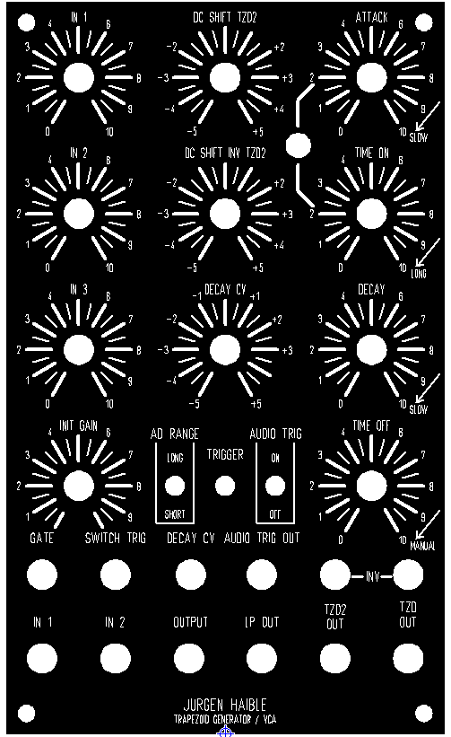
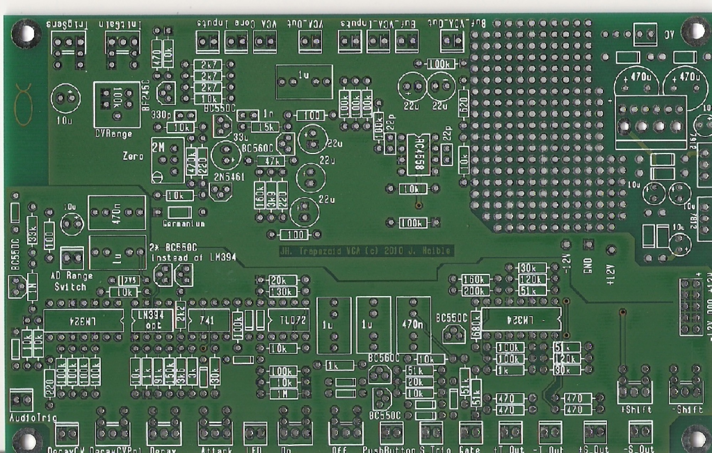

# Juergen Haible Trapezoid VCA

> **Project**
>
> ### Projecttitel: Juergen Haible Trapezoid VCA
>
> ### Status: `in PROGRESS`
>
> ### Startdate: 12/2014
>
> ### Duedate: 12/2015
>
> ### Manufacture link: [http://www.jhaible.com/trapezoid/trapezoid.html](http://www.jhaible.com/trapezoid/trapezoid.html)

further guide: [http://www.dragonflyalley.com/constructionJHtrapezoidVCA.htm](http://www.dragonflyalley.com/constructionJHtrapezoidVCA.htm)  BOm from Bill and Will: [JHtrapeziodVCABOM.xls](assets/JHtrapeziodVCABOM.xls)

**BOM (from me)**

except powersupply part

| quantity | Part |   | dealer |
|---|---|---|---|
| 2 | LM324 |   | [http://www.reichelt.de/LM-324-DIL/3/index.html?&ACTION=3&LA=446&ARTICLE=10463&artnr=LM+324+DIL&SEARCH=lm324](http://www.reichelt.de/LM-324-DIL/3/index.html?&ACTION=3&LA=446&ARTICLE=10463&artnr=LM+324+DIL&SEARCH=lm324) |
| 1 \* | LM394 - if you dont use both bc550c |   | ultra rare ebay   - or use Bc550 |
| 1 | LM741 or uA741 |   | [http://www.reichelt.de/-A-741-DIP/3/index.html?&ACTION=3&LA=446&ARTICLE=23435&artnr=%C2%B5A+741+DIP&SEARCH=741](http://www.reichelt.de/-A-741-DIP/3/index.html?&ACTION=3&LA=446&ARTICLE=23435&artnr=%C2%B5A+741+DIP&SEARCH=741) |
| 1 | TL072 |   | everywhere TME/mouser |
| 1 | RC4558 or C4558 lm4558 |   | [http://www.reichelt.de/RC-4558-DIP/3/index.html?&ACTION=3&LA=446&ARTICLE=15170&artnr=RC+4558+DIP&SEARCH=4558](http://www.reichelt.de/RC-4558-DIP/3/index.html?&ACTION=3&LA=446&ARTICLE=15170&artnr=RC+4558+DIP&SEARCH=4558) |
| 1 | 2N5461 |   | [http://www.reichelt.de/index.html?&ACTION=446&LA=446](http://www.reichelt.de/index.html?&ACTION=446&LA=446) |
| 2 | BC560c |   | TME/mouser |
| 4\* + 2x | BC550c by usage of bc550c instead of lm394 |   | TME/mouser |
| 1 | BF245C |   | [http://www.reichelt.de/BF-245C/3/index.html?&ACTION=3&LA=446&ARTICLE=5446&artnr=BF+245C&SEARCH=BF245](http://www.reichelt.de/BF-245C/3/index.html?&ACTION=3&LA=446&ARTICLE=5446&artnr=BF+245C&SEARCH=BF245) |
| 1 | zener 7v5 |   | [http://www.reichelt.de/ZF-7-5/3/index.html?&ACTION=3&LA=446&ARTICLE=23145&artnr=ZF+7%2C5&SEARCH=zener+7v5](http://www.reichelt.de/ZF-7-5/3/index.html?&ACTION=3&LA=446&ARTICLE=23145&artnr=ZF+7%2C5&SEARCH=zener+7v5) |
| 11 | 1n4148 |   | everywhere |
| 1 | 1n34 or AA143 or other germanium diode |   | [http://www.reichelt.de/index.html?&ACTION=446&LA=446](http://www.reichelt.de/index.html?&ACTION=446&LA=446) |
| 1 | 100k trimmer single turn |   | bourns.. |
| 1 | 2M multiturn trimmer |   | bourns |
| 2 | 22p MLCC |   | TME/mouser |
| 1 | 330p MLCC |   | TME/mouser |
| 1 | 1nF poly/mlcc |   | TME/mouser |
| 2 | 1uf  polyester ? |   | TME/mouser |
| 1 | 470nF polyester ? |   | TME/mouser |
| 2 | 10uF electrolyt cap |   | TME/mouser |
| 5 | 22uF electrolyt cap |   | TME/mouser |
| 1 | 33uF electrolyt cap |   | TME/mouser |
|   | 220R, 470, 620R 100R, 1K, 10K, 100k , 1M 2K7, 3k6, 3k9, 2k4, 30K, 51k, 91K, 160K, 15K, 33k,47k, 120K,200k, 470k, 680k |   | TME/mouser |
|   |   |   |   |
|   |   |   |   |

Panel:

[JHtrapeziodVCA.fpd](assets/JHtrapeziodVCA.fpd)

copy from Juergens Website:

- Emulating the EMS VCS3 and Synthi A Trapezoid Generator without copying the actual circuit
- Unique FET-based VCA included
- Parameters not independend of each other - quirky and inspiring like the original
- Positive and negative Polarity with variable DC shift
- Self-Cycle Mode smoothly activated towards the end of Off-Time knob range
- Standard Voltage Trigger and Switch Trigger inputs
- 3 Power options:

           +/-15V with MOTM and Synthesizers.com connectors

           +/-12V with "Euro standard" 10-pin connector

          15V AC Wallwart - ideal for making a standalone box

- Voltage controlled Decay with positive or negative amount
- A variety of extra functions that you can implement, or omit.

Built it within a few hours (a rather easy DIY project, indeed). Here's a video of me testing it: [trapezoid test](http://www.youtube.com/watch?v=KzcAhTQQx3s) .
  
 [Component overlay (component values) (PDF)](assets/trapezoid_8.pdf)
 [Component overlay (reference designators) (PDF)](assets/trapezoid_8_refdes.pdf)
 [Component overlay for a minimal version](assets/trapezoid_8_minimal.pdf) (basically just the equivalent of the VCS3 functions, for +/-12V supply)
  
 [Schematics](assets/trapezoid_sch.pdf)

 VCA Calibration
 Feed a 500mV, ca. 100Hz signal into the VCA section and monitor the VCA output.
 Connect a pushbutton or switch (or use a jumper) to the PushButton connector.
 Make sure that the LED is connected (use a red 2mA low current LED)
 Put the Trapezoid into a mode where it doesn't self-cycle, i.e. set the "off-time" potentiometer fully clockwise.
 Initial Gain Potentiometer must be set to zero (fully counterclockwise) - Remark: the Trapezoid CV is fed on the ccw end of this potentiometer, while the cw end is grounded. This is not a typo!
 Turn the trimpot R68 ("CV range") fully clockwise
 Make sure that the Trapezoid is "off" - pusbutton not engaged, LED is dark.
 You will hear some (low volume) signal on the VCA output.
 Now adjust trimpot R58 ("zero") to minimize the VCA output signal. Ideally, it should be zero. In practice, it will be almost zero.
 Now turn R68 ("CV Range") carefully counterclockwise until the signal re-appears on the VCA output. When you have reached that point, turn it back clockwise just a little, to give some reserve.
 Now you can trigger the Trapezoid generator with the pushbutton and check how the signal is turned on in the VCA.

 Decay Time Adjustment
 With a well-matched transistor pair for Q1 and Q2 (LM394, SSM2010, or hand-matched BC550C pair), you don't need any adjustment.
 But you can also use completely unmatched BC550C transitors, and then might have to adjust R8 (nominal 150k) a little. A smaller value (130k or 120k) will make the overall decay time range larger - a higher value will make it shorter. Do not ask for any "right" value or further instructions how to select R8, please. Either the process of selecting this resistor is self-explanatory for you, or you should simply go for a matched pair (LM394 etc.).

 Caution: Do not use the footprint for the LM394 and for the two BC550's at the same time: it's either-or.
