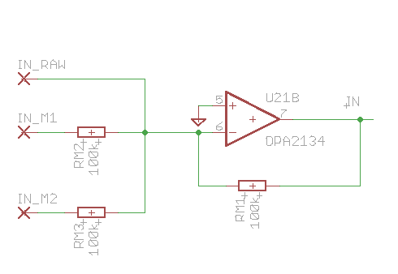
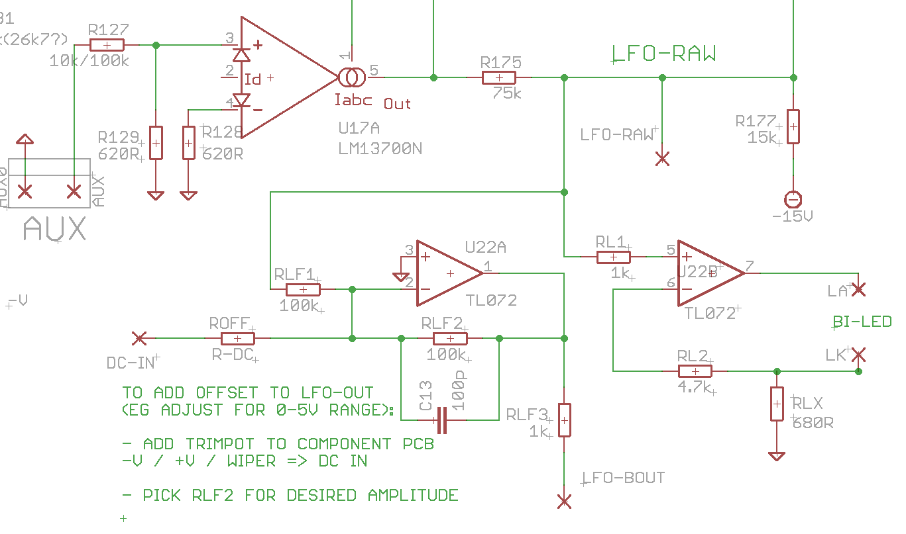
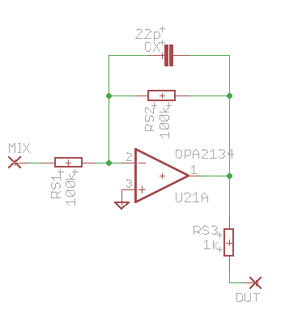
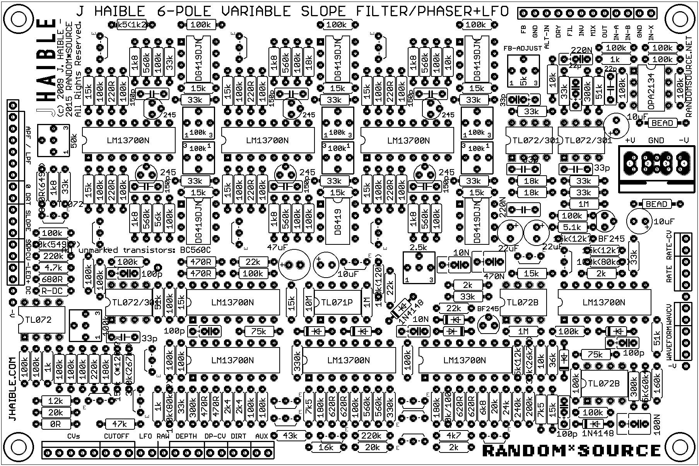

# Juergen Haible Variable Slope Filter / Phaser

> **Project**
>
> Projecttitel: Variable Slope Filter / PhaserStatus:
>
> `in build`
>
> Startdate: Jun.2015Duedate: Sep.2015Manufacture link: [http://www.jhaible.info/varislope\_filter\_phaser/varislope\_filter\_phaser.html](http://www.jhaible.info/varislope_filter_phaser/varislope_filter_phaser.html)

## original BOM:

[varislope\_full\_version\_bom.pdf](assets/varislope_full_version_bom.pdf)

### Randomsource BOM:

[VarSlopeFilter\_RS\_deluxe\_BOM.pdf](assets/VarSlopeFilter_RS_deluxe_BOM.pdf)   (blue = change for 12V) (purple =15V version)

### Documents:

Input Mixer:

LFO Mod:

Output Buffer:

Component view:

### Pots:

Input Level - Audio signal input level control
Feedback - Resonance Loop. Can burst into self-oscillation. Inverted or non-inverted feedback for unusual effects.
Mix - Wet / Dry mix of filtered and unfiltered signal. Inverted or non-inverted mix. Mandatory for phasing; interesting for LPF mode because of phase cancellation effects.
Ouput Level - Output attenuator for audio signal
APF / LPF - Switches to change the function of the 6 filter stages from All Pass Filter (Pole/Zero pairs) to Low Pass Filter (Poles only). 3 Switches for 3 pairs. (6 individual switches would be possible as well.)
Mix / Filter - In "Filter" position the "Mix" potentiometer is disconnected for 100% filter signal without any crosstalk from the dry signal (important for powefull 36dB/Oct LPF effect).
Clean / Dirty - Dirty applies some dynamic load to the single-ended buffer of the last filter stage.
Active / Bypass - True hard bypass
Slope - Spreads the pole frequencies of the individual stages. This means less filter steepness in LPF mode (ccw end is 36dB/Oct), and wider notch spacing in Phaser (APF) mode.
LFO Amount - Modulation amount of on-board LFO
LFO Wave - Crossfade between LFO waveshapes: Tringle -&gt; Sine -&gt; Square -&gt; Sample&Hold -&gt; Audio-Rate Self-Modulation (see [video](http://electro-music.com/forum/phpbb-files/lfo_morphing_150.mov)).

Also possible, but not on Front panel:
Slope Control Voltage Input
LFO Amount Control Voltage Input
LFO Waveshape Control Voltage Input
LFO Rate Control Voltage Input
External Filter or Phase Control Voltage Input (for ADSR etc.)
External 1V/Oct Control Voltage Input (no tempco, though.)

## Calibration:

NEW: Adjustment

1. Measure the voltage at the lead of R82, on the side where a tiny arrow and the number "3" is printed on the PCB, against GND. Turn R84 (note the number "3" near that trimpot!), until you read approx. -7.5V. The "Cutoff" potentiometer should be at ccw position for this test, or not yet connected.

2. Measure the voltage at R71 (where the arrow and the number "1" is printed), and adjust it to -7.5V, with R71. (note the number "1" near that trimpot!)

3. Same procedure, number "2": Measure at R76, adjust for -7.5V with R78.

4. Same procedure, number "4" - R88, R90.

5. Same for "5", R94, R96.

6. Same for "6", R100, R102.

7. Play with Cuotoff potentiometer and see if the manual control range is the way you like it. If not, play with R84 (number "3") until you're satisfied. Do \*not\* readjust the other trimmers from previous steps, though!

8. Adjust R6 (Feedb\_Adj) for the self-oscillation to set in at the point of the Resonance potentiometr's travel that is convenient for you. \*Attention\*: The point of self-oscillation will change dramatically when you change the filter configuration (either with Slope potentiometer, or with LPF / Phaser switching). Protect your ears until you know what can happen - the effect can be quite dramatic.

9. Adjust R137 (Noise) to get a similar level in Sample & Hold mode, as with the other modulation waveforms.

Final Remark: None of these adjustments is overly critical. You may even get good results without the trimmers "1", "2", "4", "5" and "6".
