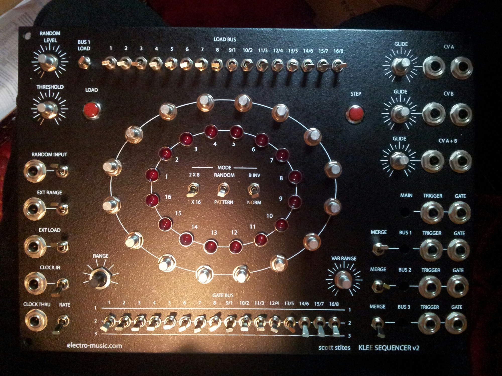
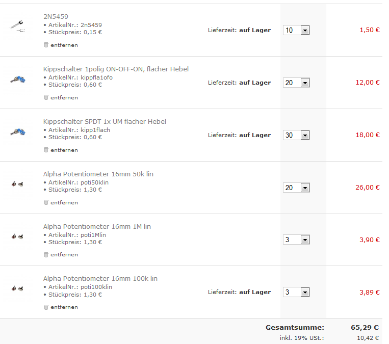

# Kleesequencer in 5U

> **Project**
>
> ### Kleesequencer in 5U
>
> ### `Status` : done
>
> ### Startdate: July 2012
>
> ### Duedate: 12-2014
>
> ### Manufacture link:[http://www.bild-schall.com/product/digi-eins](http://www.bild-schall.com/product/digi-eins)[http://electro-music.com/forum/forum-155.html](http://electro-music.com/forum/forum-155.html)

**Subpages:**

unfinished Kleesequencer - work in progress (click to enlarge)

internal info: left switches for Demonstration only, top and button exchange to LED holders

Frontpanel parts:

|   |   |   |
|---|---|---|
| 16 | 50k lin | pot |
| 3 | 1M lin | pot |
| 3 | 100k lin | pot |
| 16 | SPST | ON-OFF   Pattern switch |
| 16 | SPDT | ON\_:OFF\_ON Gate Switch |
| 8 | SPST | ON-OFF |
| 2 | SPDT | ON-ON |
| 2 | SPST | (ON)-OFF (pushbuttons) |
| 1 | SW43 | SP8T Rotary |
| 19 | 6,3mm jacks | 3pole swiitched |
| 22 | LED rot |   |

Copy from em: "I used the Toggleswitch 1 pole ON-OFF-ON, flat toggle for the gate bus switches, and the Toggleswitch SPDT flat toggle for all others. I recommend to use the miyamas though, as they have superior quality. "

**Switches**

**Musikding**

