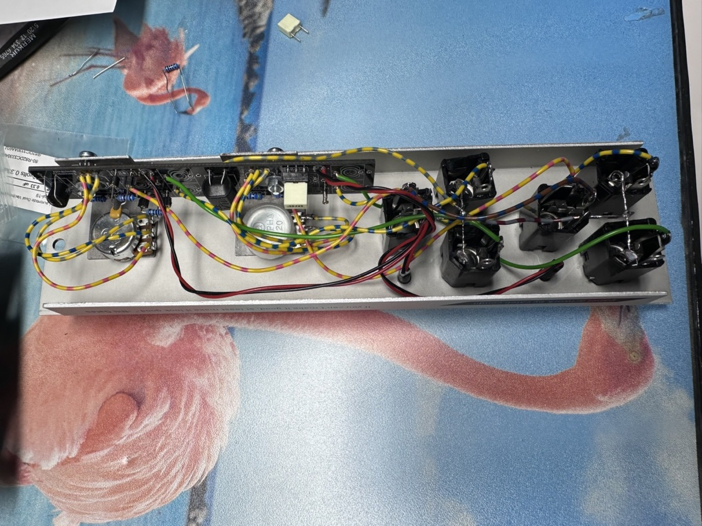
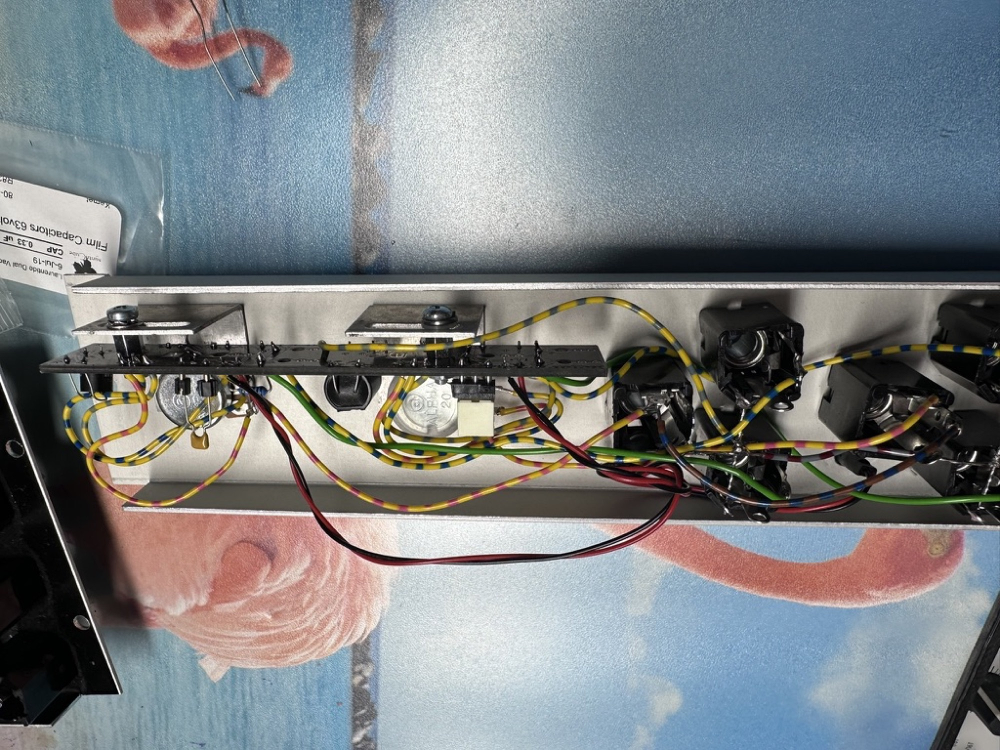

# Laurentide Dual Vactrol VG2

since the original website from Laurentide is offline, here's the backup:

[vg2\_pcb\_v3.zip](assets/vg2_pcb_v3.zip)

[VG2 - Laurentide SynthWorks.pdf](assets/VG2---Laurentide-SynthWorks.pdf)

[vg2\_panel\_v3.zip](assets/vg2_panel_v3.zip)

I used brackets in my 5U build, the brackets are available by Synthcube (Bracket MFOS Universal Mounting Single) MFOSMTNBKT1

