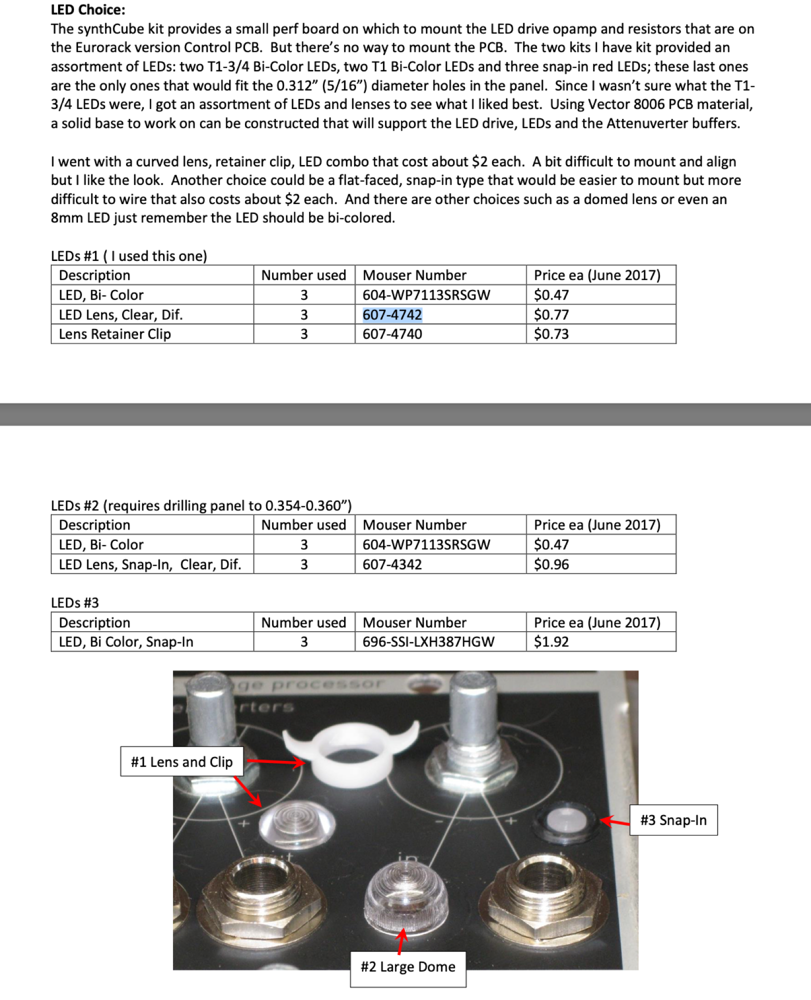
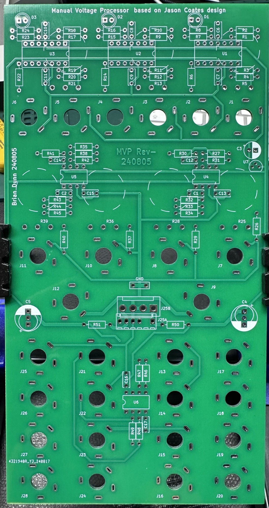
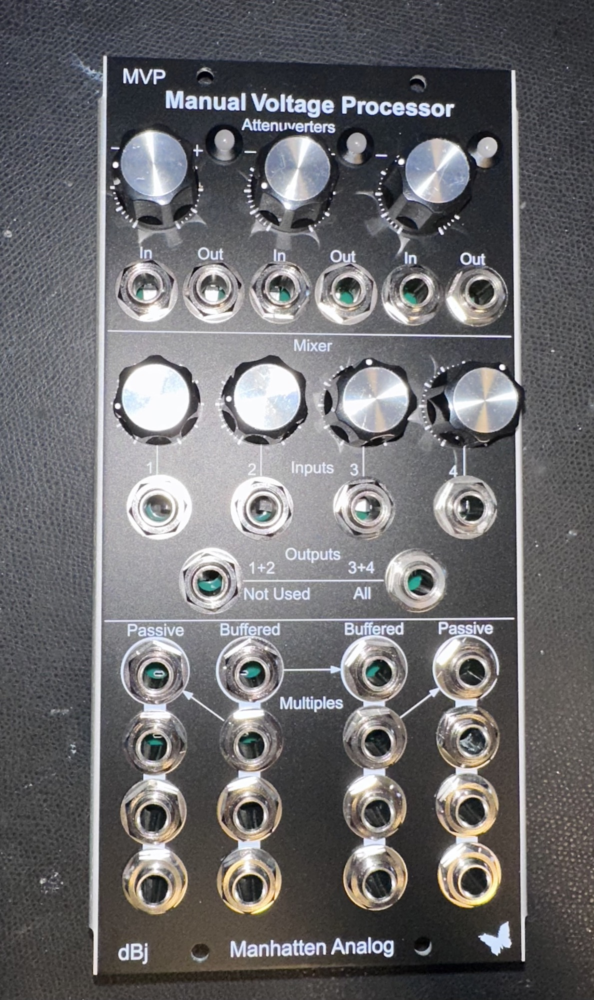
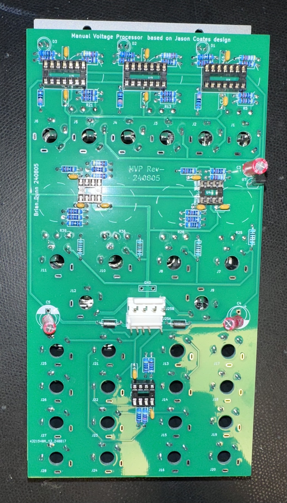

# Manhatten Analog MVP

**Bug**:

R26, R29, R37 R40 must be a bridge instead of 10K.

**improvements for better noise ratio:**

install at U4 and U5 a OP275 opamp and swap C1 from 22p to 33p.

furthermore install a 33pF capacitor at U4 and U5 between C5 and C6.

Guide:  (extract the Partvalues from the Schematic on the last page in this document).   not nice- but what can we do ?

[dBj MA Manual Voltage Processor Assembly Instructions 2024 PDF.pdf](assets/dBj-MA-Manual-Voltage-Processor-Assembly-Instructions-2024-PDF.pdf)

**old guide:**

[old-MVP-buildguide.pdf](assets/old-MVP-buildguide.pdf)

**BOM tip:**

LED holder 3x

[https://www.tme.eu/de/details/rtf-5010/fassungen/kingbright-electronic/](https://www.tme.eu/de/details/rtf-5010/fassungen/kingbright-electronic/)

Jacks:

[https://www.tme.eu/de/details/acjm-mv-2s/klinken-steckverbinder/amphenol/](https://www.tme.eu/de/details/acjm-mv-2s/klinken-steckverbinder/amphenol/)

LED must be a 2pol red-green 5mm LED

BOM info from old build guide:

Build info:

on mine is an “error”:  audio out at the 1+2 out or 3+4 out can't be turnoff completely. attenuation is faulty.

