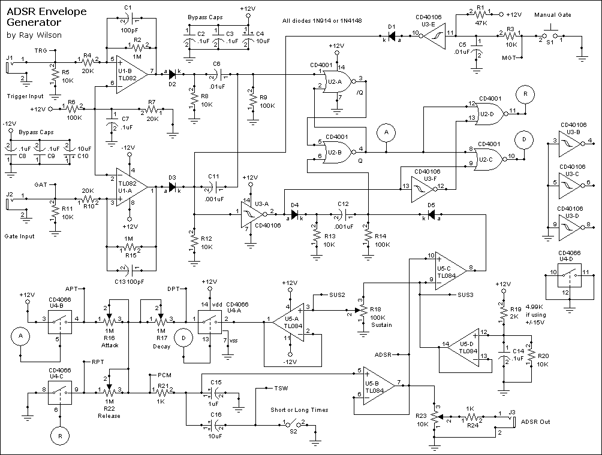
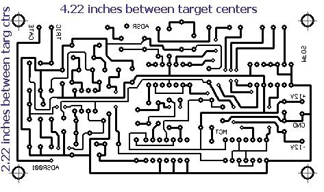
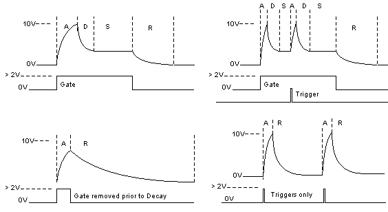
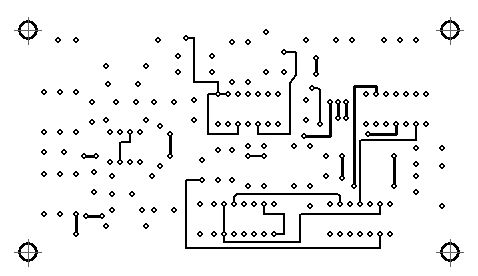
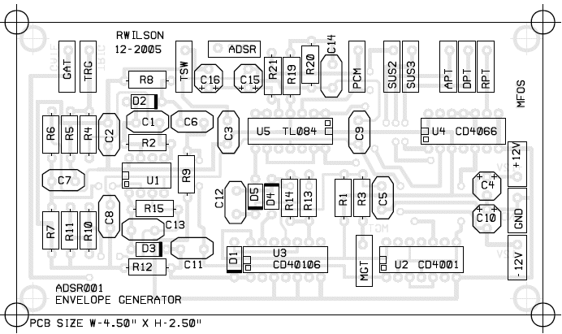
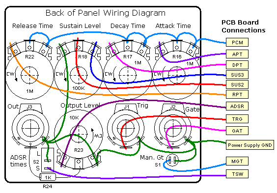
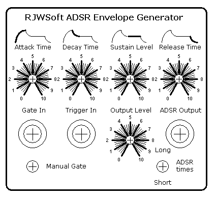
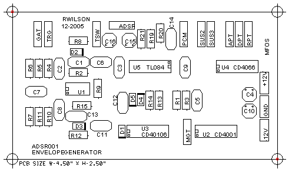

# Mfos  ADSR old version

> **Project**
>
> ### Projecttitel :Mfos ADSR old version
>
> ### Status: `Status`
>
> ### Startdate: 01.10.2013
>
> ### Duedate: 01.12.2013
>
> ### Manufacture link: musicfromouterspace.com

[ADSR001.html](assets/ADSR001.html)

[MFOS ADSR.zip](assets/MFOS-ADSR.zip)

If you dont use the Power Level pot:

```
Just solder the flying 1K (R24) directly to the point 'ADSR' and the output jack.
```

### BOM

Potis from alpha - ordered by musikding

[ADSR\_12\_2005\_parts.pdf](assets/ADSR_12_2005_parts.pdf)

### Schematic

[ADSR\_12\_2005\_schem.pdf](assets/ADSR_12_2005_schem.pdf)

### Panelwiring
















