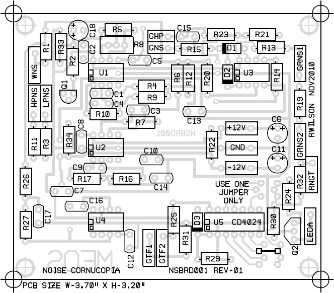
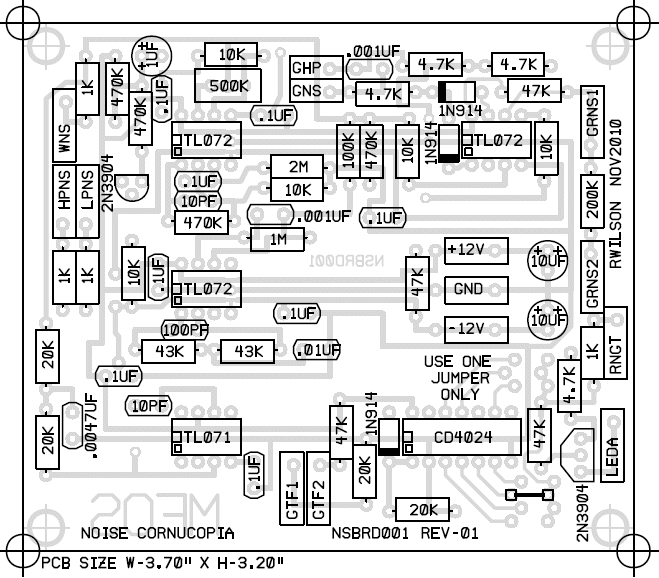
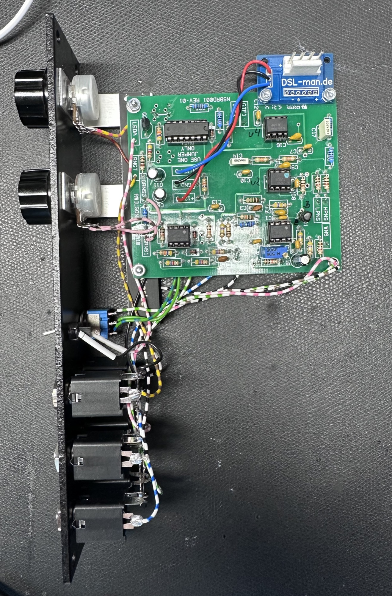
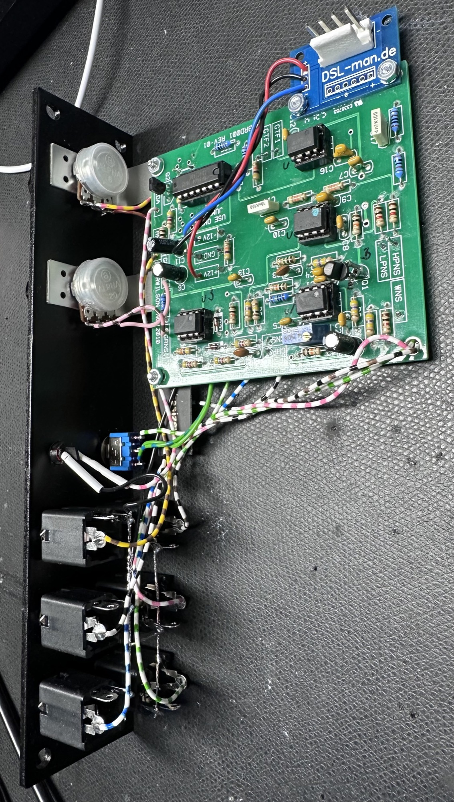

# MFOS Noise Cornucopia

build in 2025 done ✅

**Cornucopia**: a symbol of plentitude, strong harvests and abundance. This circuit delivers a plentitude of noise, a veritable harvest of noise, yes, I dare say... an abundance of noise. Noise, noise and more noise. This circuit gives you white noise, pink-ish noise, high pass noise, grainy noise (with grainy adjust), and lastly adjustable random gates. Noise lovers take heart this board was made for you.

BOM:

| Qty. | Description | Value | Designators |
|---|---|---|---|
| 1 | CD4024 7 Stage Binary Counter | CD4024 | U5 |
| 1 | TL071 Op Amp | TL071 | U4 |
| 3 | TL072 Dual Op Amp | TL072 | U1, U2, U3 |
| 2 | 2N3904 | 2N3904 | Q1, Q2 |
| 3 | 1N914 High Speed Diode | 1N914 | D1, D2, D3 |
| 1 | General Purpose LED | LED | LED1 |
| 2 | Linear Taper Potentiometer | 100K | R18, R28 |
| 1 | Resistor 1/4 Watt 5% | 100K | R6 |
| 5 | Resistor 1/4 Watt 5% | 10K | R5, R9, R14, R20, R34 |
| 4 | Resistor 1/4 Watt 5% | 1K | R1, R3, R11, R32 |
| 1 | Resistor 1/4 Watt 5% | 1M | R7 |
| 1 | Resistor 1/4 Watt 5% | 200K | R19 |
| 4 | Resistor 1/4 Watt 5% | 20K | R26, R27, R29, R31 |
| 1 | Resistor 1/4 Watt 5% | 2M | R4 |
| 4 | Resistor 1/4 Watt 5% | 4.7K | R15, R21, R23, R24 |
| 2 | Resistor 1/4 Watt 5% | 43K | R16, R17 |
| 4 | Resistor 1/4 Watt 5% | 470K | R2, R10, R12, R33 |
| 4 | Resistor 1/4 Watt 5% | 47K | R13, R22, R25, R30 |
| 1 | Trim Pot | 500K | R8 |
| 2 | Ceramic Capacitor | .001uF | C3, C15 |
| 1 | Ceramic Capacitor | .0047uF or .005uF | C17 |
| 1 | Ceramic Capacitor | .01uF | C14 |
| 8 | Ceramic Capacitor | .1uF | C1, C2, C5, C7, C8, C10, C12, C13 |
| 1 | Ceramic Capacitor | 100pF | C9 |
| 2 | Ceramic Capacitor | 10pF | C4, C16 |
| 2 | Electrolytic Capacitor | 10uF | C6, C11 |
| 1 | Electrolytic Capacitor | 1uF | C18 |

[panelwiring.pdf](assets/panelwiring.pdf)

**Adjust R8 for approximately +/-5V peaks in the noise signal.**

