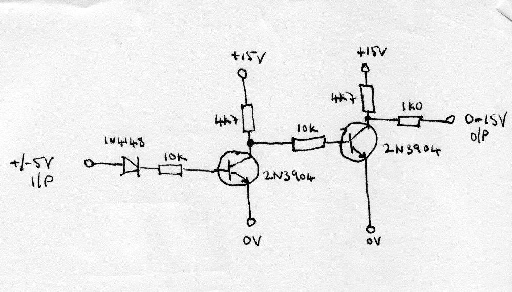
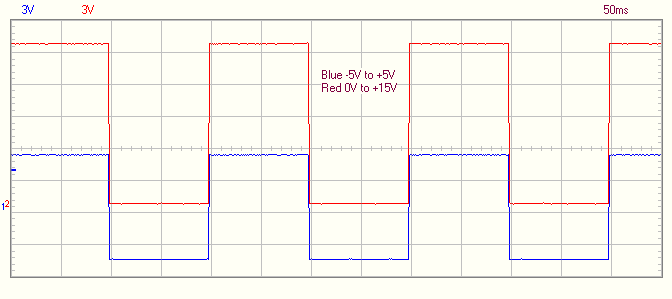
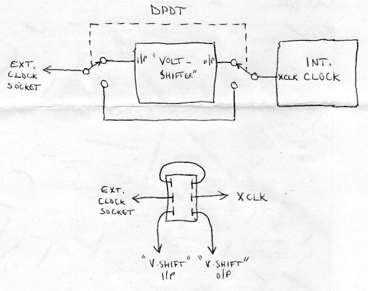
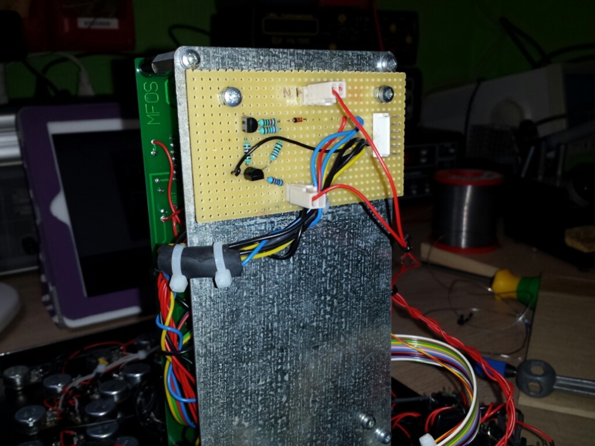
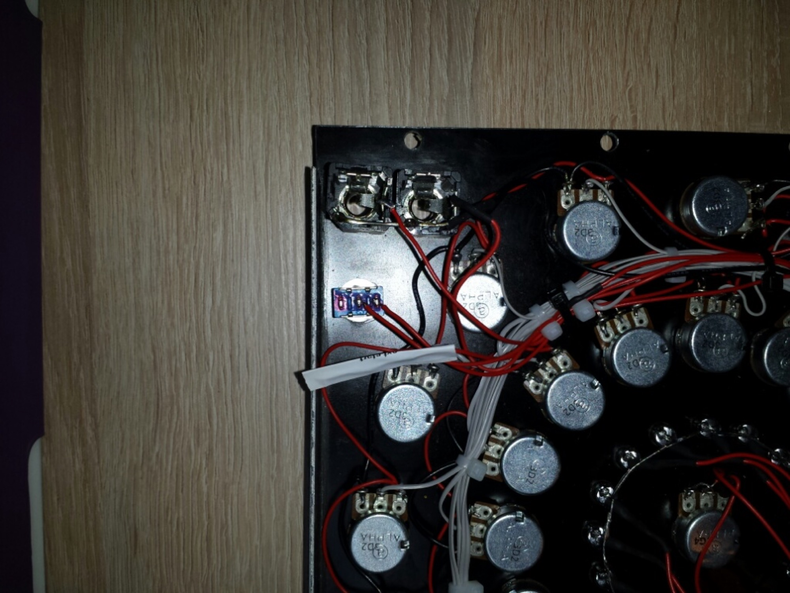
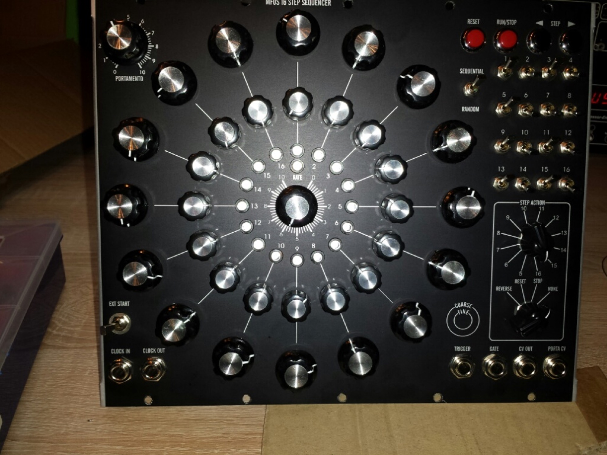
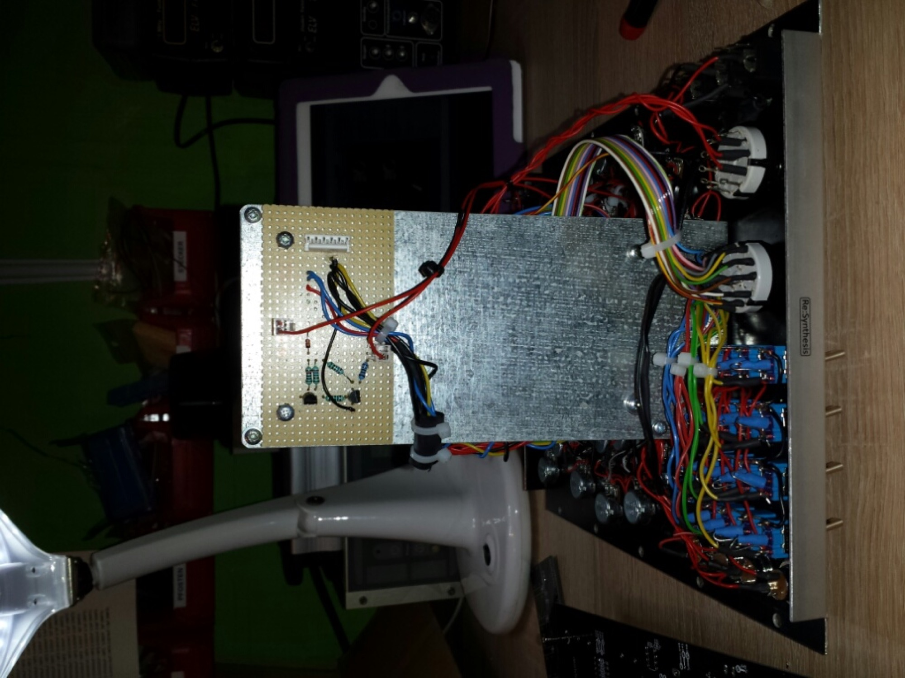

# Mfos 16step sequencer Modification

### The Mfos sequencer runs in my environment with +/-15V.

**Issue:** the clock in dont work with VCO pulse or other low voltage devices.

**Solution:** a voltage shifter to bring the clock to 15V, with a SPST or DPDT switch to break the output signal from the voltage shifter by usingf internal clock..

**supported by**: [http://electro-music.com/forum/viewtopic.php?p=395267#395267](http://electro-music.com/forum/viewtopic.php?p=395267#395267)

**new /other solution:**

**untested Level shifter** from +/ - 5V to 10V

[http://www.modularsynthesis.com/modules/DJB-016/djb016.htm](http://www.modularsynthesis.com/modules/DJB-016/djb016.htm)

[DJB-016\_schematic.jpg](assets/DJB-016_schematic.jpg)

**Building:**

****

****

**DPDT switch**

****

****

**i have replaced the ext.start  Input jack with a SPST switch, and break only the output signal from the voltage shifter**

****

****

****
