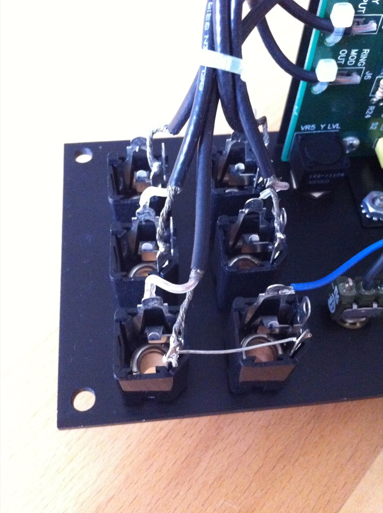
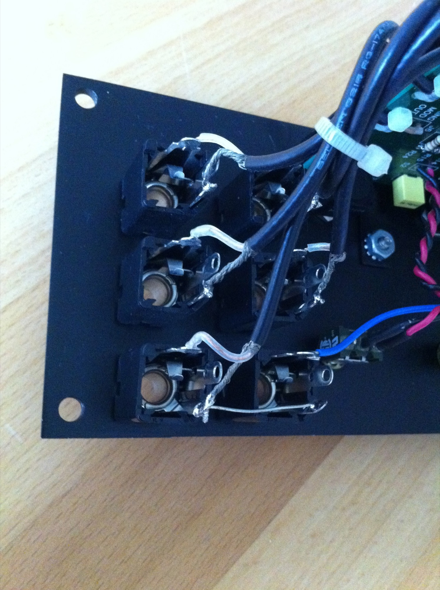
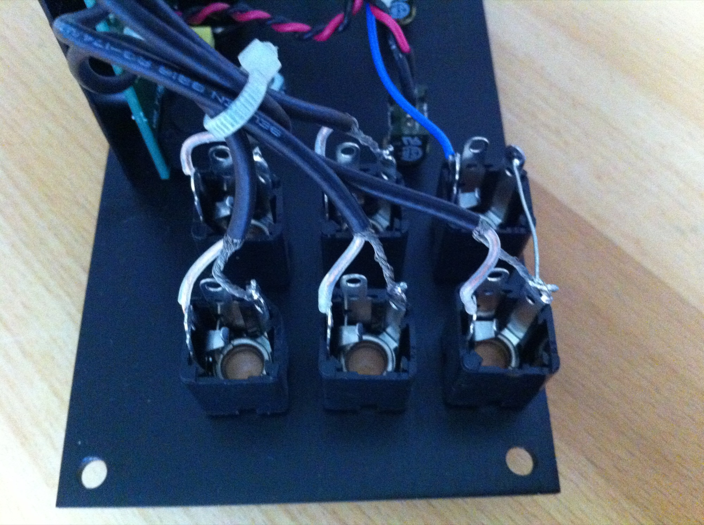
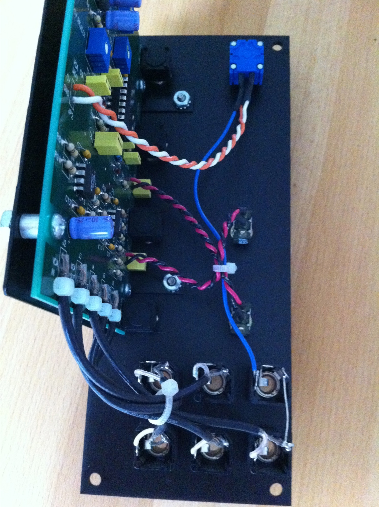

# MOTM 110

> **Project**
>
> ### Projecttitel: MOTM 110
>
> ### Status: - finished
>
> ### Startdate: --
>
> ### Duedate: 2013
>
> ### Manufacture link:

i´ve got a MOTM 110 and have to replace the bananas with Switchcraft jacks.

