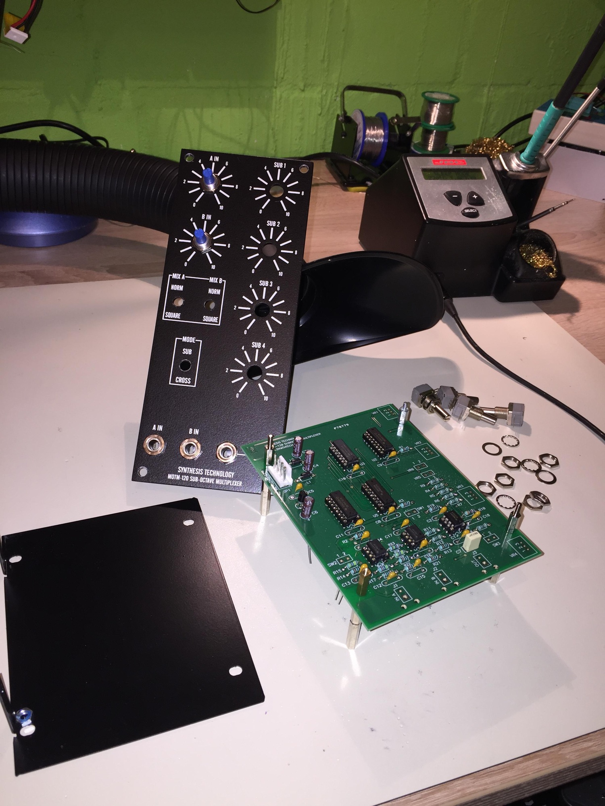
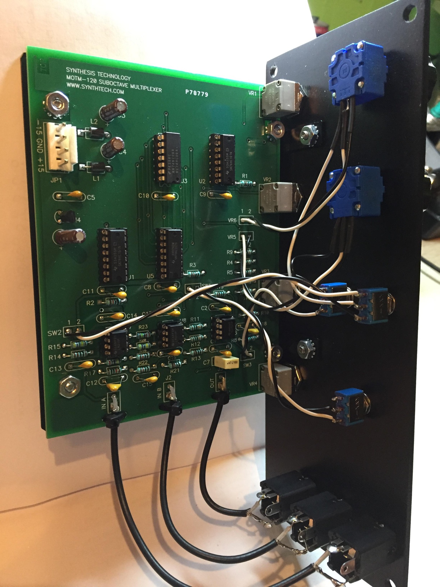
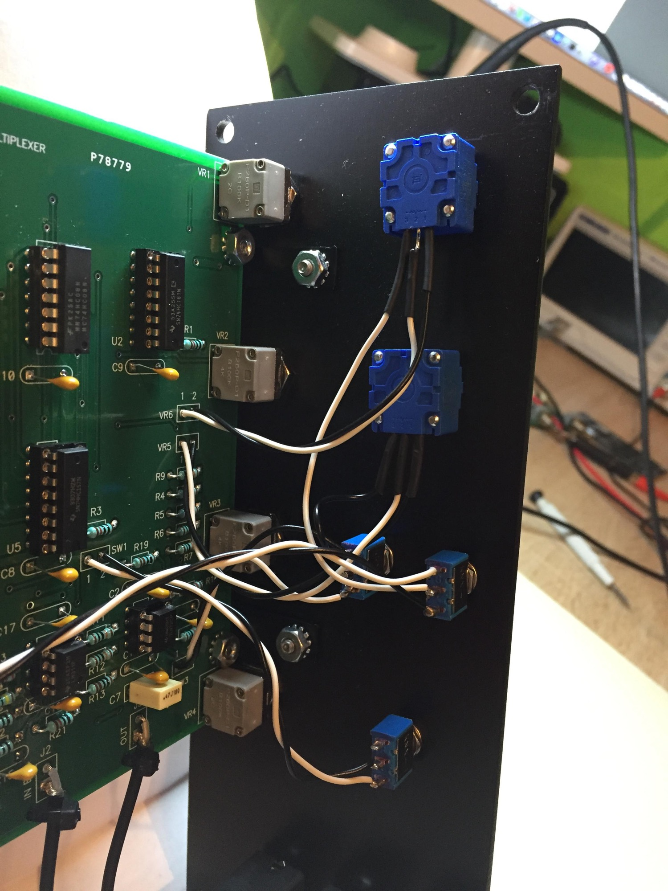
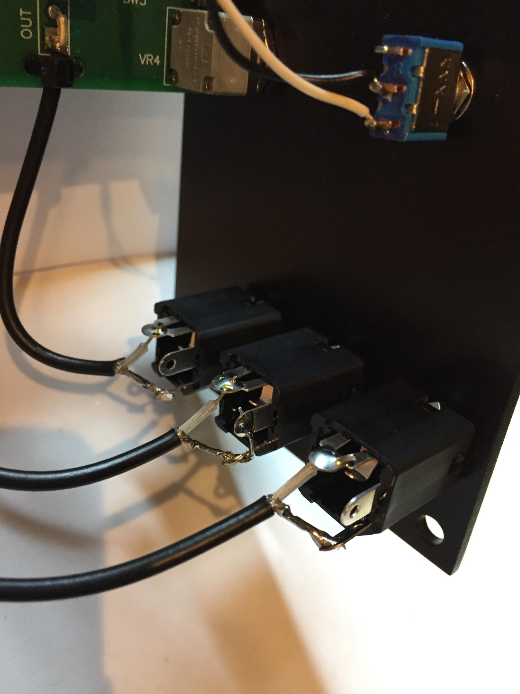
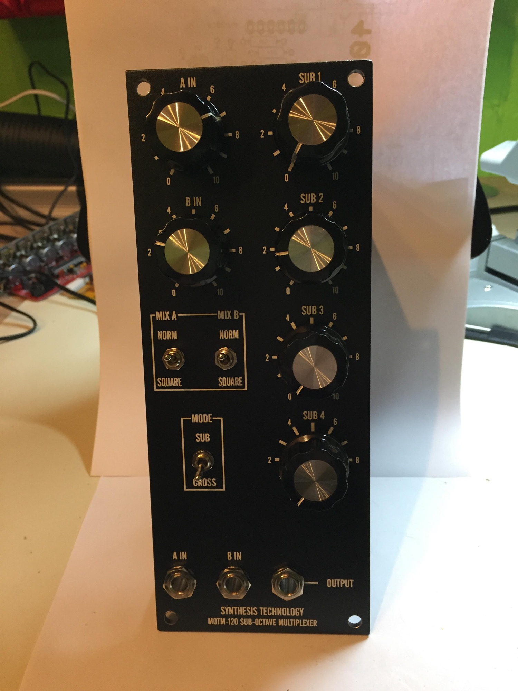

# MOTM 120

> **Project**
>
> ### Projecttitel: MOTM 120 Sub-octave multiplexer
>
> ### Status: `in build`
>
> ### Startdate: 01 Jan. 2017
>
> ### Duedate: 28 Feb. 2017
>
> ### Manufacture link: [http://synthtech.com/motm/120/](http://synthtech.com/motm/120/)

**BOM/guide**

[MOTM-120\_manual.pdf](assets/MOTM-120_manual.pdf)

**Pictures**

