# MOTM 440

> **Project**
>
> ### Projecttitel: MOTM 440
>
> ### Status: `Finished`
>
> ### Startdate: 10.10.2014
>
> ### Duedate: 01.12.2014
>
> ### update 01/2025
>
> ### Manufacture link: [http://www.synthtech.com/motm440.html](http://www.synthtech.com/motm440.html)

I built a lot of MOTM440 in MOTM and MU Format.

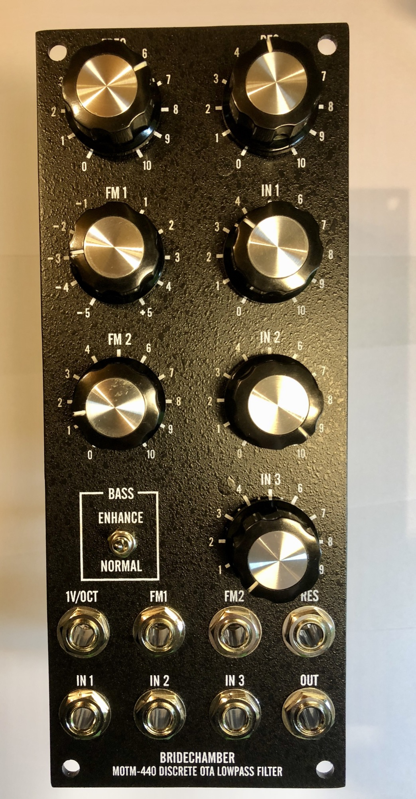

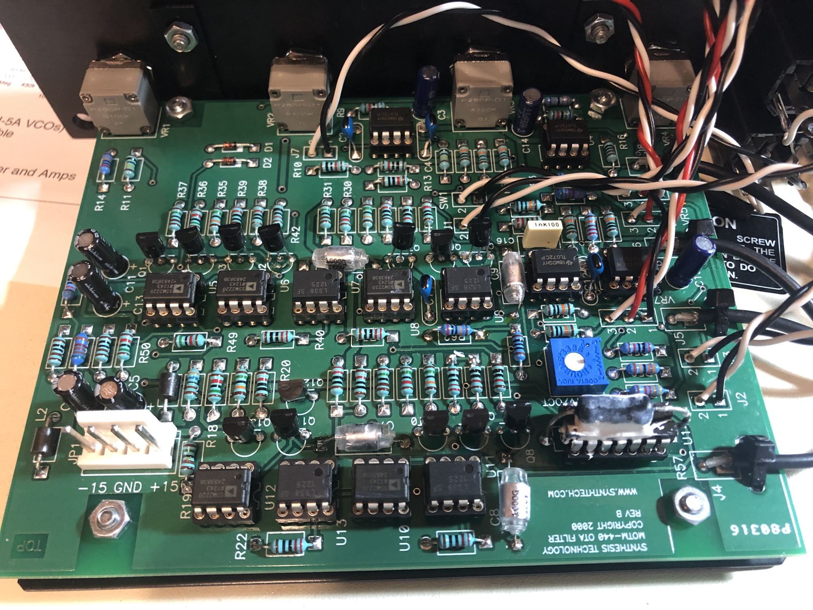

**Here's my latest Build from 2020-2024:**

MOTM440 in MU Format. let me know when you want one...

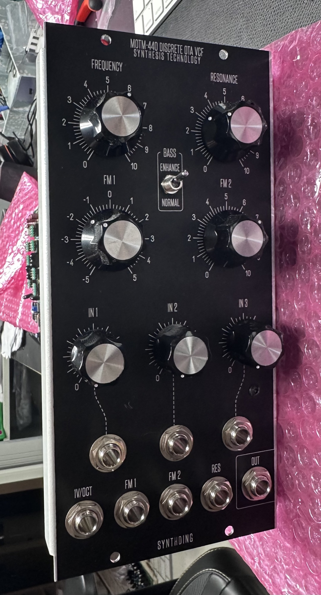

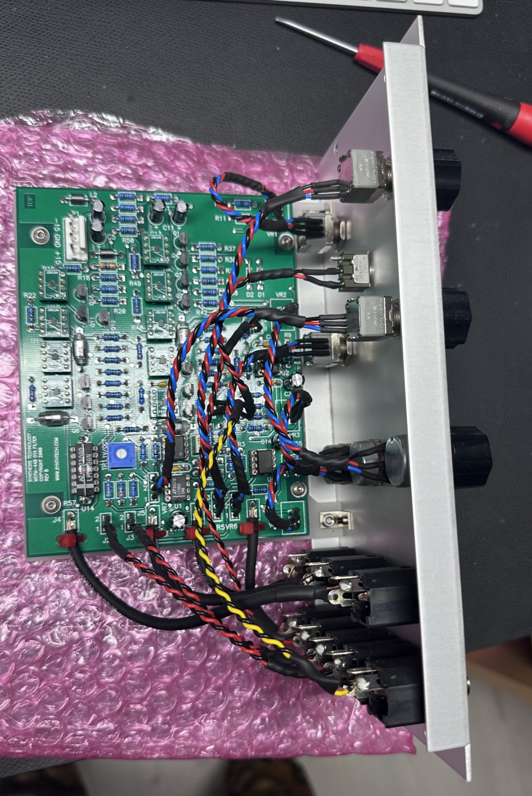

and a different build:

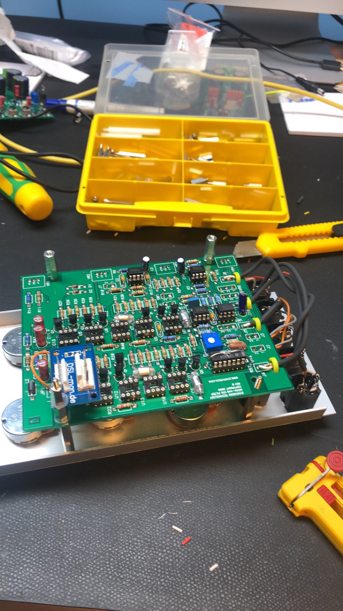

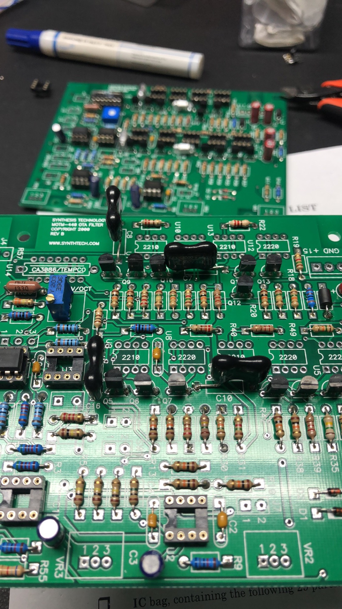

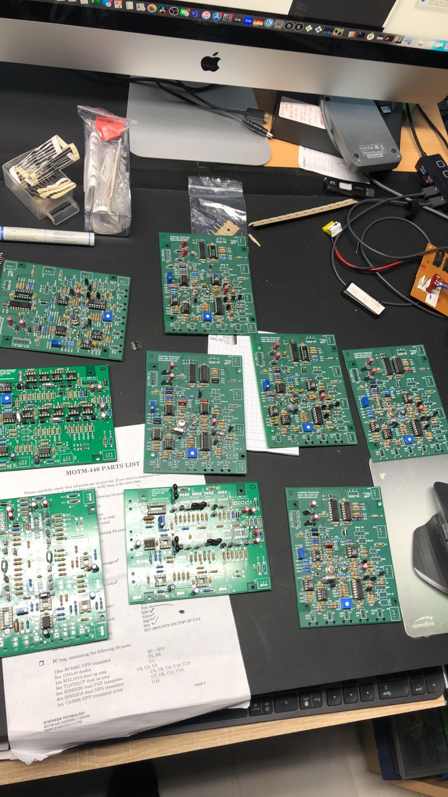

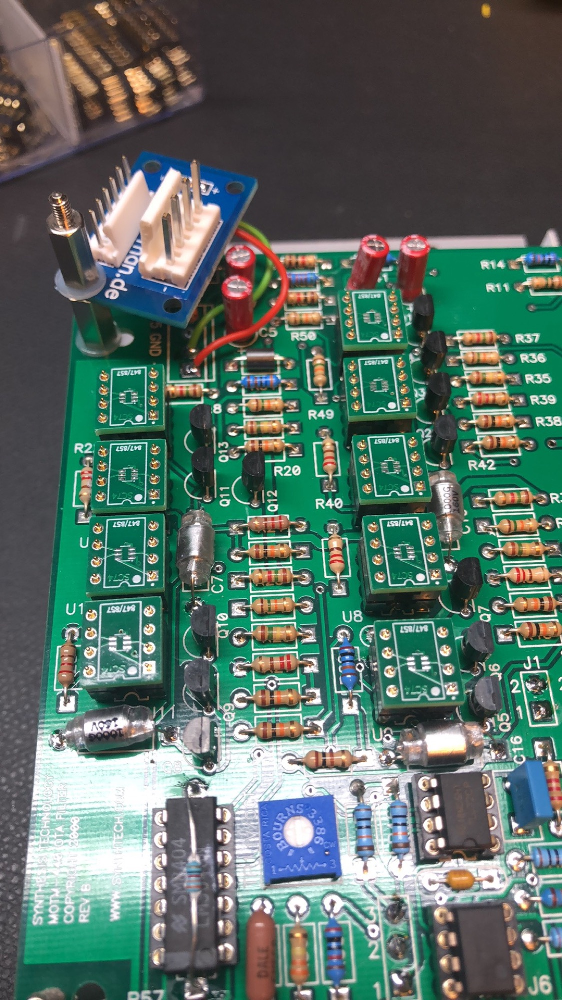

**copy from old synthtech page:**

You have probably heard of the SSM2040 filter chip, used in the Prophet 5 Rev. 2 synth, the Voyetra 8, and others. Although short-lived, the SSM2040 filter had a unique sound different from a Moog, ARP or other 4-pole lowpass. Why? The design used a clever discrete OTA gain cell.

The MOTM-440 offers an updated SSM2040 architecture using matched NPN/PNP pairs and features a switch that adds a second audio feedback path to boost bass response at higher Q levels. This makes the filter "growl and rumble" even more! In addition, voltage-controlled Q allows for more sweeping effects. Three audio inputs and three CV inputs make the MOTM-440 the killer lowpass filter in your system. The internal gain structure is such that over-driving the filter is now possible (unlike the Prophet 5) to get even more nasty sounds. Did we mention it self-oscillates at high Q?

So order a MOTM-440 filter for a fraction of the price of a P5 Rev. 2, but without the worry of obsolete parts!

***"The MOTM-440 is the best-sounding analog filter I have ever heard." - Robert Rich***

## ***BOM:***

[***M440\_bom.pdf***](assets/M440_bom.pdf)

## ***Builders Guide:***

[***MOTM440 User's Guide.pdf***](assets/MOTM440-User-s-Guide.pdf)

## ***Parts:***

- ***Pcb, Panel, Bracket, pots, SSM Chips  from bridechamber.com  thx to Scott***

- ***pots:***

        1ea 100K cermet Spectrol 149 VR1  (from Scott)

         3ea 100K conductive plastic log Spectrol 148 VR2, VR3, VR4  (mouser)

         3ea 100K conductive plastic Bourns 95A1 VR5, VR6, VR7  (mouser)

- **capaciators:**
  4x 1nF polysterene or polypropylene  - banzai
  3x 3m3  bipolar electrolyt  - mouser, TME
  1x 1nF Filmcap
  4x 100nF MLCC caps
- **resistors**:  only nontypical values here listed:
  3x 51k1
  2x 200k
  2x 20k
  1x 221k
  1x 3k6
  1x 44k2
  1x 1k Tempco 3300ppm  on top of u14
- **SEMIS and others**
  13x bc550c
  2x 1n4148 diode
  1x TL1013  (MXL1013)
  3x TL072
  5x SSM2220 → i have drop-in replacements on diysynth.de (my shop)
  4x SSM2210 → i have drop-in replacements on [diysynth.de](http://diysynth.de) (my shop)
  1x CA3086
- **Others:**
  1x SPDT (ON-ON) switch
  8x Switchcraft 112A Jacks
  7x knobs Alco PKES90B1/4
  1x 20k bourns trimpot
  around 1-2m RG174 cable
  lot of cable for wiring the switches, pots
  2x ferrite beads
  1x MTA header

> **Achtung**
>
> ---
>
> (not happen with pcbs from 2019/2020 from synthcube)
>
> If you have purchased an MOTM-440 PCB that has a **"P80316"** silk screened in the upper left hand corner by the Synth Tech label, please run a wire descriped in picture (the pcb trace is defective)
>
> [http://www.muffwiggler.com/forum/viewtopic.php?p=1175840&sid=f286a3c98a3a58e25cbd2bf90200d1cd](http://www.muffwiggler.com/forum/viewtopic.php?p=1175840&sid=f286a3c98a3a58e25cbd2bf90200d1cd)
>
> 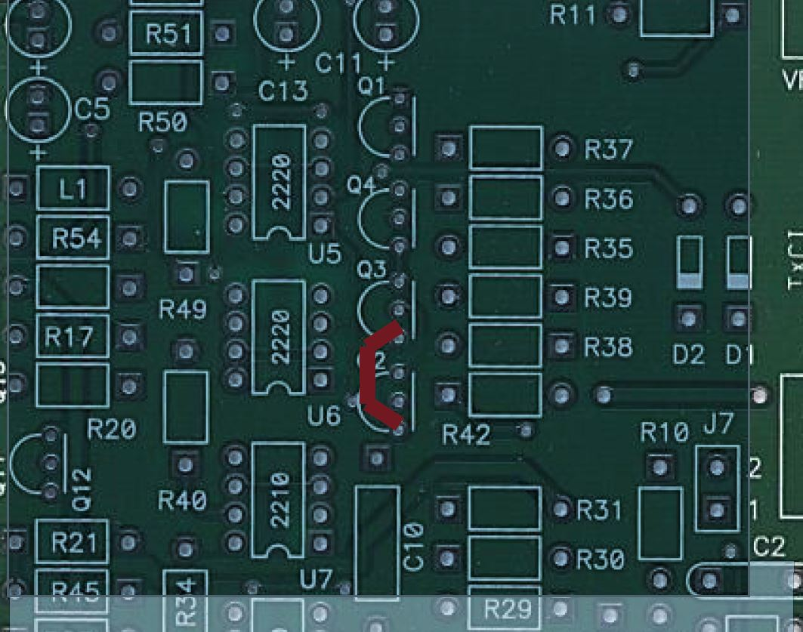
>
> further a other issue was found on one pcb:
>
> [http://www.sequencer.de/synthesizer/viewtopic.php?t=87264](http://www.sequencer.de/synthesizer/viewtopic.php?t=87264)
>
> if your Input 1 and your Frequenzmodulation dont work,  fix this by run wires:
>
> 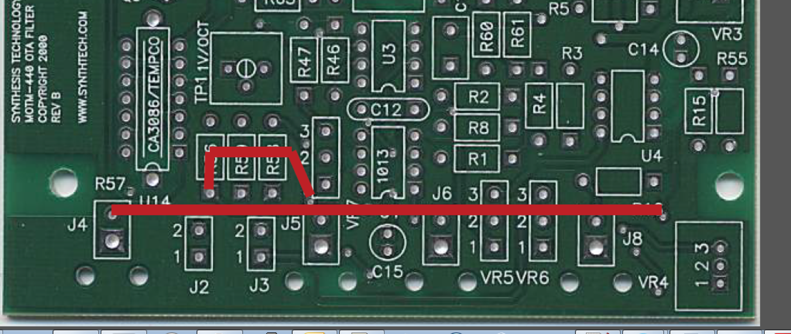
>
> Picture of missing traces here too: (fixed by above solution)
>
> 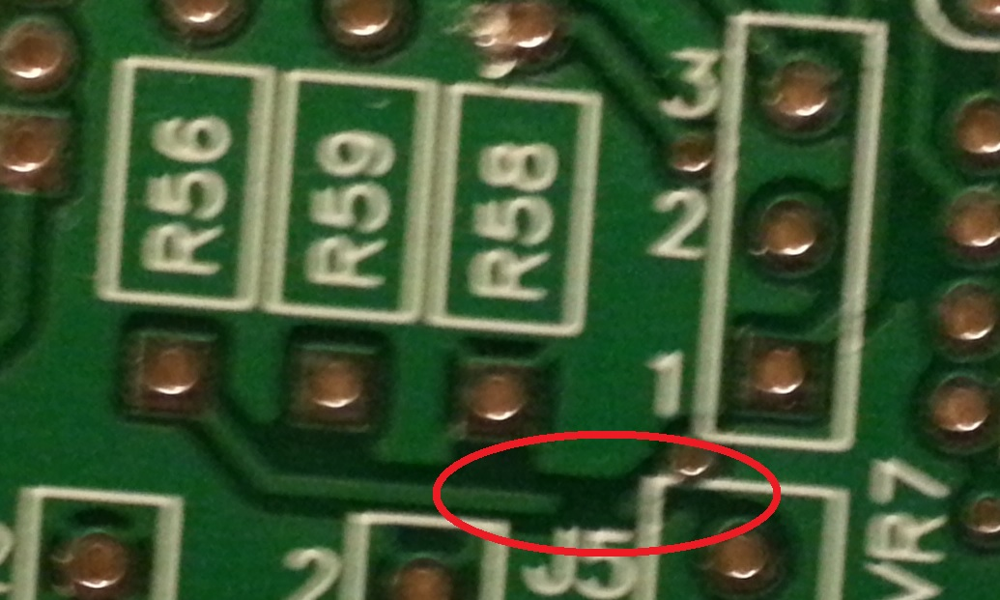

> **Info**
>
> on my pics are the Polysterene values 1n5 instead of 1n,  1v/oct, CV RES, CV FM1, CVFm2 jack polarisation is wrong .
>
> Pin1 and 2  is for the CV Jacks not with the same polarisation !

tip

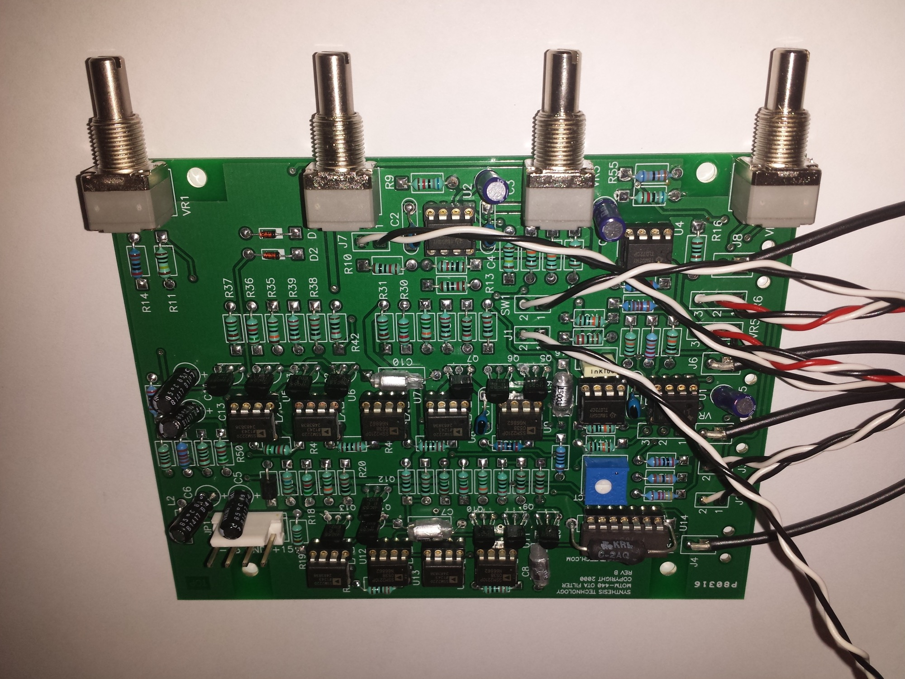

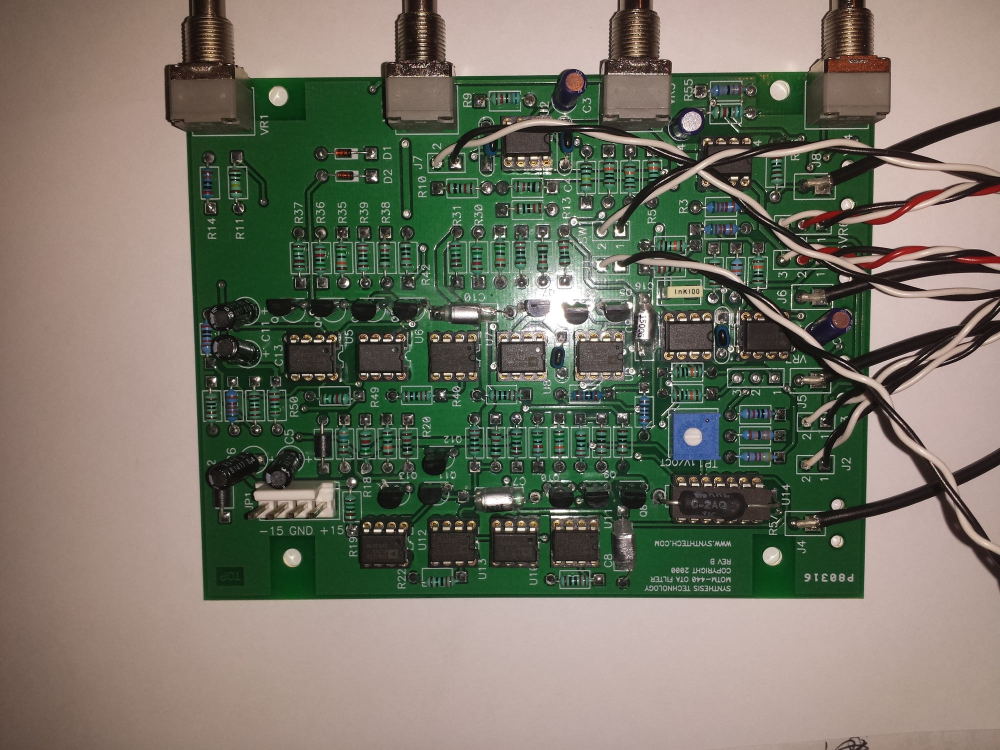

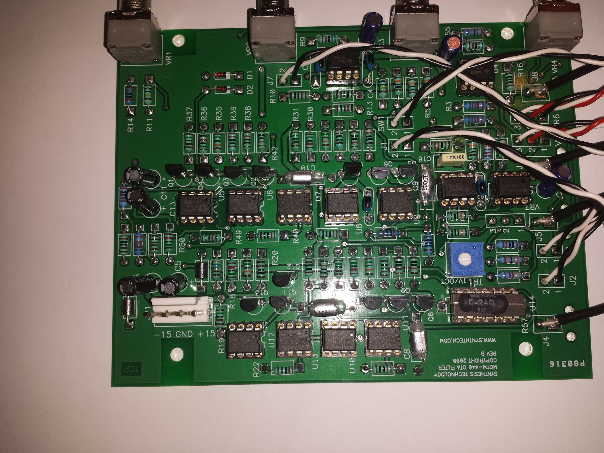

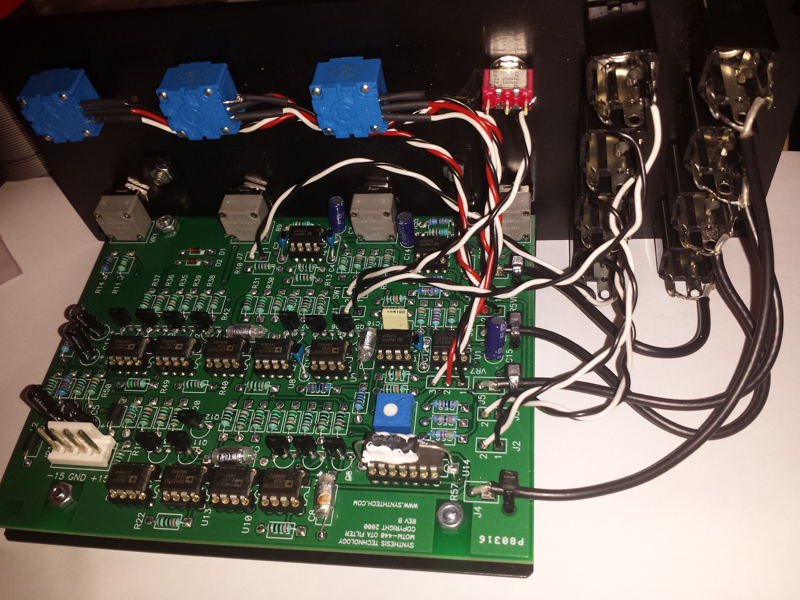

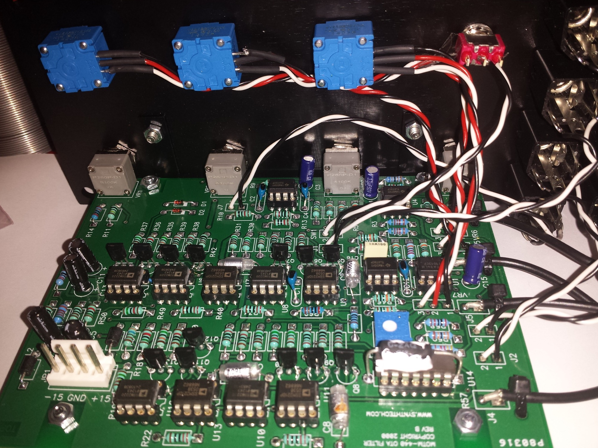

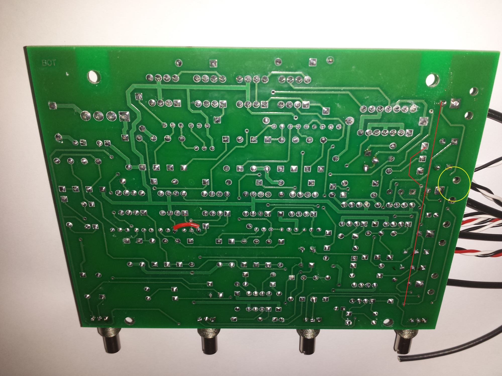

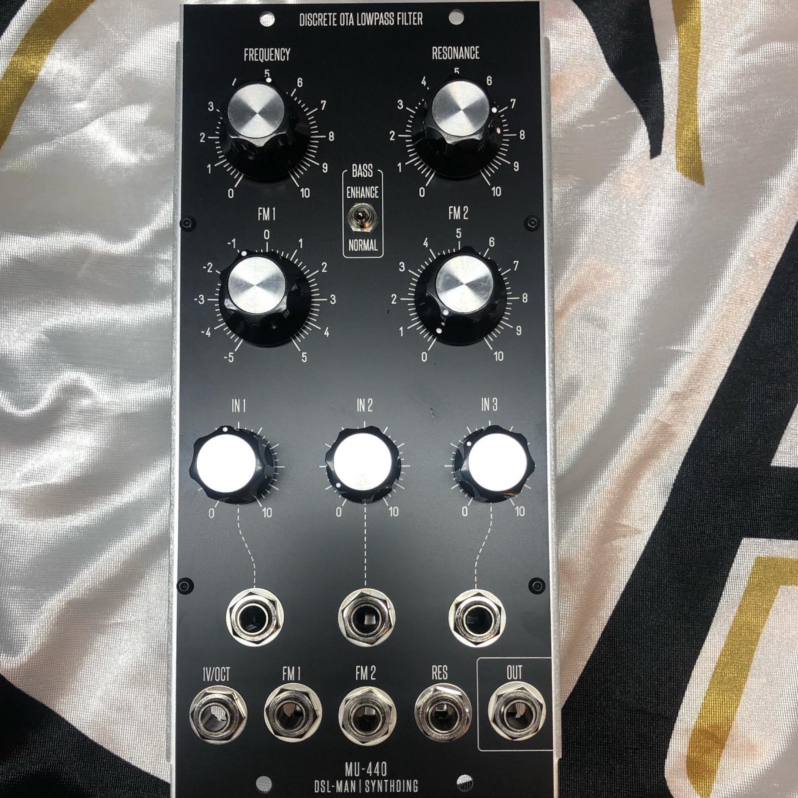

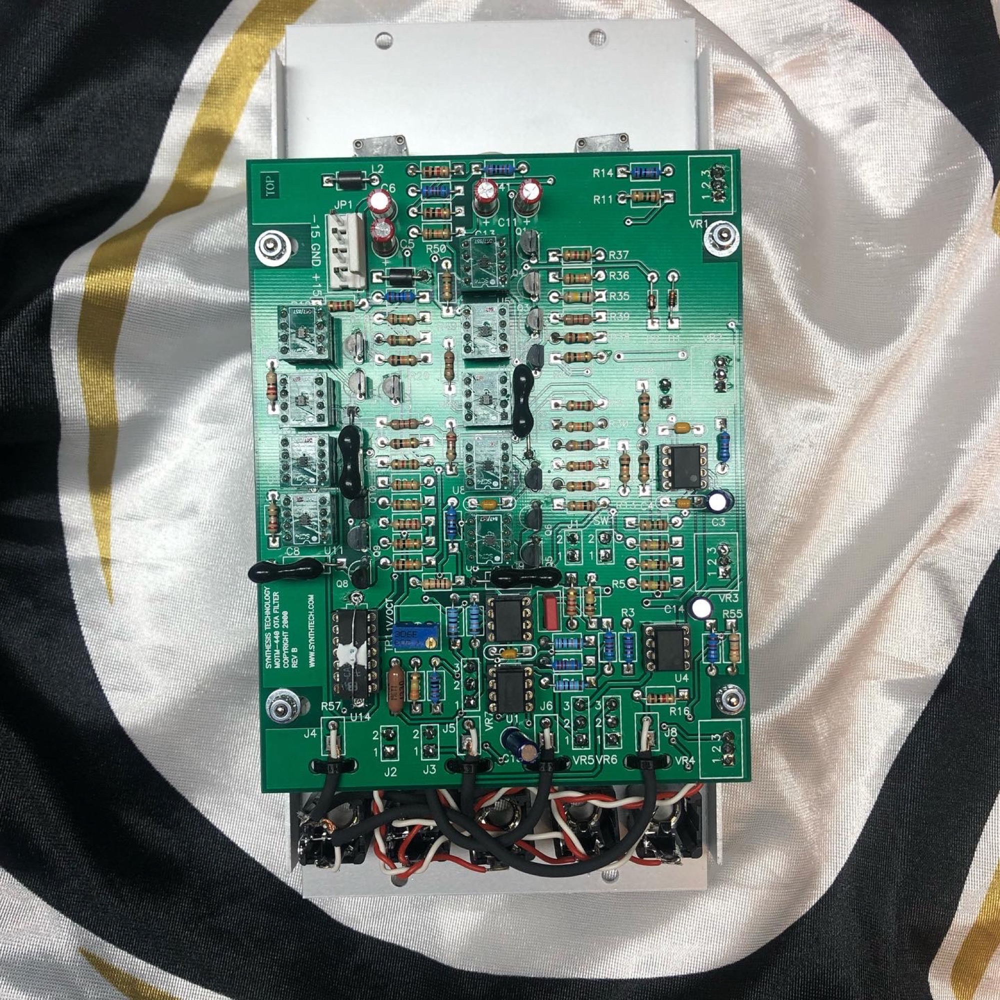

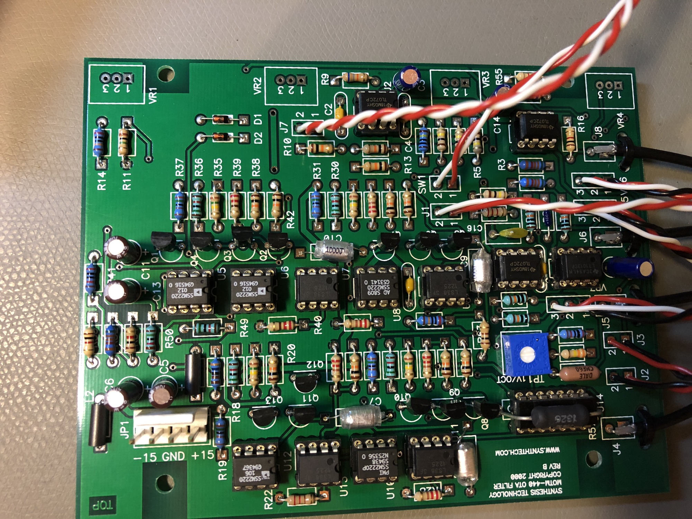

