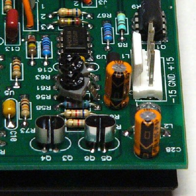
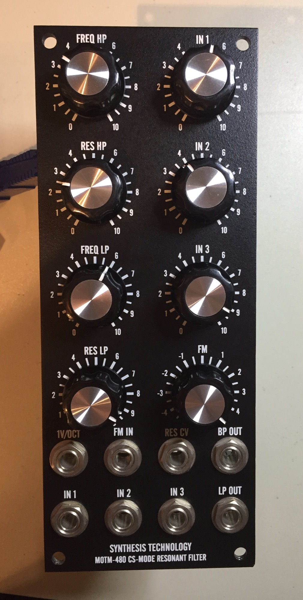
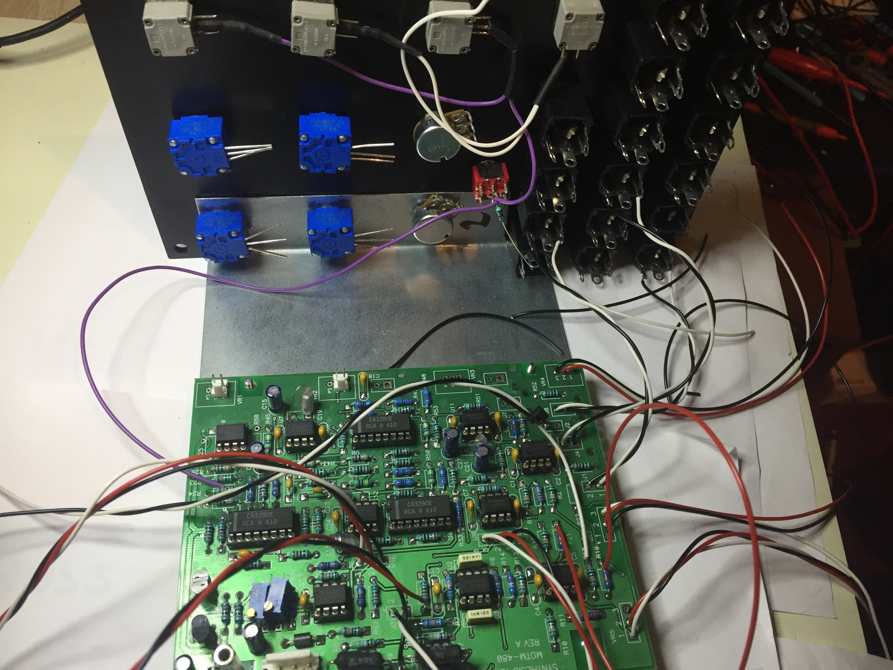
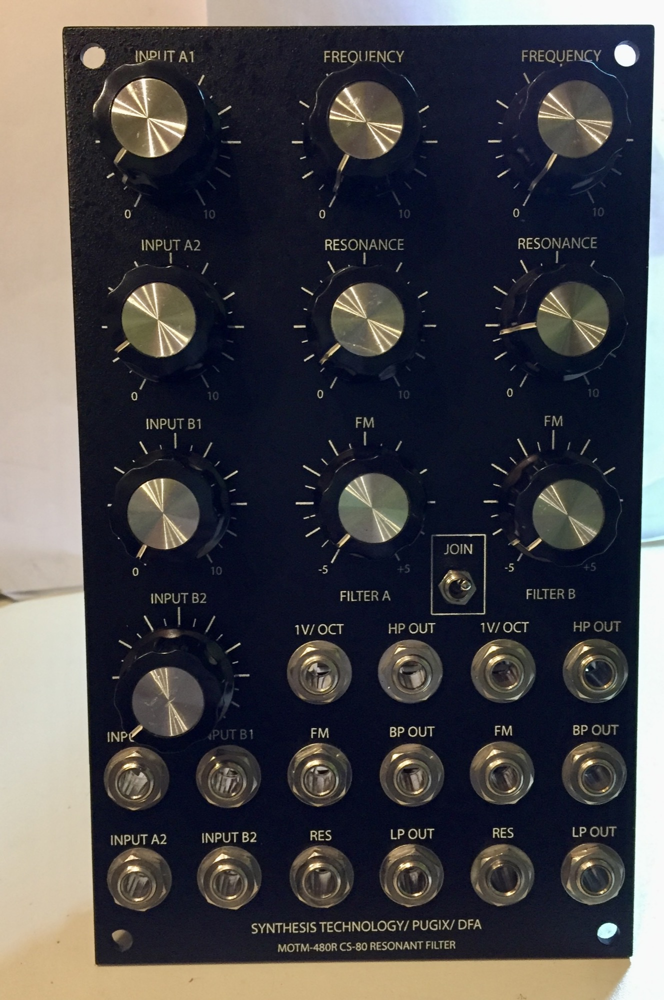
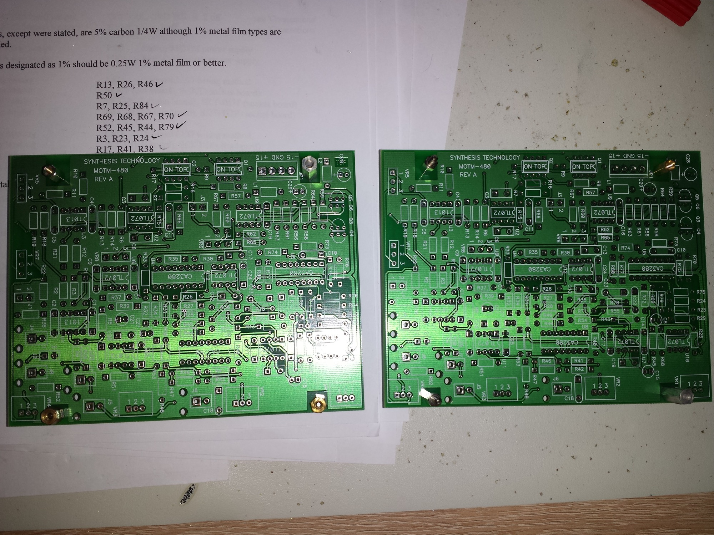
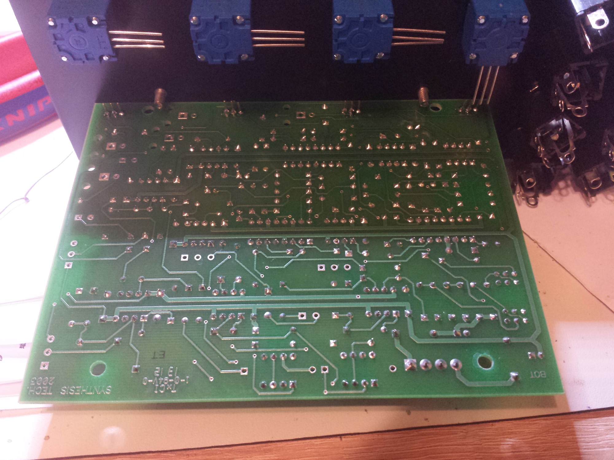
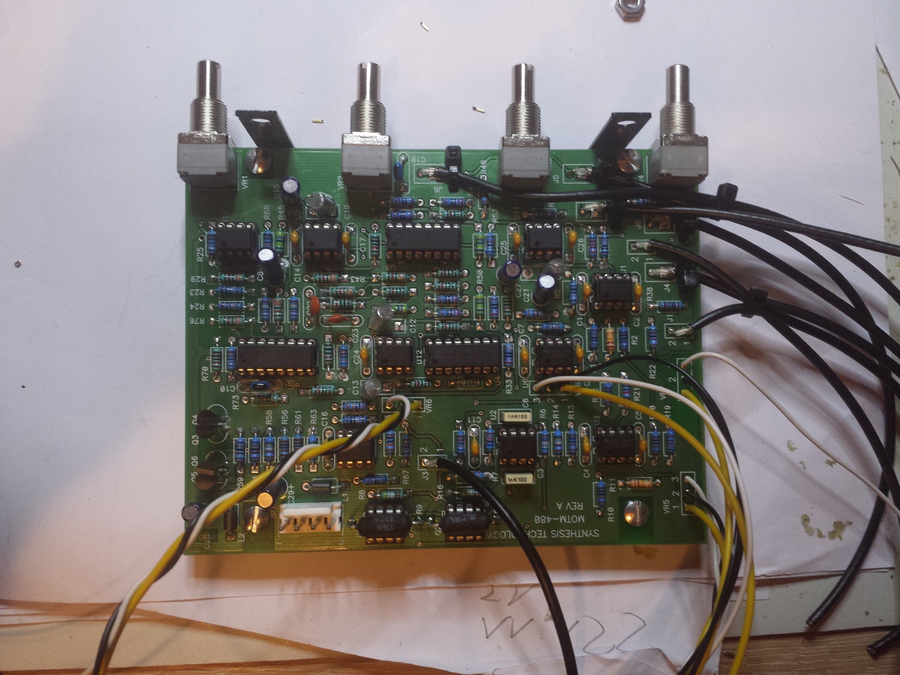
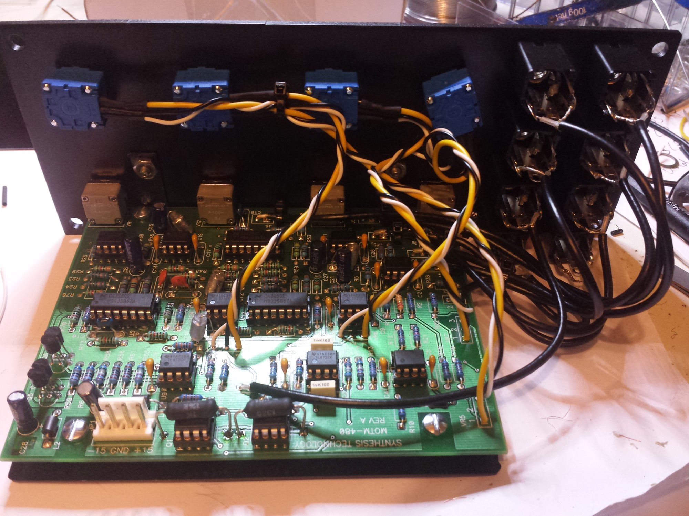

# MOTM 480

> **Project**
>
> ### Projecttitel:MOTM480
>
> ### Status: `finish`
>
> ### Startdate: 17.05.2014
>
> ### Duedate: 25.05.2014
>
> ### Manufacture link: [http://www.synthtech.com/motm480.html](http://www.synthtech.com/motm480.html)

check also the MOTM480R  page  [480R](../motm-480r/index.md)

**BOM:**

[M480\_.pdf](assets/M480_bom.pdf)

**Buildersguide**:

[MOTM480 User's Guide.pdf](assets/MOTM480-User-s-Guide.pdf)

**Hard to find Parts:**

3x CA3280

2x SSM2220

2x LT1013

1x 1k tempco (bridechamber, thonk or synthcube)

for 221k resistor handselect a 220k resistor to a value like 220,5k -  same for other non E6/E12/ values, try carbon resistors - they have 5% tolerance to handselect correct values in 1% value.

> **Tipp**
>
> i tried in 2 MOTM different capaciators for 1N5 (C12,C13,C19,C20)  polysterene and polypropylene, both sounds Modules identical.
>
> make Attention on jack wiring for jacks: okt/V, FM, CV - the polarity is reverse as the  other jacks.

> **Info**
>
> Per [Dave Brown](http://modularsynthesis.com/motm/motm.htm):
>
> "Replaced R56 and R61 with 1K trimmers. The trimmers fit in the resistor footprint by clipping one lead and slightly spreading the other two leads.
>
> "I had very weird distortion and strange modes at high resonance levels. ... Decreasing the input level to '8' eliminated both effects but I wanted to avoid them at both maximum input level and resonance. I adjusted the maximum resonance to limit the maximum output voltage to +/-13 volts."
>
> 

MOTM 480R

