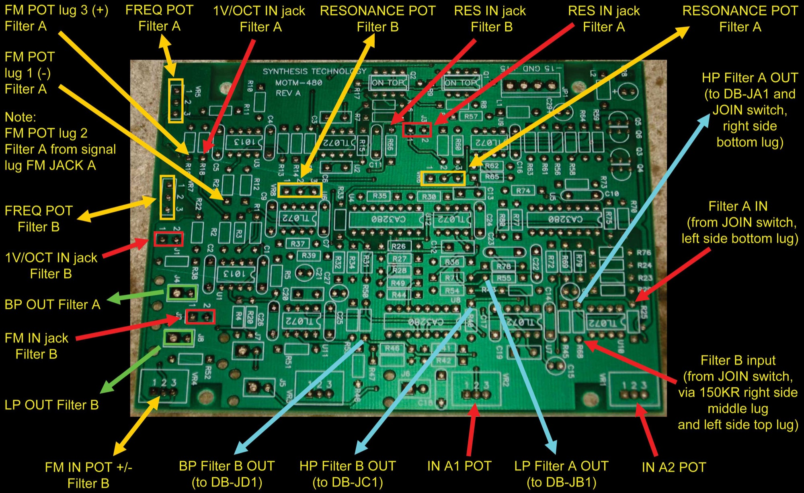
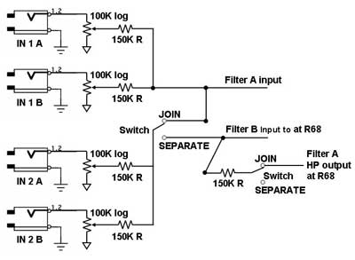
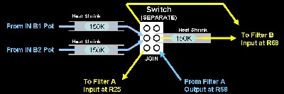
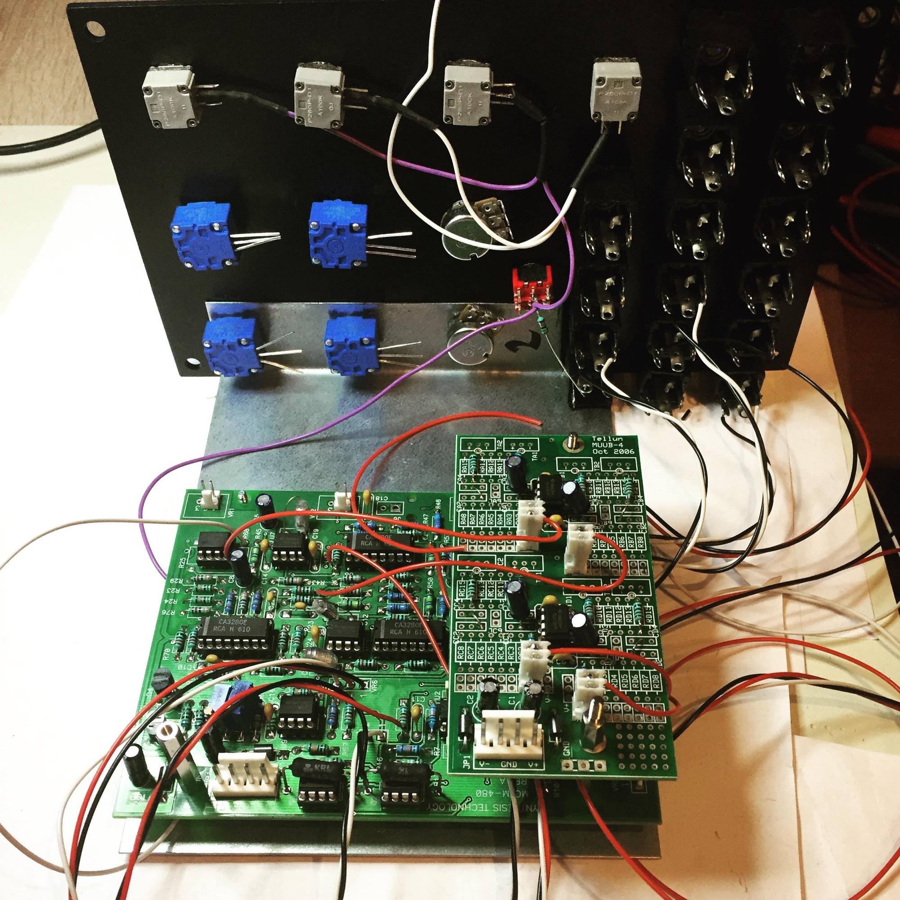
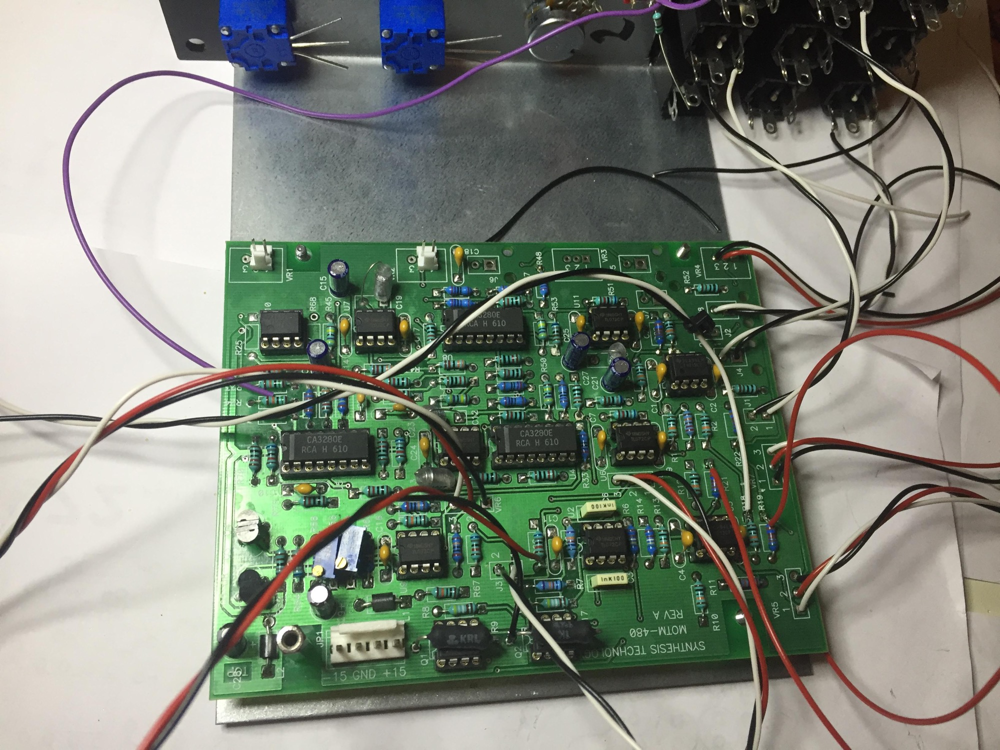
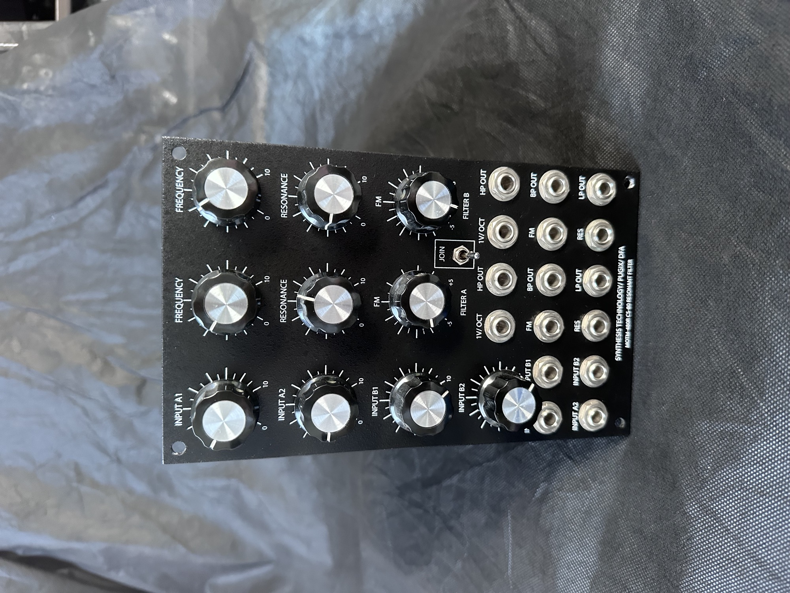
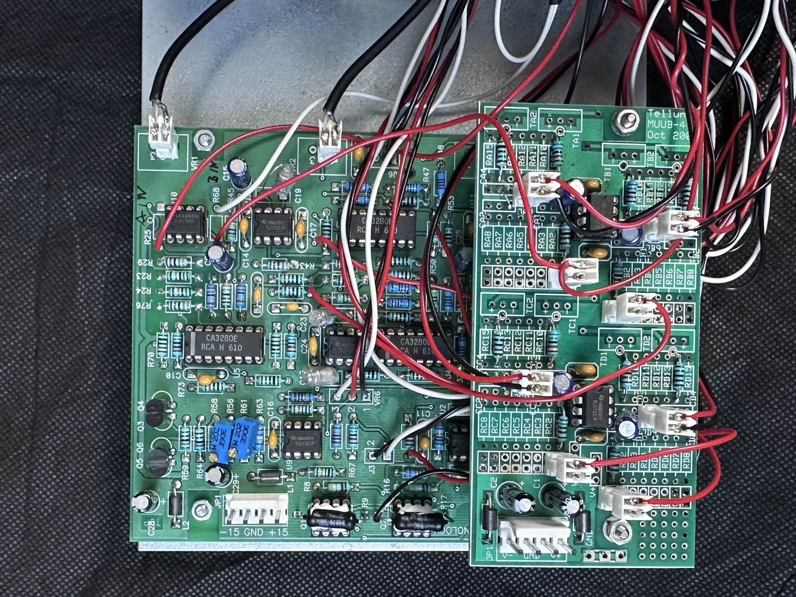

# MOTM 480R

> **Project**
>
> ### Projecttitel: MOTM 480R
>
> ### Status: `finished`
>
> ### Startdate: 01/2015
>
> ### Duedate:
>
> ### Manufacture link: [http://pugix.com/synth/motm-480-3u-dual-filters/](http://pugix.com/synth/motm-480-3u-dual-filters/)
>
> [http://www.dragonflyalley.com/constructionMOTM480.htm](http://www.dragonflyalley.com/constructionMOTM480.htm)

**Important note:**  the pugix Version dont have a switch to separate the channels - this are only needed by usage of Bridechambers MOTM Panel with "JOIN" switch.

copy from Bill and Will (dragonfly)

But we're going to include a few of our own little wrinkles too - for one thing, we're going to call the filters A & B:

- Richard completely separates the filters.  To use the filters as originally designed, you could patch the HP output of filter A into one of the inputs of filter B.  I**nstead, we're going to include a switch (SEPARATE / JOIN) to disconnect the filters or connect them as originally designed (including the 150K resistor which Richard removed).**
- He also has completely separate signal inputs for each of the two filters. In our version, the same switch **will send the inputs from IN B1 and IN B2 either to the input of filter B (when in the SEPARATE position) or to the input of Filter A (When in the JOIN position).**
- Richard also has completely separate CV inputs for each of the two filters.  In our version, we'll wire the 112X Switchcraft Jacks for Filter B's 1V/OCT, FM, and RES inputs such that they'll be normalized to Filter A's CVs until a jack is inserted into them at which point, they'll become discreet inputs.

We figured that these extra features would make it possible for us to use the filter nearly as originally designed as well as using the modifications when we want them.  With the switch in the JOIN position, Filter A HP and BP output, and Filter B LP outputs should be the original outputs.

 

please not, the bottom picture is a scheme how the circuit works, its not a wiring guide.

IN 1A = IN A1    &gt; you dont need to wire this, this is on the pcb !

IN 1B = IN A2    &gt; you dont need to wire this, this is on the pcb !

IN 2A = IN B1

IN 2B = IN B2

