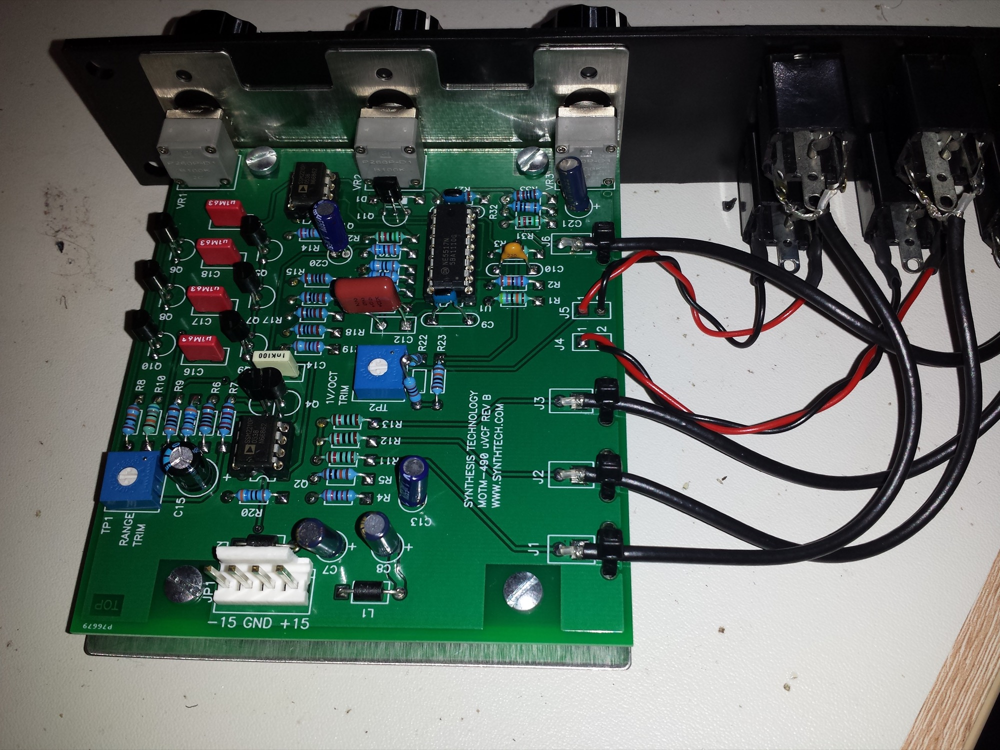

# MOTM 490

> **Project**
>
> ### Projecttitel: synthtech MOTM 490 Filter
>
> ### Status: `finished`
>
> ### Startdate: 20.06.2014
>
> ### Duedate: July 2014
>
> ### Manufacture link: [http://www.synthtech.com/motm490.html](http://www.synthtech.com/motm490.html)

The classic tone of the '70s, the low pass ladder filter defined "the synthesizer sound". The MOTM-490 captures all of the subtle characteristics of the original; growling bass, searing leads and overdrive. Can be used as a VCO above A440. Filters any external audio signal.

- Classic 24dB/Oct LPF Ladder Filter
- Based on the Moog 904A modular sound
- Three Audio Inputs
- Distinctive Overdrive Sound
- Can Self-Resonate (Sine Out)
- Low Power Operation
- MicroModule Series; 5U high x 1U wide

**BOM:**

[M490\_bom.pdf](assets/M490_bom.pdf)

**BOM** **with userguide/builderguide**

[MOTM490 User's Guide.pdf](assets/MOTM490-User-s-Guide.pdf)

