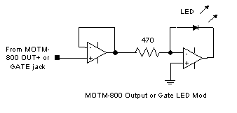
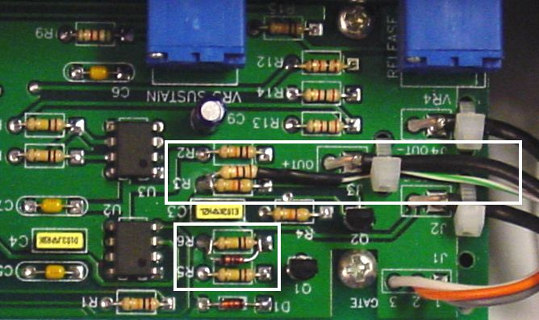

# MOTM 800 ADSR/EG

> **Project**
>
> ### Projecttitel: MOTM800 ADSR/EG
>
> ### Status: `finished`
>
> ### Startdate: 29.11.2013
>
> ### Duedate: 23.01.2014
>
> ### Manufacture link:[http://www.synthtech.com/motm800.html](http://www.synthtech.com/motm800.html)
>
> [http://www.synthtech.com/tech.html](http://www.synthtech.com/tech.html)

[M800\_bom.pdf](assets/M800_bom.pdf)

[MOTM800 User's Guide.pdf](assets/MOTM800-User-s-Guide.pdf)

Missing Part: 3,3uF bipolar Elko/elektrolyr cap

3x [91A1A-B28-D25L](http://de.mouser.com/ProductDetail/Bourns/91A1A-B28-D25L/?qs=sGAEpiMZZMtC25l1F4XBU06RTaAXjxr0%252biUQtpwIAHs%3d)   (1M Log)

1x 91A1A-B24-B15L  (10K LIN)

PCB and Panel ordered from Bridechamber arrived ✅

to order Pots from musikding, arrived  ✅

**ISSUE- Blocker:**

the bipolar cap is hard to find in germany,- a audio bipolar cap dont work ( decay dont work)

if attack dont work - maybe you have forgotten the trigger mod cable connected on trigger jack "switch" pin.

## **MODS:**

### MOTM800 LED Driver:

(copy of [http://www.hotrodmotm.com/](http://www.hotrodmotm.com/))

**OLD VERSION:**

**(copy from wiseguysynth - from google cache 02/2014)**

MOTM-800 update to Rev "B" *– New 03/03/03*

Many of us purchased our MOTM-800 modules before the January 2000 revision
 which provides for full ADSR operation with a gate only and no trigger connected.
 Occasionally, the question of how to update one’s MOTM-800 comes up on the
 MOTM list, so I thought I would post the simple instructions here for those owners
 of pre-January 2002 MOTM-800 modules.

Credit for the update goes to Paul Schreiber. Credit for the method of connecting
 the parts goes to list-member Roy Tate who send me the instructions way back when.

2 parts are needed - one small signal diode like a 1N4148 and one 1K resistor along
 with a short piece of hook up wire. Refer to the white boxes in the photo below.

Add the diode across R6. I just tacked mine in from the top. Be certain the cathode
 (black line) is toward U2.

Attach a wire to one end of the 1K resistor. I insulated my connection with some heat
 shrink. Thread the wire through a coax wire tie as shown to secure the resistor. Connect
 the opposite end of the resistor to the end of R3 closest to U3. The wire connects to
 the switch contact (top lug) on the trigger jack.

