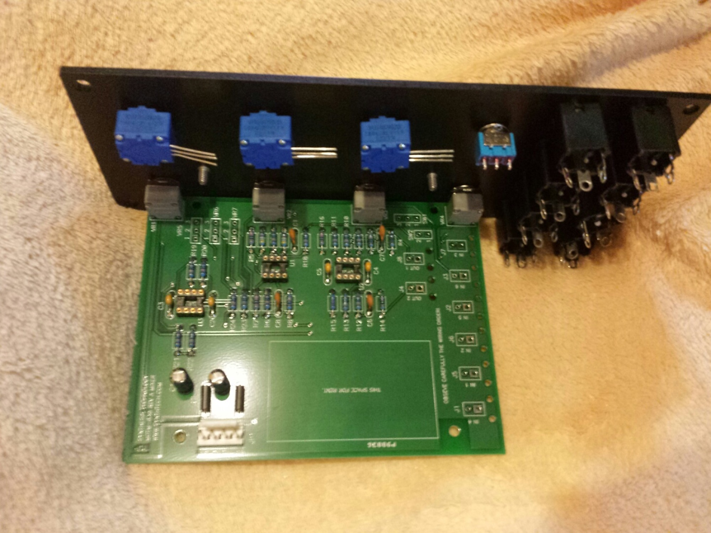
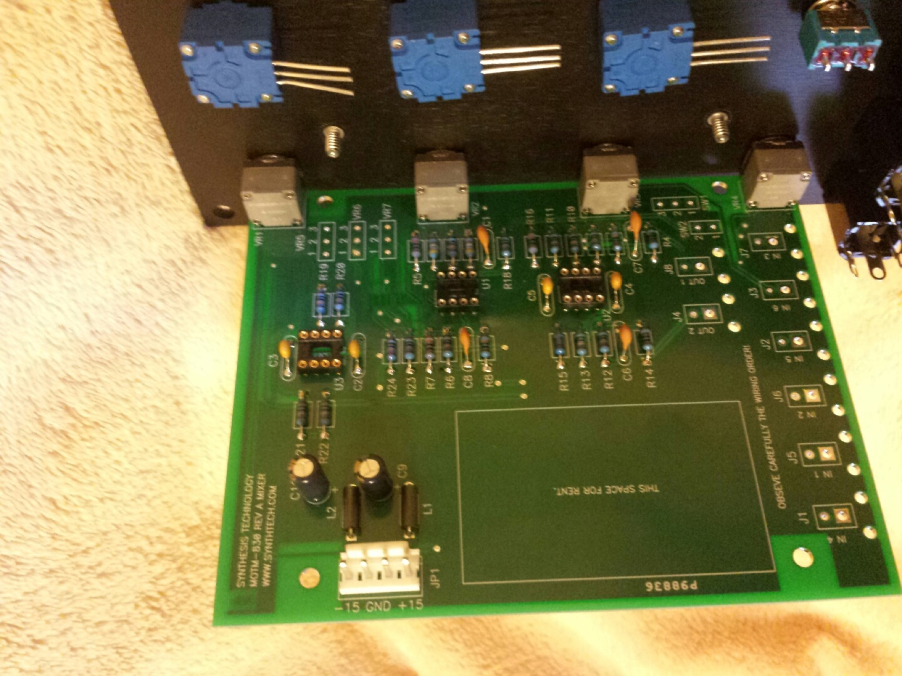
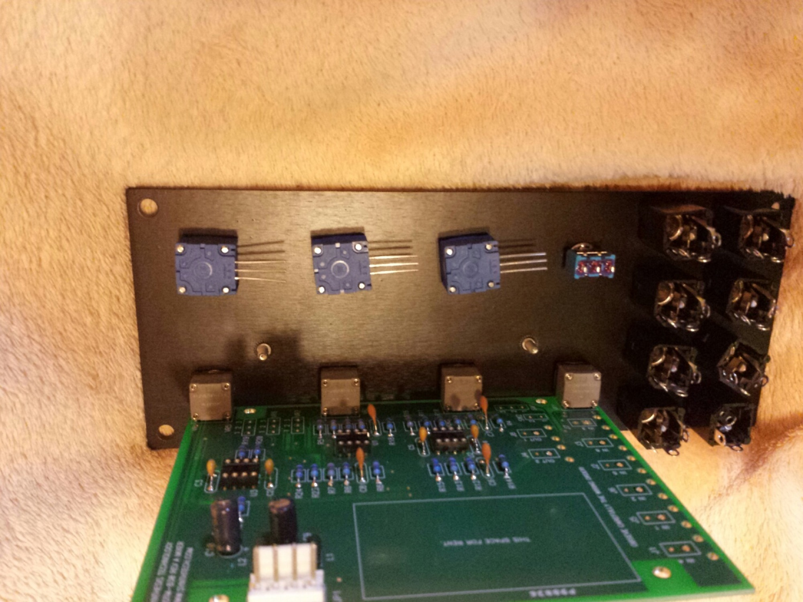
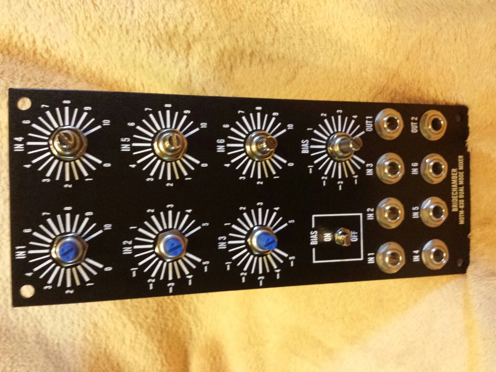
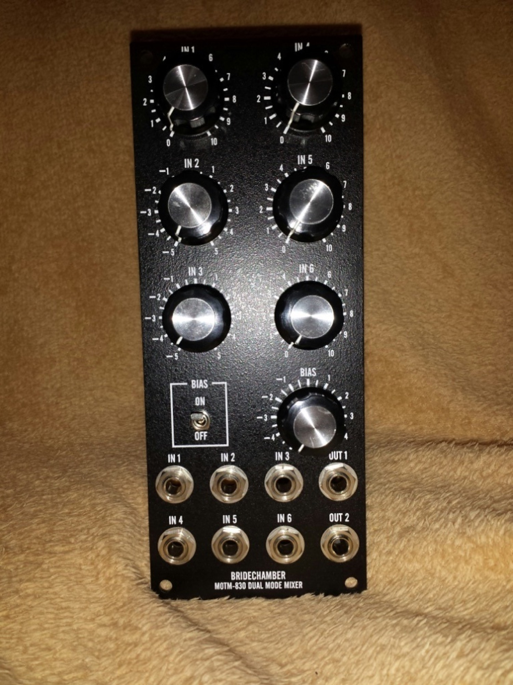
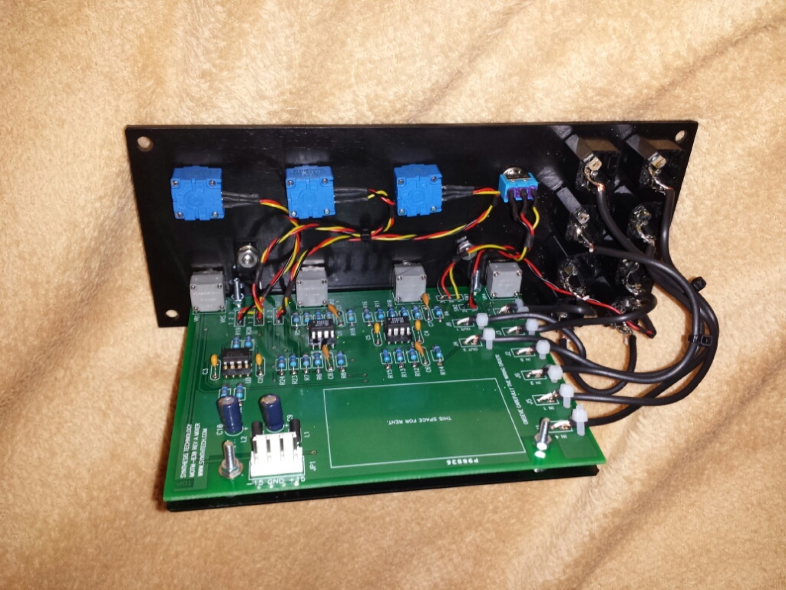
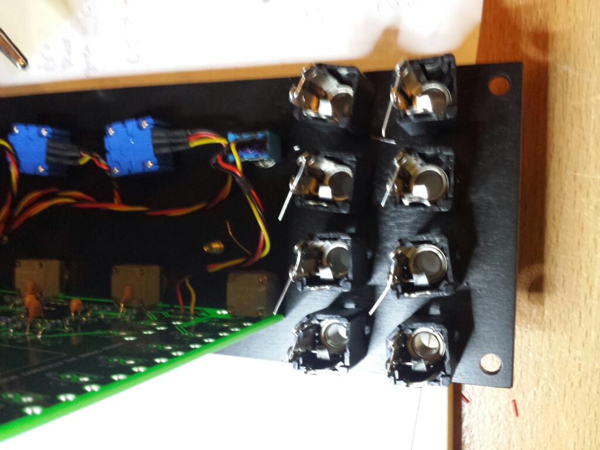

# MOTM 830 Mixer

> **Project**
>
> ### Projecttitel: MOTM 830 Mixer
>
> ### `Status` finished
>
> ### Startdate: 25.11.2013
>
> ### Duedate: 15.12.2013
>
> ### Manufacture link: [http://www.synthtech.com/motm830.html](http://www.synthtech.com/motm830.html)
>
> **further links**:[http://www.dragonflyalley.com/constructionMOTM830.htm](http://www.dragonflyalley.com/constructionMOTM830.htm)

## About the module ( copy from synthtech)

*The MOTM-830 is a dual mode (audio and/or control voltage) mixer. Using a clever switching scheme, the mixer can configure itself into either 6:1 or dual 3:1 mixers. The mixer is "split" when a patchcord is inserted into the OUT 2 jack.*

*The MOTM-830 is unique in the modular world: it is optimized for both audio signal quality and DC stability. Other mixers are generic, TL072-type mixers which are OK for audio but suffer from input offset voltage drift over temperature. The MOTM-830 uses special circuitry to provide superior audio specs (less than 0.005% THD, greater than 90dB SNR) while having superior DC specs (less than 1uV/C drift). Other features include:*

- *Shielded cables on ALL signals*
- *DC Bias generator: module can act as DC source!*
- *Mixer #1 (IN1 - 3) uses linear pots, while Mixer #2 (IN4 - 6) uses audio taper pots*
- *All pots are sealed, conductive plastic for long life and low noise*

*Easy to build, the MOTM-830 is a valuable addition to your MOTM system.*

## Userguide - Buildingguide

***[MOTM830 User's Guide.pdf](assets/MOTM830-User-s-Guide.pdf)***

## Modifications

[http://www.tellun.com/motm/mods/motm830/motm830.html](http://www.tellun.com/motm/mods/motm830/motm830.html)

#### Increase Gain

Changed some resistors to get unity gain from any input to any output.

1. Changed R8 and R17 from 44.2K to 100K (1%).
2. Changed R18 from 100K to 49.9K (1%).

**BOM:**

**[M830\_bom.pdf](assets/M830_bom.pdf)**

**RARE Parts:**

the Op285 was ordered from littlediode

pots from bridechamber and mouser

**PCB, Panel, Bracket, pots from Bridechamber**

|   |   |   |   |   |   |   |   |   |   |
|---|---|---|---|---|---|---|---|---|---|
| Capacitors |   |   |   |   |   |   |   |   |   |
| Radial Electrolytic - tol:+/- 20% |   |   |   |   |   |   |   |   |   |
| 10μF,50V (this has poles) | 2 | Mouser | Xicon | 140-XRL50V10-RC | 1 | 1 | $0,06 | 2 | $0,12 |
| Axial Ceramic Caps |   |   |   |   |   |   |   |   |   |
| .000022uF (= .022nF = 22pF) | 1 | Mouser | Xicon | 147-75-220-RC | 1 | 1 | $0,27 | 1 | $0,27 |
| .1uF (= 100nF = 100,000pF) | 7 | Mouser | Xicon | 147-72-104-RC | 1 | 1 | $0,16 | 7 | $1,12 |
| Caps Subtotal |   |   |   |   |   |   |   |   | $1,51 |
| Project Subtotal |   |   |   |   |   |   |   |   | $1,51 |
|   |   |   |   |   |   |   |   |   |   |
| Resistors - 1/4 W - 5% (unless resistors are specified as otherwise, assume they're 5% - Paul lists them as 5% - extra clear!) note: there is a price breakpoint on the 5% Rs that makes it super-cheap to buy 10 of them.  I always do and put the extras away for when we need them. |   |   |   |   |   |   |   |   |   |
| 1K ohm (2K2) | 2 | Mouser | Xicon | 291-1K-RC | 1 | 1 | $0,10 | 1 | $0,10 |
| 10 K ohm | 3 | Mouser | Xicon | 291-10K-RC | 1 | 1 | $0,10 | 4 | $0,40 |
| 44.2 K ohm (44K2) 1% | 2 | Mouser | Xicon | 271-44.2K-RC | 1 | 1 | $0,13 | 1 | $0,13 |
| 49.9 K ohm (49K9) 1% | 2 | Mouser | Xicon | 271-49.9K-RC | 1 | 1 | $0,13 | 1 | $0,13 |
| 51K ohm | 1 | Mouser | Xicon | 291-51K-RC | 1 | 1 | $0,10 | 1 | $0,10 |
| 100 K ohm 1% | 13 | Mouser | Xicon | 271-100K-RC | 1 | 1 | $0,13 | 3 | $0,39 |
| 150 K ohm 1% | 1 | Mouser | Xicon | 271-150K-RC | 1 | 1 | $0,13 | 3 | $0,39 |
| Resistor Subtotal |   |   |   |   |   |   |   |   | $1,64 |
| Project Subtotal |   |   |   |   |   |   |   |   | $3,15 |
|   |   |   |   |   |   |   |   |   |   |
| Semiconductors |   |   |   |   |   |   |   |   |   |
| TL072 dual op amp | 1 | Mouser | STMicroelectronics | 595-TL072ACN | 1 | 1 | $0,95 | 1 | $0,95 |
| OP285GP | 2 | Synth Tech |   | these are very hard to find | 1 | 1 | $8,00 | 1 | $8,00 |
| you may have to sustitute a OP275 |   |   |   |   |   |   |   |   |   |
| IC Subtotal |   |   |   |   |   |   |   |   | $8,95 |
| Project Subtotal |   |   |   |   |   |   |   |   | $12,10 |
|   |   |   |   |   |   |   |   |   |   |
| Misc |   |   |   |   |   |   |   |   |   |
| Axial Ferrite Beads | 2 | Mouser | Fair-Rite | 623-2743002112 | 1 | 1 | $0,12 | 3 | $0,36 |
| MTA .156" Connectors FRCTN LK HDR STR 4P Square post, tin | 1 | Mouser | Tyco | 571-6404454 | 1 | 1 | $0,30 | 1 | $0,30 |
| Toggle Switches SPDT on-none-on | 1 | Mouser | NKK | 633-M201202-RO | 1 | 1 | $4,50 | 1 | $4,50 |
| Misc Subtotal |   |   |   |   |   |   |   |   | $0,66 |
| Project Subtotal |   |   |   |   |   |   |   |   | $12,76 |
|   |   |   |   |   |   |   |   |   |   |
| Pots / Trimmers |   |   |   |   |   |   |   |   |   |
| Set of 100K log taper Spectrol 148 pot - this has 4 pots - these pots are very diffcult to find | 1 | Synth Tech |   |   | 1 | 1 | $30,00 | 1 | $30,00 |
| 100K conductive plastic Spectrol 148 log pot | 3 | Mouser | Vishay/Spectrol | very very hard to find | 1 | 1 |   |   |   |
| Set of 100K cermet Spectrol 149 pot - this has 2 pots and ends up being much less expensive than getting them from Mouser | 1 | Synth Tech |   |   | 1 | 1 | $15,00 | 1 | $15,00 |
| 100K cermet Spectrol 149 pot | 1 | Mouser | Vishay/Spectrol | 594-149-7104 | 1 | 1 | $12,97 | do the math! If you're doing another module, it pays to buy the set from Paul |   |
| Bourns 100K panel mount ~~95A pots~~ | 3 | Mouser | Bourns | 652-95A1A-B28-A20 use: **91A1A-B28-A20L** | 1 | 1 | $8,08 | 3 | $24,24 |
| Pots Subtotal |   |   |   |   |   |   |   |   | $69,24 |
| Project Subtotal |   |   |   |   |   |   |   |   | $82,00 |
|   |   |   |   |   |   |   |   |   |   |
| Jacks |   |   |   |   |   |   |   |   |   |
| 2 Conductor Closed Tip 1/4" jack (112A type) | 7 | Mouser | Switchcraft | \|   \| \|---\| \| 502-112AX \| | 1 | 1 | $1,89 | 7 | $13,23 |
| 502-112AX |   |   |   |   |   |   |   |   |   |
| Closed tip Closed ring jack (114B type) | 1 | Mouser | Switchcraft | \|   \| \|---\| \| 502-114BX \| | 1 | 1 | $3,35 | 1 | $3,35 |
| 502-114BX |   |   |   |   |   |   |   |   |   |
| lock washer | 8 | Mouser | Vishay/Spectrol | 594-512-0008 | 1 | 1 | $0,13 | 8 | $1,00 |
| Jacks Subtotal |   |   |   |   |   |   |   |   | $17,58 |
| Project Subtotal |   |   |   |   |   |   |   |   | $99,58 |
|   |   |   |   |   |   |   |   |   |   |
| Wire |   |   |   |   |   |   |   |   |   |
| Power Cable - 20" | 1 | Synth Tech |   |   | 1 | 1 | $7,00 | 1 | $7,00 |
| Wire Assortment | 1 | Synth Tech |   |   | 1 | 1 | $8,00 | 1 | $8,00 |
| Coax assortment | 1 | Synth Tech |   |   | 1 | 1 | $9,00 | 1 | $9,00 |
| OR you could buy a bunch of wire and do it yourself. |   |   |   |   |   |   |   |   |   |
| Belden Hook-Up Wire - 22AWG, box of five 100foot spools, different colors |   | Mouser | Belden CDT | 566-9531 | 1 | 1 | $134,68 |   |   |
| Belden Co-Axial Cable 100 foot spool -   RG174/U 26AWG BLACK |   | Mouser | Belden CDT | 566-8216-100 | 1 | 1 | $51,70 |   |   |
|   |   |   |   |   |   |   |   |   |   |
| Wire Subtotal |   |   |   |   |   |   |   |   | $24,00 |
| Project Subtotal |   |   |   |   |   |   |   |   | $123,58 |
|   |   |   |   |   |   |   |   |   |   |
| Hardware |   |   |   |   |   |   |   |   |   |
| Large BR-1 mounting bracket | 1 | Synth Tech |   |   | 1 | 1 | $8,00 | 1 | $8,00 |
| #6-32 x 1/2 screws | 4 | Mouser | Keystone | 534-9409 | 1 | 1 | $0,08 | 4 | $0,32 |
| 1/4" al spacers | 4 | Mouser | Keystone | 534-398 | 1 | 1 | $0,14 | 4 | $0,56 |
| #6 KEPS nuts - these come in a bag of 100 | 6 | Pointe-Products.com |   | 10607-P | 1 | 100 | $6,70 |   |   |
| count them individaully - here' how they add up: |   |   |   |   |   |   | $0,07 | 6 | $0,40 |
| Tie Wraps | 9 | Mouser | 3M Electronic Specialty | 517-41932 | 1 | 1 | $0,04 | 4 | $0,16 |
| 8 ALCO knobs - so look, if you'r only building this module, you can buy these guys at Mouser… but otherwise think about buying them from Paul - much less expensive | 1 | Synth Tech |   |   | 1 | 1 | $16,00 | 1 | $16,00 |
| knob - Alcoswitch | 7 | Mouser | Tyco Electronics / Alcoswitch | 506-PKES90B1/4 | 1 | 1 | $3,33 |   |   |
| Hardware Subtotal |   |   |   |   |   |   |   |   | $25,44 |
| Project Subtotal |   |   |   |   |   |   |   |   | $123,58 |
|   |   |   |   |   |   |   |   |   |   |
| PCB / Panel |   |   |   |   |   |   |   |   |   |
| MOTM-830 Mixer pc board | 1 | Synth Tech |   |   | 1 | 1 | $39,00 | 1 | $39,00 |
| MOTM-830 front panel | 1 | Synth Tech |   |   | 1 | 1 | $39,00 | 1 | $39,00 |
| PCB/Panel Subtotal |   |   |   |   |   |   |   |   | $78,00 |
| Project Subtotal |   |   |   |   |   |   |   |   | $201,58 |
|   |   |   |   |   |   |   |   |   |   |
| Solder |   |   |   |   |   |   |   |   |   |
| heat-shrink 1/8" - four foot length - you need this |   |   |   | 602-221018-4BK | 1 | 1 | $1,50 |   |   |
