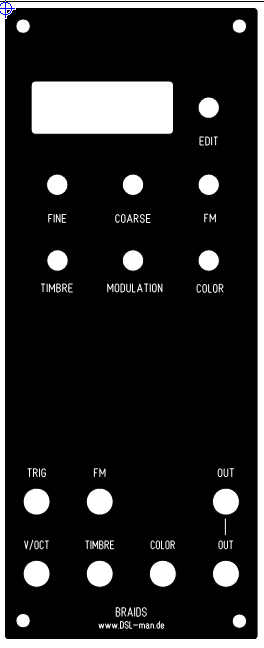
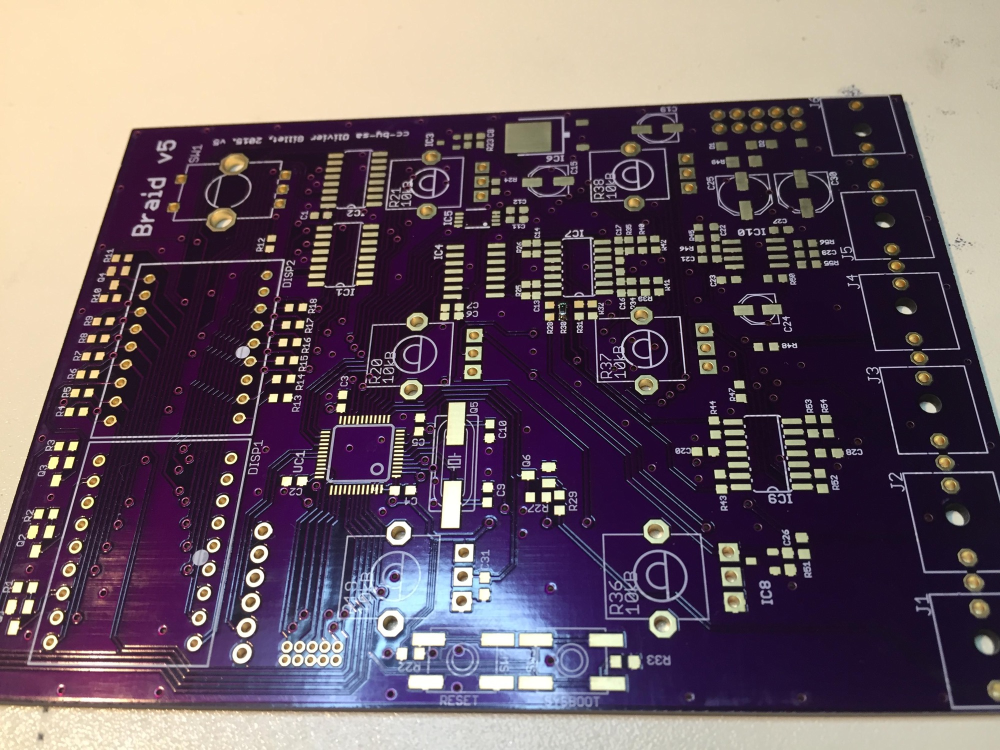
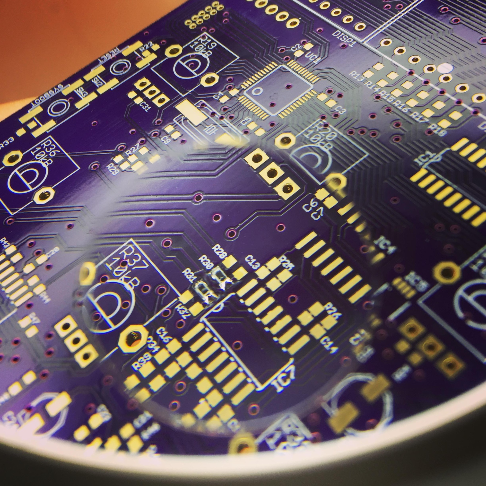
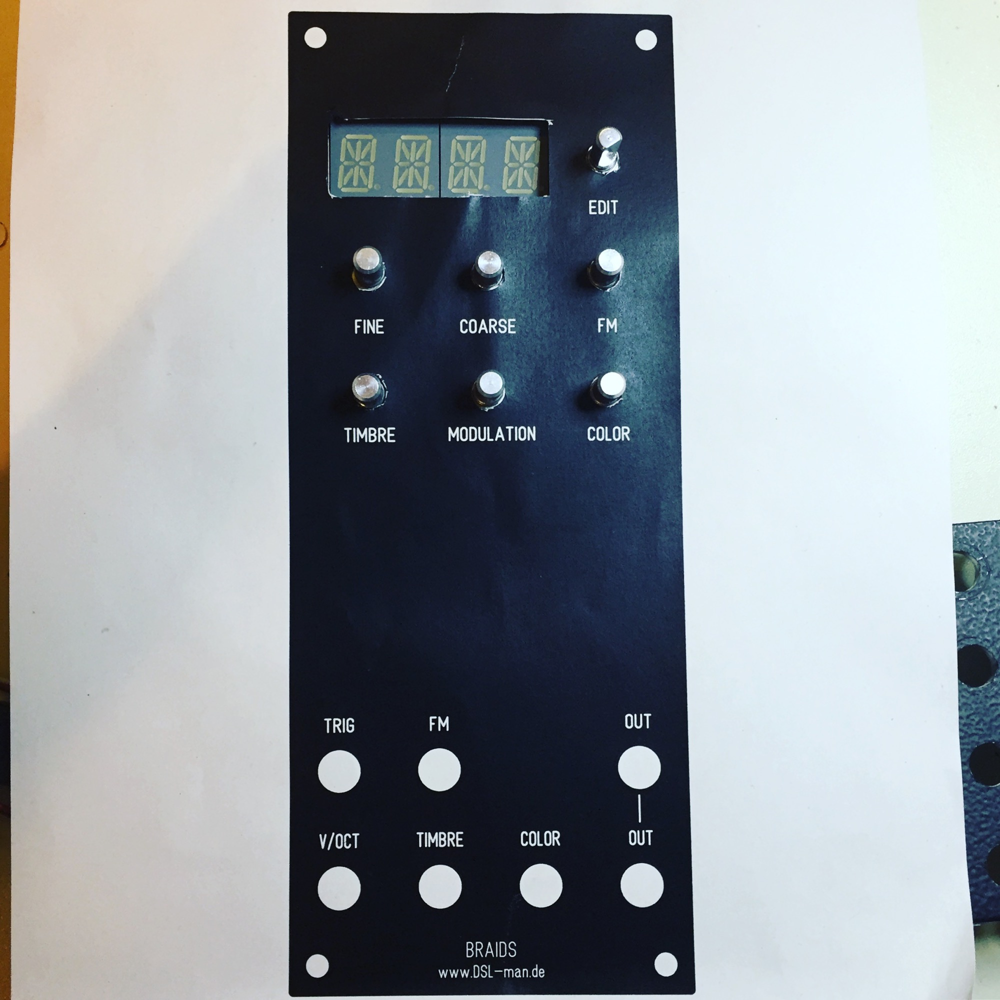

# Mutable Instruments Braids in MOTM

> **Project**
>
> ### Projecttitel: Mutable Instruments Braids in MOTM
>
> ### Status: `in progress`
>
> ### Startdate: 17 Jan. 2017
>
> ### Duedate: 01.July.2017
>
> ### Manufacture link: --

its planned to build a  Braids Module in MOTM format.

**Mouser BOM:** [http://www.mouser.com/ProjectManager/ProjectDetail.aspx?AccessID=6bd0055711](http://www.mouser.com/ProjectManager/ProjectDetail.aspx?AccessID=6bd0055711)

+ 6 Jacks ( in case of 5U  = 6,3mm jacks)

+  Pots  6 x 10K linear pots 15mm shaft

PCB from  [https://www.muffwiggler.com/forum/viewtopic.php?t=135393&postdays=0&postorder=asc&start=0](https://www.muffwiggler.com/forum/viewtopic.php?t=135393&postdays=0&postorder=asc&start=0)

**BOM as Excel list:**

 

[Kopie von Braids.xlsx](assets/Kopie-von-Braids.xlsx)

**Panel:**

Eurorack original file:

original design embedded in MOTM 5U high 2U widht

designed with Schaeffers Frontpaneldesigner (please ask me for the fpd Panel file in MOTM /5U)

**Pictures**

