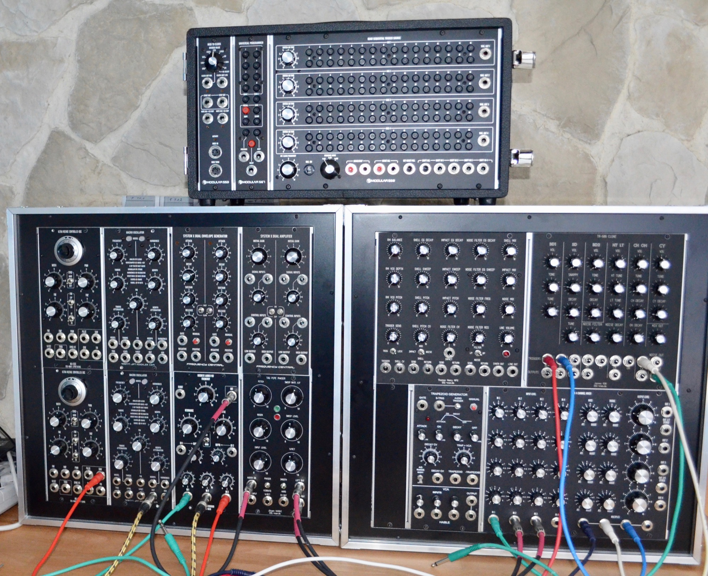

# Mutable Plaits in 5U MJK

> **Project**
>
> ### Projecttitel: Mutable Plaits in 5U MJK
>
> ### Status: up and running
>
> ### Startdate: 2019
>
> ### Duedate: 12/2019
>
> ### Manufacture link: [http://www.martinjankoehler.com/synth...](https://www.youtube.com/redirect?redir_token=6hXCNEOtQq8CJrmhtjQagUpNKQ18MTU3OTQ2NTUwMEAxNTc5Mzc5MTAw&v=xUmWcxQ1tv8&q=http%3A%2F%2Fwww.martinjankoehler.com%2Fsynthesizers%2F&event=video_description)

[http://youtube.com/watch?v=xUmWcxQ1tv8](http://youtube.com/watch?v=xUmWcxQ1tv8)

