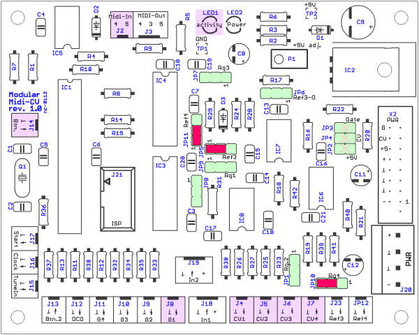
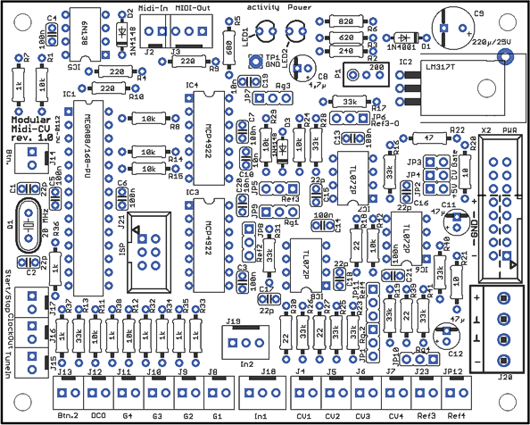
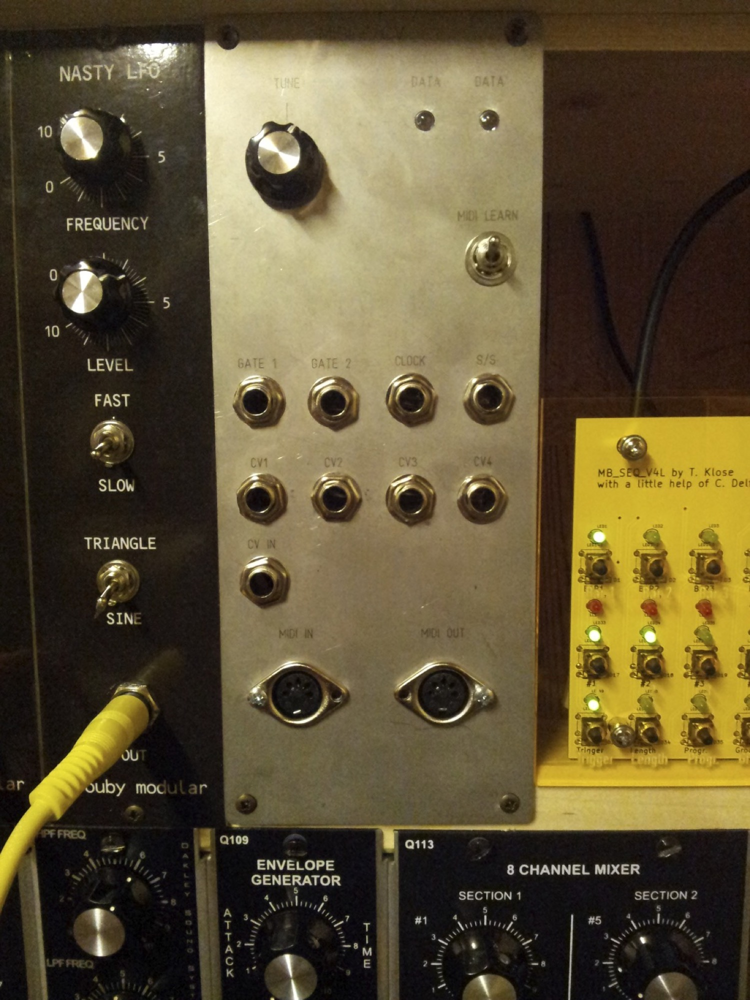

# nordcore MIDI CV Interface

> **Project**
>
> ### Projecttitel: Midi-CV Interface
>
> ### Status: STATUS finished
>
> ### Startdate: 2012
>
> ### Duedate: 2012
>
> updated Aril 2014
>
> ### Manufacture link: [http://www.sequencer.de/synthesizer/viewtopic.php?f=13&t=63127](http://www.sequencer.de/synthesizer/viewtopic.php?f=13&t=63127)
>
> [**Sourcen**: http://www.sequencer.de/synth/index.php/MCV876\_Controller\_Update](http://www.sequencer.de/synth/index.php/MCV876_Controller_Update)

**Subpages**

**sequencer.de** Forum Midi CV Interface designed by nordcore.

[http://www.sequencer.de/synthesizer/viewtopic.php?f=13&t=63127](http://www.sequencer.de/synthesizer/viewtopic.php?f=13&t=63127)

**Builders guide:**

[bauanleitung.pdf](assets/bauanleitung.pdf)

**Sourcen**: [Midi-CV-007a.zip](assets/Midi-CV-007a.zip)

**Schematics:** [Mod-CV-1.0.sch.pdf](assets/Mod-CV-1.0.sch.pdf)

**Jumper:**
[http://www.sequencer.de/synthesizer/vie ... 25#p713784](http://www.sequencer.de/synthesizer/viewtopic.php?f=13&t=63127&start=525#p713784)
[http://www.sequencer.de/synthesizer/dow ... hp?id=5094](http://www.sequencer.de/synthesizer/download/file.php?id=5094)

RED = as Default  Jumper.

if jumpered JP2, 3, 4 are the +5V, Gate or CV optional on the Doepfer-Bus

choose "Rg" (Range) Jumper , by using 5V (open), +/5V (2-3) or 10V(1-2) for using CV

**Hardware**

4 Controlvoltages (CV)  0-10V

4-6 Gate Outputs 0 to 5V switched.

1 LED „multicontrol“

1 bushbutton.

MIDI-Input

MIDI-Thru Out

(No MIDI out)

## Funktionsübersicht – Standardbelegung

Das Interface kann zwar (über Midi und Sys-Ex Befehle) durchaus unterschiedlich konfiguriert werden. Zunächst aber die Standardbelegung. Die ist einkanalig und monophon.

Defaultsetting is monophon with one channel

|   |   |   |   |
|---|---|---|---|
| CV 1 | Tonhöhe (Noten) | Gate 1 | Note-ON |
| CV 2 | Velocity | Gate 2 | CC 18 |
| CV 3 | Mod Wheel | Gate 3 | CC 19 |
| CV 4 | Pitch Bend | Gate 4 | CC 20 |
|   |   | Gate 5 | Midi Start/Stop |
|   |   | Gate 6 | Midi Clock /6 (entsprechend 16-tel) |

 CV 1 and Gate 1 are  Standardoutputs

all CV works for 1V/Oktave .

CV2  Aftertouch 0-5V.

CV3  Pitchbend, middleposition 5V , works with 0...10V.

CV4  Modulationwheel

all CV´s can be changed in software/ctrlr to use for other modes like polyphonic mode,

setup by ctrlr panel as standalone or VST Plugin.  -&gt;

**BOM:** reichelt.de

Warenkorbname: Modular-Midi-Cv-1.0

|   |   |   |   |   |   |   |
|---|---|---|---|---|---|---|
| [METALL 10,0](http://www.reichelt.de/1-4W-1-10-0-Ohm-97-6-Ohm/METALL-10-0/3/index.html?&ACTION=3&LA=20&GROUP=B1212&GROUPID=3076&ARTICLE=11448&START=0&SORT=-rank&OFFSET=16) | [Metallschichtwiderstand 10,0 Ohm](http://www.reichelt.de/1-4W-1-10-0-Ohm-97-6-Ohm/METALL-10-0/3/index.html?&ACTION=3&LA=20&GROUP=B1212&GROUPID=3076&ARTICLE=11448&START=0&SORT=-rank&OFFSET=16) | 0,08 € | 1 |   |   |   |
| [PS 25/3G BR](http://www.reichelt.de/Platinen-Steckverbinder/PS-25-3G-BR/3/index.html?&ACTION=3&LA=20&GROUP=C1B5&GROUPID=5216&ARTICLE=40274&START=0&SORT=-rank&OFFSET=16) | [Platinensteckverbinder gerade, braun, 3-polig](http://www.reichelt.de/Platinen-Steckverbinder/PS-25-3G-BR/3/index.html?&ACTION=3&LA=20&GROUP=C1B5&GROUPID=5216&ARTICLE=40274&START=0&SORT=-rank&OFFSET=16) | 0,35 € | 1 |   |   |   |
| [RAD FC 47/25](http://www.reichelt.de/Elkos-radial-105-C-1000-5000h/RAD-FC-47-25/3/index.html?&ACTION=3&LA=20&GROUP=B319&GROUPID=4000&ARTICLE=84601&START=0&SORT=-rank&OFFSET=16) | [Elko radial, 105°C, low ESR, RM 2,0mm](http://www.reichelt.de/Elkos-radial-105-C-1000-5000h/RAD-FC-47-25/3/index.html?&ACTION=3&LA=20&GROUP=B319&GROUPID=4000&ARTICLE=84601&START=0&SORT=-rank&OFFSET=16) | 0,09 € | 1 |   |   |   |
| [METALL 220](http://www.reichelt.de/1-4W-1-100-Ohm-976-Ohm/METALL-220/3/index.html?&ACTION=3&LA=20&GROUP=B1213&GROUPID=3077&ARTICLE=11627&START=0&SORT=-rank&OFFSET=16) | [Metallschichtwiderstand 220 Ohm](http://www.reichelt.de/1-4W-1-100-Ohm-976-Ohm/METALL-220/3/index.html?&ACTION=3&LA=20&GROUP=B1213&GROUPID=3077&ARTICLE=11627&START=0&SORT=-rank&OFFSET=16) | 0,08 € | 1 |   |   |   |
| [MCP 4922-E/P](http://www.reichelt.de/ICs-MCP-3-5-/MCP-4922-E-P/3/index.html?&ACTION=3&LA=20&GROUP=A2175&GROUPID=5472&ARTICLE=90090&START=0&SORT=-rank&OFFSET=16) | [D/A Converter / 12- bit / 2-Kanal / mit SPI Schnittstelle / DIL-](http://www.reichelt.de/ICs-MCP-3-5-/MCP-4922-E-P/3/index.html?&ACTION=3&LA=20&GROUP=A2175&GROUPID=5472&ARTICLE=90090&START=0&SORT=-rank&OFFSET=16) | 2,30 € | 1 |   |   |   |
| [MAB 5S](http://www.reichelt.de/Diodeneinbaubuchsen/MAB-5S/3/index.html?&ACTION=3&LA=20&GROUP=C1653&GROUPID=5182&ARTICLE=11172&START=0&SORT=-rank&OFFSET=16) | [DIN-Buchse, 5-polig, halbrund](http://www.reichelt.de/Diodeneinbaubuchsen/MAB-5S/3/index.html?&ACTION=3&LA=20&GROUP=C1653&GROUPID=5182&ARTICLE=11172&START=0&SORT=-rank&OFFSET=16) | 0,40 € | 1 |   |   |   |
| [WSL 16G](http://www.reichelt.de/Pfosten-Wannenstecker/WSL-16G/3/index.html?&ACTION=3&LA=20&GROUP=C151&GROUPID=3231&ARTICLE=22822&START=0&SORT=-rank&OFFSET=16) | [Wannenstecker, 16-polig, gerade](http://www.reichelt.de/Pfosten-Wannenstecker/WSL-16G/3/index.html?&ACTION=3&LA=20&GROUP=C151&GROUPID=3231&ARTICLE=22822&START=0&SORT=-rank&OFFSET=16) | 0,12 € | 1 |   |   |   |
| [1N 4148](http://www.reichelt.de/1N-UF-AA-Dioden/1N-4148/3/index.html?&ACTION=3&LA=20&GROUP=A411&GROUPID=2987&ARTICLE=1730&START=0&SORT=-rank&OFFSET=16) | [Planar Epitaxial Schaltdiode, DO35, 100V, 0,15A](http://www.reichelt.de/1N-UF-AA-Dioden/1N-4148/3/index.html?&ACTION=3&LA=20&GROUP=A411&GROUPID=2987&ARTICLE=1730&START=0&SORT=-rank&OFFSET=16) | 0,02 € | 1 |   |   |   |
| [GS 14P](http://www.reichelt.de/IC-Sockel/GS-14P/3/index.html?&ACTION=3&LA=20&GROUP=C131&GROUPID=3215&ARTICLE=8207&START=0&SORT=-rank&OFFSET=16) | [IC-Sockel, 14-polig, superflach, gedreht, vergold.](http://www.reichelt.de/IC-Sockel/GS-14P/3/index.html?&ACTION=3&LA=20&GROUP=C131&GROUPID=3215&ARTICLE=8207&START=0&SORT=-rank&OFFSET=16) | 0,29 € | 1 |   |   |   |
| [TL 072 DIP](http://www.reichelt.de/ICs-TA-TL-/TL-072-DIP/3/index.html?&ACTION=3&LA=20&GROUP=A2195&GROUPID=5479&ARTICLE=21556&START=0&SORT=-rank&OFFSET=16) | [Op-Amp, DIP-8](http://www.reichelt.de/ICs-TA-TL-/TL-072-DIP/3/index.html?&ACTION=3&LA=20&GROUP=A2195&GROUPID=5479&ARTICLE=21556&START=0&SORT=-rank&OFFSET=16) | 0,28 € | 1 |   |   |   |
| [X7R-2,5 10N](http://www.reichelt.de/Vielschicht-bedrahtet-X7R-10-/X7R-2-5-10N/3/index.html?&ACTION=3&LA=20&GROUP=B3512&GROUPID=3162&ARTICLE=22854&START=0&SORT=-rank&OFFSET=16) | [Vielschicht-Keramikkondensator 10N, 10%](http://www.reichelt.de/Vielschicht-bedrahtet-X7R-10-/X7R-2-5-10N/3/index.html?&ACTION=3&LA=20&GROUP=B3512&GROUPID=3162&ARTICLE=22854&START=0&SORT=-rank&OFFSET=16) | 0,06 € | 1 |   |   |   |
| [METALL 10,0K](http://www.reichelt.de/1-4W-1-10-0-k-Ohm-95-3-k-Ohm/METALL-10-0K/3/index.html?&ACTION=3&LA=20&GROUP=B1215&GROUPID=3079&ARTICLE=11449&START=0&SORT=-rank&OFFSET=16) | [Metallschichtwiderstand 10,0 K-Ohm](http://www.reichelt.de/1-4W-1-10-0-k-Ohm-95-3-k-Ohm/METALL-10-0K/3/index.html?&ACTION=3&LA=20&GROUP=B1215&GROUPID=3079&ARTICLE=11449&START=0&SORT=-rank&OFFSET=16) | 0,08 € | 1 |   |   |   |
| [JUMPER 2,54GL SW](http://www.reichelt.de/Stiftleisten/JUMPER-2-54GL-SW/3/index.html?&ACTION=3&LA=20&GROUP=C141&GROUPID=3220&ARTICLE=9019&START=0&SORT=-rank&OFFSET=16) | [Kurzschlussbrücke, schw. m. Grifflasche](http://www.reichelt.de/Stiftleisten/JUMPER-2-54GL-SW/3/index.html?&ACTION=3&LA=20&GROUP=C141&GROUPID=3220&ARTICLE=9019&START=0&SORT=-rank&OFFSET=16) | 0,04 € | 1 |   |   |   |
| [METALL 33,0K](http://www.reichelt.de/1-4W-1-10-0-k-Ohm-95-3-k-Ohm/METALL-33-0K/3/index.html?&ACTION=3&LA=20&GROUP=B1215&GROUPID=3079&ARTICLE=11730&START=0&SORT=-rank&OFFSET=16) | [Metallschichtwiderstand 33,0 K-Ohm](http://www.reichelt.de/1-4W-1-10-0-k-Ohm-95-3-k-Ohm/METALL-33-0K/3/index.html?&ACTION=3&LA=20&GROUP=B1215&GROUPID=3079&ARTICLE=11730&START=0&SORT=-rank&OFFSET=16) | 0,05 € | 1 |   |   |   |
| [PS 25/2G BR](http://www.reichelt.de/Platinen-Steckverbinder/PS-25-2G-BR/3/index.html?&ACTION=3&LA=20&GROUP=C1B5&GROUPID=5216&ARTICLE=38232&START=0&SORT=-rank&OFFSET=16) | [Platinensteckverbinder gerade, braun, 2-polig](http://www.reichelt.de/Platinen-Steckverbinder/PS-25-2G-BR/3/index.html?&ACTION=3&LA=20&GROUP=C1B5&GROUPID=5216&ARTICLE=38232&START=0&SORT=-rank&OFFSET=16) | 0,32 € | 1 |   |   |   |
| [Z5U-2,5 100N](http://www.reichelt.de/Vielschicht-bedrahtet-Z5U-20-/Z5U-2-5-100N/3/index.html?&ACTION=3&LA=20&GROUP=B3513&GROUPID=3163&ARTICLE=22977&START=0&SORT=-rank&OFFSET=16) | [Vielschicht-Keramikkondensator 100N, 20%](http://www.reichelt.de/Vielschicht-bedrahtet-Z5U-20-/Z5U-2-5-100N/3/index.html?&ACTION=3&LA=20&GROUP=B3513&GROUPID=3163&ARTICLE=22977&START=0&SORT=-rank&OFFSET=16) | 0,04 € | 1 |   |   |   |
| [METALL 1,00K](http://www.reichelt.de/1-4W-1-1-00-k-Ohm-9-76-k-Ohm/METALL-1-00K/3/index.html?&ACTION=3&LA=20&GROUP=B1214&GROUPID=3078&ARTICLE=11403&START=0&SORT=-rank&OFFSET=16) | [Metallschichtwiderstand 1,00 K-Ohm](http://www.reichelt.de/1-4W-1-1-00-k-Ohm-9-76-k-Ohm/METALL-1-00K/3/index.html?&ACTION=3&LA=20&GROUP=B1214&GROUPID=3078&ARTICLE=11403&START=0&SORT=-rank&OFFSET=16) | 0,08 € | 1 |   |   |   |
| [GS 8P](http://www.reichelt.de/IC-Sockel/GS-8P/3/index.html?&ACTION=3&LA=20&GROUP=C131&GROUPID=3215&ARTICLE=8231&START=0&SORT=-rank&OFFSET=16) | [IC-Sockel, 8-polig, superflach, gedreht, vergold.](http://www.reichelt.de/IC-Sockel/GS-8P/3/index.html?&ACTION=3&LA=20&GROUP=C131&GROUPID=3215&ARTICLE=8231&START=0&SORT=-rank&OFFSET=16) | 0,17 € | 1 |   |   |   |
| [METALL 22,0](http://www.reichelt.de/1-4W-1-10-0-Ohm-97-6-Ohm/METALL-22-0/3/index.html?&ACTION=3&LA=20&GROUP=B1212&GROUPID=3076&ARTICLE=11621&START=0&SORT=-rank&OFFSET=16) | [Metallschichtwiderstand 22,0 Ohm](http://www.reichelt.de/1-4W-1-10-0-Ohm-97-6-Ohm/METALL-22-0/3/index.html?&ACTION=3&LA=20&GROUP=B1212&GROUPID=3076&ARTICLE=11621&START=0&SORT=-rank&OFFSET=16) | 0,08 € | 1 |   |   |   |
| [KERKO 22P](http://www.reichelt.de/Scheiben/KERKO-22P/3/index.html?&ACTION=3&LA=20&GROUP=B353&GROUPID=3169&ARTICLE=9281&START=0&SORT=-rank&OFFSET=16) | [Keramik-Kondensator 22P](http://www.reichelt.de/Scheiben/KERKO-22P/3/index.html?&ACTION=3&LA=20&GROUP=B353&GROUPID=3169&ARTICLE=9281&START=0&SORT=-rank&OFFSET=16) | 0,06 € | 1 |   |   |   |
| [V FI342](http://www.reichelt.de/Finger-Aufsteckkuehlkoerper/V-FI342/3/index.html?&ACTION=3&LA=20&GROUP=C81&GROUPID=3379&ARTICLE=53833&START=0&SORT=-rank&OFFSET=16) | [Aufsteckkühlkörper für Gehäuse TO-220, 25K/W](http://www.reichelt.de/Finger-Aufsteckkuehlkoerper/V-FI342/3/index.html?&ACTION=3&LA=20&GROUP=C81&GROUPID=3379&ARTICLE=53833&START=0&SORT=-rank&OFFSET=16) | 1,10 € | 1 |   |   |   |
| [SL 1X36G 2,54](http://www.reichelt.de/Stiftleisten/SL-1X36G-2-54/3/index.html?&ACTION=3&LA=20&GROUP=C141&GROUPID=3220&ARTICLE=19504&START=0&SORT=-rank&OFFSET=16) | [36pol. Stiftleiste, gerade, RM 2,54](http://www.reichelt.de/Stiftleisten/SL-1X36G-2-54/3/index.html?&ACTION=3&LA=20&GROUP=C141&GROUPID=3220&ARTICLE=19504&START=0&SORT=-rank&OFFSET=16) | 0,16 € | 1 |   |   |   |
| [LED 3MM 2MA RT](http://www.reichelt.de/LEDs-Low-Current/LED-3MM-2MA-RT/3/index.html?&ACTION=3&LA=20&GROUP=A5333&GROUPID=3020&ARTICLE=21626&START=0&SORT=-rank&OFFSET=16) | [LED 3mm, low-Current, rot](http://www.reichelt.de/LEDs-Low-Current/LED-3MM-2MA-RT/3/index.html?&ACTION=3&LA=20&GROUP=A5333&GROUPID=3020&ARTICLE=21626&START=0&SORT=-rank&OFFSET=16) | 0,08 € | 1 |   |   |   |
| [LM 317-220](http://www.reichelt.de/ICs-LM-10-LM-999/LM-317-220/3/index.html?&ACTION=3&LA=20&GROUP=A2151&GROUPID=5464&ARTICLE=10458&START=0&SORT=-rank&OFFSET=16) | [Spannungsregler, TO-220, Dual Gauge](http://www.reichelt.de/ICs-LM-10-LM-999/LM-317-220/3/index.html?&ACTION=3&LA=20&GROUP=A2151&GROUPID=5464&ARTICLE=10458&START=0&SORT=-rank&OFFSET=16) | 0,25 € | 1 |   |   |   |
| [METALL 240](http://www.reichelt.de/1-4W-1-100-Ohm-976-Ohm/METALL-240/3/index.html?&ACTION=3&LA=20&GROUP=B1213&GROUPID=3077&ARTICLE=11647&START=0&SORT=-rank&OFFSET=16) | [Metallschichtwiderstand 240 Ohm](http://www.reichelt.de/1-4W-1-100-Ohm-976-Ohm/METALL-240/3/index.html?&ACTION=3&LA=20&GROUP=B1213&GROUPID=3077&ARTICLE=11647&START=0&SORT=-rank&OFFSET=16) | 0,08 € | 1 |   |   |   |
| [METALL 47,0](http://www.reichelt.de/1-4W-1-10-0-Ohm-97-6-Ohm/METALL-47-0/3/index.html?&ACTION=3&LA=20&GROUP=B1212&GROUPID=3076&ARTICLE=11822&START=0&SORT=-rank&OFFSET=16) | [Metallschichtwiderstand 47,0 Ohm](http://www.reichelt.de/1-4W-1-10-0-Ohm-97-6-Ohm/METALL-47-0/3/index.html?&ACTION=3&LA=20&GROUP=B1212&GROUPID=3076&ARTICLE=11822&START=0&SORT=-rank&OFFSET=16) | 0,08 € | 1 |   |   |   |
| [LED 3MM 2MA GN](http://www.reichelt.de/LEDs-Low-Current/LED-3MM-2MA-GN/3/index.html?&ACTION=3&LA=20&GROUP=A5333&GROUPID=3020&ARTICLE=21624&START=0&SORT=-rank&OFFSET=16) | [LED 3mm, low-Current, grün](http://www.reichelt.de/LEDs-Low-Current/LED-3MM-2MA-GN/3/index.html?&ACTION=3&LA=20&GROUP=A5333&GROUPID=3020&ARTICLE=21624&START=0&SORT=-rank&OFFSET=16) | 0,08 € | 1 |   |   |   |
| [GS 28P-S](http://www.reichelt.de/IC-Sockel/GS-28P-S/3/index.html?&ACTION=3&LA=20&GROUP=C131&GROUPID=3215&ARTICLE=8222&START=0&SORT=-rank&OFFSET=16) | [IC-Sockel, 28-polig, superflach, gedreht, schmal](http://www.reichelt.de/IC-Sockel/GS-28P-S/3/index.html?&ACTION=3&LA=20&GROUP=C131&GROUPID=3215&ARTICLE=8222&START=0&SORT=-rank&OFFSET=16) | 0,43 € | 1 |   |   |   |
| [20,0000-HC49U-S](http://www.reichelt.de/Quarze/20-0000-HC49U-S/3/index.html?&ACTION=3&LA=20&GROUP=B41&GROUPID=3173&ARTICLE=32853&START=0&SORT=-rank&OFFSET=16) | [Standardquarz, Grundton, 20,0 MHz](http://www.reichelt.de/Quarze/20-0000-HC49U-S/3/index.html?&ACTION=3&LA=20&GROUP=B41&GROUPID=3173&ARTICLE=32853&START=0&SORT=-rank&OFFSET=16) | 0,17 € | 1 |   |   |   |
| [64W-200](http://www.reichelt.de/Praezisionstrimmer/64W-200/3/index.html?&ACTION=3&LA=20&GROUP=B22&GROUPID=3129&ARTICLE=2703&START=0&SORT=-rank&OFFSET=16) | [Präzisionspoti. 25 Gänge, stehend, 200 Ohm](http://www.reichelt.de/Praezisionstrimmer/64W-200/3/index.html?&ACTION=3&LA=20&GROUP=B22&GROUPID=3129&ARTICLE=2703&START=0&SORT=-rank&OFFSET=16) | 0,30 € | 1 |   |   |   |
| [6N 138](http://www.reichelt.de/Optokoppler/6N-138/3/index.html?&ACTION=3&LA=20&GROUP=A55&GROUPID=3046&ARTICLE=2859&START=0&SORT=-rank&OFFSET=16) | [OPTOKOPPLER](http://www.reichelt.de/Optokoppler/6N-138/3/index.html?&ACTION=3&LA=20&GROUP=A55&GROUPID=3046&ARTICLE=2859&START=0&SORT=-rank&OFFSET=16) | 0,59 € | 1 |   |   |   |
| [METALL 620](http://www.reichelt.de/1-4W-1-100-Ohm-976-Ohm/METALL-620/3/index.html?&ACTION=3&LA=20&GROUP=B1213&GROUPID=3077&ARTICLE=11924&START=0&SORT=-rank&OFFSET=16) | [Metallschichtwiderstand 620 Ohm](http://www.reichelt.de/1-4W-1-100-Ohm-976-Ohm/METALL-620/3/index.html?&ACTION=3&LA=20&GROUP=B1213&GROUPID=3077&ARTICLE=11924&START=0&SORT=-rank&OFFSET=16) | 0,08 € | 1 |   |   |   |
| [METALL 680](http://www.reichelt.de/1-4W-1-100-Ohm-976-Ohm/METALL-680/3/index.html?&ACTION=3&LA=20&GROUP=B1213&GROUPID=3077&ARTICLE=11942&START=0&SORT=-rank&OFFSET=16) | [Metallschichtwiderstand 680 Ohm](http://www.reichelt.de/1-4W-1-100-Ohm-976-Ohm/METALL-680/3/index.html?&ACTION=3&LA=20&GROUP=B1213&GROUPID=3077&ARTICLE=11942&START=0&SORT=-rank&OFFSET=16) | 0,08 € | 1 |   |   |   |
| [RAFI 107.104](http://www.reichelt.de/Drucktaster-Druckschalter/RAFI-107-104/3/index.html?&ACTION=3&LA=20&GROUP=C221&GROUPID=3277&ARTICLE=110861&START=0&SORT=-rank&OFFSET=16) | [Taster, Schließer, 24V, 0,1A, Ø9,1mm, schwarz](http://www.reichelt.de/Drucktaster-Druckschalter/RAFI-107-104/3/index.html?&ACTION=3&LA=20&GROUP=C221&GROUPID=3277&ARTICLE=110861&START=0&SORT=-rank&OFFSET=16) | 2,05 € | 1 |   |   |   |
| [SDH 1,6 BL](http://www.reichelt.de/Schrumpfschlauch-Abschnitte/SDH-1-6-BL/3/index.html?&ACTION=3&LA=20&GROUP=CD2&GROUPID=5749&ARTICLE=17392&START=0&SORT=-rank&OFFSET=16) | [10er Pack 2:1 Schrumpfschlauch, 1,6mm blau](http://www.reichelt.de/Schrumpfschlauch-Abschnitte/SDH-1-6-BL/3/index.html?&ACTION=3&LA=20&GROUP=CD2&GROUPID=5749&ARTICLE=17392&START=0&SORT=-rank&OFFSET=16) | 0,33 € | 1 |   |   |   |
| [SDH 3,2 SW](http://www.reichelt.de/Schrumpfschlauch-Abschnitte/SDH-3-2-SW/3/index.html?&ACTION=3&LA=20&GROUP=CD2&GROUPID=5749&ARTICLE=17406&START=0&SORT=-rank&OFFSET=16) | [10er Pack 2:1 Schrumpfschlauch, 3,2mm schwarz](http://www.reichelt.de/Schrumpfschlauch-Abschnitte/SDH-3-2-SW/3/index.html?&ACTION=3&LA=20&GROUP=CD2&GROUPID=5749&ARTICLE=17406&START=0&SORT=-rank&OFFSET=16) | 0,27 € | 1 |   |   |   |
| [RAD FC 4,7/50](http://www.reichelt.de/Elkos-radial-105-C-1000-5000h/RAD-FC-4-7-50/3/index.html?&ACTION=3&LA=20&GROUP=B319&GROUPID=4000&ARTICLE=84583&START=0&SORT=-rank&OFFSET=16) | [Elko radial, 105°C, low ESR, RM 2,0mm](http://www.reichelt.de/Elkos-radial-105-C-1000-5000h/RAD-FC-4-7-50/3/index.html?&ACTION=3&LA=20&GROUP=B319&GROUPID=4000&ARTICLE=84583&START=0&SORT=-rank&OFFSET=16) | 0,09 € | 1 |   |   |   |
| [RAD FC 220/25](http://www.reichelt.de/Elkos-radial-105-C-1000-5000h/RAD-FC-220-25/3/index.html?&ACTION=3&LA=20&GROUP=B319&GROUPID=4000&ARTICLE=84635&START=0&SORT=-rank&OFFSET=16) | [Elko radial, 105°C, low ESR, RM 3,5mm](http://www.reichelt.de/Elkos-radial-105-C-1000-5000h/RAD-FC-220-25/3/index.html?&ACTION=3&LA=20&GROUP=B319&GROUPID=4000&ARTICLE=84635&START=0&SORT=-rank&OFFSET=16) | 0,18 € | 1 |   |   |   |
| [METALL 820](http://www.reichelt.de/1-4W-1-100-Ohm-976-Ohm/METALL-820/3/index.html?&ACTION=3&LA=20&GROUP=B1213&GROUPID=3077&ARTICLE=12002&START=0&SORT=-rank&OFFSET=16) | [Metallschichtwiderstand 820 Ohm](http://www.reichelt.de/1-4W-1-100-Ohm-976-Ohm/METALL-820/3/index.html?&ACTION=3&LA=20&GROUP=B1213&GROUPID=3077&ARTICLE=12002&START=0&SORT=-rank&OFFSET=16) | 0,08 € | 1 |   |   |   |
| [MONTAGERING 3MM](http://www.reichelt.de/LED-Zubehoer/MONTAGERING-3MM/3/index.html?&ACTION=3&LA=20&GROUP=A539&GROUPID=3044&ARTICLE=12528&START=0&SORT=-rank&OFFSET=16) | [Montageclip für LED 3mm](http://www.reichelt.de/LED-Zubehoer/MONTAGERING-3MM/3/index.html?&ACTION=3&LA=20&GROUP=A539&GROUPID=3044&ARTICLE=12528&START=0&SORT=-rank&OFFSET=16) | 0,05 € | 1 |   |   |   |
| [PS 25/5G BR](http://www.reichelt.de/Platinen-Steckverbinder/PS-25-5G-BR/3/index.html?&ACTION=3&LA=20&GROUP=C1B5&GROUPID=5216&ARTICLE=40400&START=0&SORT=-rank&OFFSET=16) | [Platinensteckverbinder gerade, braun, 5-polig](http://www.reichelt.de/Platinen-Steckverbinder/PS-25-5G-BR/3/index.html?&ACTION=3&LA=20&GROUP=C1B5&GROUPID=5216&ARTICLE=40400&START=0&SORT=-rank&OFFSET=16) | 0,57 € | 1 |   |   |   |
| [1N 4001](http://www.reichelt.de/1N-UF-AA-Dioden/1N-4001/3/index.html?&ACTION=3&LA=20&GROUP=A411&GROUPID=2987&ARTICLE=1723&START=0&SORT=-rank&OFFSET=16) | [Gleichrichterdiode, DO41, 50V, 1A](http://www.reichelt.de/1N-UF-AA-Dioden/1N-4001/3/index.html?&ACTION=3&LA=20&GROUP=A411&GROUPID=2987&ARTICLE=1723&START=0&SORT=-rank&OFFSET=16) | 0,02 € | 1 |   |   |   |
