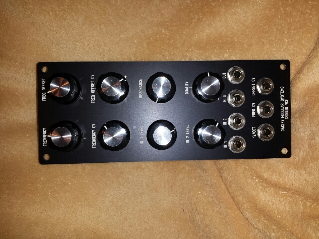
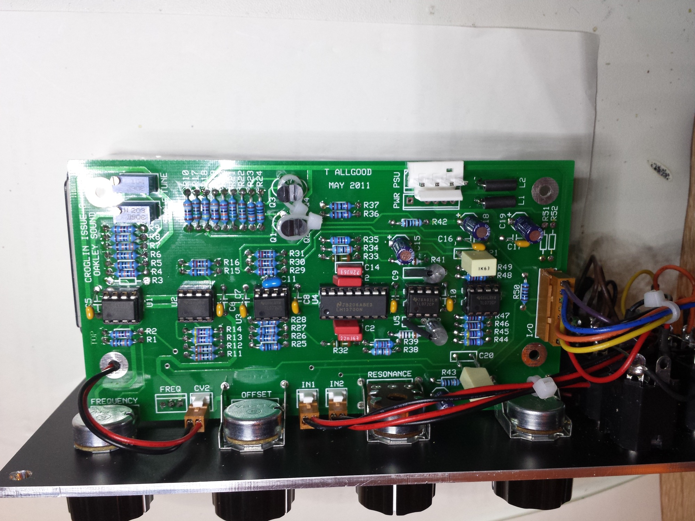
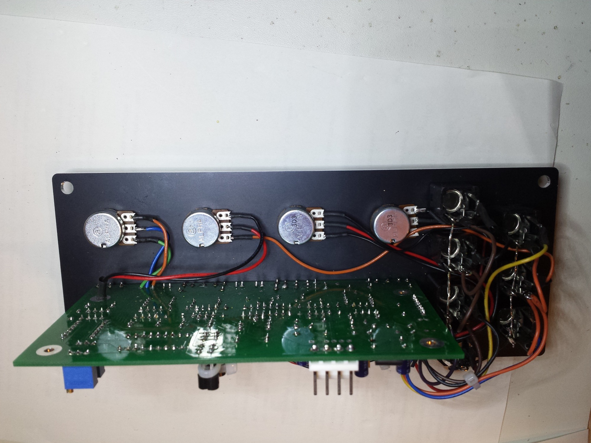
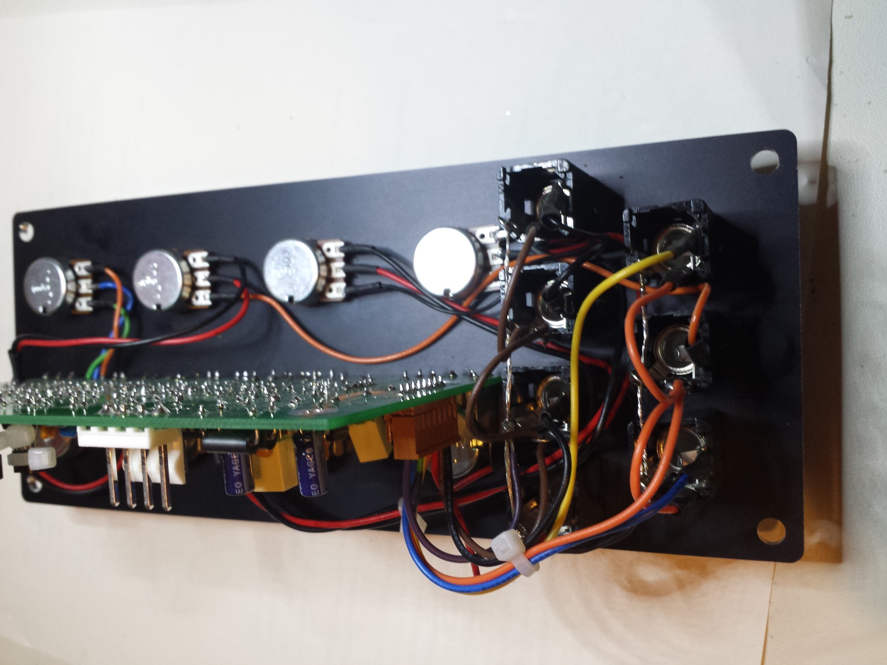

# Oakley Croglin VCF

> **Project**
>
> ### Projecttitel: Oakley Croglin VCF
>
> ### `Status` : finished
>
> ### Startdate: 22.11.2013
>
> ### Duedate: 11.12.2013
>
> ### Projectwebsite (manufacture): [http://oakleysound.com/croglin.htm](http://oakleysound.com/croglin.htm)

**Parts needed to order:**

| Description | Seller |   | Quantity | Each | Total | Ordered | Received | Payed CU |
|---|---|---|---|---|---|---|---|---|
| Potis 50k lin [http://www.banzaimusic.com/Alpha-16mm-split-shaft-50k-lin.html](http://www.banzaimusic.com/Alpha-16mm-split-shaft-50k-lin.html) | md |   | 3 | 1 |   |   |   |   |
| Poti 1k dual lin stereo [http://www.banzaimusic.com/Alpha-16mm-stereo-1k-lin.html](http://www.banzaimusic.com/Alpha-16mm-stereo-1k-lin.html) | md |   | 1 | 1,79 |   |   |   |   |
| Passive Components | reichelt, homestock |   |   |   |   |   |   |   |

### Building Guide and BOM: (download here, or see attachments)

[croglin2-bg.pdf](assets/croglin2-bg.pdf)

#### Usermanual & Calibration

[croglin2-um.pdf](assets/croglin2-um.pdf)

