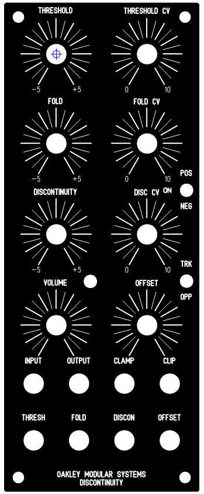
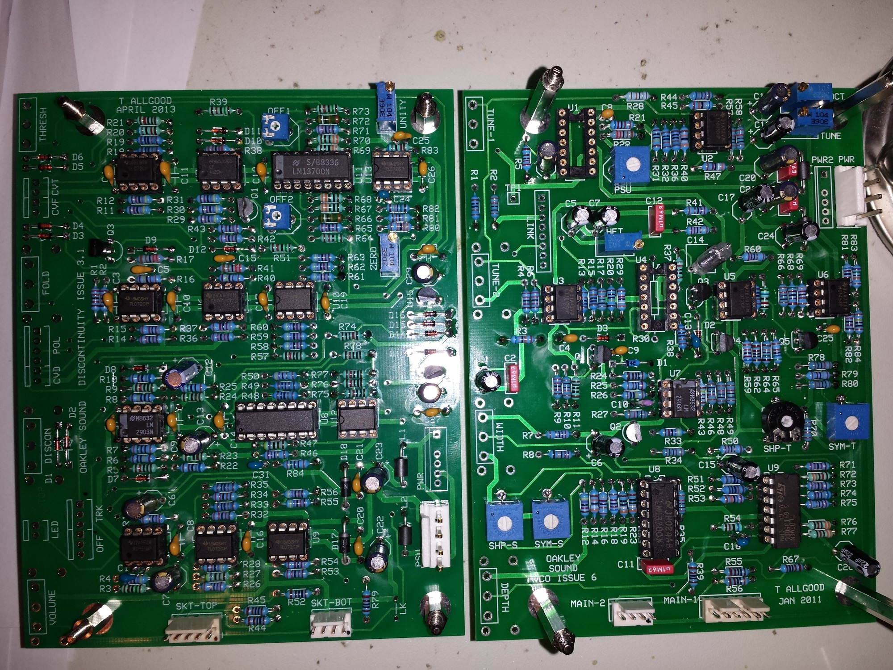
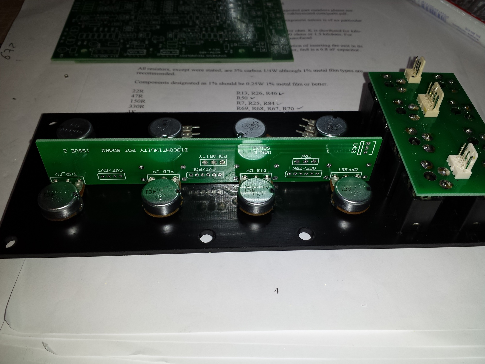
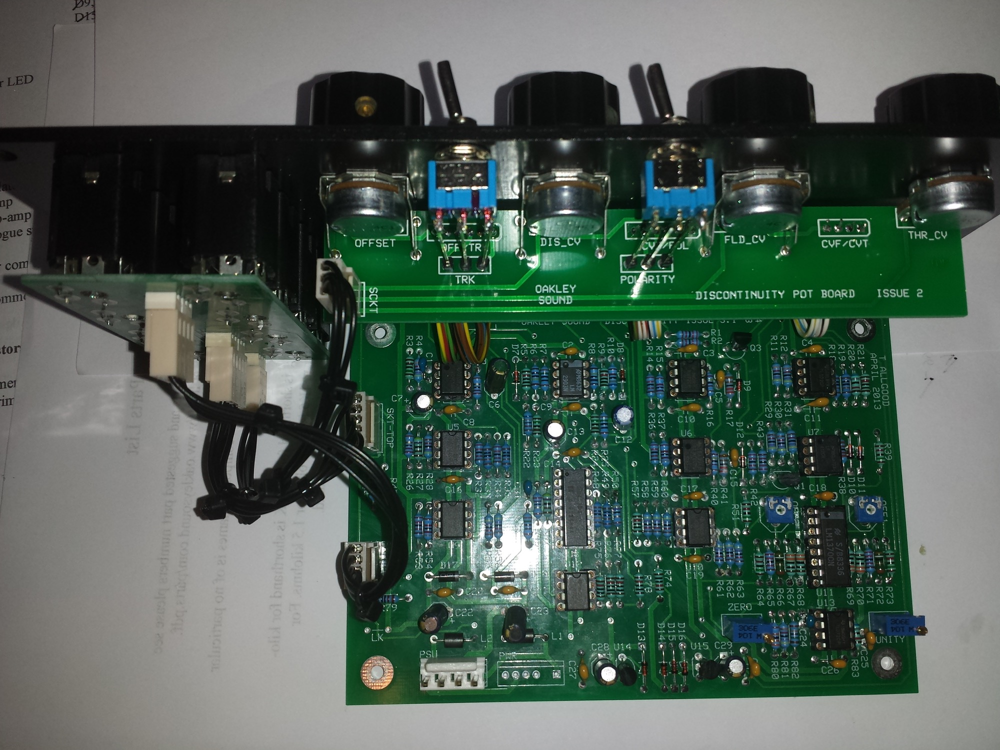
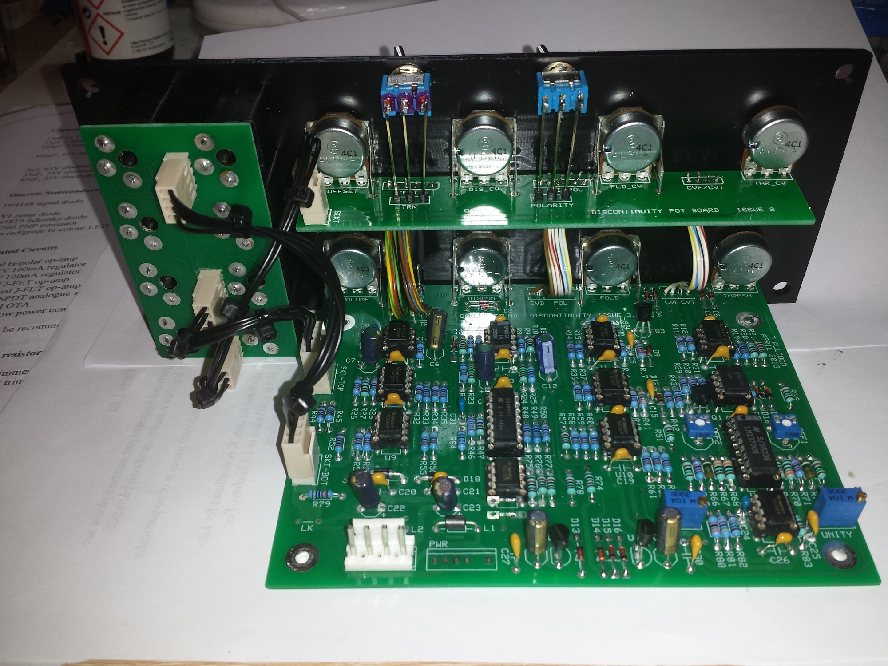
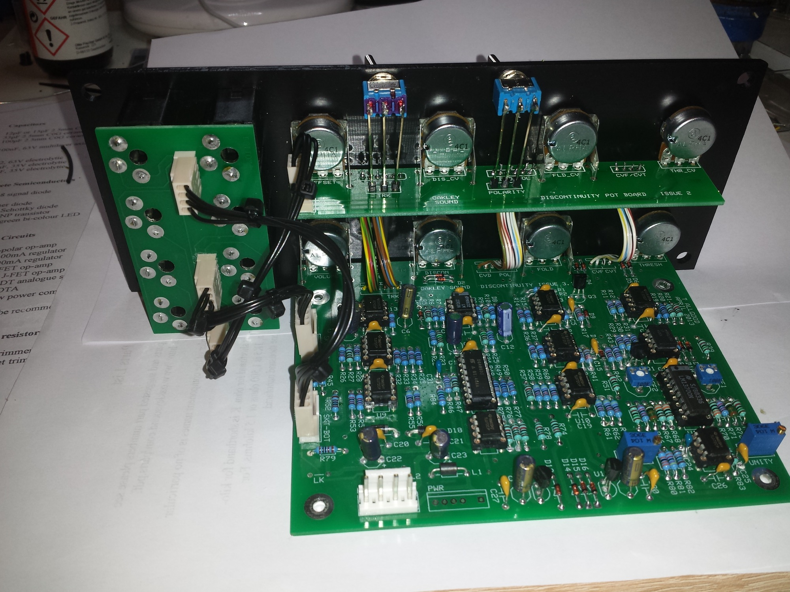
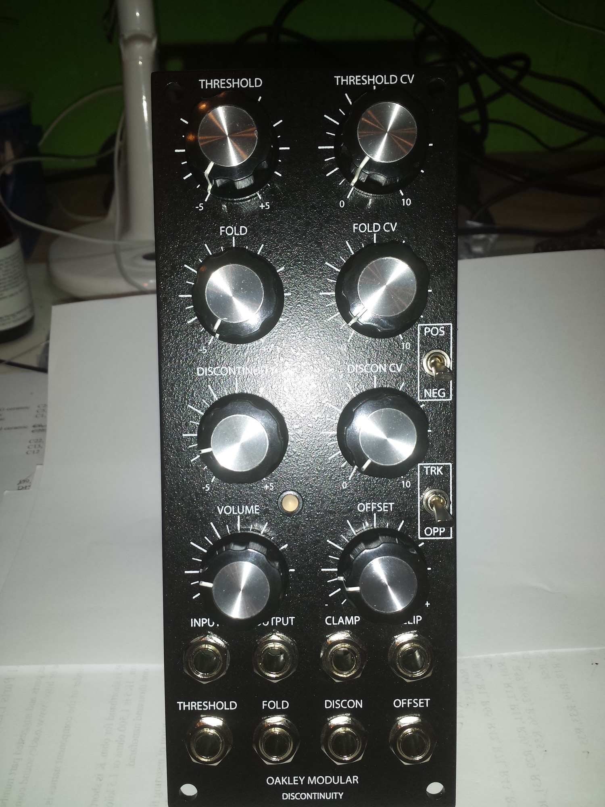
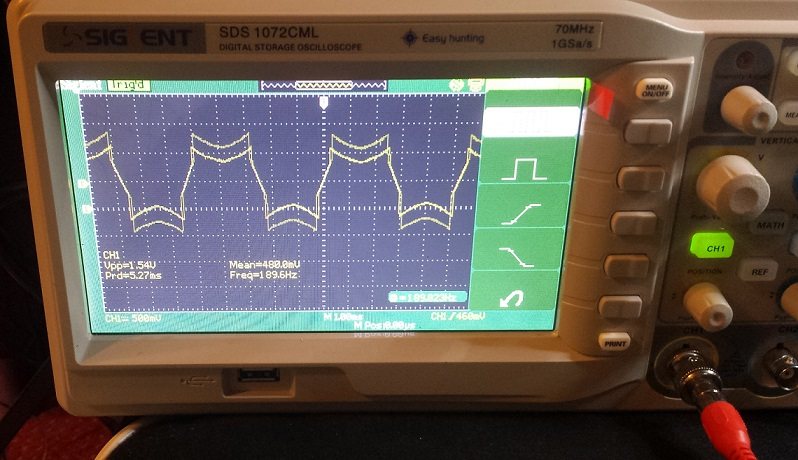

# Oakley Discontinuity

> **Project**
>
> ### Projecttitel: Oakley Discontinuity
>
> ### Status: `finish`
>
> ### Startdate: May 2014
>
> ### Duedate: 24.05.2014
>
> ### Manufacture link: [http://oakleysound.com/discon.htm](http://oakleysound.com/discon.htm)

**Documents:**

[discon3-um.pdf](assets/discon3-um.pdf)  Userguide rev.3

[discon3-bg.pdf](assets/discon3-bg.pdf) Buildersguide rev.3

**Frontpanel File: (pls. check the distance between pots)**

[discon-w-scale.fpd](assets/discon-w-scale.fpd)

> **Tipp**
>
> Building tip:  repplace the Offset1  trimmer with multiturn otherwise you go grazy in calibration process.

**Parts: (feel free to ask me to source the parts)**

**Integrated Circuits**

4558 dual bi-polar op-amp  U1

78L05 +5V 100mA regulator U14

79L05 -5V 100mA regulator U15

TL072 dual J-FET op-amp  U3, U4, U5, U6, U9, U10, U12, U13

LF412CN dual J-FET op-amp U7

DG403 dual SPDT analogue switch U8   from TME/Mouser

LM13700 dual OTA U11

LM2903 dual low power comparator  U2

The Image from the SCOPE is with ghosting due to camera speed.

