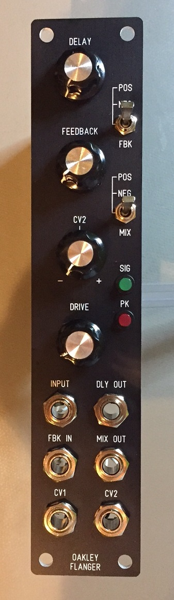
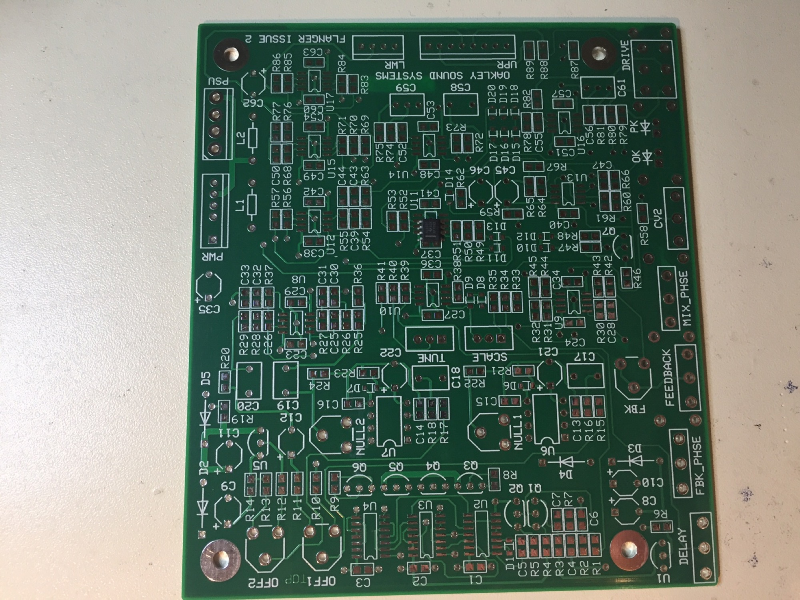
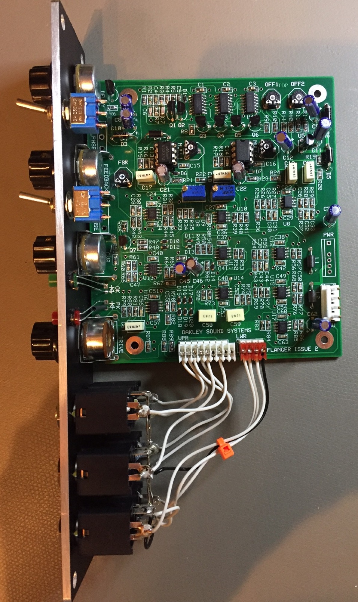
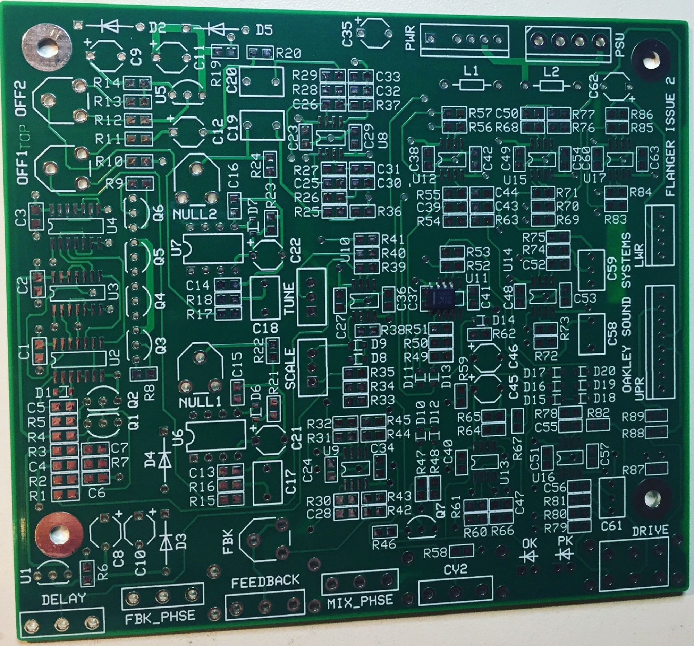
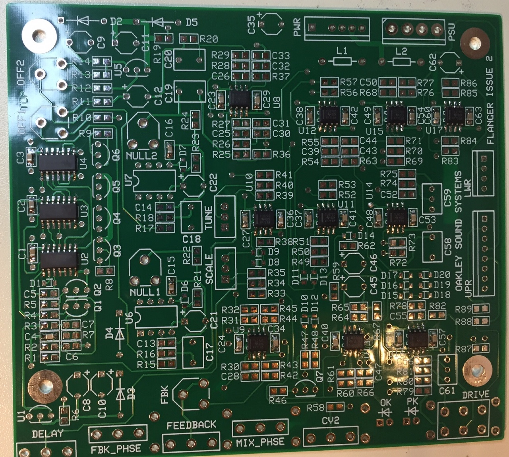

# Oakley Flanger

> **Project**
>
> ### Projecttitel: Oakleysound Flanger
>
> ### Status: `finished`
>
> ### Startdate: 14 June 2017
>
> ### Duedate: 31 July 2017
>
> ### Manufacture link: [http://oakleysound.com/flanger.htm](http://oakleysound.com/flanger.htm)

> **Info**
>
> The Oakley Flanger & Chorus module is an analogue delay line capable of delaying audio signals from 0.5mS to 15mS. In conjunction with an external LFO module this unit can be used to produce real time vibrato, chorus and flanging effects. With the feedback control set to maximum the module can be set to self-oscillate
>
> The delayed audio output is available from the DLY OUT socket. While the MIX OUT socket has a equal mix of input signal and delayed signal. The phase of the delayed signal that is mixed may be selected to be inverted (NEG) or non-inverted (POS) by the use of the MIX switch. This is particularly useful when used for chorus or flanging as the two modes can create completely different effects.
>
> A feedback path from the delayed output back to the input is available and you have control over both the amount, via the FEEDBACK pot, and phase of the signal, via the FBK switch. Inserting a jack plug into the FBK IN socket will break the internal feedback path and allow another signal to be sent into the delay line. This could allow additional processing of the raw delayed signal, from the DLY OUT socket, prior to being sent back into the delay line again. For example, using a VCA to process the feedback signal would allow CV control of the feedback level.
>
> There are two control voltage (CV) inputs. CV1 has a fixed sensitivity while CV2 has its own sensitivity control. CV2's control pot is a reversible attenuator, so you are able to adjust not only the depth of the modulation but also the polarity. Although not specifically designed to track to 1V/octave, using the CV1 input, the module can be used as tuned delay line over a useful proportion of the full operating range.
>
> The delay line itself is based around two 3207 bucket brigade delay (BBD) devices controlled by a voltage controlled oscillator (VCO) running from around 33kHz to over 1MHz. Audio bandwidth of the delayed signal extends to 14kHz and several unusual design features ensure that the module is relatively quiet compared to other units of its type.
>
> Two LEDs provide visual indication of the signal level being sent to the BBD devices. The DRIVE control should be adjusted to ensure that the green LED remains lit for optimum signal level. The red LED will light when the signal level is close to, or is, being overdriven. The module will not be harmed when the signal is overdriven and there is a soft clipping circuit in place to ensure the overdriven sound is musically useful. The DRIVE control allows a variety of different signal levels to be used with the module although the expected signal level would be expected to be between 0.5V(peak) and 8V(peak).
>
> The printed circuit board (PCB) uses a mixture of through hole and surface mount components. The op-amps, non-polar capacitors, resistors and small diodes are all surface mount. The op-amps are SO8 packages, capacitors and resistors 0805 and diodes SOD323. Most builders should find these no problem to solder even if they have not assembled modules with surface mount devices before. To calibrate the unit an oscilloscope is useful but not essential.
>
> The module accommodates either our standard Oakley/MOTM power header or a [Synthesizers.com](http://Synthesizers.com) power header. The supply voltage is +/-15V and current consumption is around +75mA and -45mA.
>
> The PCB is 109mm (deep) x 124mm (height). The PCB is a four layer design, has tough solder mask both sides, and has bold component legending for ease of construction.
>
> **source**: [http://oakleysound.com/flanger.htm](http://oakleysound.com/flanger.htm)

**BOM & Buildguide**

[flg2-bg.pdf](assets/flg2-bg.pdf)

**Userguide**

[flg2-um.pdf](assets/flg2-um.pdf)

**Panelfile (Schaeffer frontdesigner)**

**[flg1.fpd](assets/flg1.fpd)**

**

**
