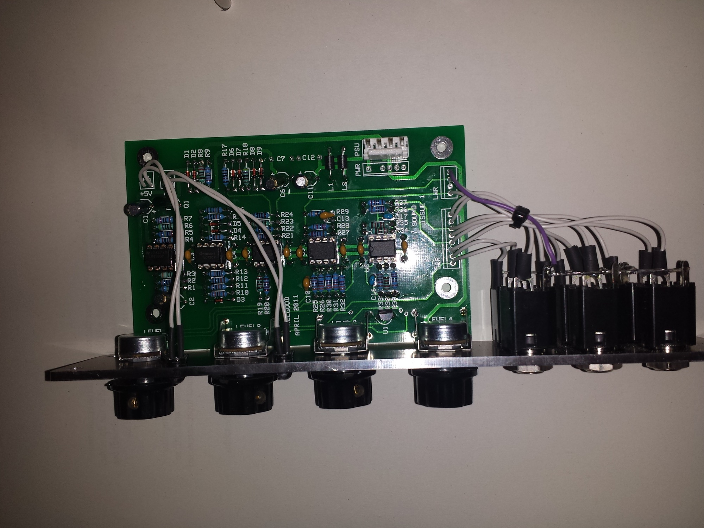
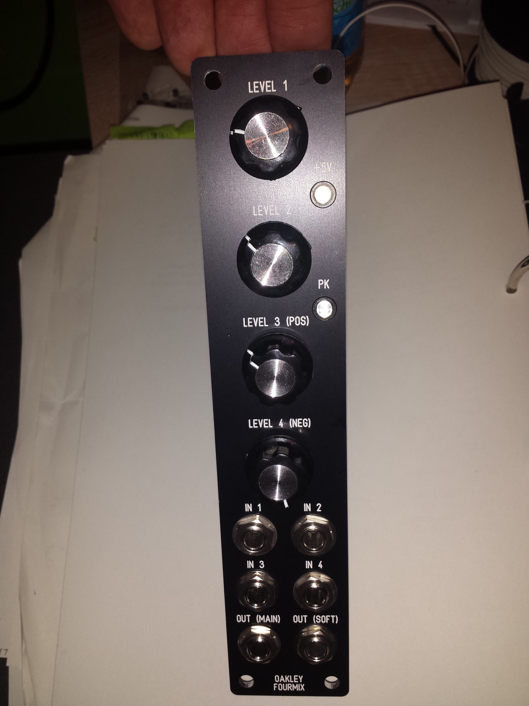
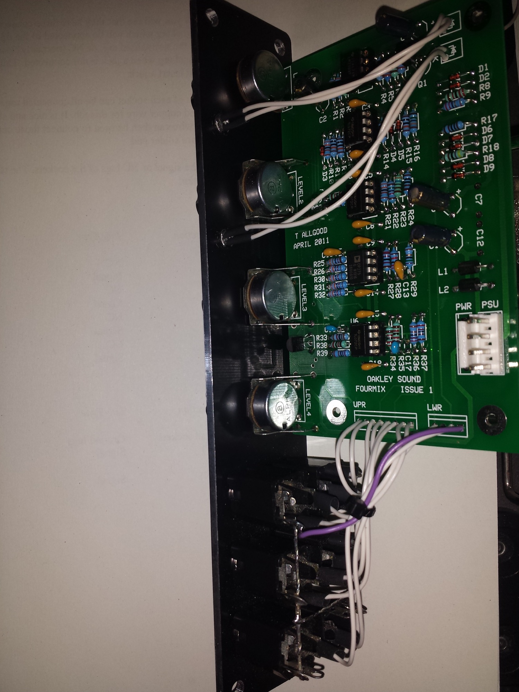

# Oakley fourmix

> **Project**
>
> ### Projecttitel: Oakley fourmix
>
> ### Status:`in progress` finished
>
> ### Startdate: 29.11.2013
>
> ### Duedate: 10.02.2013
>
> ### Manufacture link: [http://oakleysound.com/fourmix.htm](http://oakleysound.com/fourmix.htm)

PCB ordered from oakley  3 of 3 arrived ✅

Panel ordered from schaeffer and receiverd ✅

OP275 MD ✅

pots MD ✅

[fourmix1-bg.pdf](assets/fourmix1-bg.pdf)

[fourmix1.fpd](assets/fourmix1.fpd)

