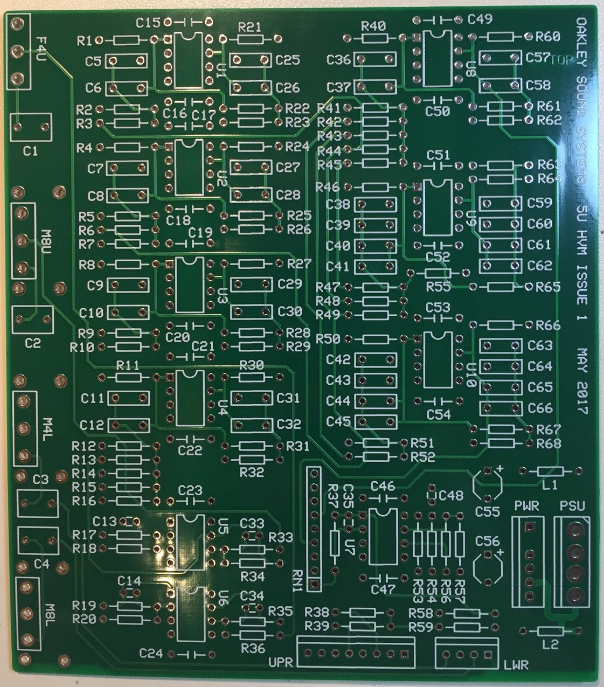
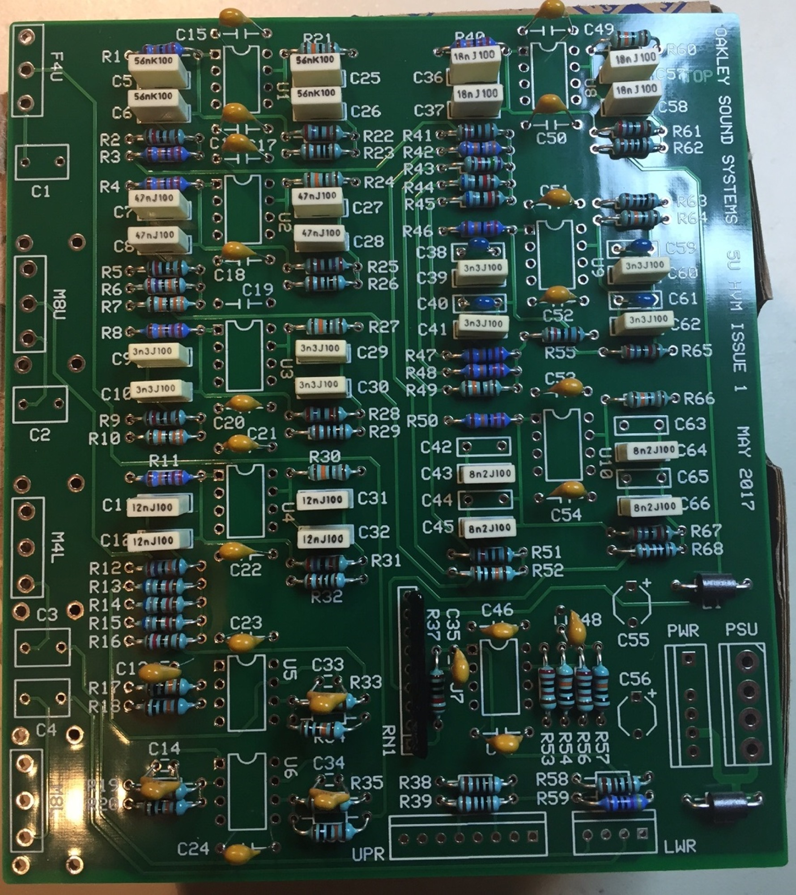

# Oakley HVM

> **Project**
>
> ### Projecttitel: Oakleysound HVM in 5U/MOTM
>
> ### Status: `done`
>
> ### Startdate: May 2017
>
> ### Duedate: July 2017
>
> ### Manufacture link: [http://oakleysound.com/5uhvm.htm](http://oakleysound.com/5uhvm.htm)

from oakleysound:

> The Oakley Sound HVM is an all analogue audio signal modification device that replicates some of the sounds made from a classic electronic keyboard first seen and heard in 1979. The VP-330 is often thought of as a string synthesiser and vocoder but some of the most ethereal sounds utilise its four human voice tabs. Tabs are simply switches that engage certain sounds - the terminology comes from organs and they could be considered a bit like a preset in today's keyboards.
>
> The human voice sounds in the VP-330 were created by using seven fixed frequency band pass filters - each of the four tabs using differing mixes of the seven filters and different octaves from the keyboard's oscillators. They are not particularly realistic when compared to vocal samples and other techniques used in later instruments but they are very interesting and sound great.
>
> The HVM is different to standard fixed filter banks (FFB) which have usually one input and one output. FFBs typically allow the user to adjust the level from each filter and the resultant outputs mixed together. In the HVM the outputs of each of the seven filters are all equally summed to one output socket. There are four inputs and each input socket has a dedicated front panel control to adjust the level of the signal that goes in to the filter bank. Each of the four signals are sent to the seven filters with each input being sent to the filters in different proportions. The differing proportions correspond to the four tabs on the original instrument. It is possible therefore to use up to four sources, for example four VCOs at different octaves, and have them all mixed at varying levels to create one output.
>
> The original instrument's four tabs were divided into two for the upper section of the keyboard and two for the lower section. The 4' and 8' refer to footages, another organ term, 4' being one octave above 8'. If you wish to be faithful to the original instrument then you should use two VCOs, spaced an octave apart, with the high VCO being fed into either the 4' Upper and the low VCO into the 8' Upper, or with the high VCO being fed into the 4' Lower and the low VCO into the 8' Lower. Any type of signal can be used either single notes or, if you have the polyphony, full chords can be processed. It is best to have a harmonically rich waveform, such as a sawtooth or squarewave, to give the filters something to work with.
>
> The fifth input, INPUT (ALL), will send a single audio input to all four inputs if no other input sockets have jacks inserted. This allows a single audio source to drive all four 'tabs' simultaneously. Inserting a patch lead into any of the four main inputs will override any signal from the ALL socket for that particular input.
>
> The module accommodates either our standard Oakley/MOTM power header or a [Synthesizers.com](http://Synthesizers.com) power header. The supply voltage is +/-15V and current consumption is around +/-45mA
>
> The PCB is 109mm (deep) x 124mm (height). The PCB is a four layer design, has tough solder mask both sides, and has bold component legending for ease of construction. No additional mounting holes are provided on this PCB. The PCB is secured to the front panel by three pot brackets.

**Buildguide:**

[5uhvm1-bg.pdf](assets/5uhvm1-bg.pdf)

**Panelfile (schaeffer)**

[5uhvm1.fpd](assets/5uhvm1.fpd)

