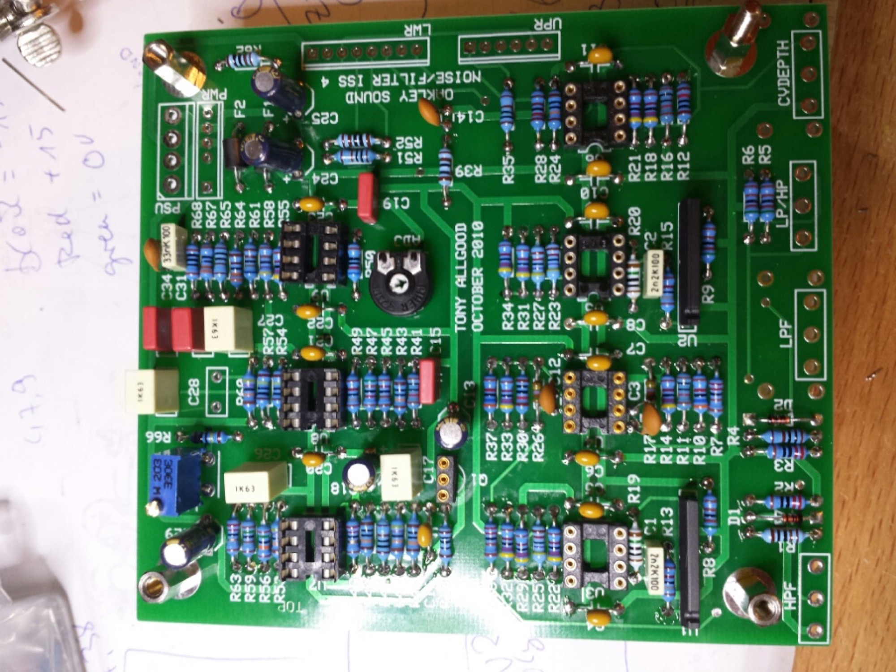
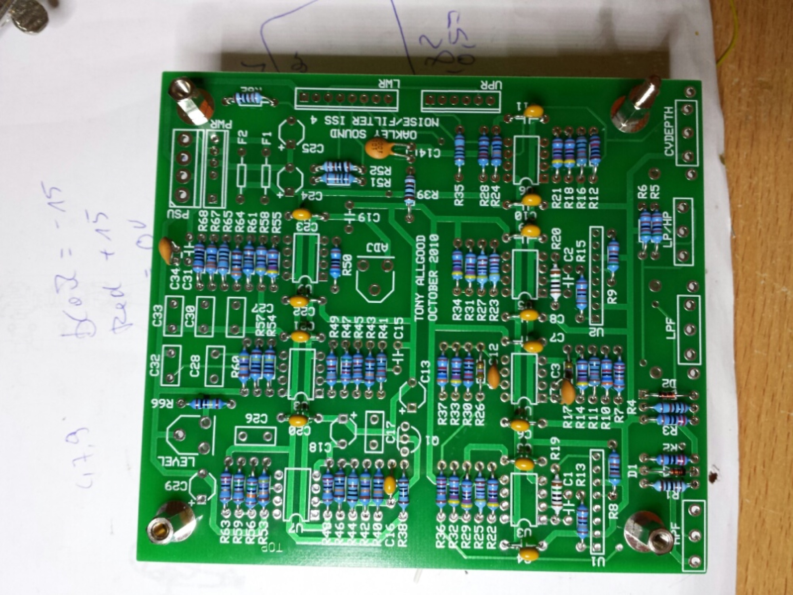
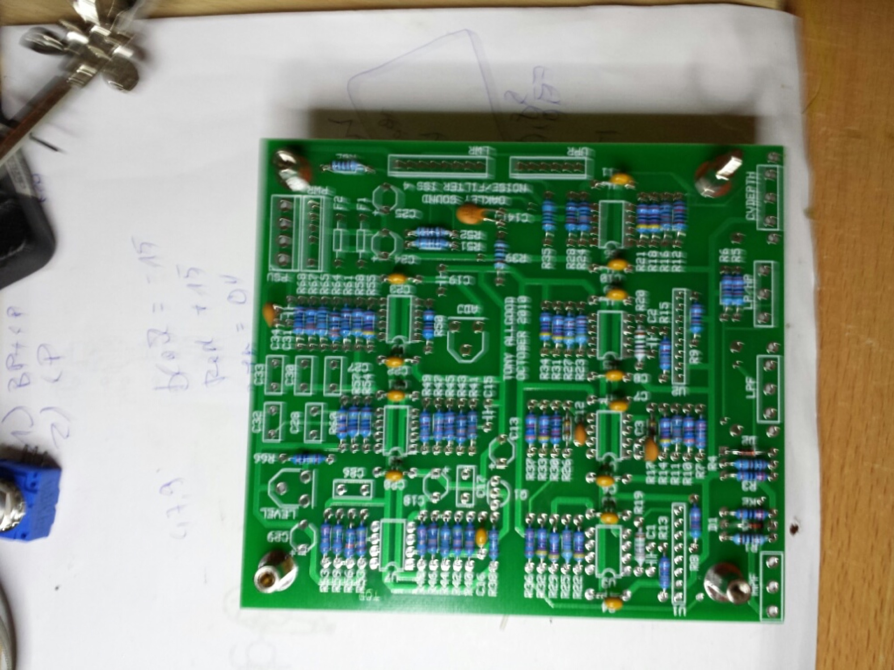
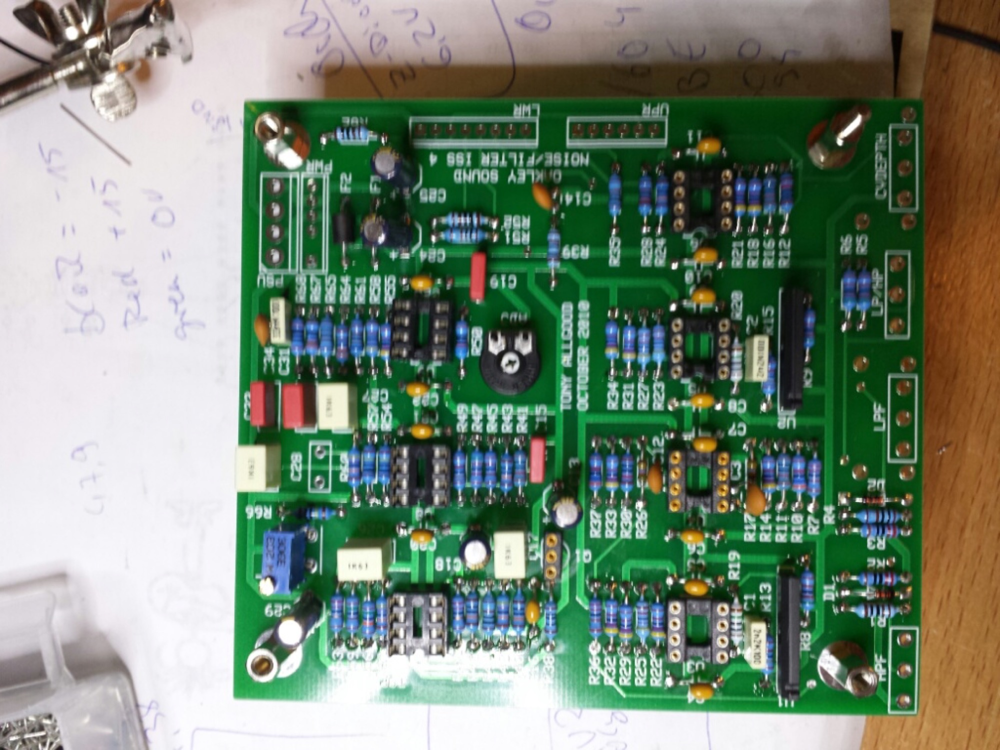
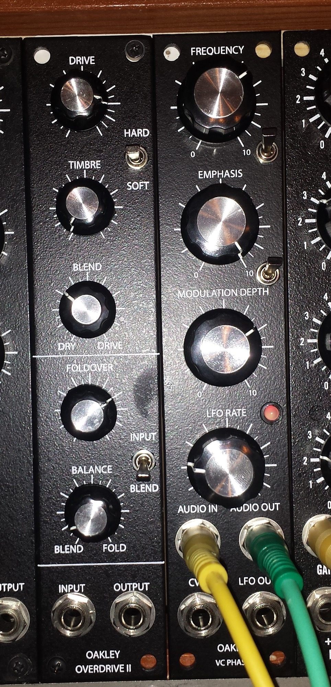
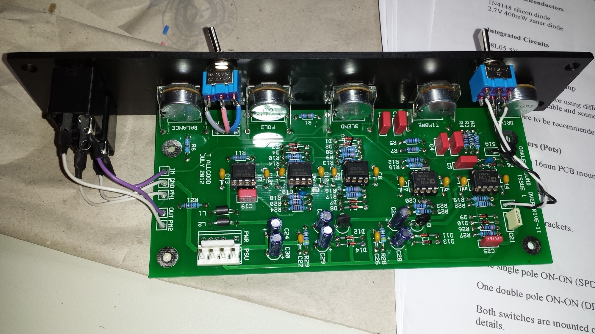
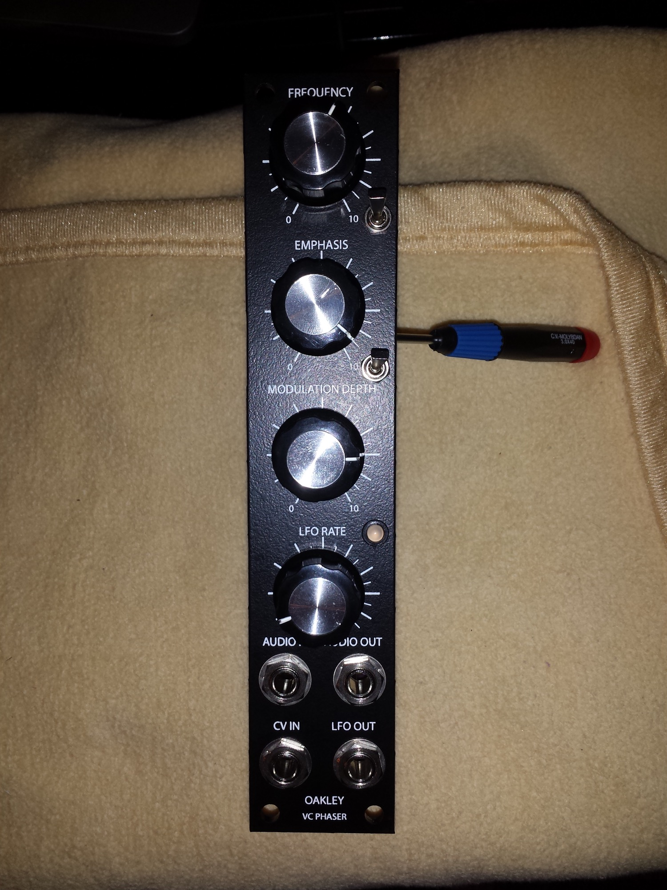
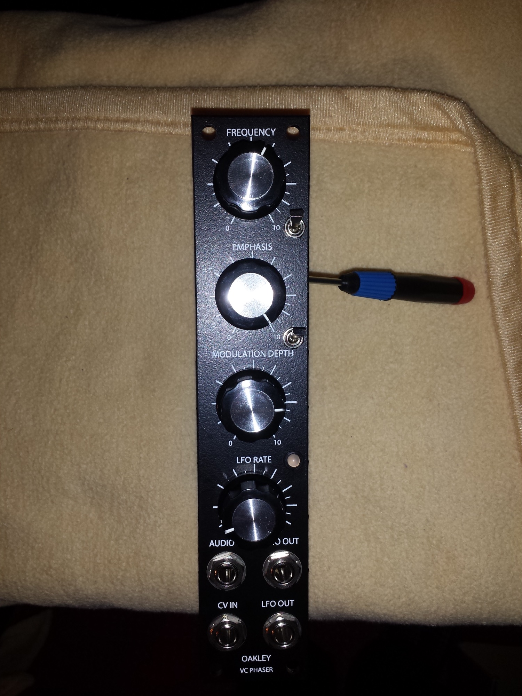
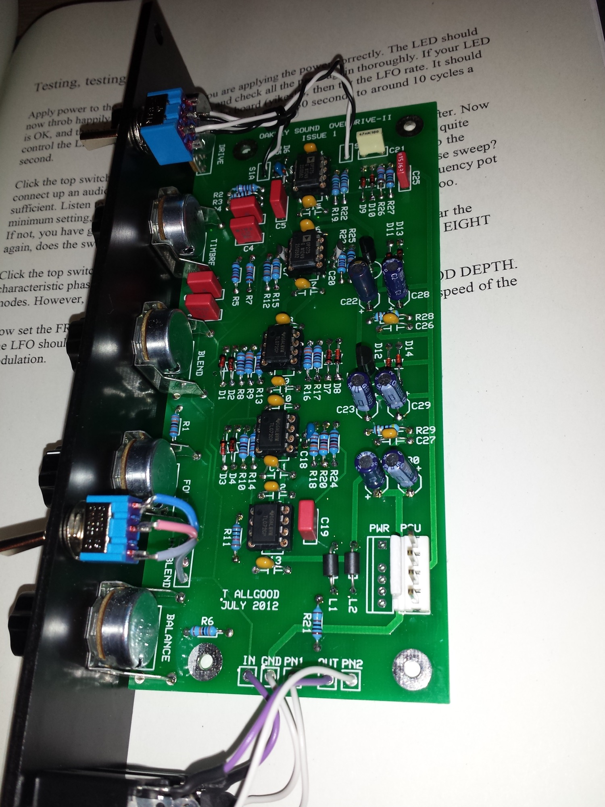
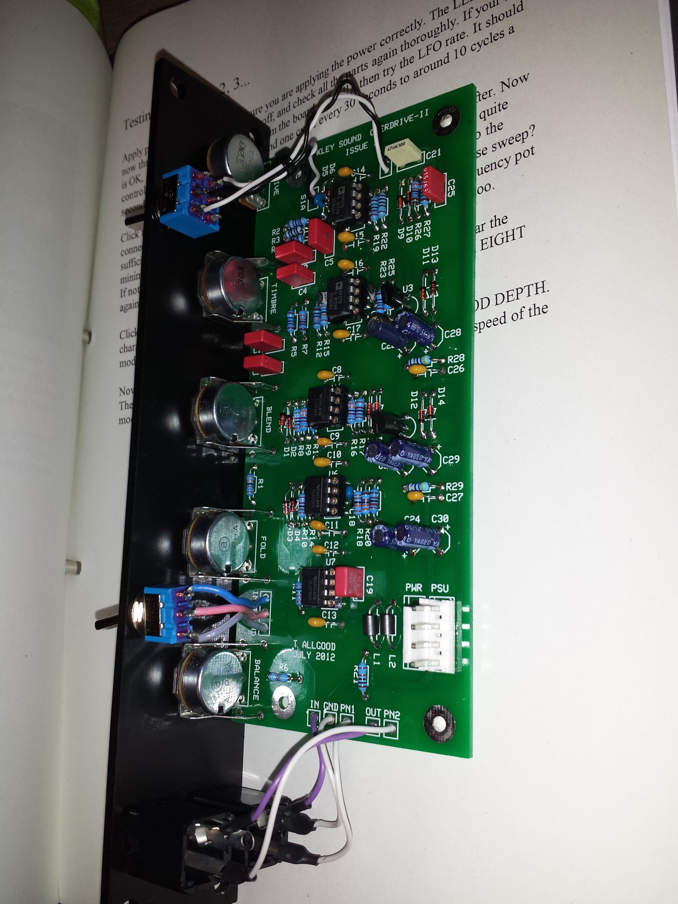

# Oakley Overdrive 2

> **Project**
>
> ### Projecttitel: Oakley Overdrive 2
>
> ### Status: `finished`
>
> ### Startdate: 23.12.2013
>
> ### Duedate: 03.02.2013
>
> ### Manufacture link: [http://www.oakleysound.com/overdrv.htm](http://www.oakleysound.com/overdrv.htm)

### Buildersguide:

[drive2-bg.pdf](assets/drive2-bg.pdf)

### Userguide:

[drive2-um.pdf](assets/drive2-um.pdf)

