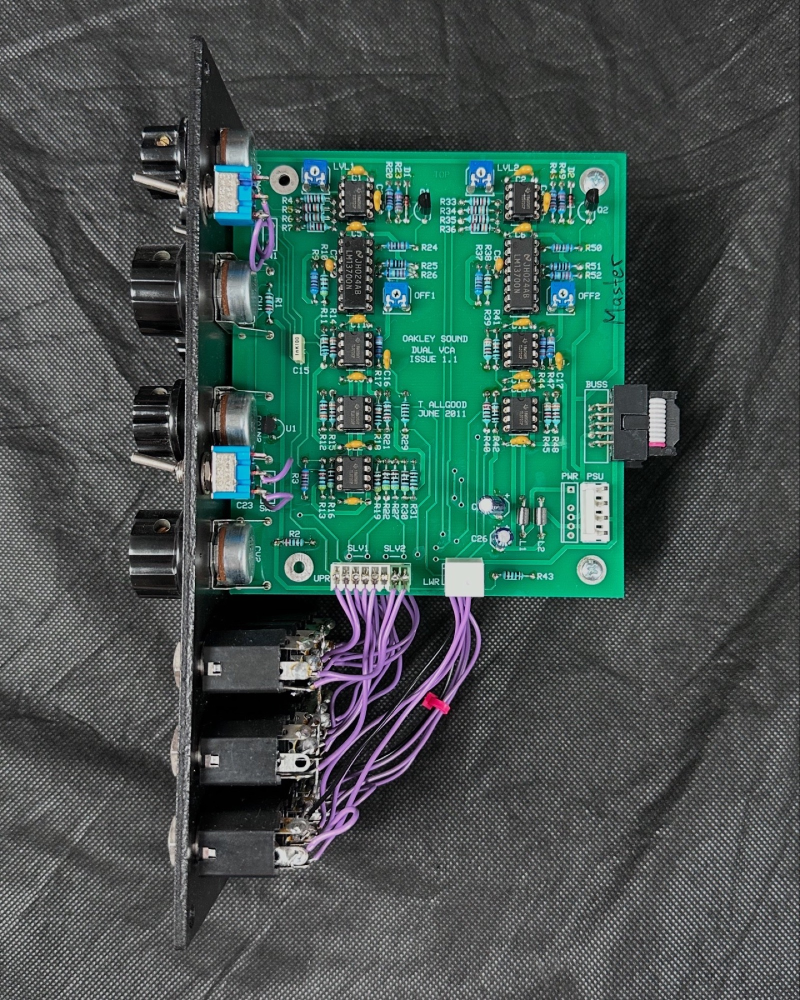
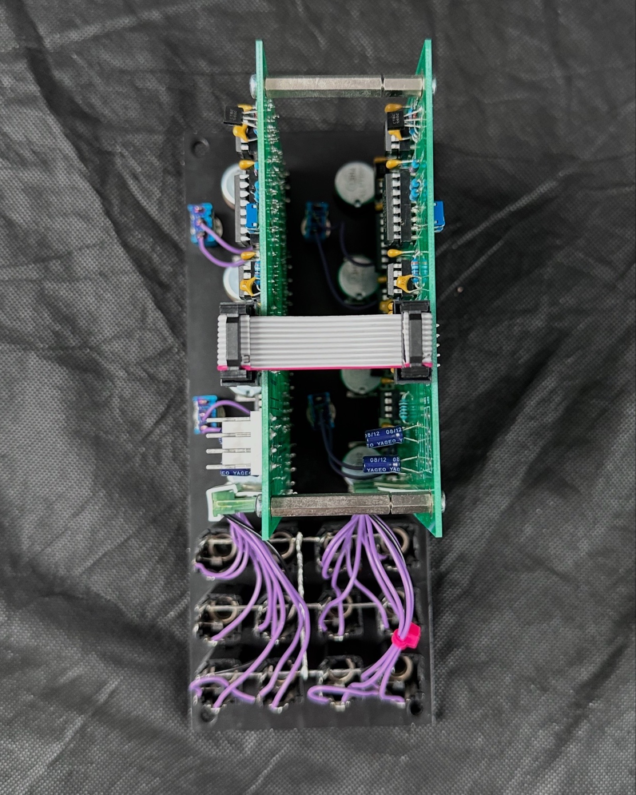
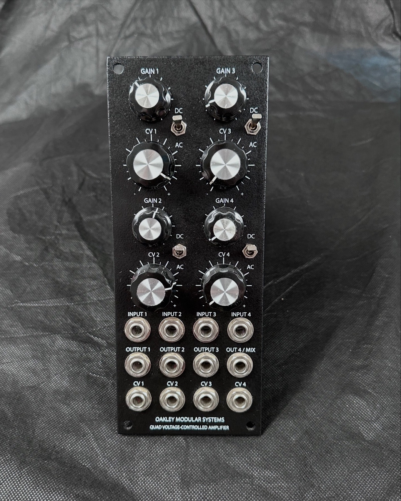

# Oakley Quad VCA

> **Project**
>
> ### Projecttitel: Oakley Quad VCA
>
> ### Status: `finished`
>
> ### Startdate: May 2014
>
> ### Duedate: july 2014
>
> ### Manufacture link: [http://oakleysound.com/vca-d.htm](http://oakleysound.com/vca-d.htm)

**Documents:**

[vcad1-um.pdf](assets/vcad1-um.pdf)   Userguide

[vcad1-bg.pdf](assets/vcad1-bg.pdf)  Buildersguide

**Parts: (x2 for quad)**

Discrete Semiconductors

BC560 PNP small signal transistor Q1, Q2

1N4148 signal diode D1, D2

Integrated Circuits

TL072ACP dual FET op-amp  U2, U4, U5, U6, U7, U9, U10

LM13700 U3, U8

LM4040DIZ-10.0 10V reference U1\*

\* The LM4040CIZ-10.0 is also suitable

