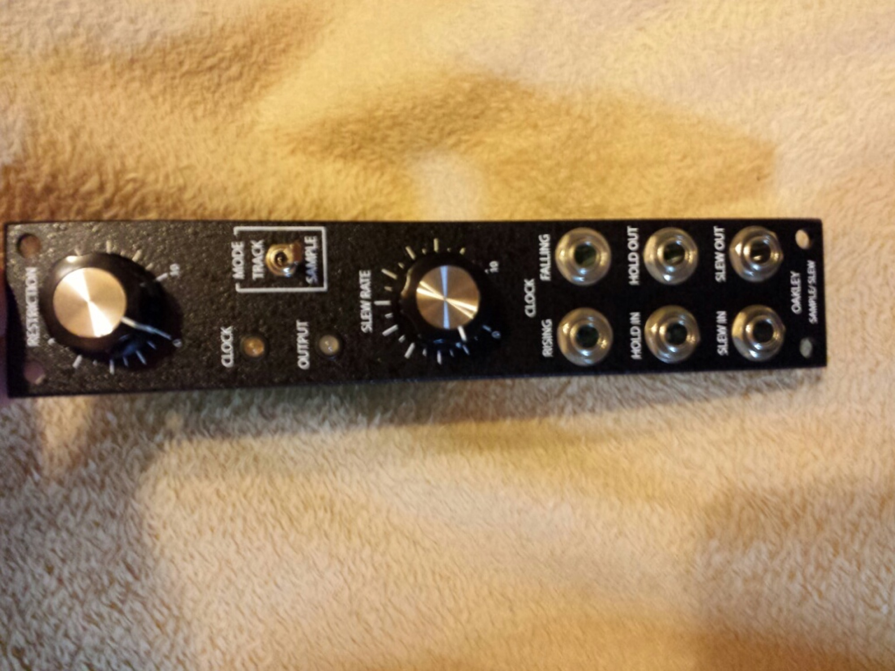
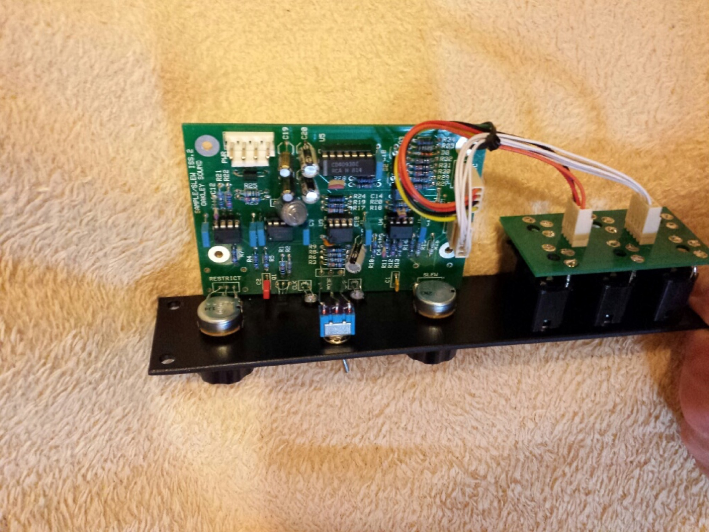
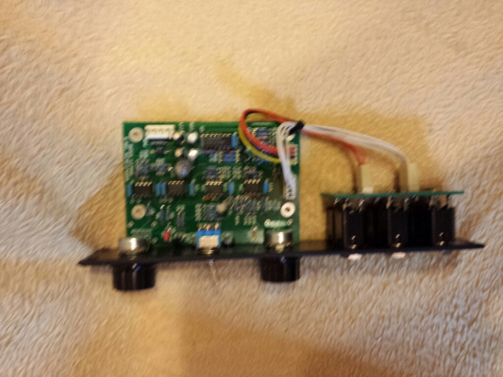

# Oakley S/H Slew

> **Project**
>
> ### Projecttitel:Oakley S/H Slew old revision
>
> ### Status: `Status` finished
>
> ### Startdate: 01.10.2013
>
> ### Duedate: 01.01.2014
>
> ### Manufacture link: oakleysound.com

### Builders and Userguide:

Oakley S/H Slew  old revision !

#### BOM Info:

need to use: 248/9 or BI P260P pots

**25K linear single**

[Mouser  Vishay 594-657-0-0-203    657-0-0-203](http://de.mouser.com/ProductDetail/Vishay-Spectrol/657-0-0-203/?qs=sGAEpiMZZMtC25l1F4XBU%2f1v6azG6DUSP%2ftO0rlySkU%3d)

100K log

mouser 91A1A-B24-D20L

#### Parts arrived:

pcb, panel, pots

