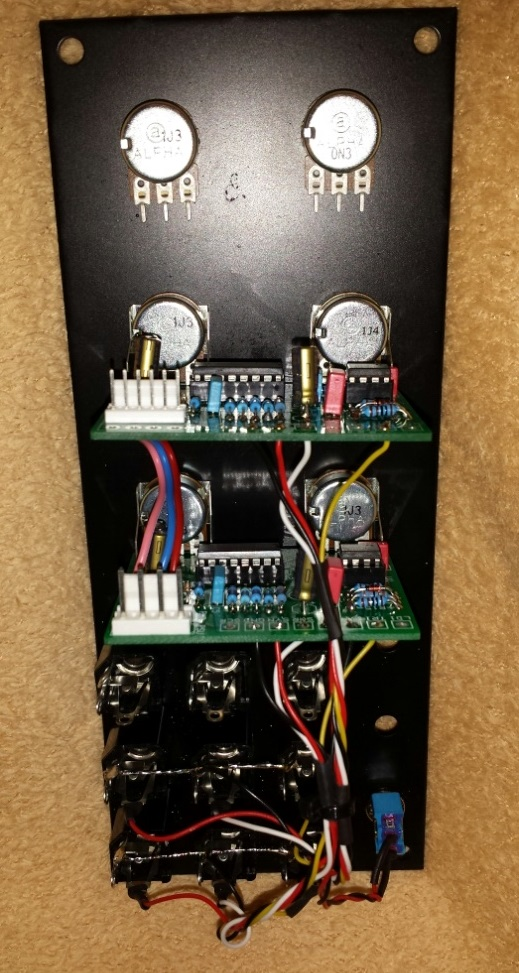
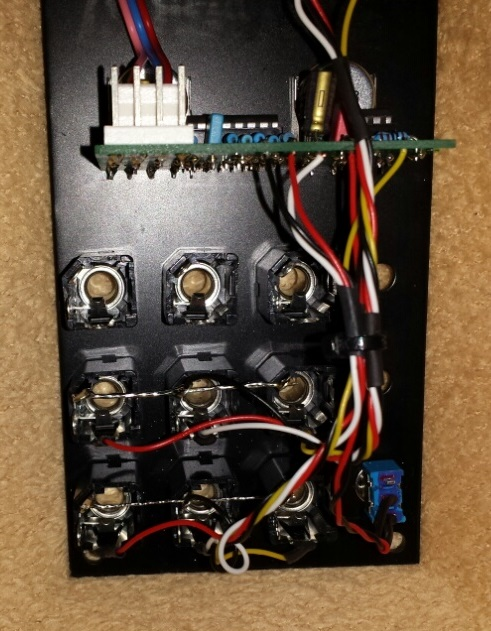
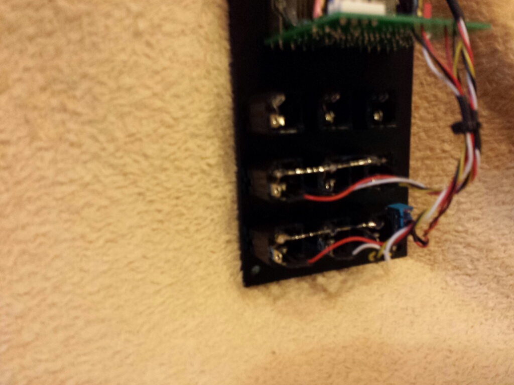
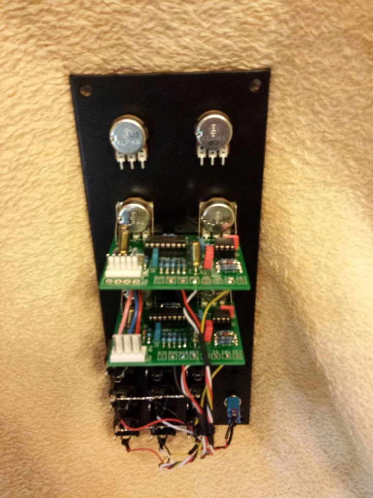
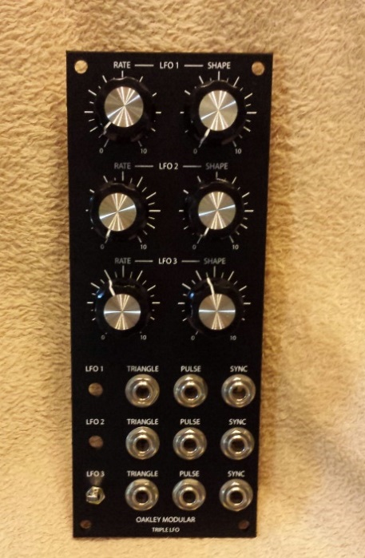

# Oakley Triple LFO

> **Project**
>
> ### Projecttitel: Oakley Triple LFO
>
> ### Status:`finshed`
>
> ### Startdate: 01.12.2013
>
> ### Duedate: 01.02.2014
>
> ### Manufacture link: [http://oakleysound.com/lfo.htm](http://oakleysound.com/lfo.htm)

**Buidersguide from 2014:**

[lfo6-bg.pdf](assets/lfo6-bg.pdf)

**About:**

The Oakley Triple LFO  have 3 Little LFO pcbs..

**Modification:**

the LFO3 works as a LFO with ultra low frequency, this can enabled by using the toggleswitch..

the other 2LFOs runs normal but its possible to sync with lfo3..

**Building Tipps:**

all 3 pcbs needs power, all pcbs are ready for MOTM and dotcom power,

in my case i have soldered one MOTM header on the third lfo pcb, dotcom header on the second. - all pcbs are connected hardwired by 3cables.

