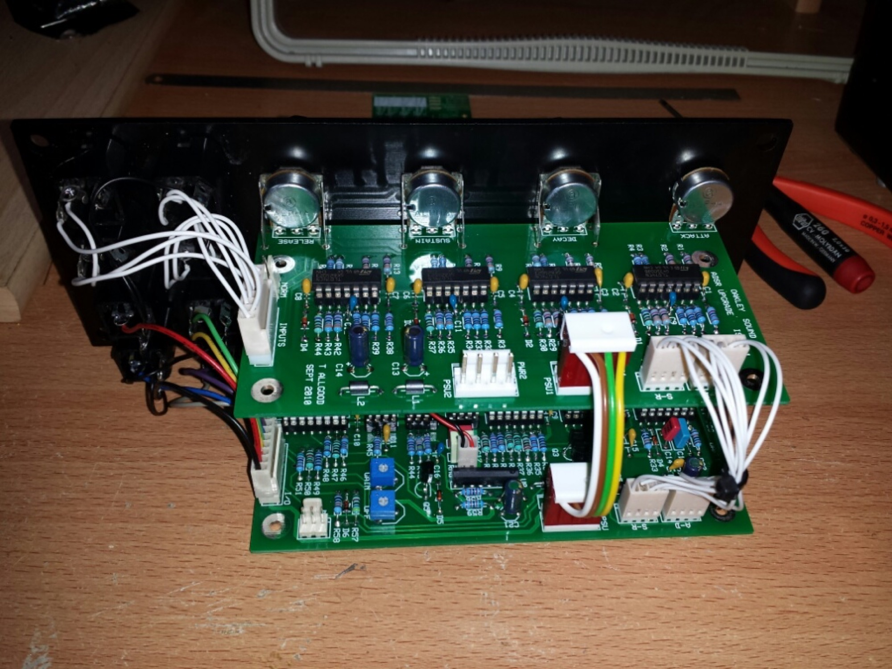
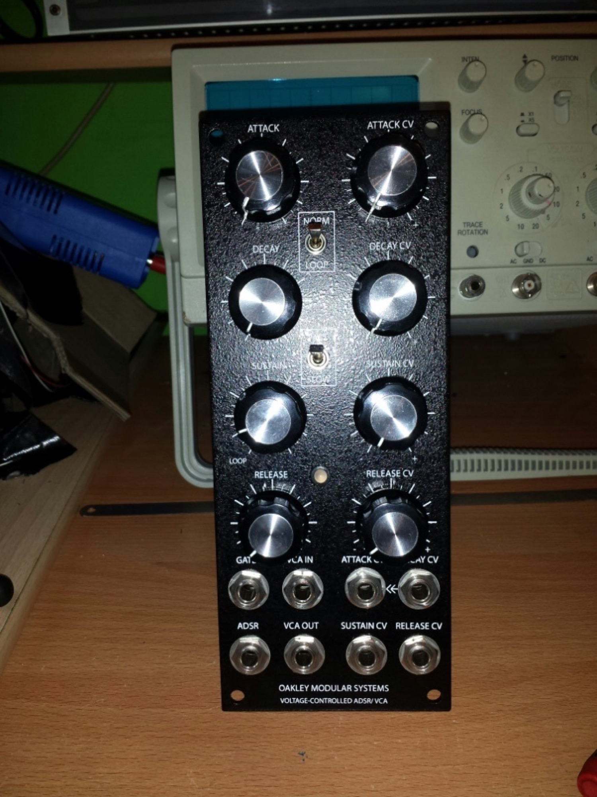

# Oakley VC-ADSR/VCA

> **Project**
>
> ### Projecttitel:Oakley VC-ADSR/VCA
>
> ### Status: `finished`
>
> ### Startdate: 26.11.2013
>
> ### Duedate: 18.01.2014
>
> ### Manufacture link: [http://oakleysound.com/vc-adsr.htm](http://oakleysound.com/vc-adsr.htm)

**Tech. docs for this version**

[adsr4-bg.pdf](assets/adsr4-bg.pdf)

[upgrade1-bg.pdf](assets/upgrade1-bg.pdf)

