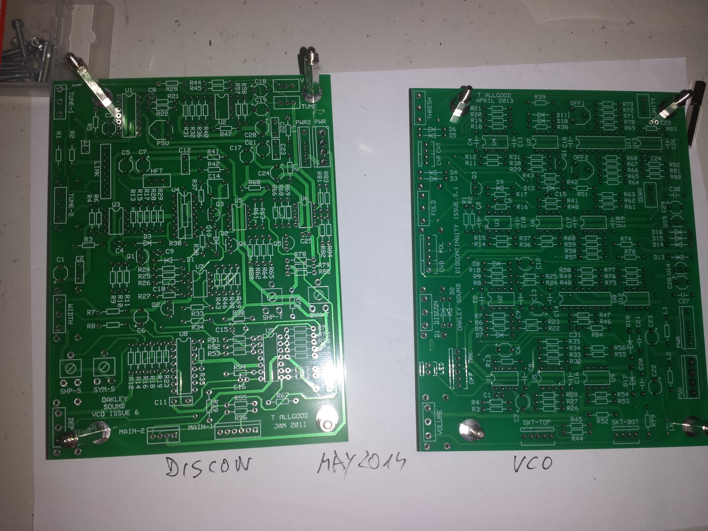
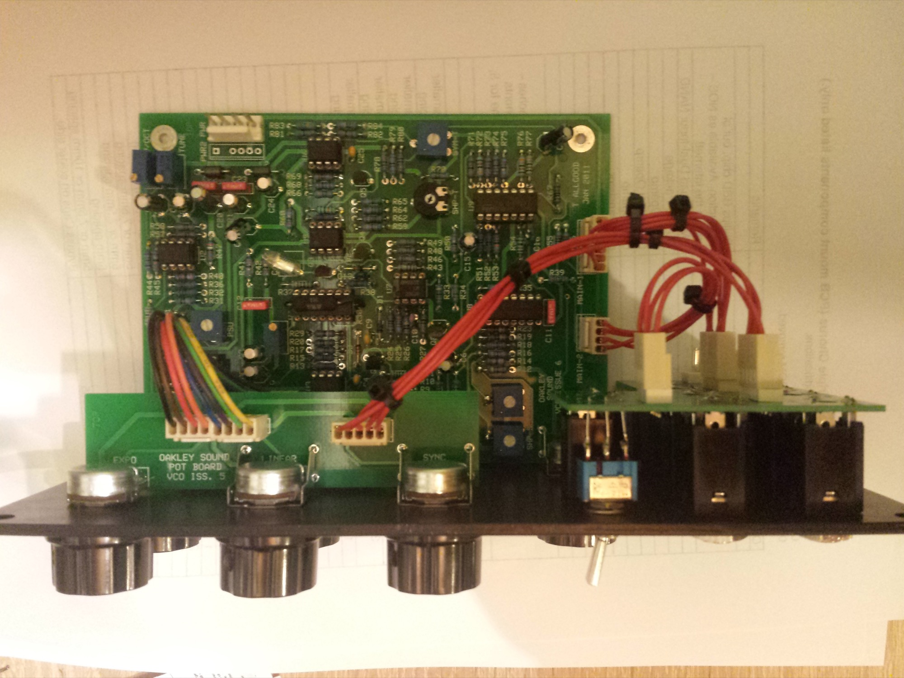
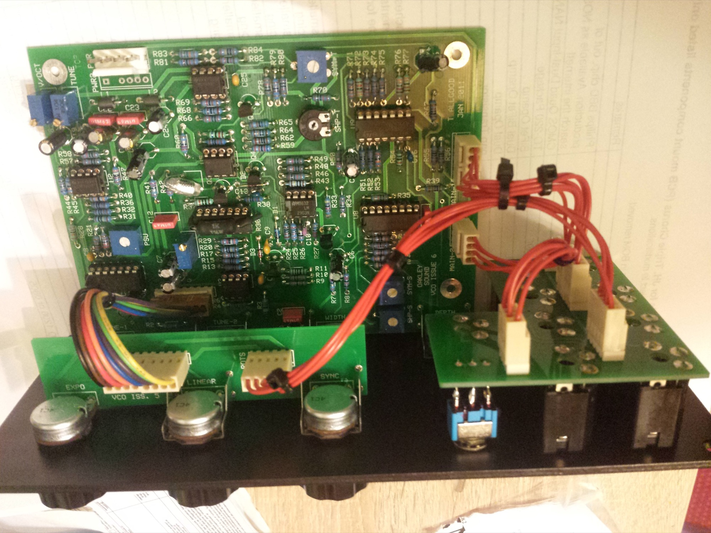
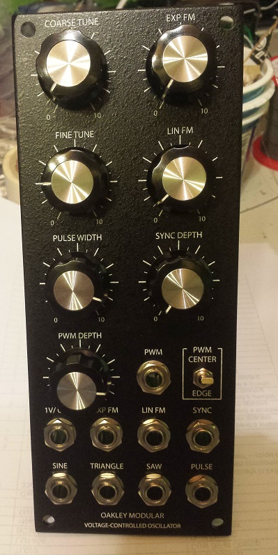

# Oakley VCO

> **Project**
>
> ### Projecttitel: Oakley VCO
>
> ### Status: `finsihed`
>
> ### Startdate: May2014
>
> ### Duedate: July 2014
>
> ### Manufacture link: [http://oakleysound.com/vco.htm](http://oakleysound.com/vco.htm)

**Dokumentation:**

[vco6-um.pdf](assets/vco6-um.pdf)   rev.6  Userguide

[vco6-bg.pdf](assets/vco6-bg.pdf)  rev.6  Buildersguide

**Parts:**

Pcb from oakleysound

Panel from bridechamber

**rare Parts:** homestock, mouser, banzai, reichelt, TME

| Discrete Semiconductors 1N4148 signal diode BAT42 Schottky diode BC550 NPN transistor J112 J-FET Integrated Circuits LM1458 dual bi-polar op-am LM13700 transconductance amp LM2903 dual comparator LM723 voltage regulator LT1013CP low drift dual op-amp THAT300P matched NPN quad array TL074 quad bi-fet op-amp TL072 dual bi-fet op-amp | D2, D3 D1 Q1, 2, 4, 5 Q3 U6, U8 U7 U1 U2,U3 U4 U9 U5 |   |
|---|---|---|
|   |   |   |
|   |   |   |
|   |   |   |

