# Oakleysound Discrete Ladder Filter

> **Project**
>
> ### Projecttitel: Oakleysound Discrete Ladder Filter (DLF)
>
> ### Status:`in build`
>
> ### Startdate: 06/2019
>
> ### Duedate: 07/2019
>
> ### Manufacture link: [http://www.oakleysound.com/dlf.htm](http://www.oakleysound.com/dlf.htm)

> **Info**
>
> ### source: oakleysound.com
>
> The Oakley discrete ladder filter (DLF) is my reworking of the classic 1960's low pass filter module using the circuits from the 904A filter and CP3 mixer and combining them into one excellent sounding module. The module also features a drive control which allows you to heavily overdrive the filter circuit without producing a big change in output volume.
>
> The audio signal pathway is almost all discrete components with a dual IC op-amp only providing the input and output signal processing for the drive control. Most of the transistors will need to be hand matched in pairs for a Vbe of +/-1mV. The frequency control circuitry is based around IC op-amp much like my other filter designs and is temperature stabilised.
>
> Prior to entering the filter circuit, the audio signal passes through a clone of the CP3 mixer. This is true even in the 1U wide version of the module which only has the one input socket. The original CP3 module had two outputs, an inverted output and a non inverted output. Apart from the change in phase the two outputs sounded different when the input signal was particularly loud. The Oakley DLF has a front panel switch to select which of the input stage's outputs go on to the filter circuit. The DLF's input stage will start to clip at around +/-4V, but keeping the signal below this will ensure that the filter receives a clean signal.
>
> The discrete low pass filter circuitry is also liable to distort when driven hard but does so in a less aggressive manner than the mixer. The DLF's drive control alters the input signal level so the filter will operate from clean to heavily overdriven. With variations in input level and drive level it is possible to utilise the overdrive characteristics of only the input stage, only the filter, or both for a really heavy sound.
>
> The filter will self oscillate at high resonance. However, like the original module, the filter won't self oscillate below 100Hz. When the filter's cut-off frequency is swept at high resonance this limited resonance at low frequencies gives the filter a powerful sound.
>
> The 1U 'Filter Core' format is our way of handling filter modules. Although the 1U module can be used as a filter module on its own, it is expected that users will make use of external mixers to control CV and audio levels going into the filter. In this way, you will be able to have a collection of space saving 1U filter cores that can be used with any generic mixer module. The popular Oakley [Multimix](http://www.oakleysound.com/multimix.htm) (for CV and audio) and/or the [Fourmix](http://www.oakleysound.com/fourmix.htm) (for just the audio) are the perfect choices for such a mixer module.
>
> For the 2U design three audio inputs are provided, all of which have their own attenuator. Three CVs can control the cut-off of the filter. One is fixed at 1V/octave and the other two have an input attenuator, one of which is a reversible attenuator.
>
> The module accommodates either our standard Oakley/MOTM power header or a [Synthesizers.com](http://Synthesizers.com) power header. Current consumption is approximately +80mA and -55mA.
>
> The PCB is 89mm (deep) x 143mm (height). As with all Oakley projects the PCB is double sided with through plated holes, has tough solder mask both sides, and has bold component legending for ease of construction.

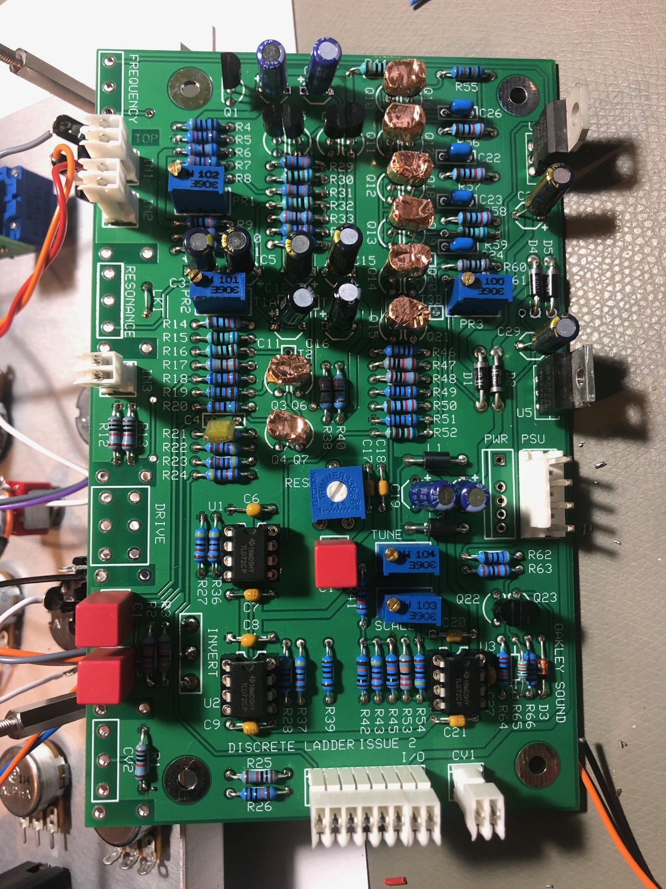

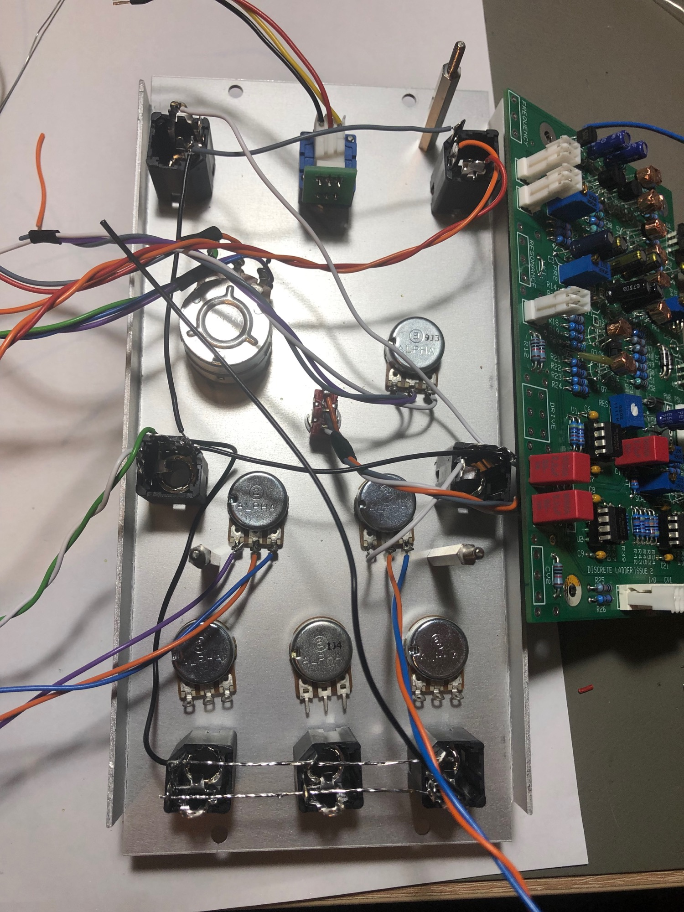

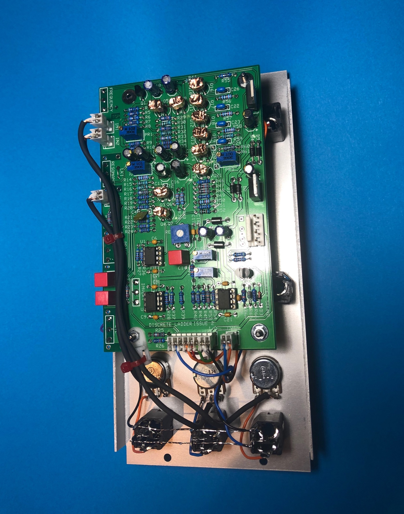

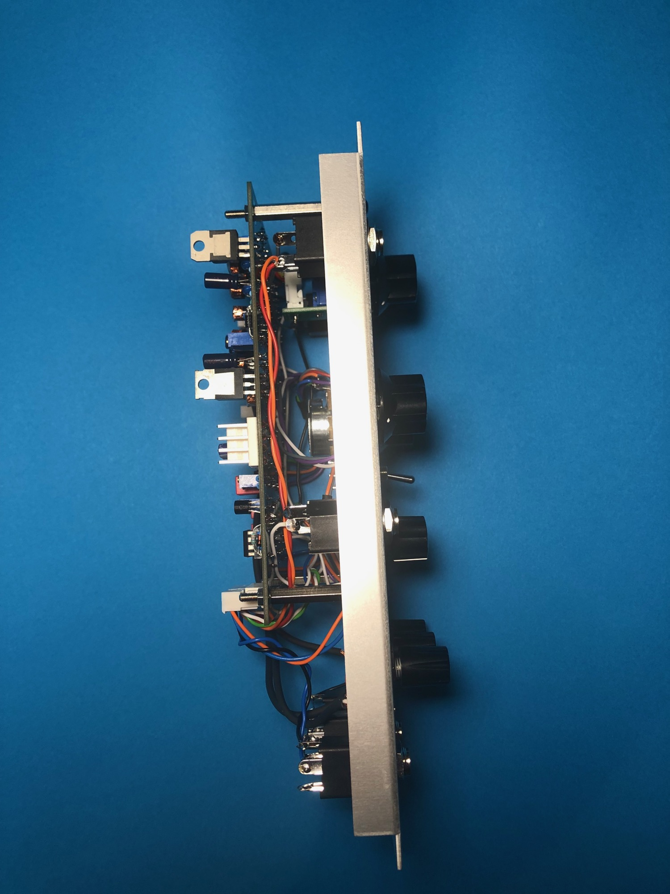

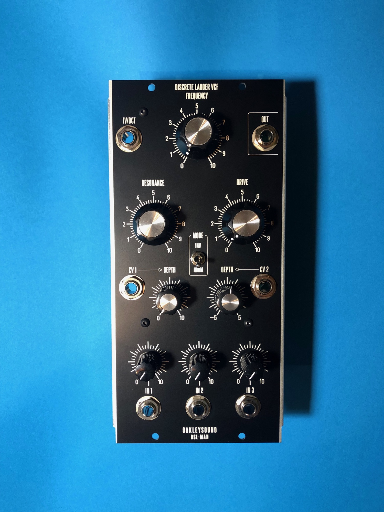

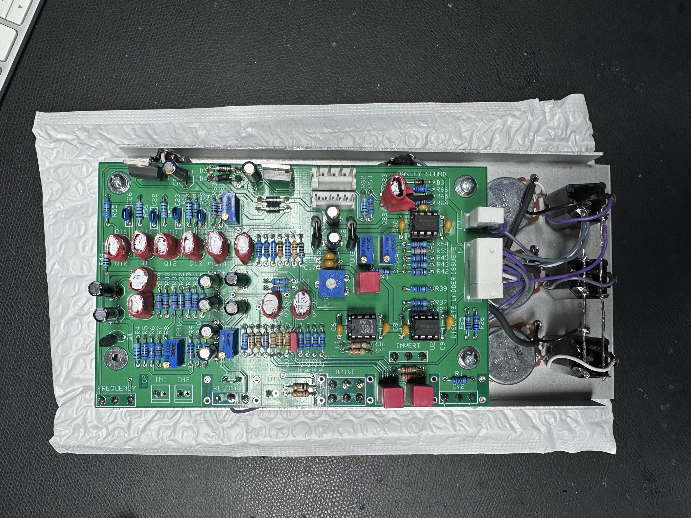

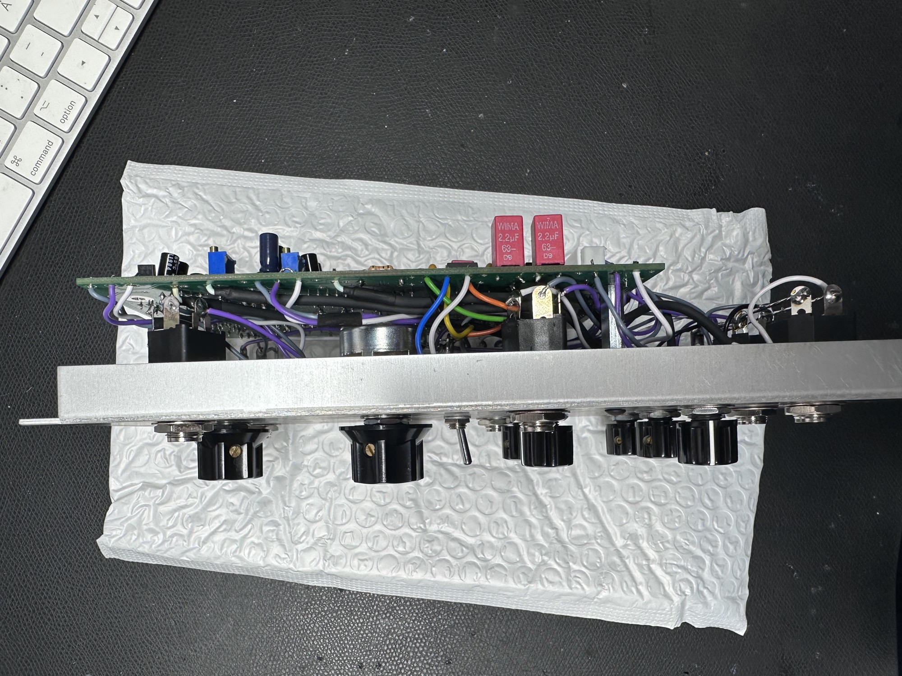

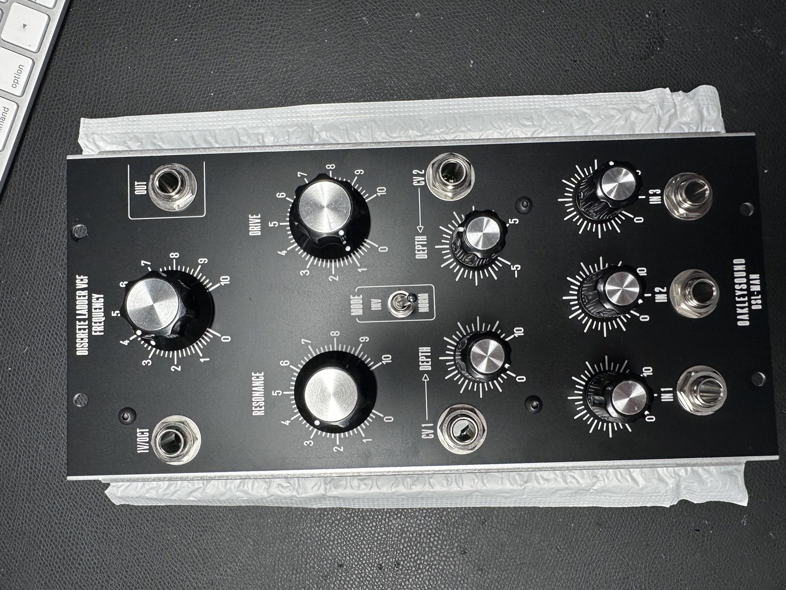

## Userguide:

[dlf2-um.pdf](assets/dlf2-um.pdf)

## Buildguide:

[dlf2-bg.pdf](assets/dlf2-bg.pdf)

## Frontpanels:

[dlf-2u.fpd](assets/dlf-2u.fpd)

[dlf-c.fpd](assets/dlf-c.fpd)

## Gallery:

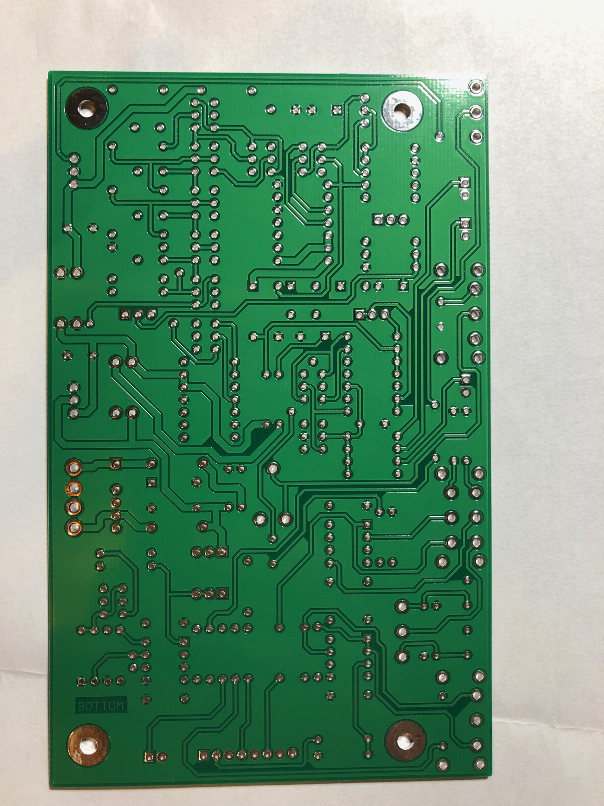

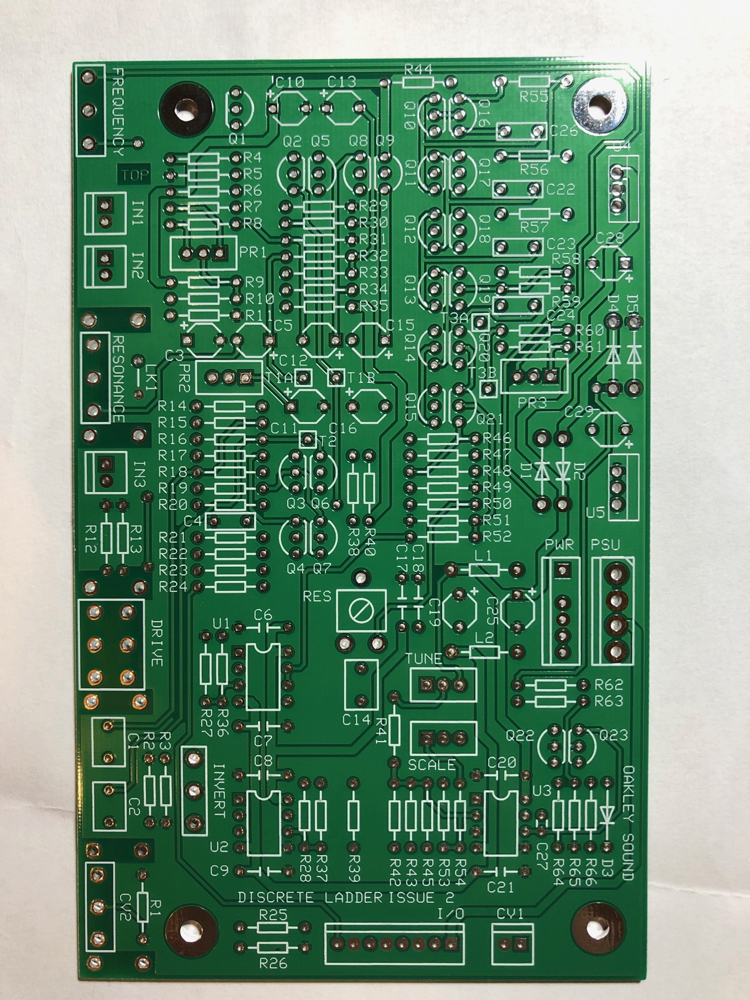

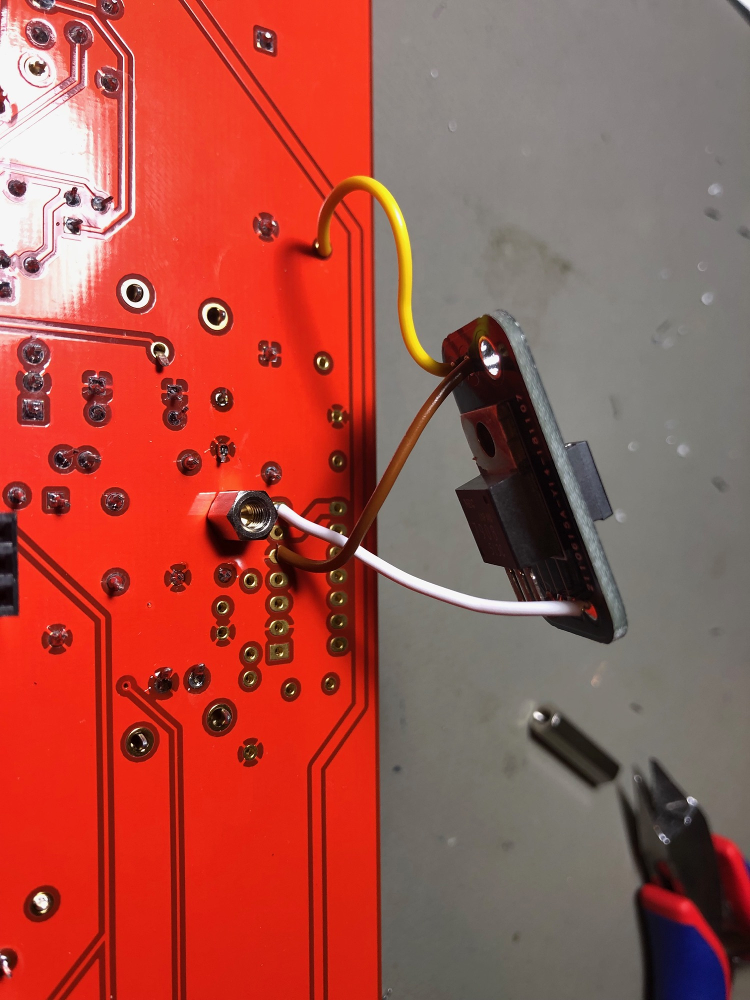

