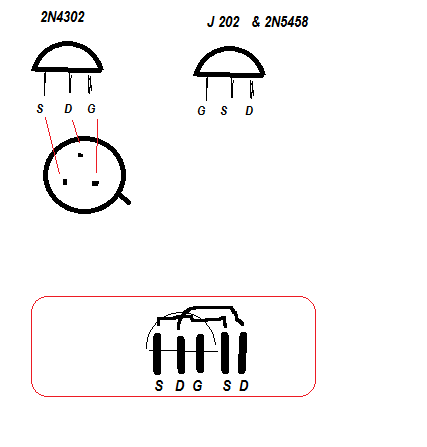
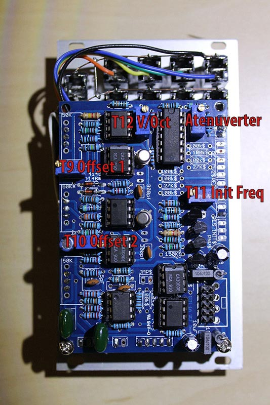
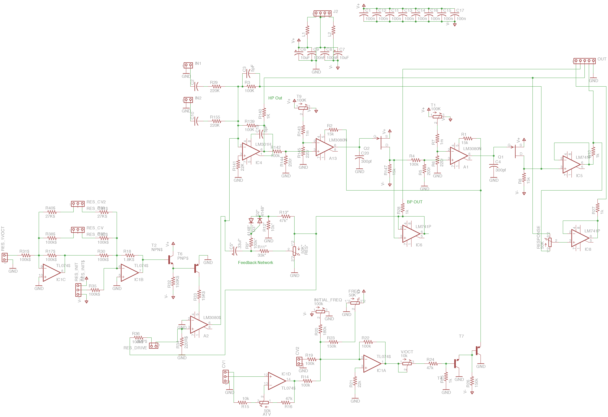
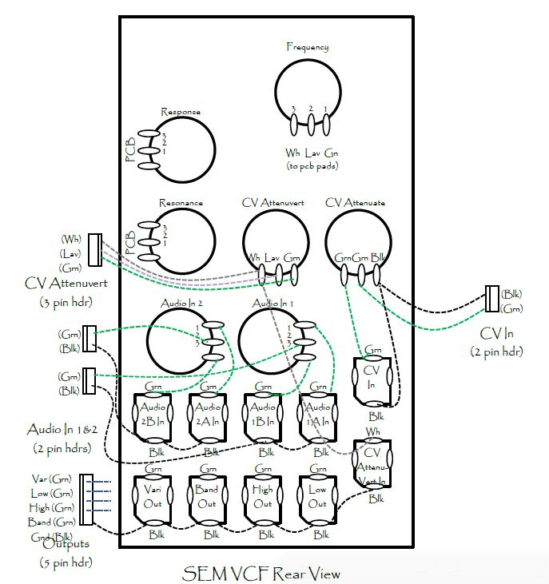
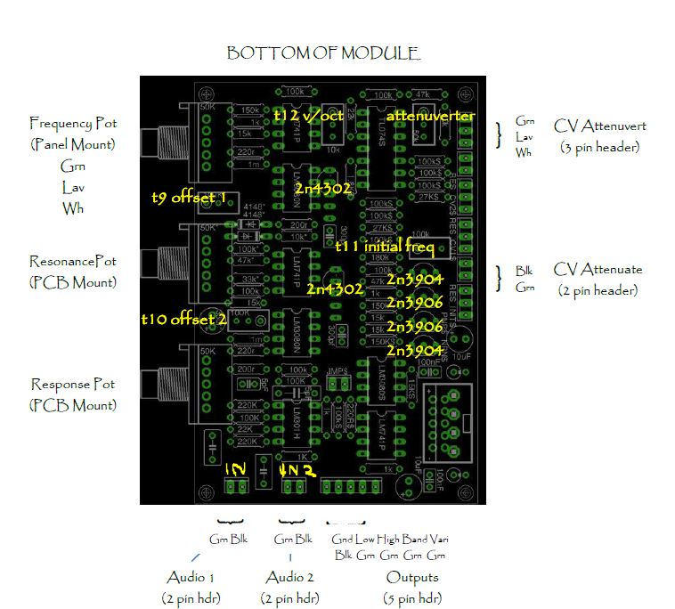
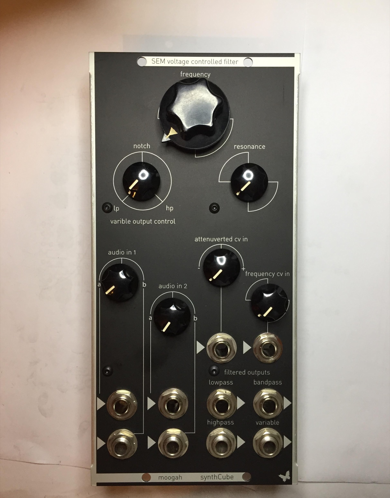

# Oberheim SEM VCF in MOTM

> **Project**
>
> ### Projecttitel: Oberheim SEM VCF in MOTM
>
> ### Status: one finished in 2013, one in shedule 2015
>
> ### Startdate: 2013
>
> ### Duedate: 2013/2015
>
> ### updated : 02/2019
>
> ### Manufacture link: [http://www.muffwiggler.com/forum/viewtopic.php?t=69431](http://www.muffwiggler.com/forum/viewtopic.php?t=69431)

**update 02/2017: i repaneled the Filter to a MU Format Panel from synthcube.com**

Here the latest Builders Guide  (with all known bugfixes)

[~~SEMVCFBuildDocEurov5.pdf~~](assets/SEMVCFBuildDocEurov5.pdf)

[SEMVCFBuildDocEurov8.pdf](assets/SEMVCFBuildDocEurov8.pdf)

**SEM VCF FILTER**

thanks to moogah from muffs.

**BOM:**

change the 300pF kerko to silver mica 300pf (Silver Mica/Glimmer Kondensator)

[SEM\_BOm neu.xlsx](assets/SEM_BOm-neu.xlsx)

You can use: J202 or 2N5458 as replacement for 2N4302 (see pinout in gallery - at the bottom of the page)

Link to BOM: - please use my above BOM !!
[https://docs.google.com/file/d/0Byb1hJRK5lw6OU9ZRmpGVy1yM1U/edit?pli=1](https://docs.google.com/file/d/0Byb1hJRK5lw6OU9ZRmpGVy1yM1U/edit?pli=1)

Link to Synthcube site for ordering:
[http://synthcube.com/cart/index.php?route=product/product&product\_id=1](http://synthcube.com/cart/index.php?route=product/product&product_id=1) 77

**General**

Link to original thread:
[http://www.muffwiggler.com/forum/viewtopic.php?t=69431](http://www.muffwiggler.com/forum/viewtopic.php?t=69431)

The original schematics (page 6), all components not marked with a '$' are the exactly the same as the original with this layout.

[http://www.synthfool.com/docs/Oberheim/Oberheim\_SEM1A/Oberheim\_SEM\_1A\_](http://www.synthfool.com/docs/Oberheim/Oberheim_SEM1A/Oberheim_SEM_1A_) Schematics.pdf

If you orient the board so power is lower right- the order for the transistors from top to bottom is as follows: 
2n3904 
2n3906 
2n3906 
2n3904 

The 2n4302's is located in the two unlabeled spots in the middle of the board,  using only the 3pins  (middle position)

**from muffs:**

There are 3 100n SMT caps mounted on the bottom of the board. If you really don't want to deal with SMT, the filter will still work without them.

The components marked with a $ are for the version with VC Resonance.

The components marked with a \* are for the original version, but they are left off on the vc res build.

the FET buffer transistors (2N4302 on the original) are the two in the middle of the board in this picture. The silkscreen shows the correct orientation for the 4302, but there are two additional pins which make it easier to use a substitute without having to bed pins.

The 2n3904 and 2n3906 pair are poorly labeled (not labeled...). They are the two without any markings and the 2n3906 is the one with a trace connected to its middle pin.

you will probably need to stretch the pins of the 5pF capacitor above the LM301. To be sure, just don't let it's leads touch the board directly.

There are 3 150K resistors on the board, all three will be 120K instead for a 12V version. However, one of the 150K is only needed for vc-res, so you can ignore that one.

The inputs are on the bottom left and the pins are: Input, Ground.

The outputs are on the bottom right and the pins are: Ground, LP, HP, BP, Variable.

The pots mount on the component side of the board.

**Troubleshooting by usage of J202**

issue: no sound on powered module

2N4302 replaced by J202

validated !  works

**Callibration**

1) Using an oscilloscope, check pin Q8 on board -to-board connector (this pin is the nearest to connector I1). 

2) Turn "Notch" pot to "HP". 

3) Adjust "OFFSET 1" trimmer to zero volt. 

4) Turn "Notch" pot to "LP". 

5) Adjust "OFFSET 2" trimmer for zero volt. 

6) Center VCO1 frequency pot and VCF frequency pot (at 12 o'clock). 

7) Apply VCO1 pulse waveform into VCF and rotate resonance (Q) pot fully clockwise. 

8) Adjust VCF "INIT FREQ" trimmer until fundamental (F1) is prominent. 

9) Juper CV input to pin H1. 

10) Depress key one octave above lowest keyboard key and adjust VCF "Volt/octave" trimmer for maximum signal. 

11) Repeat steps 1 through 5..  

