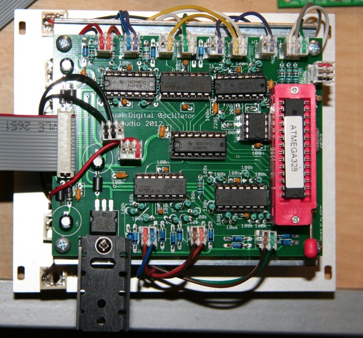
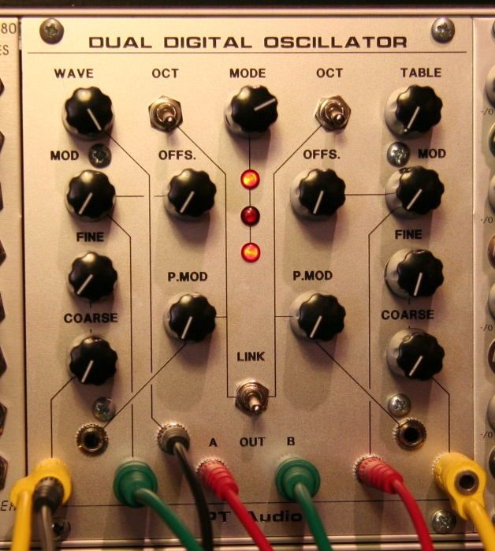
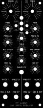
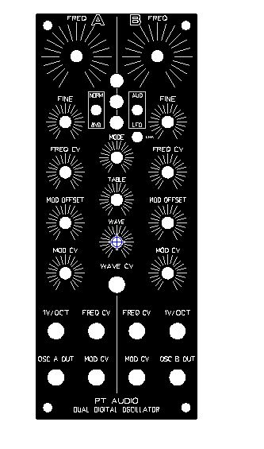
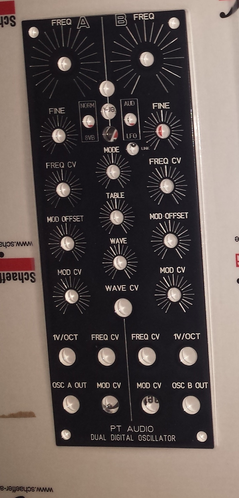
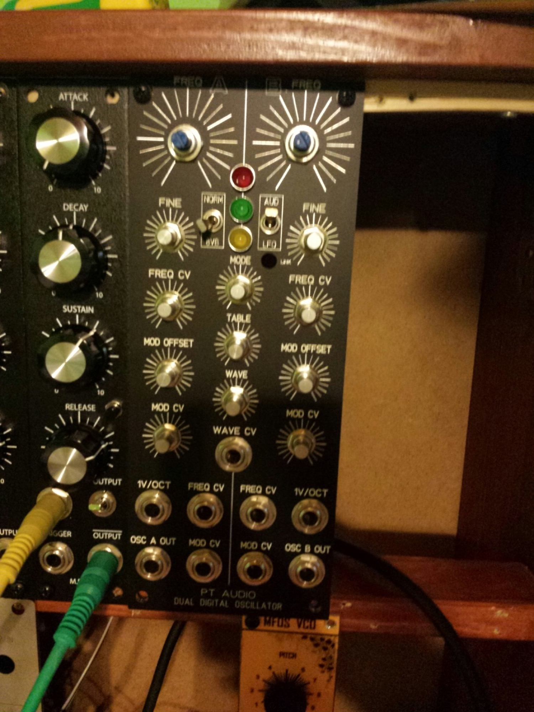
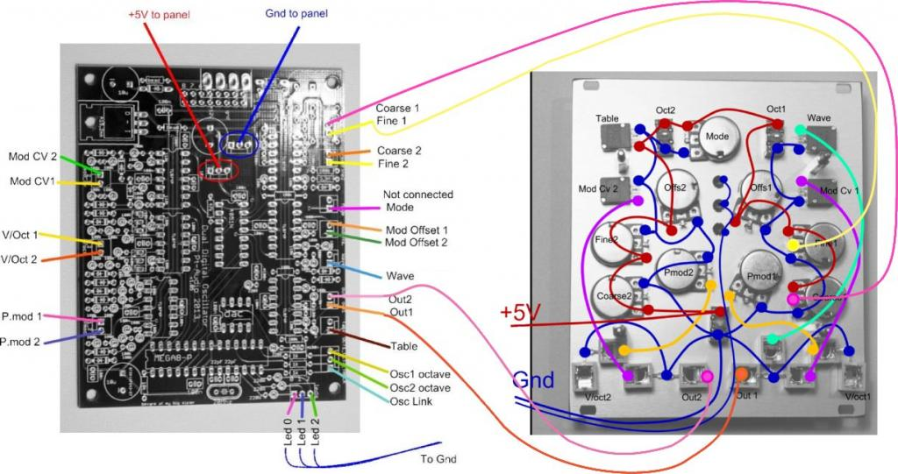
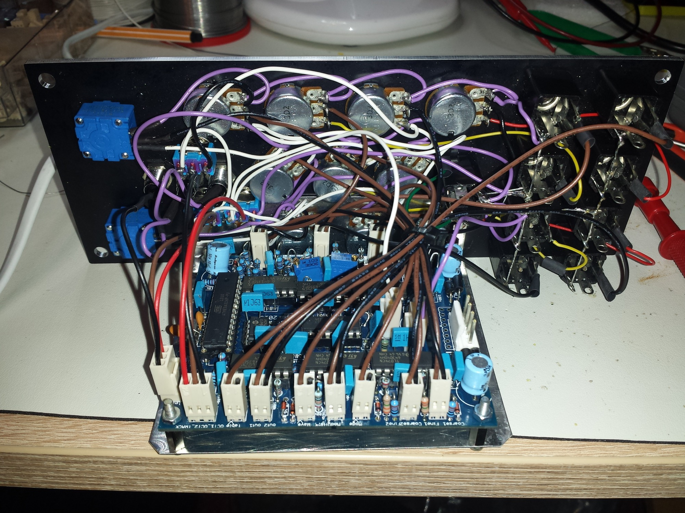

# PT-Audio Dual DCO

> ### Projecttitel: PT-Audio Dual DCO
>
> ### `Status` finished
>
> ### Startdate: 01.07.2013
>
> ### Duedate: 23.02.2014
>
> ### Manufacture link: [http://www.muffwiggler.com/forum/viewtopic.php?t=70449&start=200&postdays=0&postorder=desc&highlight=ptaudio](http://www.muffwiggler.com/forum/viewtopic.php?t=70449&start=200&postdays=0&postorder=desc&highlight=ptaudio)
>
> [http://www.muffwiggler.com/forum/viewtopic.php?t=70449&postdays=0&postorder=desc&highlight=ptaudio&start=640](http://www.muffwiggler.com/forum/viewtopic.php?t=70449&postdays=0&postorder=desc&highlight=ptaudio&start=640)
>
> shop: synthcube

**building from muffwiggler Forum 2013/2014**

Pictures from other customers, only for demonstration view

the second picture is mine.

**Tech:**

It is based on DSS (Direct digital synthesis) and is running on a ATMega 328p chip.

Both oscillators share a set of 4 \* 8 Wavetables that can be interpolated.

It has 8 modes of operation:

- 1. Phase mod 1-&gt;2, 2-&gt;1

- 2. Saw mod

- 3. SampleWrap

- 4. BitCrush

- 5. PhaseCrush

- 6. Bitkill

- 7. And/Or

- 8. Sync 1-&gt;2

(still not 100% set in stone as so many variations sound cool)

pitch tracking is 5 octaves, 1V/oct. And can be offset +5 octaves with the coarse/fine controls. Additionally the pitch can be modified by the pitch mod inputs +/- 5 octaves.

Osc1 can be switched down one octave, and osc2 switched down 8 osctaves.

Osc2 can either follow osc1 or run free, by flipping the link switch.

All CV inputs are 0-5V but the pitch mod that is -5/+5. All inputs are protected against voltages outside that range, but inputting a non expected voltage may result in unexpected behaviour wink

pmod (pitch modulation - its a attunator for Freq.CV input, without cable connected it works as a offset)

You also have the link switch, this simply copies the V/oct input from osc1 to osc2. (It does internally, digitally) so if you apply the same signal to both oscillators, and also have the link switch on, you will get a 1:2 pitch

Mod. and Offset are related as they both control the modulation amount for each oscillator.
 Mod is the Modulation CV attenuator, it needs CV input to do anything.
 Offset is the manual offset for this, so you can tweak that manually without any CV input. These two are added internally to allow you to get a lot of modulation range.

**Build Manual:**

**[DDO\_Build\_Manual\_v091.pdf](assets/DDO_Build_Manual_v091.pdf)**

[DDO\_Build\_Manual\_v091.pdf](assets/DDO_Build_Manual_v091.pdf)

**BOM:**

[DDO\_BOM\_20130525.tab](assets/DDO_BOM_20130525.tab)

### Frontpanel Files:

[2u\_motmformat\_dual\_digital\_oscillator\_748\_01.svg](assets/2u_motmformat_dual_digital_oscillator_748_01.svg)

[2u\_motmformat\_dual\_digital\_oscillator\_748\_01.fpd](assets/2u_motmformat_dual_digital_oscillator_748_01.fpd)    -&gt; Freq.CV = pmod (pitch modulation - its a attunator for Freq.CV input, without cable connected it works as a offset)

[2u\_motmformat\_dual\_digital\_oscillator\_748.fpd](assets/2u_motmformat_dual_digital_oscillator_748.fpd)

[2u\_motmformat\_dual\_digital\_oscillator\_mdota\_137.fpd](assets/2u_motmformat_dual_digital_oscillator_mdota_137.fpd)   -&gt; the right frequency pot/coars is a pushpull pot - to enable the link between OscA/OscB

**Building Tips:**

The \*100n caps are the output filtering caps. I found that 100n is a bit too mellow for my taste and went with 10n instead. That is what you hear in the latest demos. In the BOM they are marked as 10n\*.

copy from muffs:

**Here's a mod idea:** use a switching jack for the Wave CV in and connect the switch to 5v. That way the Wave pot will sweep through the table manually when no cable is inserted into the jack.
 If you do this, please use a current limiting resistor to protect anything you plug in here. 100 -200 Ohm should be enough.

**for MOTM Format:**

by usage of 15Volts change the both trimmer from 10K to 25K

please see comments at the fronpanel files for wiring at custom panels.

**Wiring:**

