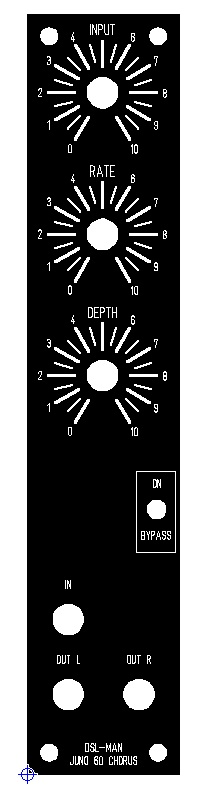
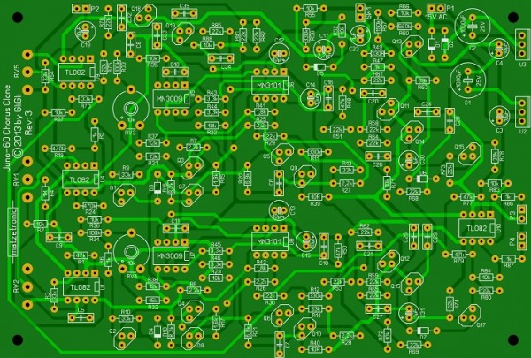
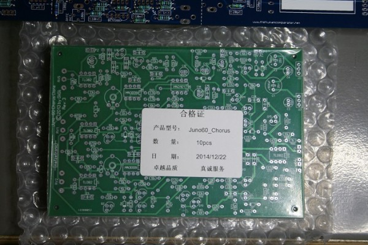
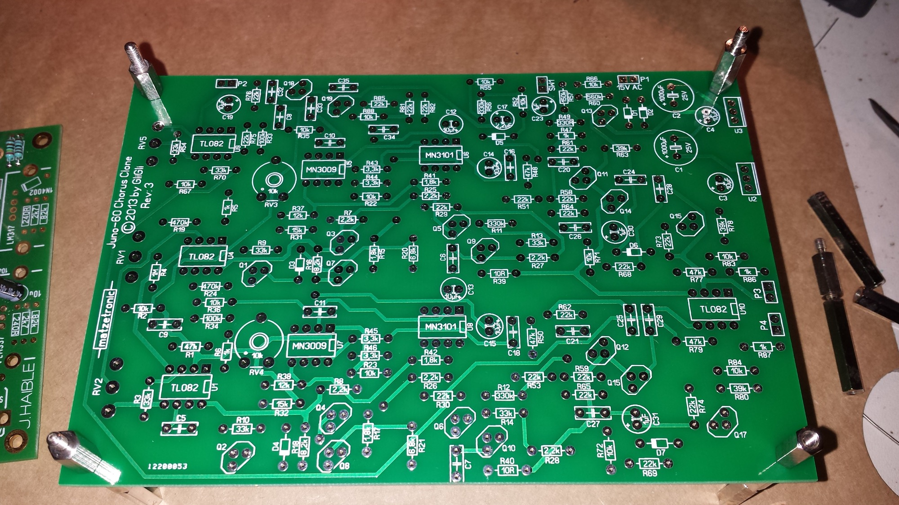
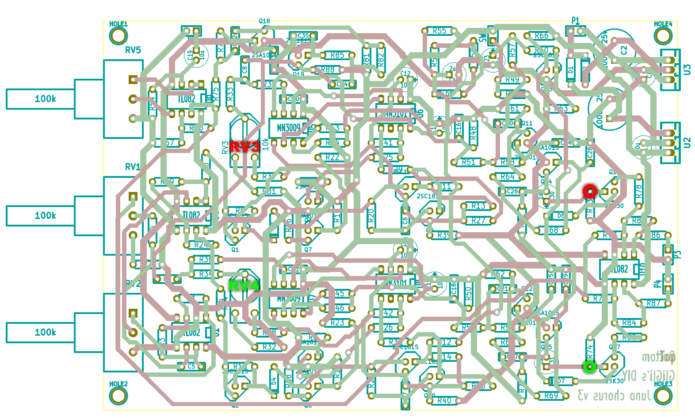

# Roland Juno 60 Chorus

> **Project**
>
> ### Projecttitel: Roland Juno 106 Chorus
>
> ### Status: `finished`
>
> ### Startdate: 06.May 2015
>
> ### Duedate: 30.May 2015
>
> update 24.oct.2022 BOM failure (pdf)
>
> ### Manufacture link: [https://github.com/gligli/juno-chorus-clone](https://github.com/gligli/juno-chorus-clone)

### Projectlinks:

[https://github.com/gligli/juno-chorus-clone](https://github.com/gligli/juno-chorus-clone)

[http://gliglisynth.blogspot.de/2014/05/new-diy-project-standalone-juno-60.html](http://gliglisynth.blogspot.de/2014/05/new-diy-project-standalone-juno-60.html)

[http://www.sequencer.de/synthesizer/viewtopic.php?f=13&t=101954](http://www.sequencer.de/synthesizer/viewtopic.php?f=13&t=101954)

[http://www.sequencer.de/synthesizer/viewtopic.php?f=13&t=102448](http://www.sequencer.de/synthesizer/viewtopic.php?f=13&t=102448)

### BOM (partlist) :

~~[Juno-60 Chorus BOM.pdf](assets/Juno-60-Chorus-BOM.pdf).~~Dont use this BOM !!  in case you used the PCB from the gligli project, you have to export from kicad a BOM. 

(10K and 22K are mixed in the above PDF)

for trimmer use: Piher PT 10-L 10k

all Potis are linear types

### Building notice:

for Rectifiers (Dioden) D1 und D2 its important to use 1N5819 or 1N4001 

### **Schematics:**

**[juno-chorus-clone-sch.pdf](assets/juno-chorus-clone-sch.pdf) (from M.B pcb)**

### **Trimming: (copy from [http://www.sequencer.de/synthesizer/viewtopic.php?f=13&t=102448](http://www.sequencer.de/synthesizer/viewtopic.php?f=13&t=102448) ) thanks to nordcore**

Die Trimmer stellen den Offset am Eingang der Eimerkette so ein, dass sie symmetrisch clippt, die Aussteuerung also in der Mitte des Aussteuerungsbereichs der Eimerkette liegt.

Das kann man auch mit der Soundkarte messen, in dem man das Audiosignal am Drain von Q16 bzw. Q17 abgreift. Dort liegen die (Anti-Aliasing-)gefilterten und gleichspannungsfreien Ausgangssignale der beiden Eimerketten solo vor. Dieses Signal hört man zu Kontrolle mit an.

Eingangssignal (Synthesizer mit nicht zu hohem Sinus, 200 ...400Hz) langsam aufdrehen, wenn die Trimmer nicht völlig verdreht sind, dann wird man Ausgangssignal bekommen. Das wird jetzt recht bald mit steigendem Pegel auf einer Seite angefressen (abgeplattet), das Ohr hört Klirr.

Trimmer so stellen, das maximale Signalhöhe möglich ist bzw. die abgeplatteten Stellen auf beiden Seiten gleichmäßig daherkommen.

Da das die graden Harmonischen auf Null abgleicht hört man das auch recht gut - klingt es nach "Klarinette" ist es richtig.

Der Abgleich ist nicht sonderlich kritisch - der driftet eh etwas. Nicht zu doll "überfahren", das muss ja für leichte Übersteuerung stimmen.

**Panel**

my own Panel Design in MOTM Format:

[JUNO60.fpd](assets/JUNO60.fpd)

update 2017 for correct Pot distance 

[JUNO60-2017.fpd](assets/JUNO60-2017.fpd)

### **Pictures:**

**

**
