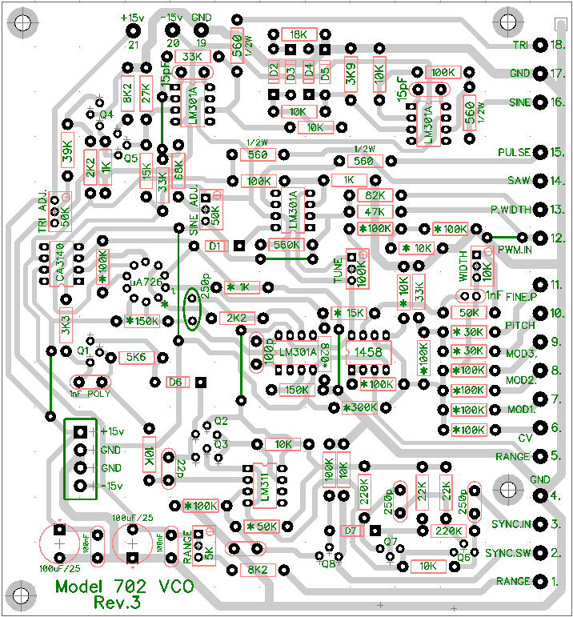
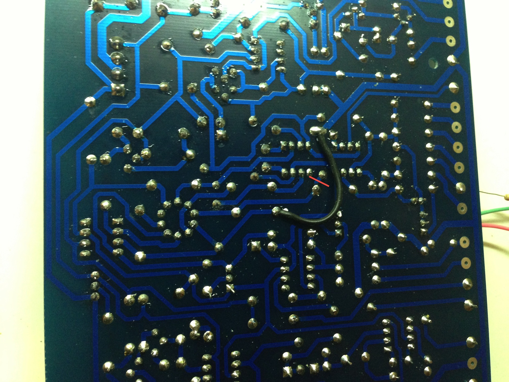

# Roland System 700 Clone

> **Project**
>
> ### Projecttitel: Roland 700
>
> ### Status: in progress
>
> ### Startdate: 09/2020
>
> ### Duedate: 2021
>
> ### Manufacture link:

[http://www.florian-anwander.de/roland\_system700/](http://www.florian-anwander.de/roland_system700/)

VCO: [702\_a3.jpg.pdf](assets/702_a3.jpg.pdf)

[702\_corrections.pdf](assets/702_corrections.pdf)

This Pages are just Infos for myself:

> ***VCO***
>
> Pin out van de FET niet correct, nieuwe FET gemonteerd.
>
> R30 ontbrak, in de documentatie met modificaties zou dit een 2k2 weerstand zijn. 10K weer-
>
> stand op de onderkant van de print gemonteerd. Printspoor onderbroken. Ontbrekende 820
>
> ohm weerstand gemonteerd. R48 is op pcb gemarkeerd als 100k, moet 10k zijn.
>
> Weerstand in het pulse breedte circuit ontbrak. 56K weerstand in plaats van 560K ge-
>
> monteerd. Jumper bij pwm input verbind de input met ground. Jumper verwijderd.
>
> Weerstand tussen tune trimmer en cv summer ontbrak. 100K weerstand gemonteerd op
>
> onderkant print. VCO 2 was instabiel door een probleem met de THAT300 transistor array.
>
> Transistor array vefvangen. Ua726 niet af te regelen op 50 graden, diverse tests gedaan,
>
> heater kan niet genoeg warmte genereren om tot 50 graden te komen. Maximaal 43 graden
>
> was haalbaar in testopstelling. Afgeregeld op 38 graden.
>
> ***VCF #1***Header voeding zat niet goed gesoldeerd, header verwijderd. Gaten opgeboord en
>
> nieuwe header gemonteerd. Elektrolytische condensator zat verkeerd om gemonteerd.
>
> Ingang van de sommeerversteker van de control voltages zat niet aangesloten.
>
> Transistoren Q1 en Q2 staan verkeerd om op de print. Transistoren gewisseld.
>
> Weerstand van 10ohm in plaats van 10Mohm in de aansturing van de OTA's. Weerstanden
>
> van 10k vervangen door 22k in de aansturing van de OTA's. Meegeleverde CA3080 werken niet. Nieuwe CA3080's geplaatst.
>
> Keramische condensatoren in het filter vervangen door polystyreen condensatoren.
>
> 1PF condensatoren rond de buffers vervangen en LM301's vervangen door CA3140's.
>
> Extra uitgang voor BPF en HPF gemaakt. Weerstand vervangen. 12NF vervangen door 15nF.
>
> 1 verkeerde weerstand in het overload circuit, 4R7 in plaats van 4M7. Elco verkeerd om, staat
>
> verkeerd op de print. Overload werkte niet doordat de ingang van de overload detector ver-
>
> bonden was met V+. Printspoor onderbroken.
>
> ***Sample&hold***
>
> Condensatoren verkeerd om gemonteerd, staat niet goed aangegeven op de print! PNP tran-
>
> sistor als Q4 gemonteerd moet een NPN zijn. Printspoor ontbrak bij de output van de clock
>
> generator. Condensator en FET niet aangesloten op input van de opamp door ontbrekend print-
>
> spoor. Clock output lag tussen -15V en +15V, Transistor zat niet aan ground door ontbrekend
>
> printspoor.
>
> ***Noise en Ringmodulator***
>
> Voedings connector had 1 pin die niet goed gesoldeerd zat. 2 Printsporen ontbraken. Pink en
>
> white noise zitten omgedraaid op de print. Opamp noise werkte niet, zorgde voor hele grote
>
> stroom. Adapter printje gemaakt naar SIL en een andere opamp gemonteerd. Noise level te
>
> laag. “Voetje” gemonteerd en transistor uitgezocht voor beste ruis. Weerstand aangepast om versterking groter te maken.

VCO translated to German:

```
Pin aus dem FET nicht korrekt, neuer FET montiert.
R30 fehlte, in der Dokumentation mit Modifikationen wäre dies ein 2k2 Widerstand. 10K auf der Unterseite der Platine montiert. trace unterbrochen. Fehlende 820 Ohm Widerstand montiert. R48 ist auf der Platine als 100k markiert, muss 10k sein.
Der Widerstand in der Impulsbreitenschaltung fehlte. 56K Widerstand statt 560K
montiert. Jumper am PWM-Eingang verbinden den Eingang mit Masse. Jumper entfernt.
Es gab keinen Widerstand zwischen dem Trimmer und dem Sommer der Zentralheizung. 100K Widerstand montiert auf
unterer Druck. VCO 2 war aufgrund eines Problems mit dem THAT300-Transistorarray instabil.
Transistorarray ersetzt. Ua726 bei 50 Grad nicht einstellbar, mehrere Tests durchgeführt,
Heizung kann nicht genug Wärme erzeugen, um 50 Grad zu erreichen. Maximal 43 Grad
war im Testaufbau machbar. Auf 38 Grad eingestellt.
```

[http://www.emcloned.com/viewtopic.php?f=24&t=283&p=6293&hilit=702#p6293](http://www.emcloned.com/viewtopic.php?f=24&t=283&p=6293&hilit=702#p6293)





1) The right side of R22 15K resistor (connected to uA726 pin 1) is tied directly to ground via the link that is physically located between IC1 (CA1458) and IC2 (LM301A).

2) The trace that joins pin 2 of the uA726, the 1K R23 resistor, D1 anode, 100K R27 and pin 3 of IC3 CA3140 does not connect to ground.

3) The "820 MF" (820 ohm metal film, I presume) resistor that is in parallel with the 1K MF resistor to ground on the right side of R22 15K on the schematic is missing from both the BOM and the PCB. 1K and 820 ohm in parallel like that should make about a 450 ohm resistance.

Assuming the schematic is correct (which seems highly likely for 1 and 2 above, and reasonable for 3 as well) I made corrections to my PCB to match the schematic and tested again. I saw no change in behaviour (0V on the right side of the R22 15K). I desoldered the right left of the R22 15K resistor and it measured it and it tracked the IC1A output perfectly. I resoldered it in place and desoldered the R23 1K and the 820 ohm resistors and measured again - still 0V. I removed the BC547s I was using in place of a uA726 and the voltage then tracked IC1A output just fine. I resoldered the R23 1K and 820 ohm resistors and it once again measured 0V. So if either the resistors, or the "uA726" are in place, then I do not see a voltage going in to pin 1 of uA726.

Just in case my understanding is incorrect I tried measuring the current flowing out of uA726 pin 4 (I believe the transistor pair is a voltage to current converter which drives the actual oscillator circuit itself?) There was no current flow in any of my test cases.

So I am stumped for now. Does anyone have any suggestions? No-one has reported a successful build here or on muffs that I can see.

Damir, what is the status of your builds? Do they work, and if so, did you have to make any corrections like mine?

I already know about the CV width adjustment fix on rev1 boards here: but I do not be
