# STP4012 MOTM

> **Info**
>
> | ID | Date | change | by |
> |---|---|---|---|
> | 1 | initial 2018 |   |   |
> | 2 | 04 nov.2018 | failure in BOM and Schematics | LED-man |
> | 3 | 06 nov 2018 | BOM - review |   |
>
> **please contact me****if you want a assembled Module**
>
> **The PCB and Panel is exclusively avaible from www.diysynth.de**

The Schematics are only available for users who ordered the PCB or Module, contact me.

**Module Description:**

**5U MOTM format  3U width (221,87mm x 132,97mm)**

based on the Arp 4012 Idea

LED Slider

Resonance CV Vactrol based

easy to build

less wiring

skiff friendly

powder coated and silkscreened Aluminium panel

only 2 SMT components (led driver)

10/11mm leadspace (no bloody fingers like eurorack 7mm leadspace)

leadfree pcbs

MOTM Power header (-15V/15V)

**Connections:**

3 Audio Inputs

3 CV Inputs

1 Resonance CV input

1 Output

**BOM:**

[Controlboard\_1.1.8.xlsx](assets/Controlboard_1.1.8.xlsx)

~~[BOM\_potted\_Module\_4012\_v1.1.xlsx](assets/BOM_potted_Module_4012_v1.1.xlsx)~~

~~[BOM\_potted\_Module\_4012\_v1.2.xlsx](assets/BOM_potted_Module_4012_v1.2.xlsx) one typo fixed  R2 = must be 470R instead 420R~~

[BOM\_potted\_Module\_4012\_v1.3.xlsx](assets/BOM_potted_Module_4012_v1.3.xlsx)  R2 must be 470R, R1 must 470R instead of 100K

(Double check with this file: [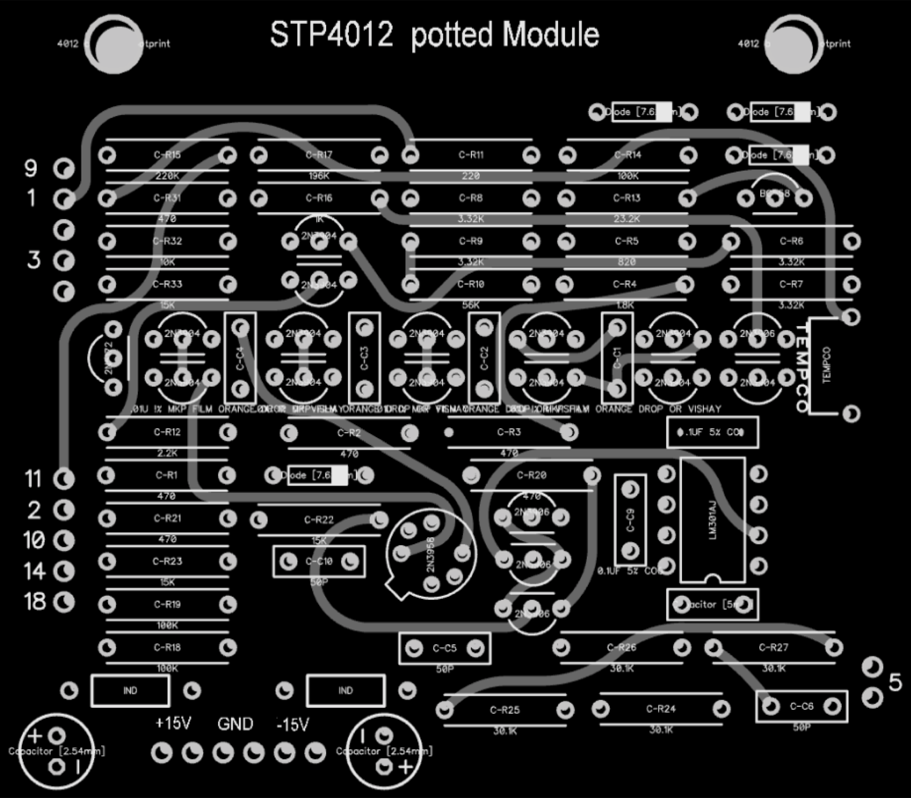](assets/4012-potted.png)

> **warning**
>
> There was a failure in old BOM and Schematics for the Controlpanel PCB, before 06.Nov.2018
>
> R7 must be 3M3
>
> R14 must be 150K
>
> R29 to be doublechecked with JMLS in schematics 5K
>
> c11 must be 22-47pf
>
> R20 on controlboard is 100K - not listed in BOM.

**Info for rare parts:**

|   |   |   |   |
|---|---|---|---|
| QUANTITY | VALUE | DESCRIPTION | OTHER |
| 1 | 2N3958 | JFET N-Channel Dual | rare part, ask Patrick aka DSL-man/LED-man |
| 1 | 1k87 | Tempco | rare part, ask Patrick aka DSL-man/LED-man |
|   |   |   |   |

## Buildguide:

Short version:

Controlboard:

start with the SMT Parts: 2 x LED driver diode on controlboard

assembly the controlboard, SW input pin 2 must be connected to SW output pin 2 (see picture)

mount all spacers for frontpanel and potted module, the 4x 12mm spacer are between controlboard and potted module, the other 4x 12mm spacer between potted pcb and DIYSYNTH cover pcb.

note: theres a LED above from the Vactrol, positive/negative is the same as the vactrol pinout marking, you can place it in the lower or upper position (its in parallel)

**assembly the potted PCB:**

place all resistors and 1N4148, solder this parts.

capacitors next, then IC socket, transistors.

**The Ladder contains matched transistor pairs, match them to less 2mV VBE difference, or ask me for help.**

**test your 2N3958 tranistor and dont overheat them while soldering.**

**[4012\_potted\_module.png](assets/4012_potted_module.png)**

**Note,  there´s one 2N3906 on left side of the tempco (from the pair the transistor on top)**

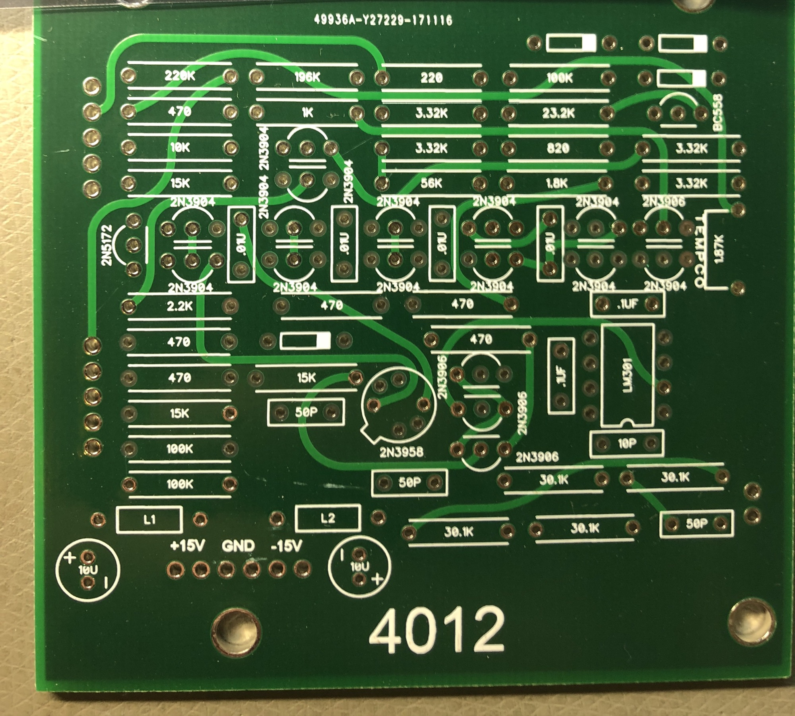

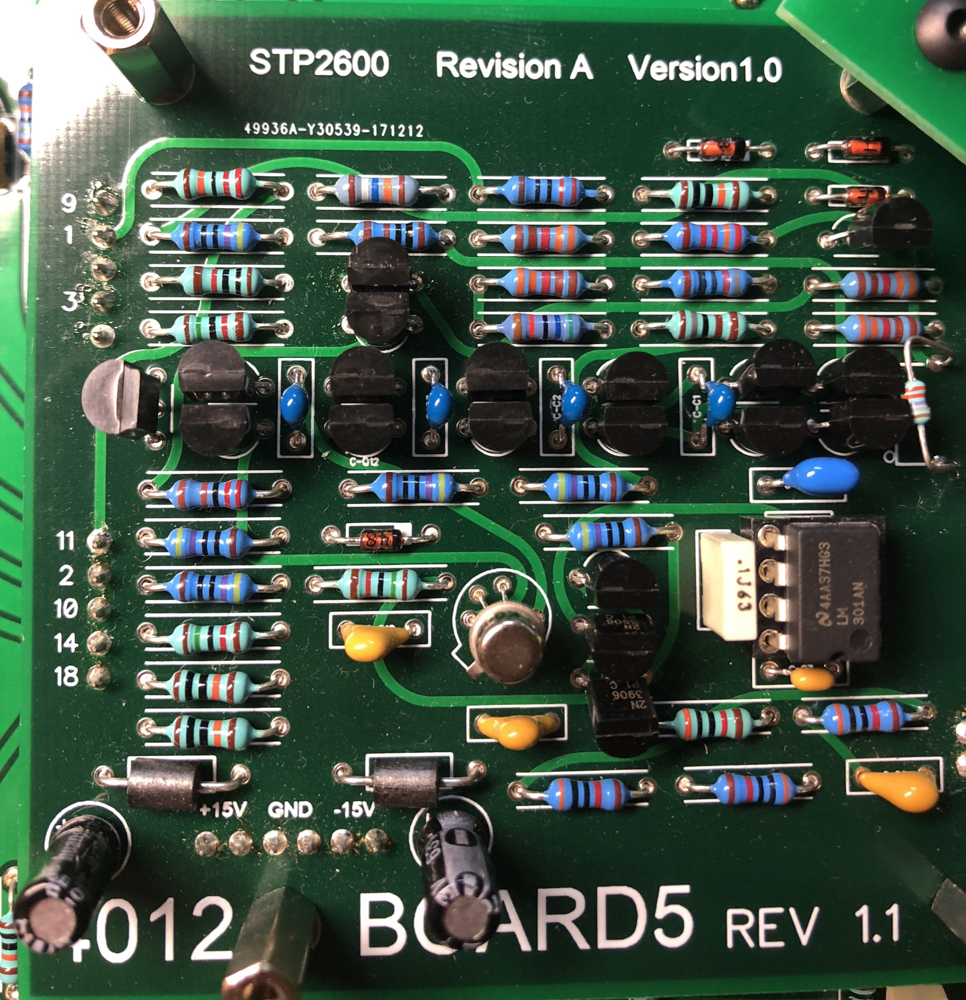

  

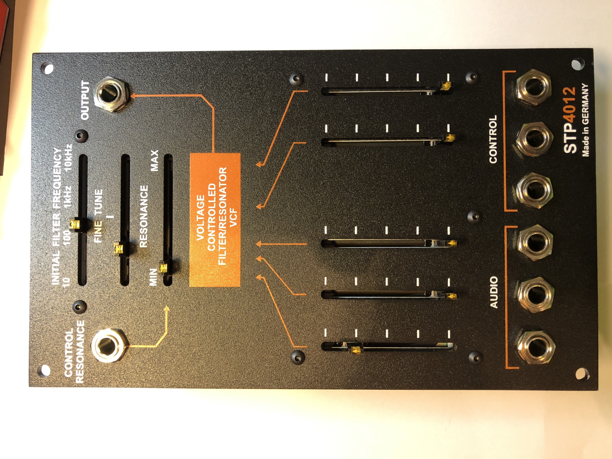

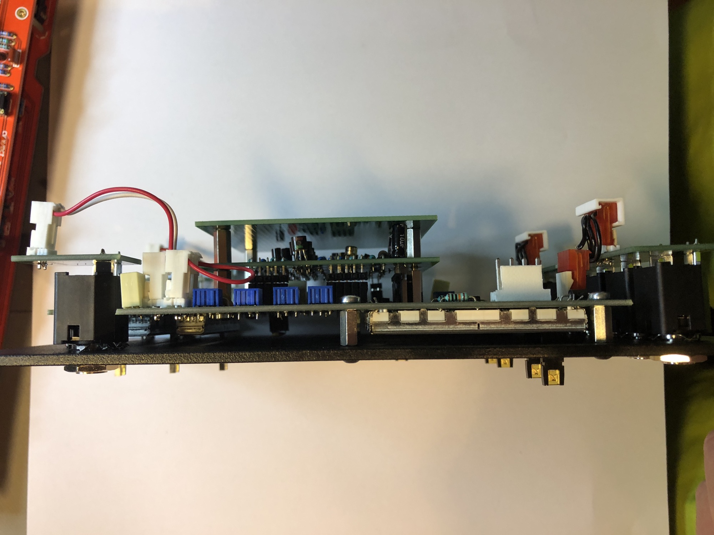

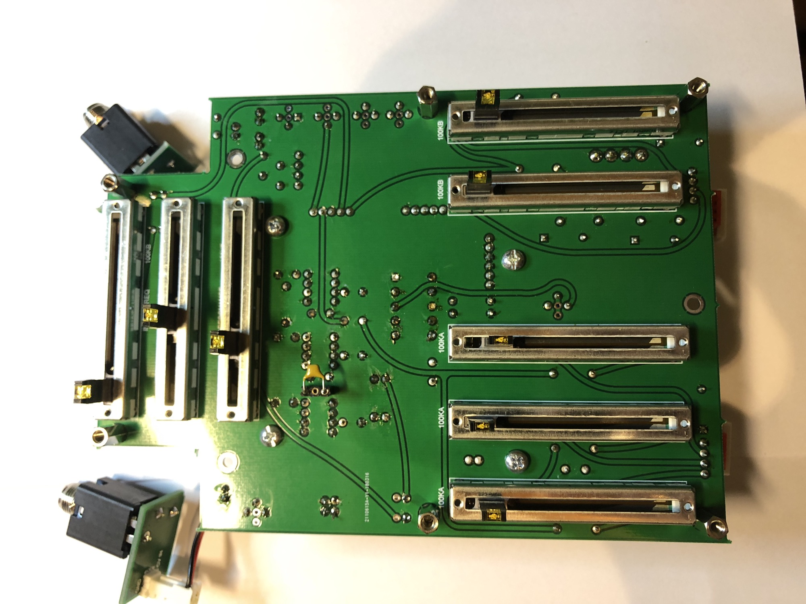

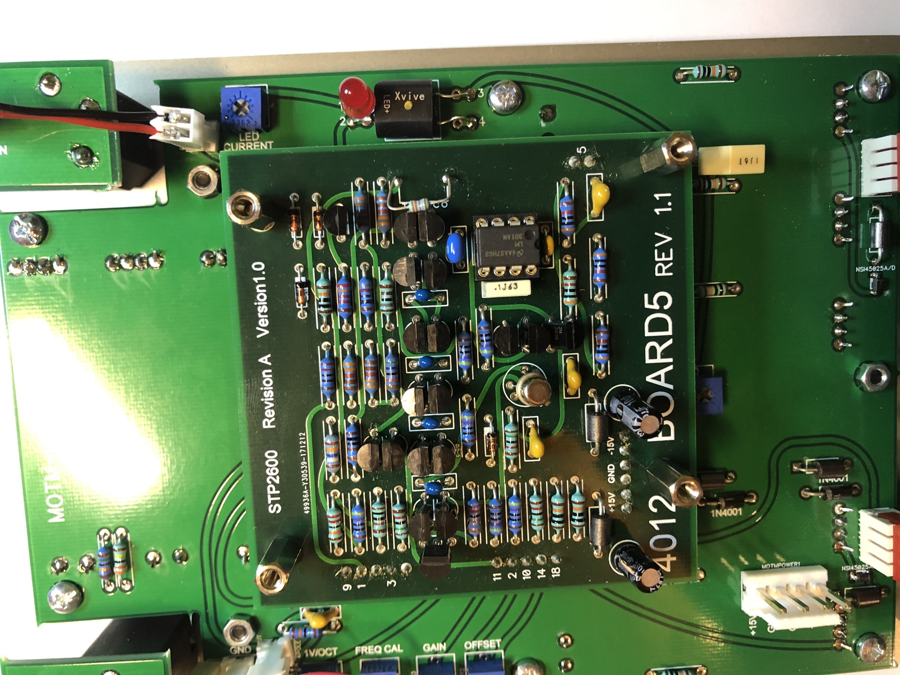

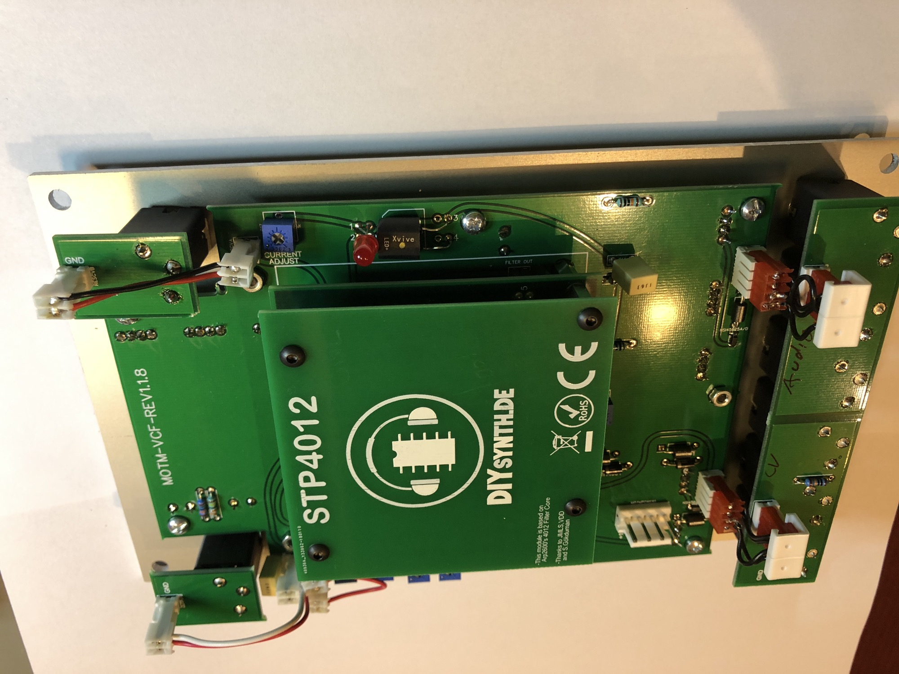

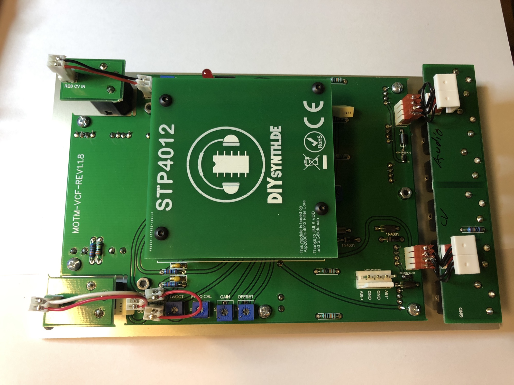

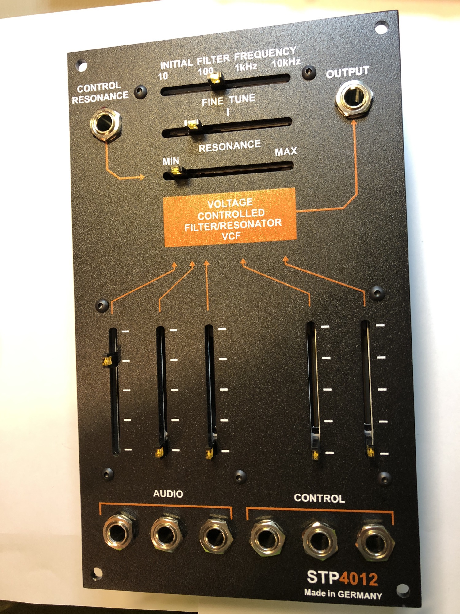

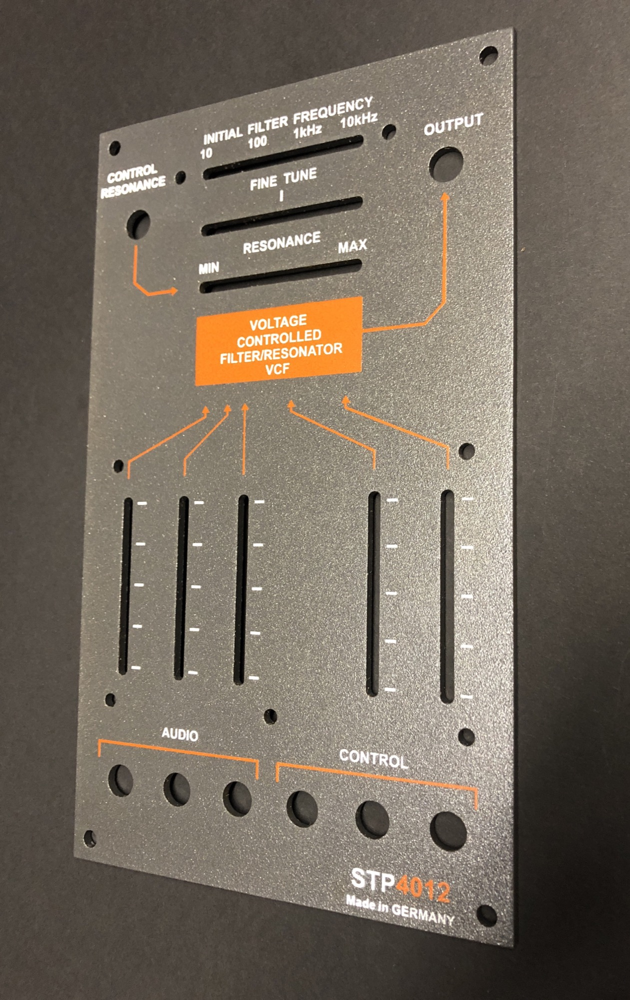

