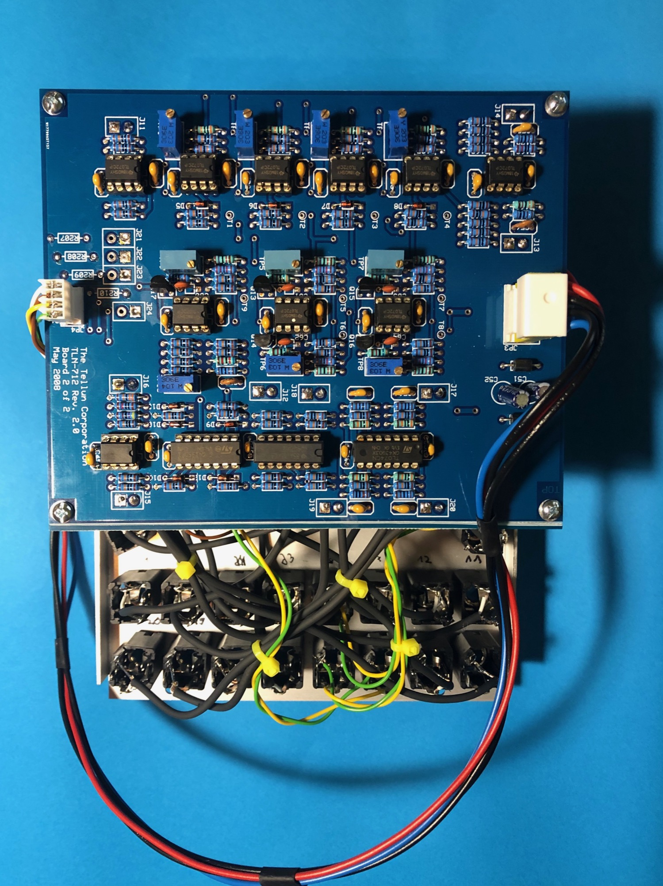
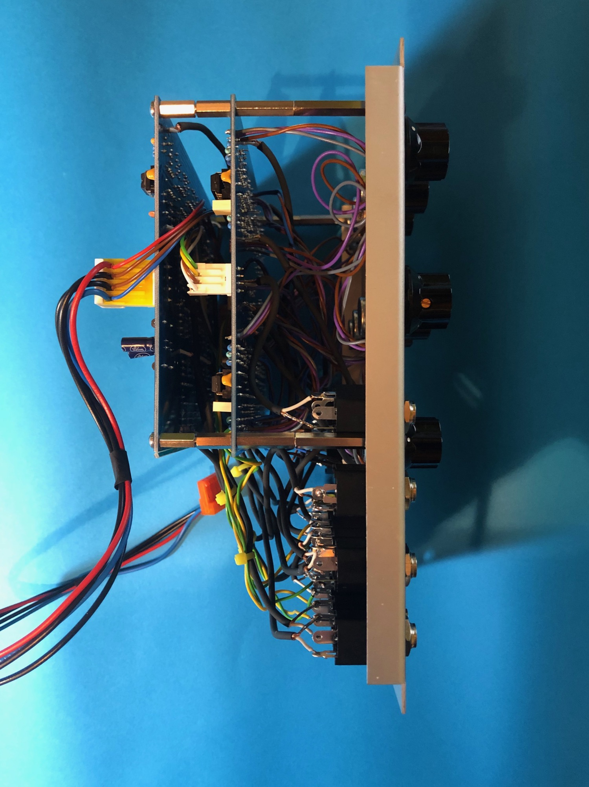
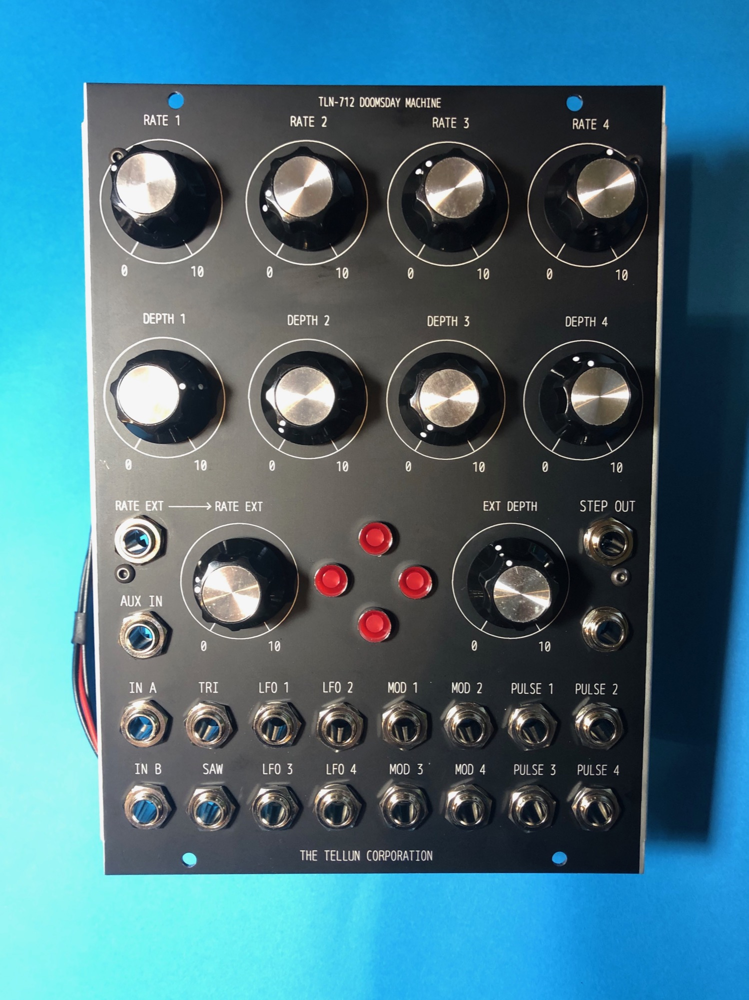

# Tellun TLN-712 Doomsday

> **Project**
>
> ### Projecttitel: Tellun TLN-712 Doomsday
>
> ### Status:
>
> ### Startdate: 04/2019
>
> ### Duedate: 08/2019
>
> ### Manufacture link:

## BOM and guide:

[TLN-712\_User\_Guide\_20.pdf](assets/TLN-712_User_Guide_20.pdf)

ask me if you want a Panel

 

