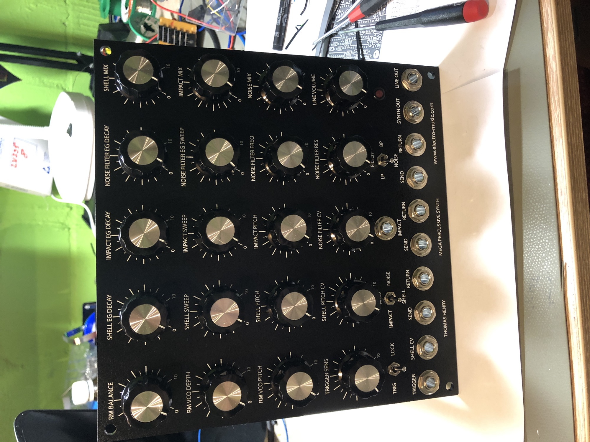
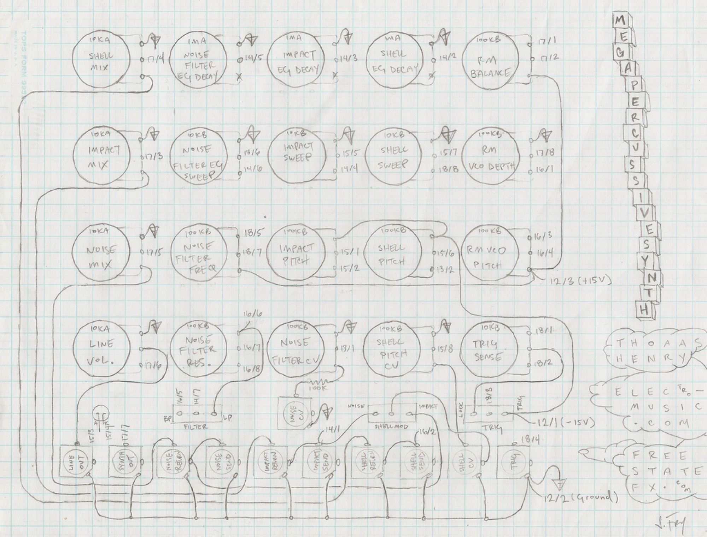
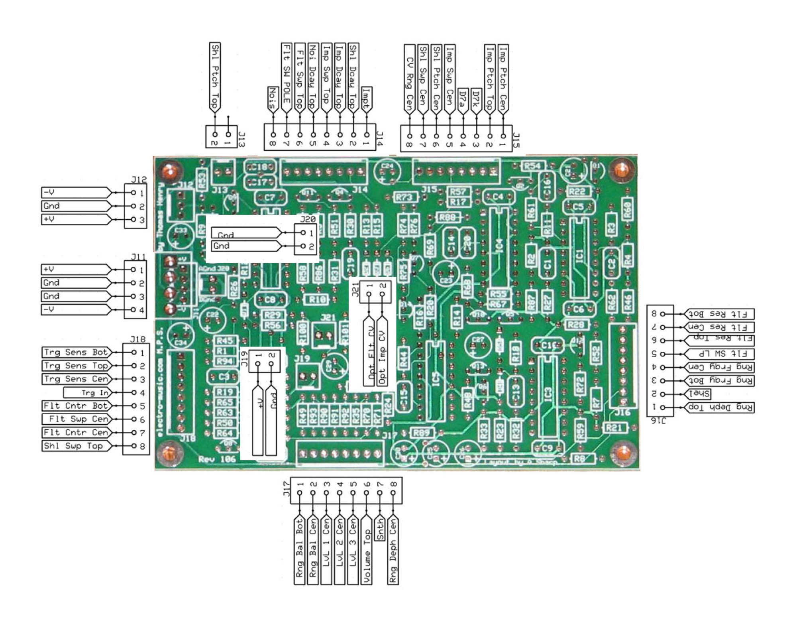
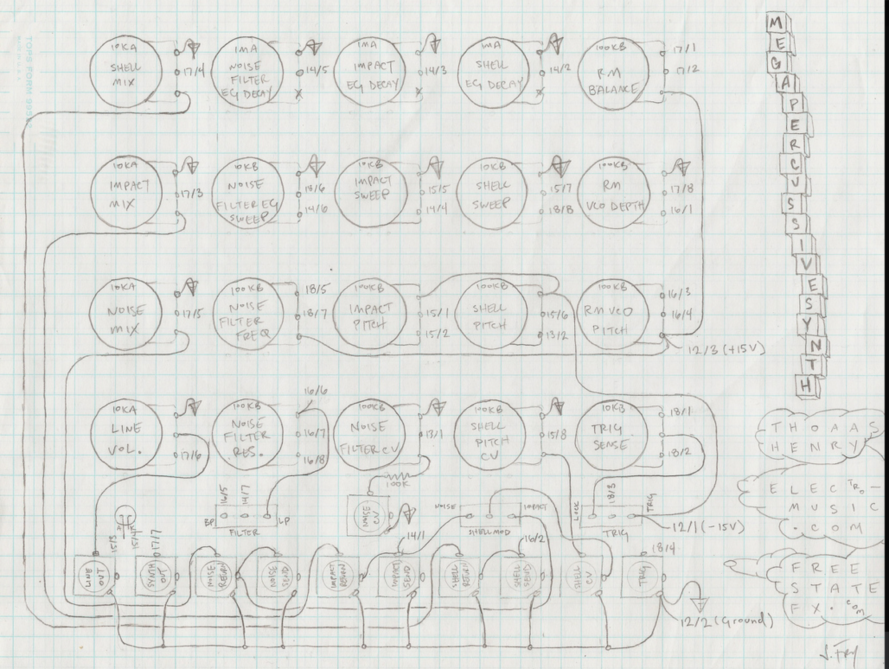
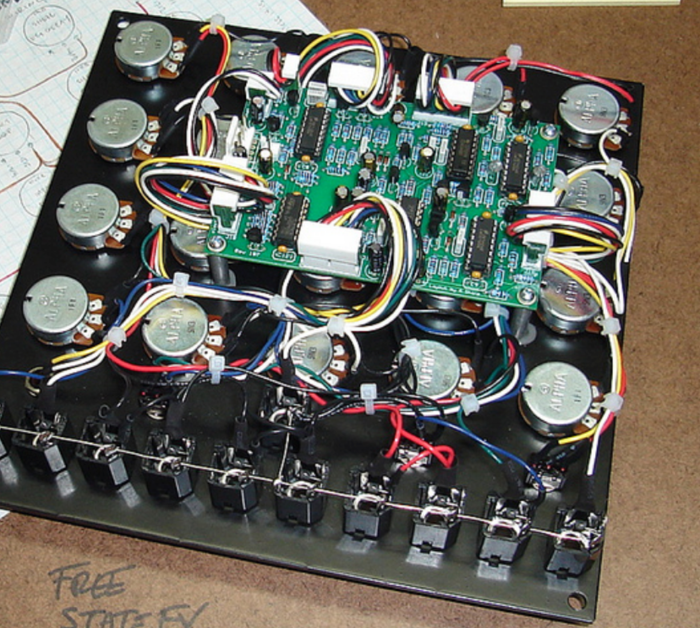
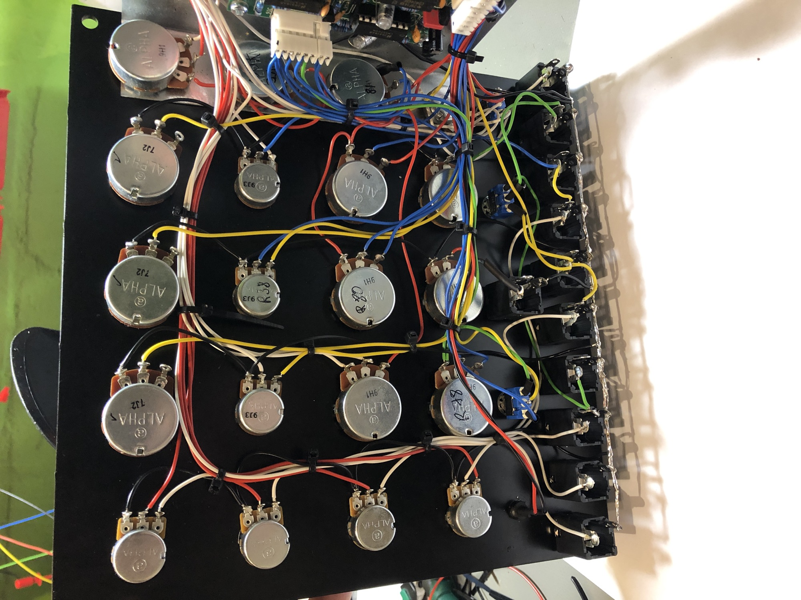
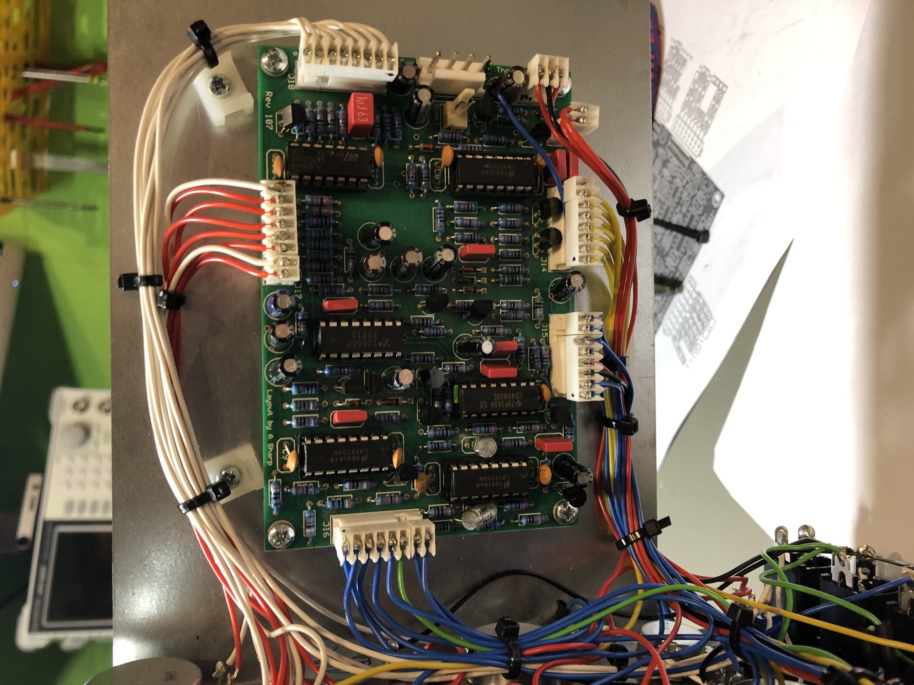

# Thomas Henry Mega Percussive Synth MPS

> **Project**
>
> ### Projecttitel: MPS Thomas Henry Mega Percussive Synth
>
> ### Status: `finished`
>
> ### Startdate: 02/2018
>
> ### Duedate: 11/2018
>
> ### Manufacture link:

I started the MOTM MPS build in 2018.

The panel is from Synthcube,  i got the assembled pcbs from a friend.

30mA +15v

15mA -15V

## BOM:

[TH-MPS BOM.pdf](assets/TH-MPS-BOM.pdf)

**Power Consumption:**

15V: 40mA

-15V: 30mA

**Please use this Wiring sheet:**

> **Hinweis**
>
> connect the "Noise" of J14 pin 8 to the "Noise Return Tip pin", its not shown in the above picture.
>
> the LED pin out is maybe wrong, there are different wiring guides..
>
> correct is Pin3 is + (the long pin from the led 😉)
>
> the above wiring guid is correct, my MPS is working.

a further wiring guide (not used in my build)

[mps\_connections\_v1\_133.pdf](assets/mps_connections_v1_133.pdf)

**Panel layout:**

[5u\_mps\_153.pdf](assets/5u_mps_153.pdf)

from Modularsynthesis:

**Modifications:**

I only made just a few modifications.

**Potentiometer values**

1. Change Sensitivity R36, Level 1 R40, Level 2 R42, and Level 3 R43 from 10K to 100K.
2. Change R45 from 20K to 200K, R1 from 100R to 1K.
3. Did not install Volume R43.
4. Change R35 from 10K to 100K and grounded one end.

**Manual Trigger**

1. Add 1N4148 diode between Trigger jack and C3.  Anode connects to the jack tip and cathode connects to C3.
2. Add momentary toggle switch.  One terminal connects to the CW of the Sensitivity control (+5V) and the other terminal connects to the anode of a 1N4148 diode.  Connect the cathode to the cathode of the above diode (forms a wired or trigger).

**Operation**

1. My impact decay was a bit erratic. I found the output of IC2A had glitches and putting my scope probe on pin 3 would settle it down.  I added a 51 pF capacitor across R94.  (scope photos below)
2. I increased C19 to 0.2 µF to increase the Impact decay.
3. I increased the gain levels of Shell and Noise by changing R90 to 49K9 and R91 to 100K.

**Notes**

1. +15 volts measured ~40 mA; -15 volts measured ~23 mA.

