# Triple LPG in MU Format

> **Project**
>
> ### Projecttitel: Triple LPG in MU Format
>
> ### Status: finished
>
> ### Startdate: 04/2020
>
> ### Duedate: 05/2020
>
> **Update 12/2024**
>
> ### Manufacture link: [http://www.naturalrhythmmusic.com/lopass.html](http://www.naturalrhythmmusic.com/lopass.html)
>
> check my page too: [Buchla Lopass Gate 292c](../buchla-lopass-gate-292c-in-5u/index.md)

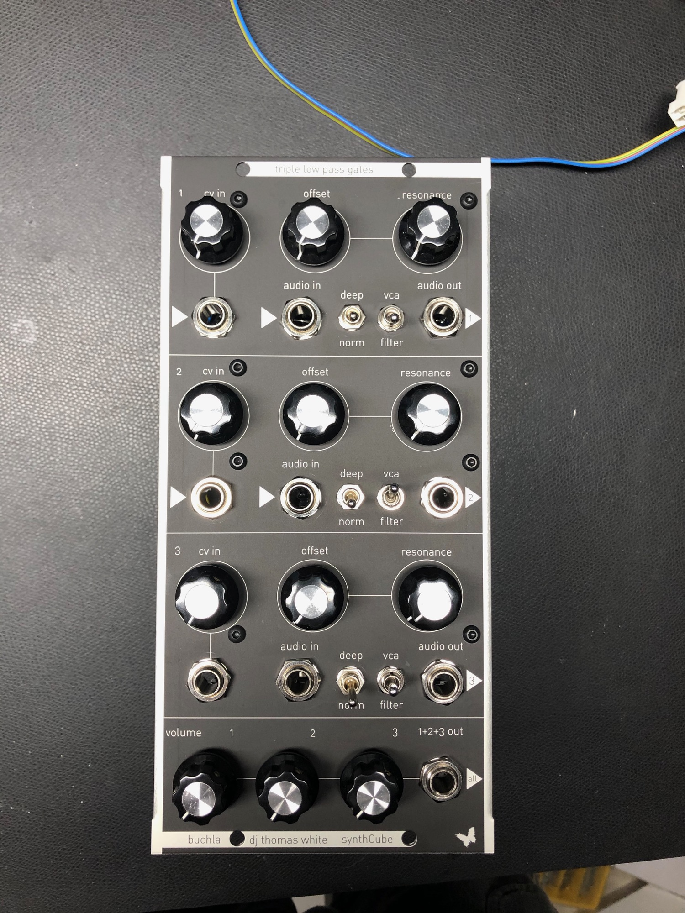

**Panel and PCBs from Synthcube:**

[https://synthcube.com/cart/dj-thomas-white-triple-lo-pass-gates-dotcom-mu-2u?search=lpg&description=true](https://synthcube.com/cart/dj-thomas-white-triple-lo-pass-gates-dotcom-mu-2u?search=lpg&description=true)

**Update 2024:**

to latest 3.4 pcb version (synthcube edition)

[Resonant+Lopass+Gate+Document+Packet.zip](assets/Resonant-Lopass-Gate-Document-Packet.zip)

**Muffwiggler Thread:**

 [https://www.muffwiggler.com/forum/viewtopic.php?f=17&t=48469&sid=da4e4f8cb628b19bacd4dc8c89736e18&start=525](https://www.muffwiggler.com/forum/viewtopic.php?f=17&t=48469&sid=da4e4f8cb628b19bacd4dc8c89736e18&start=525)

[https://www.muffwiggler.com/forum/viewtopic.php?f=24&t=134518&start=50](https://www.muffwiggler.com/forum/viewtopic.php?f=24&t=134518&start=50)

**BOM Switches:**

3x 3P3T Switch: mouser: 612-1003P3T1BM1QEH (was used in prev. build but not available in Germany atm.

**update 2024  switches:**

3x

[https://www.tme.eu/de/details/7101syzqe/kippschalter/c-k/](https://www.tme.eu/de/details/7101syzqe/kippschalter/c-k/)

and 3x

[https://www.tme.eu/de/details/7303syzqe/kippschalter/c-k/](https://www.tme.eu/de/details/7303syzqe/kippschalter/c-k/)

**Important INFO:** the hole of the  Audio Out must be changed (drilling) to the panel border side otherwise the switch and jack are too close and will not fit in a correct alignment.

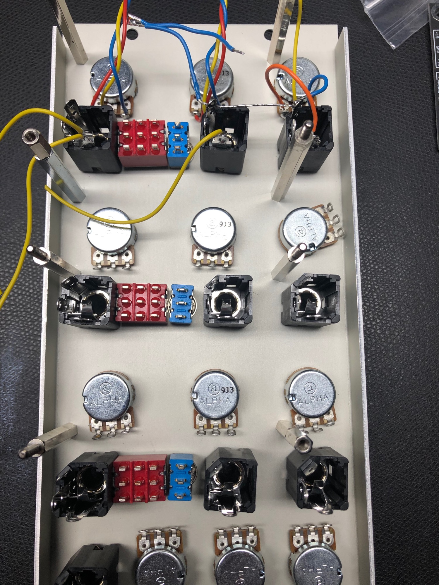

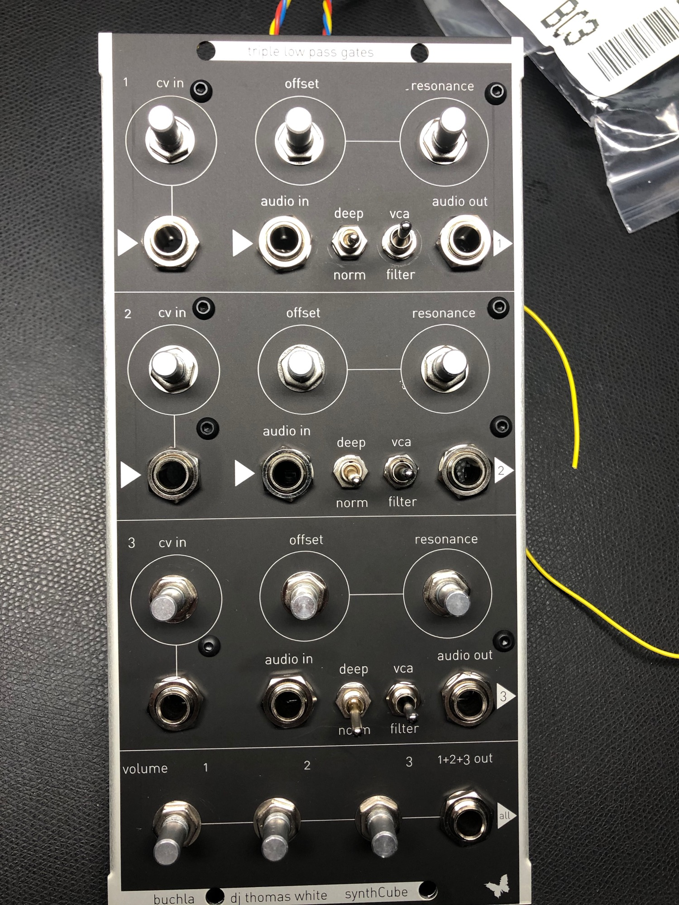

**BOM:**

normally you don't need the TL074 and the resistors around.. look in the schematics - its only for the CV and Audio "Mixer" - which isn't needed here.

[Lopass Gate Parts List.pdf](assets/Lopass-Gate-Parts-List.pdf)

**Wiring:**

the following wiring do not match with the schematics ( I didn't used this wiring !!) please look in the schematic as described 

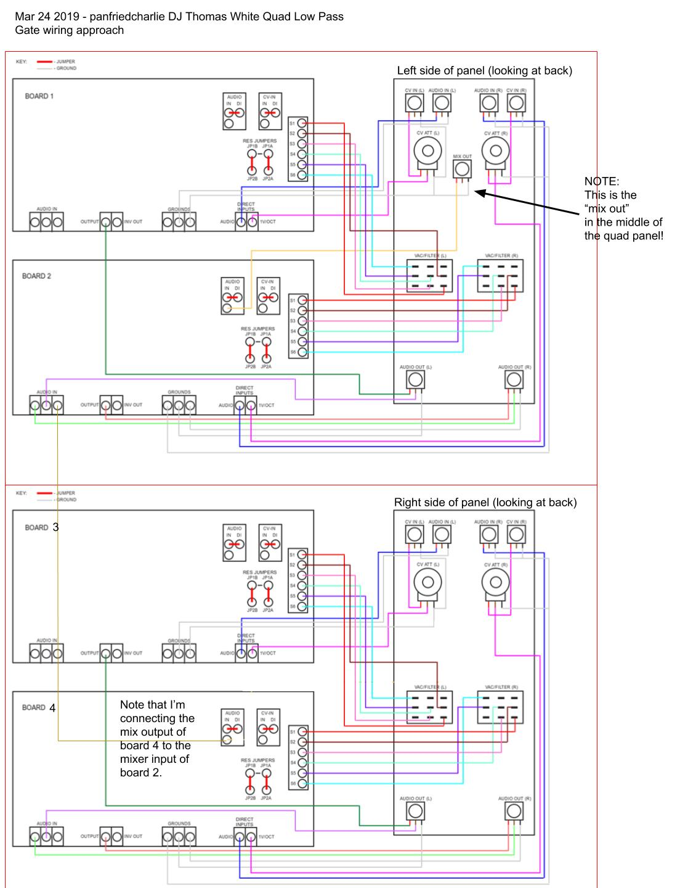

 

**Schematic:**

(the **wiring** was used by me for the Triple LPG - but you must turn the switch 180degrees that it match with the panel silkscreen)

[RLPG 3.2 Schematic Diagram.pdf](assets/RLPG-3.2-Schematic-Diagram.pdf)

**Tip:**

I used 10KA Potentiometers for the bottom mixer, I just connected from each LPG output (output jack) the signal to the bottom mixer poti, an 1K pullup resistor on the wiper

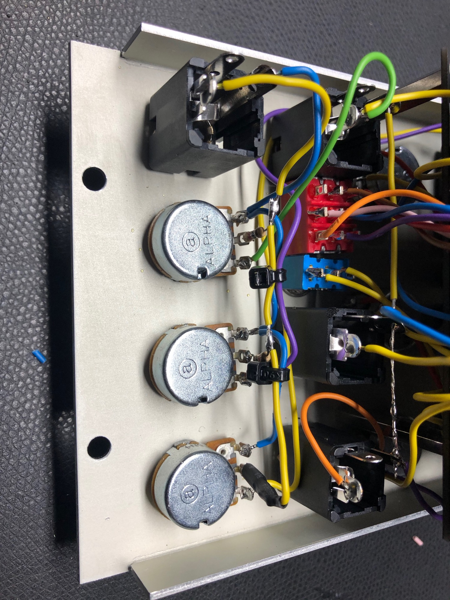

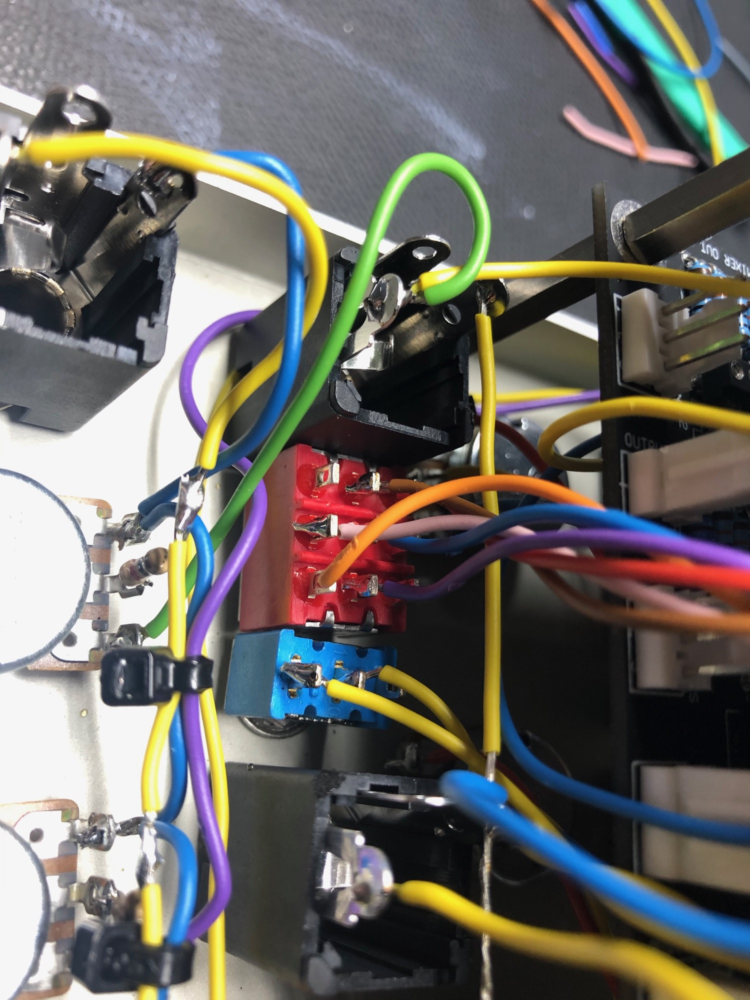

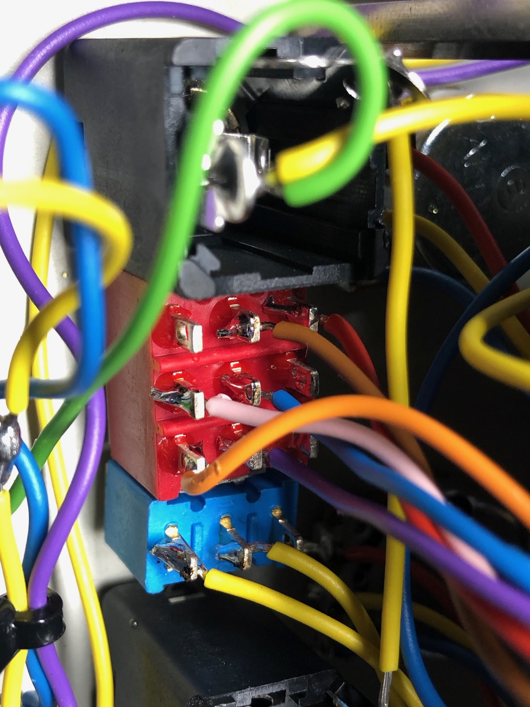

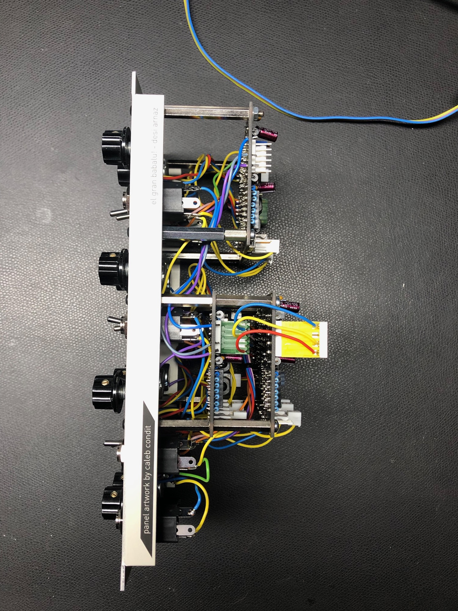

Take care on the Jumpers (routing with or without CV/Audio Mixer)

in my configuration I used  the direct way - without the mixers.

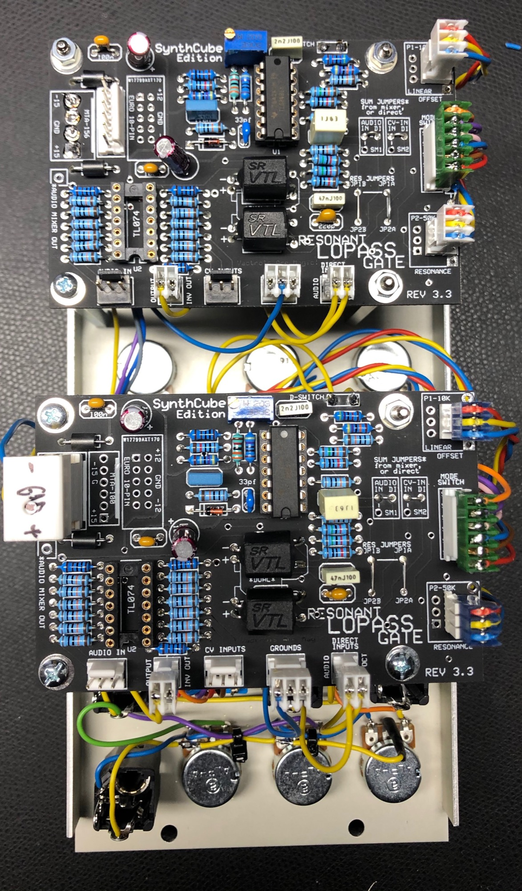

2025 build:

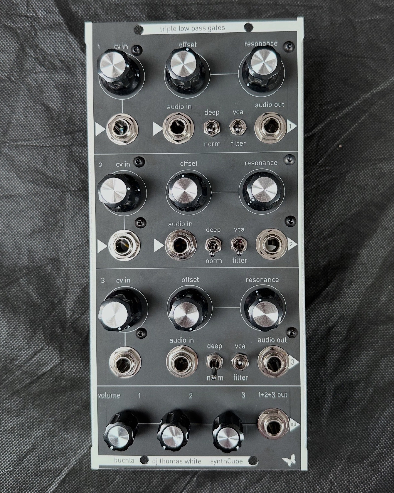

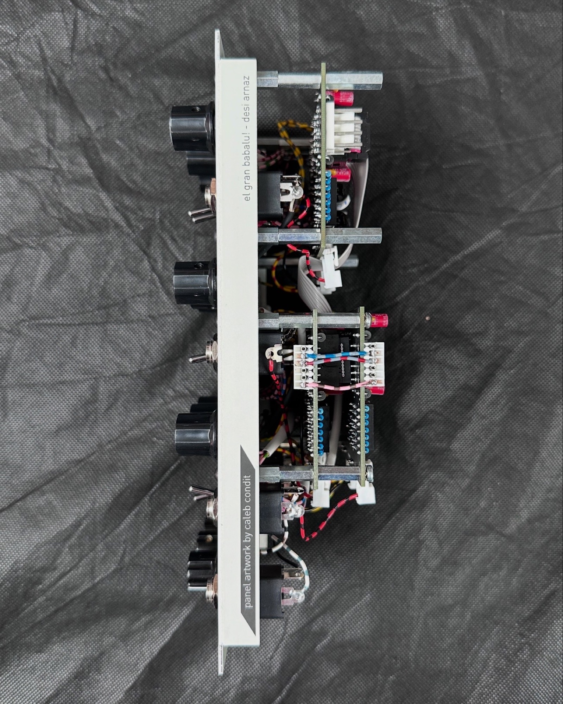

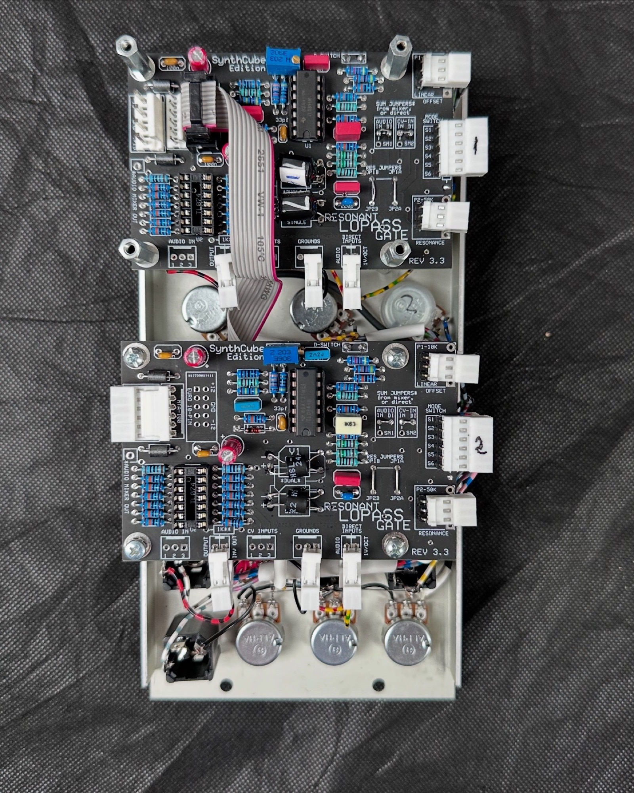
