# VDD 3007 active Splitter & buffered Multiple

> **Project**
>
> ### Projecttitel: VDD 3007
>
> ### Status: `prototyping`
>
> ### Startdate: 01 September 2017
>
> ### Duedate: 15. April 2018
>
> ### Manufacture link: this page

> **contact me if you are interested in a PCB/Panel set or an assembled Module**
>
> **PCB/Panel Set:**
> [https://www.diysynth.de/pcbs-panels/vdd-active-splitter-und-buffered-multiple-pcb-und-panel-kit.html?language=de](https://www.diysynth.de/pcbs-panels/vdd-active-splitter-und-buffered-multiple-pcb-und-panel-kit.html?language=de)

## Here´s our first MOTM DIY Module from VDD, the VDD 3007

An product corporation between Dr. Dipl.Ing Timo VDD and DSL-man.de

VDD is the „Brand“

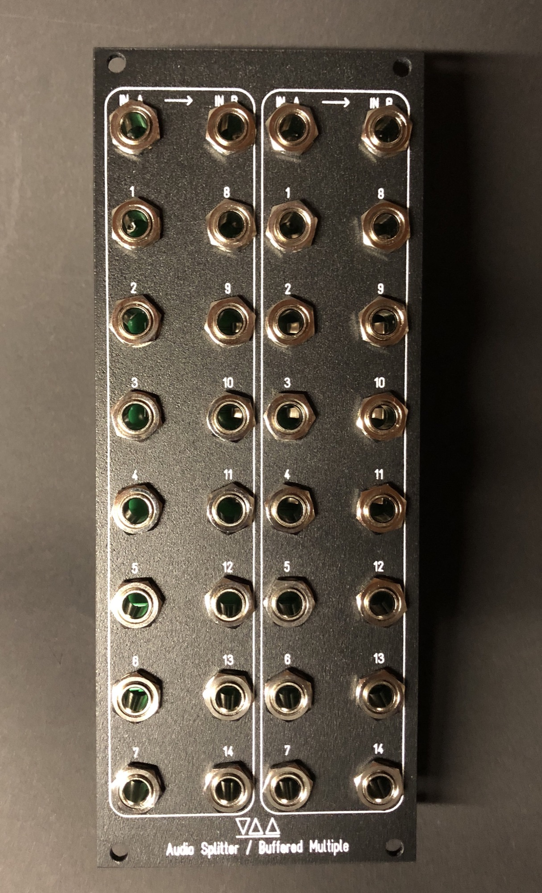

> **Description**
>
> The VDD 3007 contains 2 functions:
>
> **2x 7 Channel buffered Multiple** ( 2 inputs with each 7 outs or one imput with 14 outs)
>
> **2x 7 Channel active Splitter**     ( 2 inputs with each 7 outs or one imput with 14 outs)
>
> 2U MOTM size (88,52mm x 222,25mm)
>
> Easy to build, no wiring !
>
> skiff friendly
>
> ROHS/leadfree
>
> powder coated aluminium panel with silkscreen
>
> MOTM power -15V/15V
>
> Power consumption: max. 90mA per rail

**Buffered Multiple, Use Case desription**

if you have many VCOs and only one V/oct signal, you can´t use a normal multiple otherwise the signal source device output shutdown or you get a faulty 1v/oct signal:

**our Solution is the buffered Multiple**

buffer your CV signals, dont loss your V/oct precision

"route your 1V/oct signal to the Buffered Multiple (IN A ), patch from each output to your VCO 1V/oct input"

**Audio Splitter, Use Case desription**

if you have more than 1 VCF, you can share the Audiosignal from your VCOs and connect it to 7-14 Filter (VCF).

or share your VCF outputs to different mixer, effects

**Buildguide:**

**Schematics:**

**( please respect the copyright, IP - its not allowd to copy our circuit idea as is is or sell assembled devices commercial without our permissions, only DIYSYNTH.de has the permission to sell assembled Modules commercial.)**

- [3007-31 Signal Splitter-Lower Conn Board back.png](assets/3007-31-Signal-Splitter-Lower-Conn-Board-back.png)
- [3007-31 Signal Splitter-Lower Conn Board front.png](assets/3007-31-Signal-Splitter-Lower-Conn-Board-front.png)
- [3007-31 Signal Splitter-parts.png](assets/3007-31-Signal-Splitter-parts.png)
- [3007-31 Signal Splitter-Upper Conn Board back.png](assets/3007-31-Signal-Splitter-Upper-Conn-Board-back.png)
- [3007-31 Signal Splitter-Upper Conn Board front.png](assets/3007-31-Signal-Splitter-Upper-Conn-Board-front.png)
- [image2017-12-4 14:52:19.png](assets/image2017-12-4-14-52-19.png)
- [IMG_6115.jpg](assets/IMG_6115.jpg)
- [F786DCA3-525D-4E7A-92A8-F4B782B98472.jpeg](assets/F786DCA3-525D-4E7A-92A8-F4B782B98472.jpeg)
- [77683354-53F0-4309-B75A-AEB5FE383692.jpeg](assets/77683354-53F0-4309-B75A-AEB5FE383692.jpeg)
- [8FE7700F-0FC4-4A6F-8B97-E49380DB0CF8.jpeg](assets/8FE7700F-0FC4-4A6F-8B97-E49380DB0CF8.jpeg)
- [B823A8EF-8BB6-4131-B7E7-82A1B3A216E8.jpeg](assets/B823A8EF-8BB6-4131-B7E7-82A1B3A216E8.jpeg)
- [2B01B576-49DD-4A40-B7E8-6AB097632218.jpeg](assets/2B01B576-49DD-4A40-B7E8-6AB097632218.jpeg)
- [008B3321-3CC7-49A5-A7C8-2EF3FF92CECC.jpeg](assets/008B3321-3CC7-49A5-A7C8-2EF3FF92CECC.jpeg)
- [IMG_1744.jpeg](assets/IMG_1744.jpeg)
- [IMG_1743.jpeg](assets/IMG_1743.jpeg)
- [IMG_1745.jpeg](assets/IMG_1745.jpeg)

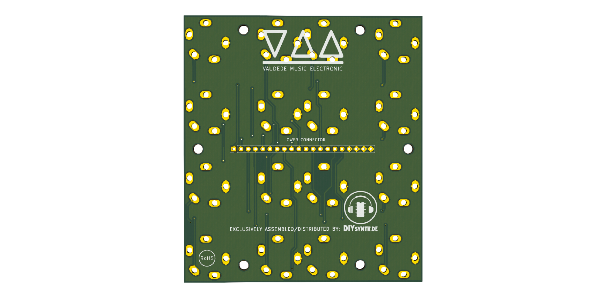

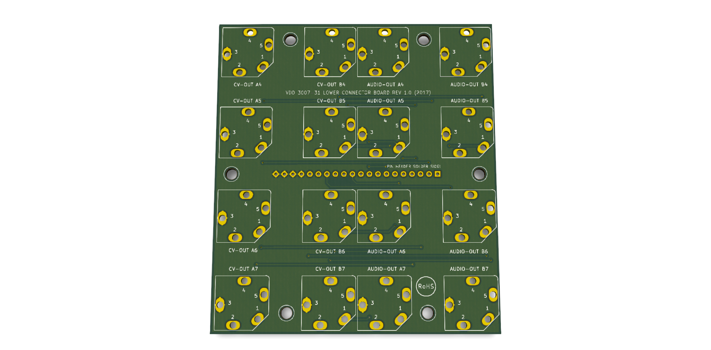

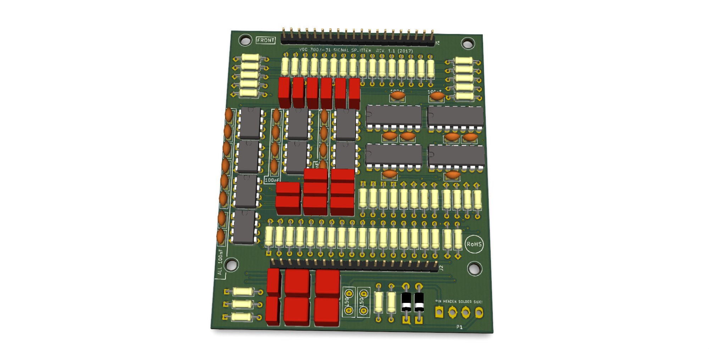

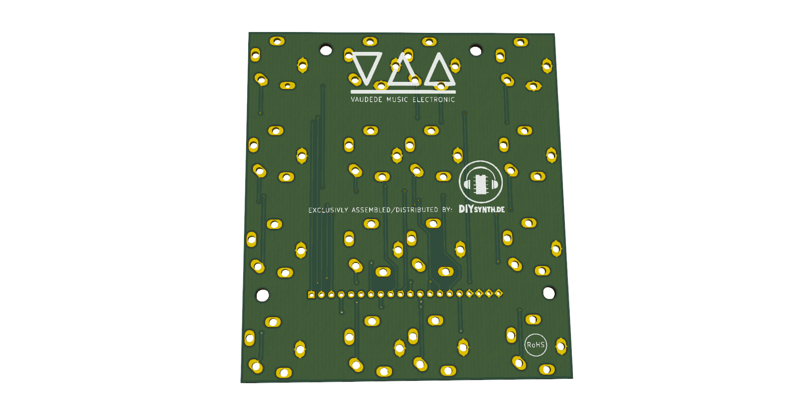

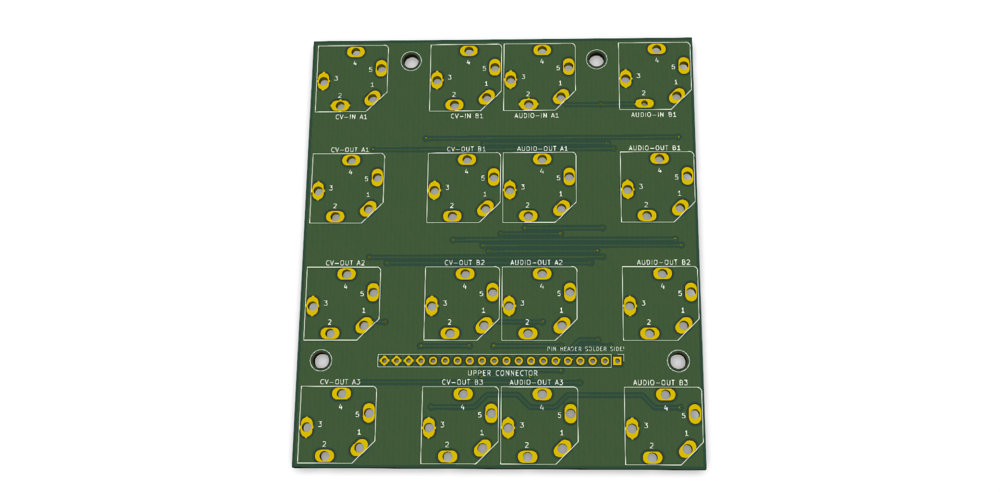

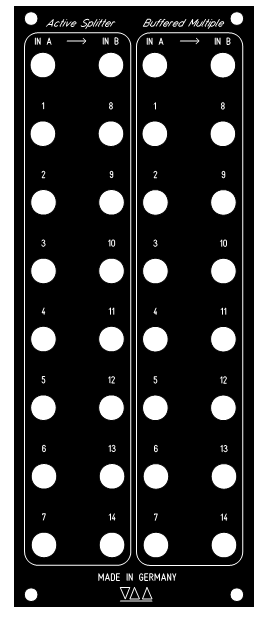

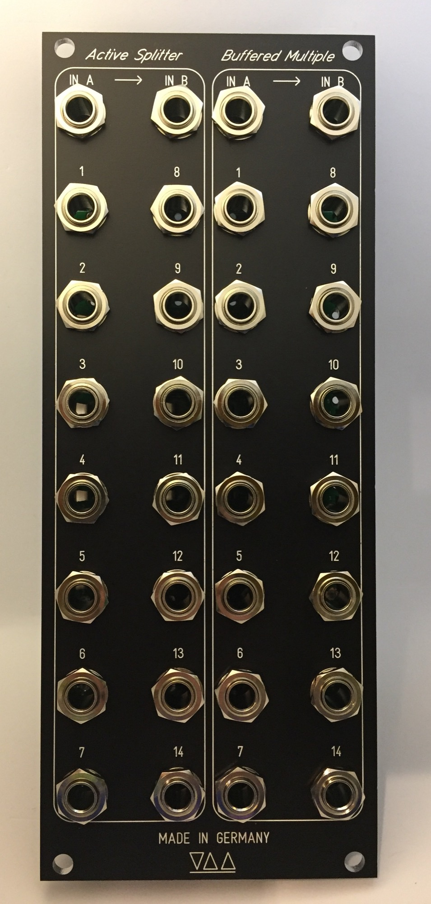

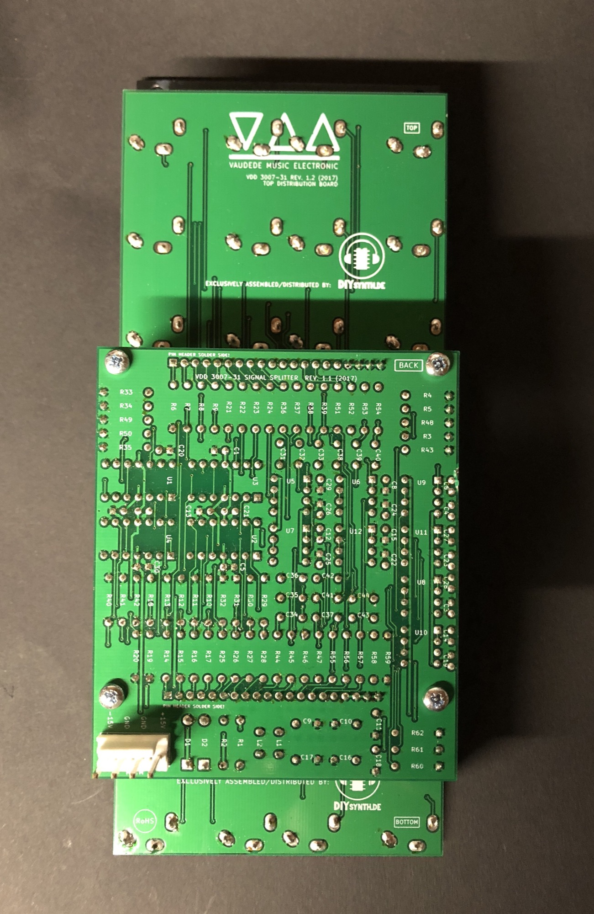

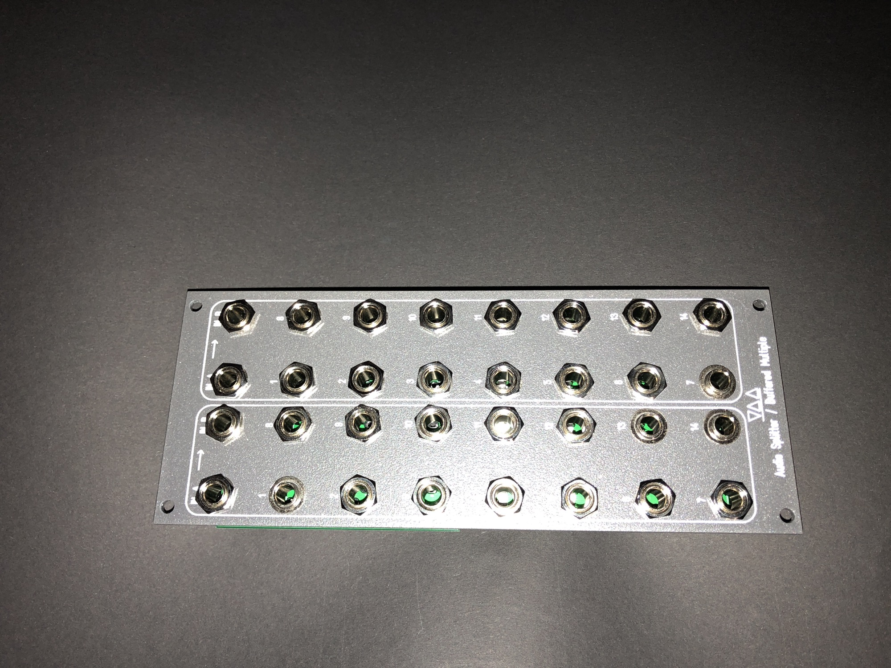

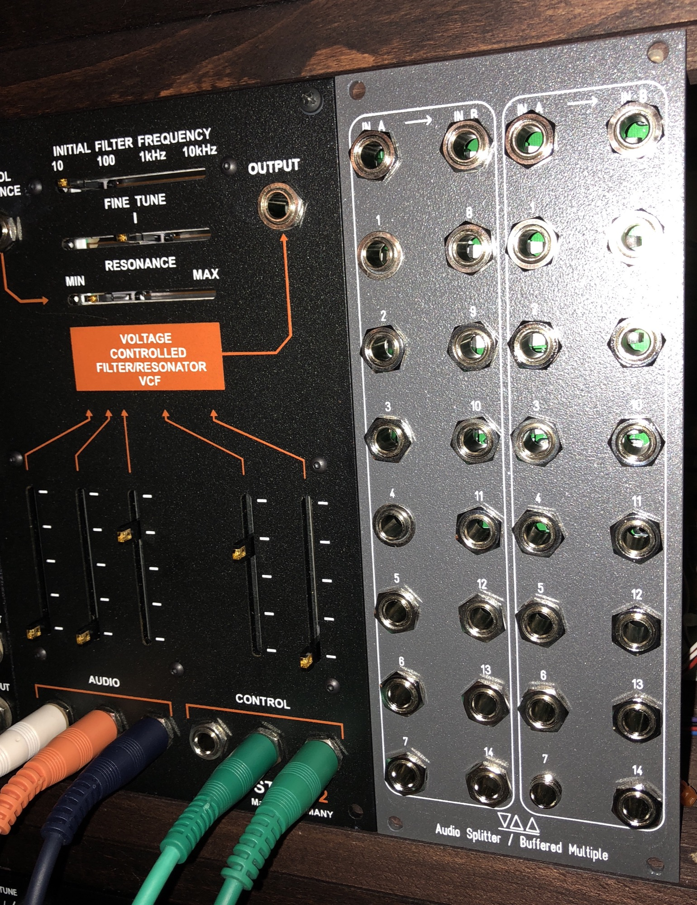

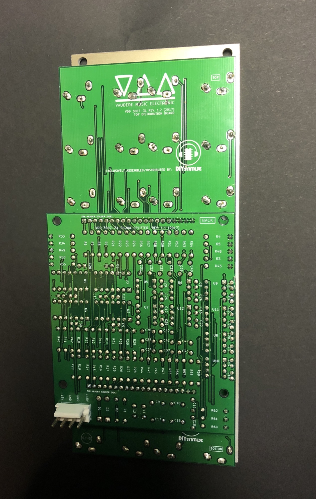

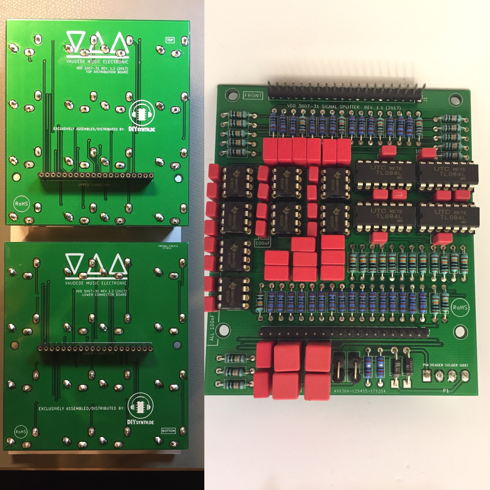

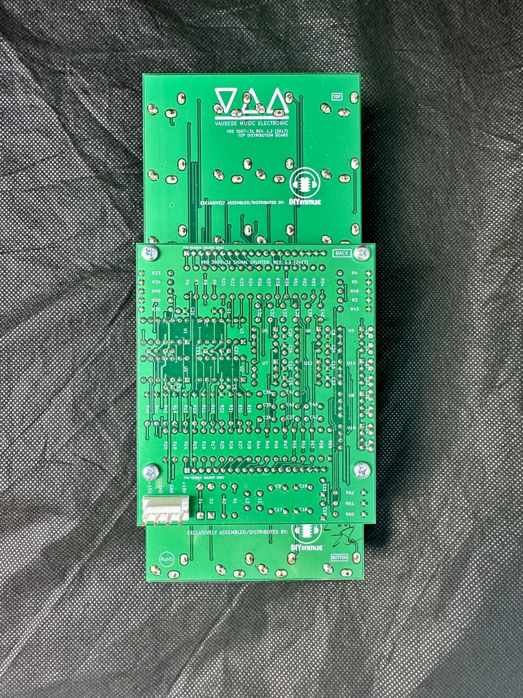

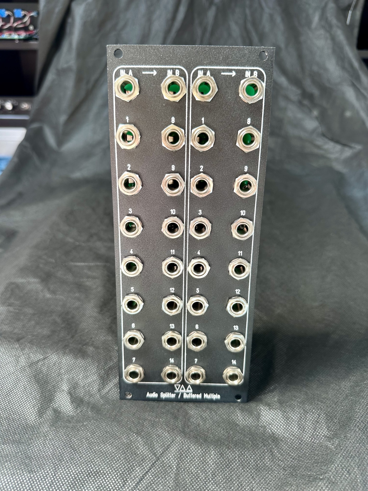

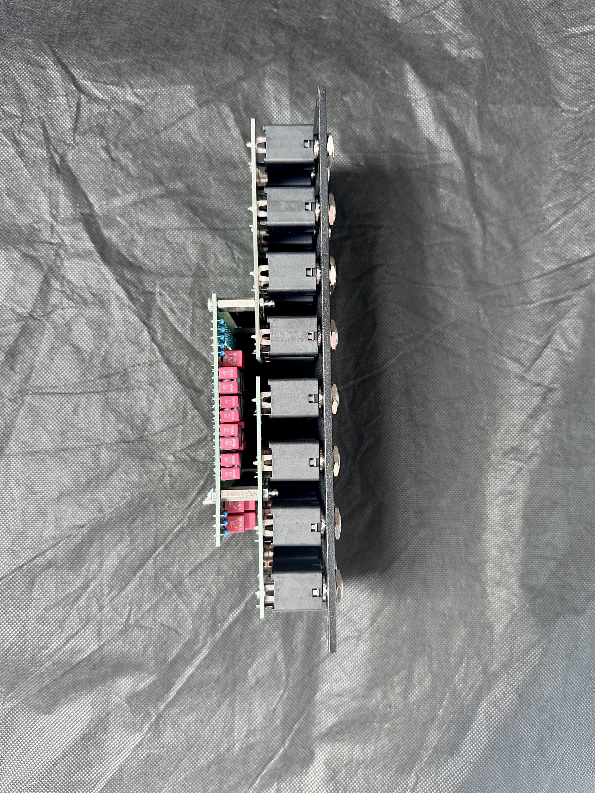

