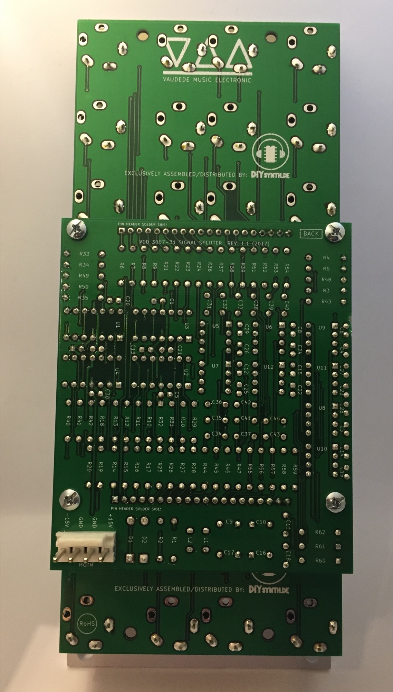
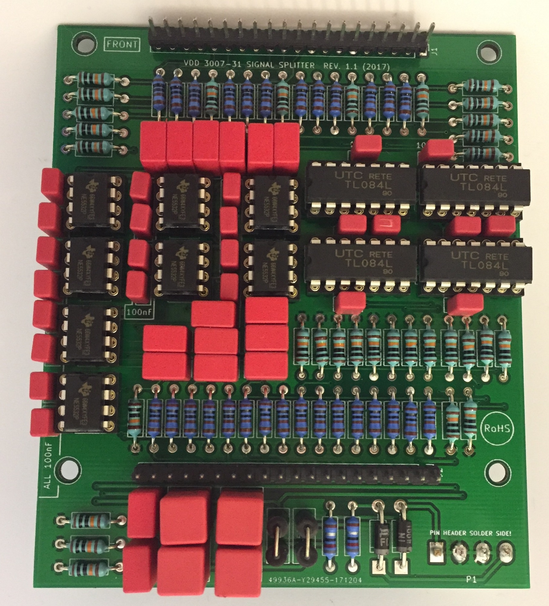
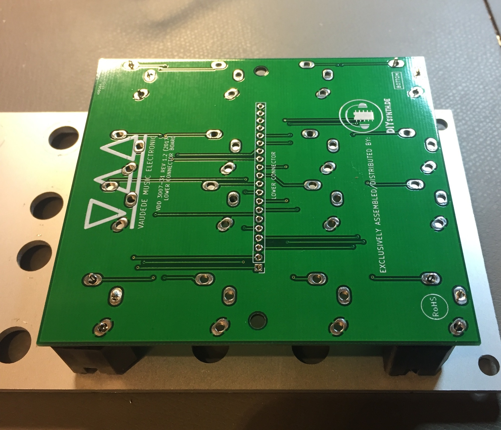

# VDD 3007 Buildguide

**Requirements:**

good Solderstation

Soldercore 0,5mm & 1mm

**BOM: (Bill of Material)**

The PCB Set from DIYsynth.de contains:

1x ucb board (upper control board)

1x lcb board (lower control board)

1x Logicboard

2x Ferrite beads

24x 100nf RM2 polyester capacitors

what you need in total

| Line nr. | part | quantity | price | source |
|---|---|---|---|---|
| 1 | 1uF RM5 | 16 |   |   |
| 2 | 4.7uF | 4 |   |   |
| 3 | 100nF | 24 |   |   |
| 4 | resistor 1K | 28 |   |   |
| 5 | resistor 100k | 32 |   |   |
| 6 | resistor 8.2R | 2 |   |   |
| 7 | Ferrite beads - included in PCB set | 2 |   |   |
| 8 | rectifier 1N4001/2/4/ | 2 |   |   |
| 9 | MOTM MTA156 4pin header | 1 |   |   |
| 10 | IC Socket 8pin round milled | 8 |   |   |
| 11 | IC Socket 14pin round milled | 4 |   |   |
| 12 | TL084 | 4 |   |   |
| 13 | NE5532 | 8 |   |   |
| 14 | jack 3 pin with switch | 4 |   |   |
| 15 | jack 2 pin with or without switch (no switch at the jack needed here but feel free to use the same as above) | 28 |   |   |
| 16 | 20pin header (you need in total 40 pins) | 2 or 4 |   |   |
| 17 | 20pin socket (you need in total 40 pins) | 2 when using 15mm spacer or 4 when using 20mm spacer |   |   |
| 18 | metal spacer (to hold the pcb) 15mm long M3\* or use 20mm spacer | 4 |   |   |
| 19 | nut, washer, screws M3 - that match to the metal spacer | depends on spacer |   |   |
| 20 | solder core 1mm and 0,5mm ROHS preferred |   |   |   |

Steps to your completed device:

**important Info:  the logicboard is mounted with the components thru the ucb and lcb boards  - like this:**

please read the guide before you start the build to understand my preferred guide, its possible to assemble the module in other ways too !

Logicboard

1. start with the assembly of the Logicboard, don't attach both long headers !
2. begin with the resistors you can solder from component side and turn the pcb - solder from solderside too.
3. place and solder the rectifiers and ferrite beads
4. place and solder the IC sockets (dont fit the ICs)
5. place and solder the capacitors
6. place the Power header (4pin MTA156) from solderside as shown here:

ucb & lcb PCB

> **Achtung**
>
> make sure you use 3 pole (switched mono jacks) for the 4 top jacks ( IN A IN B , IN A IN B)

1. prepare the long headers: the distance between the controlbaord and logicboard must be 14-15mm, the big WIMA 4.7uF caps
  the pinheaders are 7-8mm high, connect 2 together.
  mount the male and female header together
2. the boards have a silkscreen layout for the 6,3mm jack - this is the component side !
3. mount on the frontpanel  with 4 jacks in each corner on one pcb, solder one pin on each jack, thats needed to have enough space to solder the pin headers  **like this:**

        4. attach the 4x 15mm spacers to the ucb and lcb

5. connect the male or female header to the ucb and lcb board

6. attach the logicboard on the headers

7. use screws or nuts (depends on orientation) on the 15mm spacers to get the pcbs in a stable and correct orientation

8. solder the logicboard headers

9. you only have 4 jacks on each pcb because we need the space to solder the haders directly between the frontpanel and ucb/lcb !

solder few pins on left, middle, rightside.

now you can remove the frontpanel and solder the other pins.

10. remove the logicboard, remove the ucb and lcb from frontpanel.

11. UCB:  place the other jacks and move carefully the frontpanel from top on the ucb, attach the washer and nuts to the 4 soldered jacks

12. LCB same as 11.

next steps depends on your personal DIY experience

13. attach the logicboard to the ucb and lcb, test with a rectifier for shorts between -15v/GND/15V and measure under voltage at the IC sockets the voltage

14. if 13. is ok  - add all ICS and test the module

**testing process Active Splitter**

Connect a Audiosignal to the Active Splitter IN A

this signal can be found now on left Out row and second Out row.

connect a audiosignal to the active splitter IN B

this signal can be found now second Out row.

**testing process buffered multiple:**

Connect a CV signal to the Buffered multiple IN A

this signal can be found now on left Out row and second Out row.

connect a CV signal to the Buffered multiple IN B

this signal can be found now second Out row.
