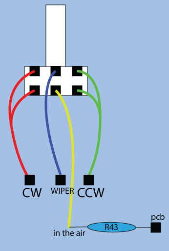
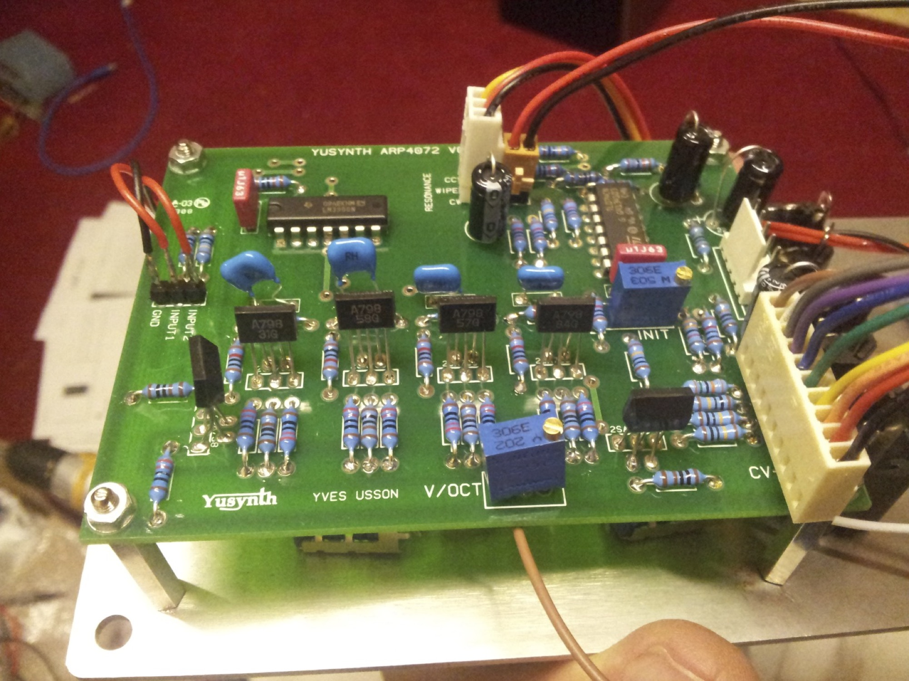
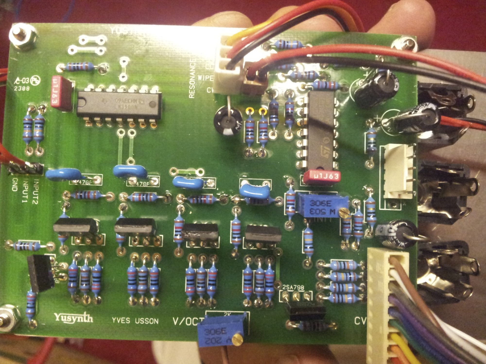
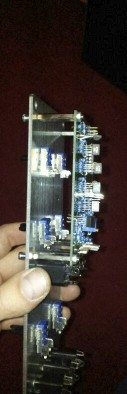
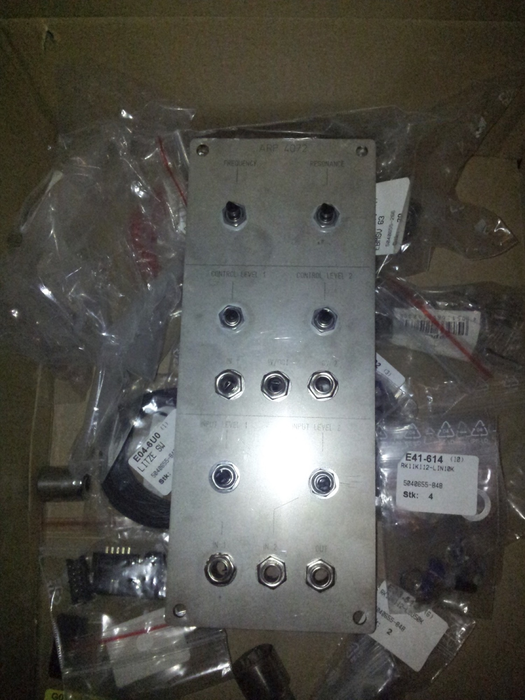
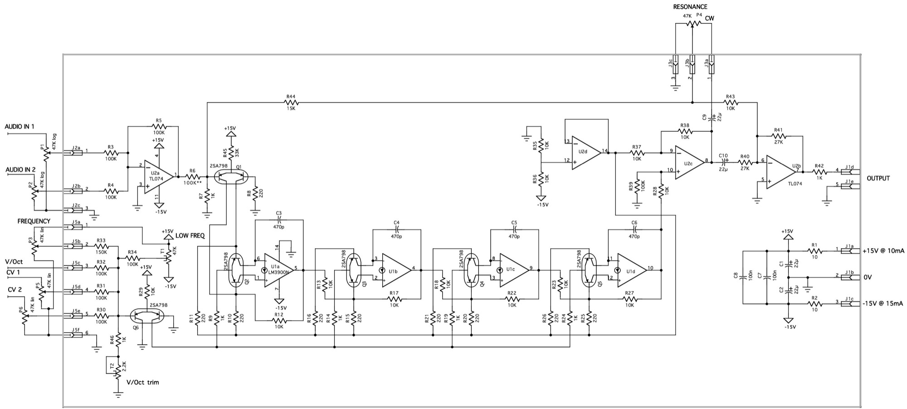
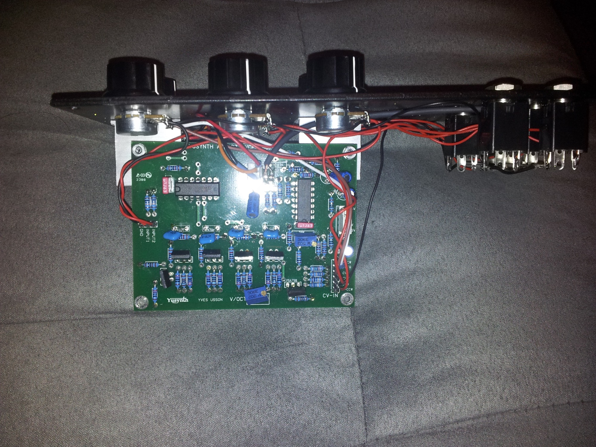
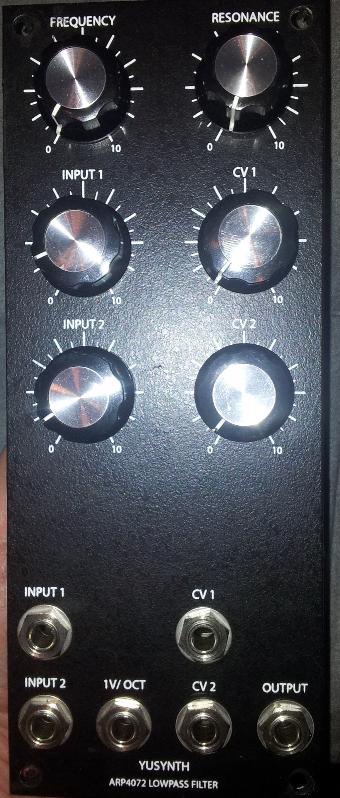
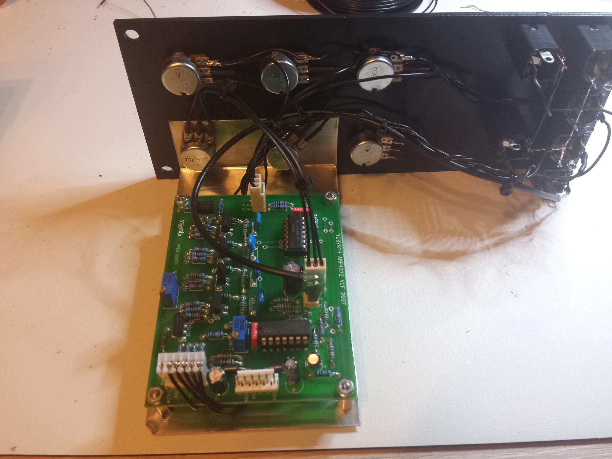
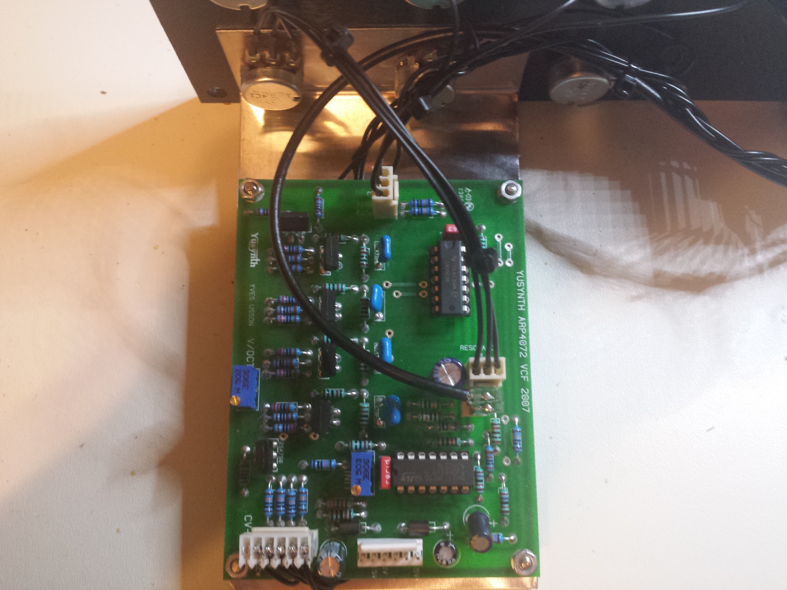

# Yusynth ARP 4072

> **Project**
>
> ### Projecttitel: Yusynth Arp4072 Filter
>
> ### Status: `finished`
>
> ### Startdate: 2010
>
> ### Duedate: 2010
>
> **update Q4/2014**
>
> ### Manufacture link: [http://yusynth.net/Modular/EN/ARPVCF/index.html](http://yusynth.net/Modular/EN/ARPVCF/index.html)

**It was my first DIY Build - so sorry for the building quality 😉**

**added a second DIY project 2014 with better quality..**

Attention: for bridechamber pcb (SA798) version,  the output is wrong.    correct:GND to TIP,  Signal to GND

**BOM parts..**

4  x 47k Linear Poti für others (freq, Resonance etc)      banzai [Alpha 16mm FS 50k lin](http://www.banzaimusic.com/Alpha-16mm-FS-50k-lin.html)

2 x 47k Log Poti für Input Level  banzai [Alpha 16mm FS 50k log](http://www.banzaimusic.com/Alpha-16mm-FS-50k-log.html)

6  x knobs

6 x female 6,3mm mono (switchcraft 112AX or equal.)

pinheaders/connectors or hard wire linking to frontpanel

|   |   |   |
|---|---|---|
| **Building details** |   |   |
| **Japanese dual transistors version** |   |   |
| \|   \|   \|   \| \|---\|---\|---\| \| **reference** \| **value** \| **quantity** \| \| U1 \| LM3900N \| 1 \| \| U2 \| TL074 \| 1 \| \| Q1 to Q6 or Q1 to Q12 \| 2SA798 either 2N3906 or BC557 matched by pairs (caution the pin out is different, see layouts above) \| 6 or 12 \| \| R1,R2 \| 10 ohms 5% - **or 2x ferrite (better)** \| 2 \| \| R8,R10\*,R11\*,R15\*,R16\*,R20\*,R21\*,R25\*,R26\* \| 220 ohms \* matched to 1% 5% otherwise \| 9 \| \| R7,R9\*,R14\*,R19\*,R24\*,R42,R46 \| 1k \* matched to 1% 5% otherwise \| 7 \| \| R12\*,R13\*,R17\*,R18\*,R22\*,R23\*,R27\*,R28\*, R29,R35,R36,R37,R38,R43 \| 10k \* matched to 1% 5% otherwise \| 14 \| \| R44 \| 15k 5% \| 1 \| \| R40,R41 \| 27k 5% \| 2 \| \| R45 \| 33k 5% \| 1 \| \| R3,R4,R5,R6,R30,R31,R32,R34,R39 \| 100k 5% \| 9 \| \| R33 \| 150k \| 1 \| \| C3,C4,C5,C6 \| 470p matched to 1% ( i use Glimmercaps they have 2%) \| 4 \| \| C7,C8 \| 100n \| 2 \| \| C1,C2,C9,C10 \| 22µF 35V \| 4 \| \| T2 \| 2k2 10 turns trimmer****3296w series for bridechamber pcb, otherwise Y**** \| 1 \| \| T1 \| 47k 10 turns trimmer  **3296w series for bridechamber pcb, otherwise Y** \| 1 \| \| P1,P2 \| 47k log potentiometer \| 2 \| \| P13,P4,P5,P6 (see latest entry) \| 47k lin potentiomter \| 4 \| \| Jk1,Jk2,Jk3,Jk4,Jk5,Jk6 \| female jack sockets \| 6 \| \| DUAL GANG POT for Resonance (bleed thru fix) \| dual 47K linear \| 1 \| |   |   |
| **reference** | **value** | **quantity** |
| U1 | LM3900N | 1 |
| U2 | TL074 | 1 |
| Q1 to Q6 or Q1 to Q12 | 2SA798 either 2N3906 or BC557 matched by pairs (caution the pin out is different, see layouts above) | 6 or 12 |
| R1,R2 | 10 ohms 5% - **or 2x ferrite (better)** | 2 |
| R8,R10\*,R11\*,R15\*,R16\*,R20\*,R21\*,R25\*,R26\* | 220 ohms \* matched to 1% 5% otherwise | 9 |
| R7,R9\*,R14\*,R19\*,R24\*,R42,R46 | 1k \* matched to 1% 5% otherwise | 7 |
| R12\*,R13\*,R17\*,R18\*,R22\*,R23\*,R27\*,R28\*, R29,R35,R36,R37,R38,R43 | 10k \* matched to 1% 5% otherwise | 14 |
| R44 | 15k 5% | 1 |
| R40,R41 | 27k 5% | 2 |
| R45 | 33k 5% | 1 |
| R3,R4,R5,R6,R30,R31,R32,R34,R39 | 100k 5% | 9 |
| R33 | 150k | 1 |
| C3,C4,C5,C6 | 470p matched to 1% ( i use Glimmercaps they have 2%) | 4 |
| C7,C8 | 100n | 2 |
| C1,C2,C9,C10 | 22µF 35V | 4 |
| T2 | 2k2 10 turns trimmer****3296w series for bridechamber pcb, otherwise Y**** | 1 |
| T1 | 47k 10 turns trimmer  **3296w series for bridechamber pcb, otherwise Y** | 1 |
| P1,P2 | 47k log potentiometer | 2 |
| P13,P4,P5,P6 (see latest entry) | 47k lin potentiomter | 4 |
| Jk1,Jk2,Jk3,Jk4,Jk5,Jk6 | female jack sockets | 6 |
| DUAL GANG POT for Resonance (bleed thru fix) | dual 47K linear | 1 |

**2k2 trimmer**

#### Reichelt Parts ohne Frontplatten poti etc:

|   |   |   |
|---|---|---|
| [LM 3900 DIL](http://www.reichelt.de/ICs-LM-LS-/LM-3900-DIL/index.html?;ACTION=3;LA=5;GROUP=A215;GROUPID=2912;ARTICLE=10500;START=0;SORT=user;OFFSET=500;SID=11TuBx8X8AAAIAABZkED8e8ba790c07a4a853c3817223cf660bd3) | [Amplifier, DIL-14](http://www.reichelt.de/ICs-LM-LS-/LM-3900-DIL/index.html?;ACTION=3;LA=5;GROUP=A215;GROUPID=2912;ARTICLE=10500;START=0;SORT=user;OFFSET=500;SID=11TuBx8X8AAAIAABZkED8e8ba790c07a4a853c3817223cf660bd3) |   |
| [TL 074 DIL](http://www.reichelt.de/ICs-TDA-9105-TSA-5512/TL-074-DIL/index.html?;ACTION=3;LA=5;GROUP=A21D;GROUPID=2920;ARTICLE=21557;START=0;SORT=user;OFFSET=500;SID=11TuBx8X8AAAIAABZkED8e8ba790c07a4a853c3817223cf660bd3) | [Op-Amp, DIL-14](http://www.reichelt.de/ICs-TDA-9105-TSA-5512/TL-074-DIL/index.html?;ACTION=3;LA=5;GROUP=A21D;GROUPID=2920;ARTICLE=21557;START=0;SORT=user;OFFSET=500;SID=11TuBx8X8AAAIAABZkED8e8ba790c07a4a853c3817223cf660bd3) |   |
| [TL 072 DIP](http://www.reichelt.de/ICs-TDA-9105-TSA-5512/TL-072-DIP/index.html?;ACTION=3;LA=5;GROUP=A21D;GROUPID=2920;ARTICLE=21556;START=0;SORT=user;OFFSET=500;SID=11TuBx8X8AAAIAABZkED8e8ba790c07a4a853c3817223cf660bd3) | [Op-Amp, DIP-8](http://www.reichelt.de/ICs-TDA-9105-TSA-5512/TL-072-DIP/index.html?;ACTION=3;LA=5;GROUP=A21D;GROUPID=2920;ARTICLE=21556;START=0;SORT=user;OFFSET=500;SID=11TuBx8X8AAAIAABZkED8e8ba790c07a4a853c3817223cf660bd3) |   |
| [METALL 220](http://www.reichelt.de/1-4W-1-100-Ohm-976-Ohm/METALL-220/index.html?;ACTION=3;LA=5;GROUP=B1213;GROUPID=3077;ARTICLE=11627;START=0;SORT=user;OFFSET=500;SID=11TuBx8X8AAAIAABZkED8e8ba790c07a4a853c3817223cf660bd3) | [Metallschichtwiderstand 220 Ohm](http://www.reichelt.de/1-4W-1-100-Ohm-976-Ohm/METALL-220/index.html?;ACTION=3;LA=5;GROUP=B1213;GROUPID=3077;ARTICLE=11627;START=0;SORT=user;OFFSET=500;SID=11TuBx8X8AAAIAABZkED8e8ba790c07a4a853c3817223cf660bd3) |   |
| [METALL 1,00K](http://www.reichelt.de/1-4W-1-1-00-k-Ohm-9-76-k-Ohm/METALL-1-00K/index.html?;ACTION=3;LA=5;GROUP=B1214;GROUPID=3078;ARTICLE=11403;START=0;SORT=user;OFFSET=500;SID=11TuBx8X8AAAIAABZkED8e8ba790c07a4a853c3817223cf660bd3) | [Metallschichtwiderstand 1,00 K-Ohm](http://www.reichelt.de/1-4W-1-1-00-k-Ohm-9-76-k-Ohm/METALL-1-00K/index.html?;ACTION=3;LA=5;GROUP=B1214;GROUPID=3078;ARTICLE=11403;START=0;SORT=user;OFFSET=500;SID=11TuBx8X8AAAIAABZkED8e8ba790c07a4a853c3817223cf660bd3) |   |
| [METALL 10,0K](http://www.reichelt.de/1-4W-1-10-0-k-Ohm-95-3-k-Ohm/METALL-10-0K/index.html?;ACTION=3;LA=5;GROUP=B1215;GROUPID=3079;ARTICLE=11449;START=0;SORT=user;OFFSET=500;SID=11TuBx8X8AAAIAABZkED8e8ba790c07a4a853c3817223cf660bd3) | [Metallschichtwiderstand 10,0 K-Ohm](http://www.reichelt.de/1-4W-1-10-0-k-Ohm-95-3-k-Ohm/METALL-10-0K/index.html?;ACTION=3;LA=5;GROUP=B1215;GROUPID=3079;ARTICLE=11449;START=0;SORT=user;OFFSET=500;SID=11TuBx8X8AAAIAABZkED8e8ba790c07a4a853c3817223cf660bd3) |   |
| [METALL 15,0K](http://www.reichelt.de/1-4W-1-10-0-k-Ohm-95-3-k-Ohm/METALL-15-0K/index.html?;ACTION=3;LA=5;GROUP=B1215;GROUPID=3079;ARTICLE=11522;START=0;SORT=user;OFFSET=500;SID=11TuBx8X8AAAIAABZkED8e8ba790c07a4a853c3817223cf660bd3) | [Metallschichtwiderstand 15,0 K-Ohm](http://www.reichelt.de/1-4W-1-10-0-k-Ohm-95-3-k-Ohm/METALL-15-0K/index.html?;ACTION=3;LA=5;GROUP=B1215;GROUPID=3079;ARTICLE=11522;START=0;SORT=user;OFFSET=500;SID=11TuBx8X8AAAIAABZkED8e8ba790c07a4a853c3817223cf660bd3) |   |
| [METALL 27,0K](http://www.reichelt.de/1-4W-1-10-0-k-Ohm-95-3-k-Ohm/METALL-27-0K/index.html?;ACTION=3;LA=5;GROUP=B1215;GROUPID=3079;ARTICLE=11666;START=0;SORT=user;OFFSET=500;SID=11TuBx8X8AAAIAABZkED8e8ba790c07a4a853c3817223cf660bd3) | [Metallschichtwiderstand 27,0 K-Ohm](http://www.reichelt.de/1-4W-1-10-0-k-Ohm-95-3-k-Ohm/METALL-27-0K/index.html?;ACTION=3;LA=5;GROUP=B1215;GROUPID=3079;ARTICLE=11666;START=0;SORT=user;OFFSET=500;SID=11TuBx8X8AAAIAABZkED8e8ba790c07a4a853c3817223cf660bd3) |   |
| [METALL 33,0K](http://www.reichelt.de/1-4W-1-10-0-k-Ohm-95-3-k-Ohm/METALL-33-0K/index.html?;ACTION=3;LA=5;GROUP=B1215;GROUPID=3079;ARTICLE=11730;START=0;SORT=user;OFFSET=500;SID=11TuBx8X8AAAIAABZkED8e8ba790c07a4a853c3817223cf660bd3) | [Metallschichtwiderstand 33,0 K-Ohm](http://www.reichelt.de/1-4W-1-10-0-k-Ohm-95-3-k-Ohm/METALL-33-0K/index.html?;ACTION=3;LA=5;GROUP=B1215;GROUPID=3079;ARTICLE=11730;START=0;SORT=user;OFFSET=500;SID=11TuBx8X8AAAIAABZkED8e8ba790c07a4a853c3817223cf660bd3) |   |
| [METALL 100K](http://www.reichelt.de/1-4W-1-100-k-Ohm-976-k-Ohm/METALL-100K/index.html?;ACTION=3;LA=5;GROUP=B1216;GROUPID=3080;ARTICLE=11458;START=0;SORT=user;OFFSET=500;SID=11TuBx8X8AAAIAABZkED8e8ba790c07a4a853c3817223cf660bd3) | [Metallschichtwiderstand 100 K-Ohm](http://www.reichelt.de/1-4W-1-100-k-Ohm-976-k-Ohm/METALL-100K/index.html?;ACTION=3;LA=5;GROUP=B1216;GROUPID=3080;ARTICLE=11458;START=0;SORT=user;OFFSET=500;SID=11TuBx8X8AAAIAABZkED8e8ba790c07a4a853c3817223cf660bd3) |   |
| [METALL 150K](http://www.reichelt.de/1-4W-1-100-k-Ohm-976-k-Ohm/METALL-150K/index.html?;ACTION=3;LA=5;GROUP=B1216;GROUPID=3080;ARTICLE=11528;START=0;SORT=user;OFFSET=500;SID=11TuBx8X8AAAIAABZkED8e8ba790c07a4a853c3817223cf660bd3) | [Metallschichtwiderstand 150 K-Ohm](http://www.reichelt.de/1-4W-1-100-k-Ohm-976-k-Ohm/METALL-150K/index.html?;ACTION=3;LA=5;GROUP=B1216;GROUPID=3080;ARTICLE=11528;START=0;SORT=user;OFFSET=500;SID=11TuBx8X8AAAIAABZkED8e8ba790c07a4a853c3817223cf660bd3) |   |
| [http://www.reichelt.de/Scheiben/KERKO-470P/index.html?;ACTION=3;LA=5;GROUP=B353;GROUPID=3169;ARTICLE=9295;START=0;SORT=user;OFFSET=500;SID=11TuBx8X8AAAIAABZkED8e8ba790c07a4a853c3817223cf660bd3](http://www.reichelt.de/Scheiben/KERKO-470P/index.html?;ACTION=3;LA=5;GROUP=B353;GROUPID=3169;ARTICLE=9295;START=0;SORT=user;OFFSET=500;SID=11TuBx8X8AAAIAABZkED8e8ba790c07a4a853c3817223cf660bd3)470p Glimmer | [http://www.reichelt.de/CY-22-3-470P/3/index.html?&ACTION=3&LA=446&ARTICLE=42437&artnr=CY+22-3+470P&SEARCH=470p](http://www.reichelt.de/CY-22-3-470P/3/index.html?&ACTION=3&LA=446&ARTICLE=42437&artnr=CY+22-3+470P&SEARCH=470p) |   |
| 100N poly or c0g | C0G or polyester |   |
| 22uF electrolyt cap | elekrolyt kondensator |   |
| 64Y-50K | [http://www.reichelt.de/64Y-50K/3/index.html?&ACTION=3&LA=446&ARTICLE=2727&artnr=64Y-50K&SEARCH=64Y-50K](http://www.reichelt.de/64Y-50K/3/index.html?&ACTION=3&LA=446&ARTICLE=2727&artnr=64Y-50K&SEARCH=64Y-50K) for bridechamber pcb use 64W-50K |   |
| 64Y-2K | [http://www.reichelt.de/64Y-50K/3/index.html?ACTION=3;ARTICLE=2717;SEARCH=64Y-2,0K](http://www.reichelt.de/64Y-50K/3/index.html?ACTION=3;ARTICLE=2717;SEARCH=64Y-2,0K) for bridechamber pcb use 64W-2,0K [http://www.reichelt.de/index.html?ACTION=3;ARTICLE=2700;SEARCH=64W-2,0K](http://www.reichelt.de/index.html?ACTION=3;ARTICLE=2700;SEARCH=64W-2,0K) |   |
| 2x Ferrite instead of 2x 10R |   |   |

**Bleed through FIX** (high esonance and tracking is better too)

 this means unsolder the left leg of R43, solder a wire this leg and connect this wire to the wiper lug of the second potentiometer of the dual-gang pot.

**Schematic from Yusynth**

