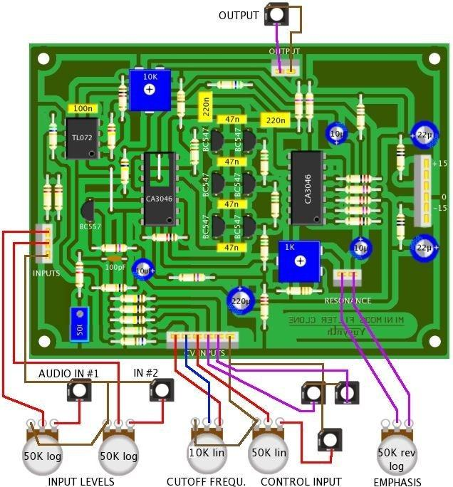
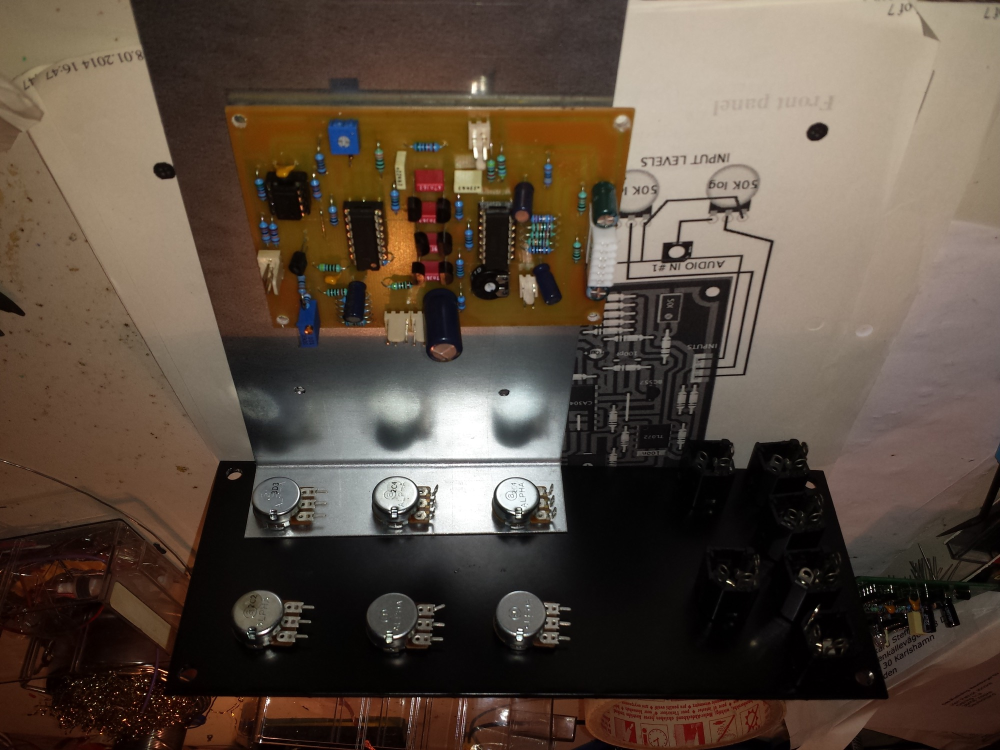
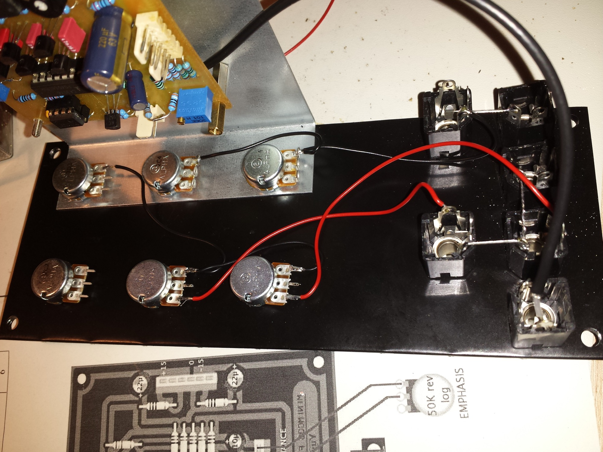
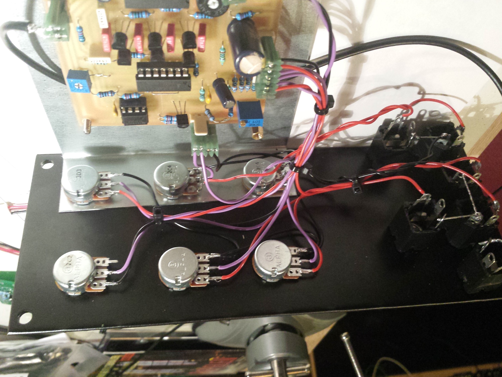
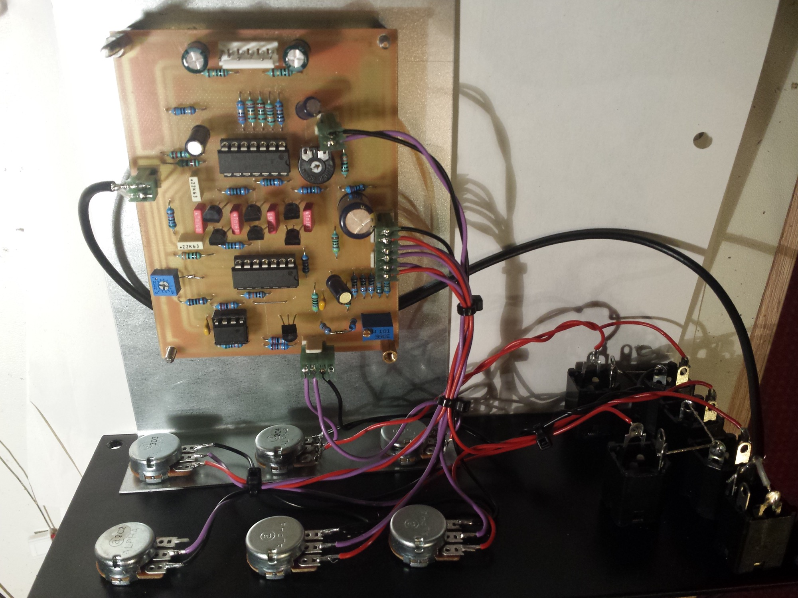
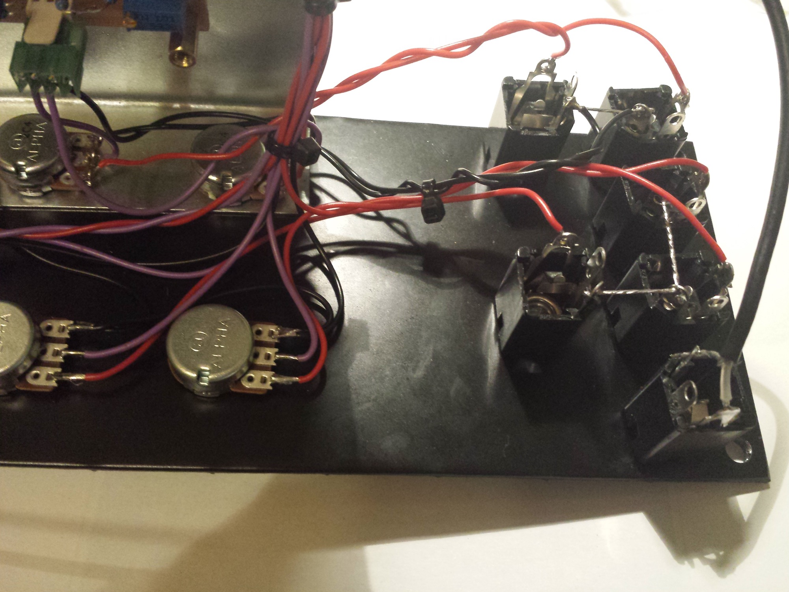
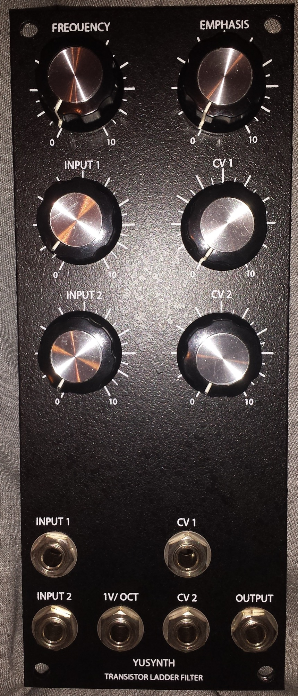
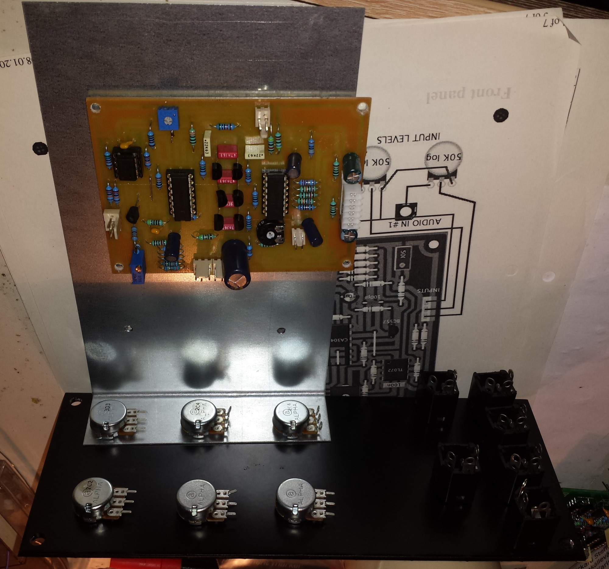
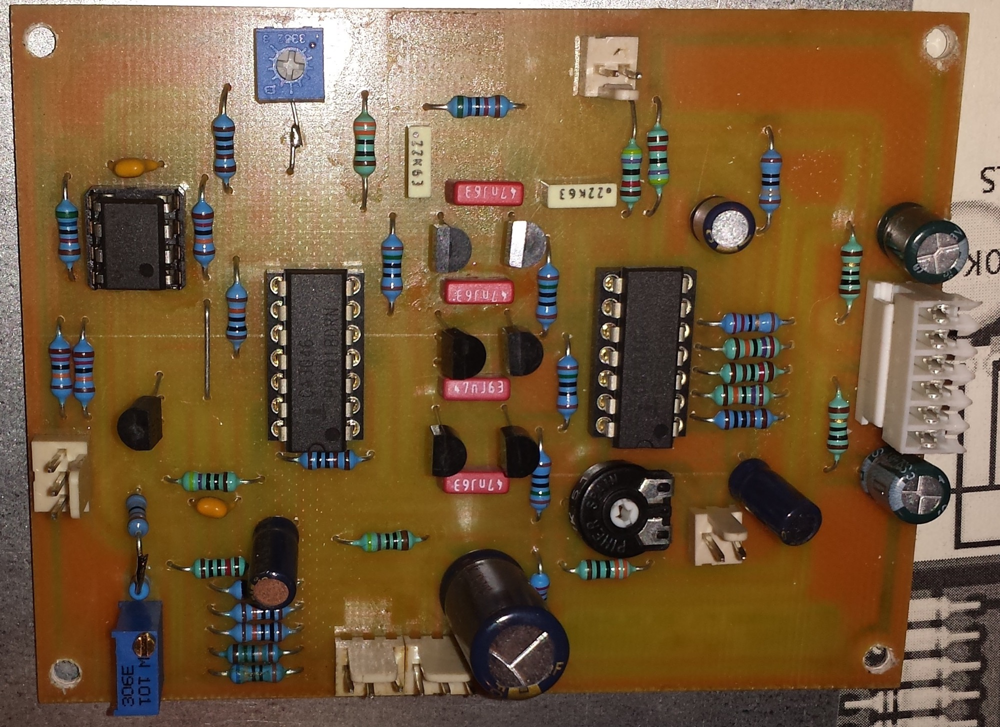
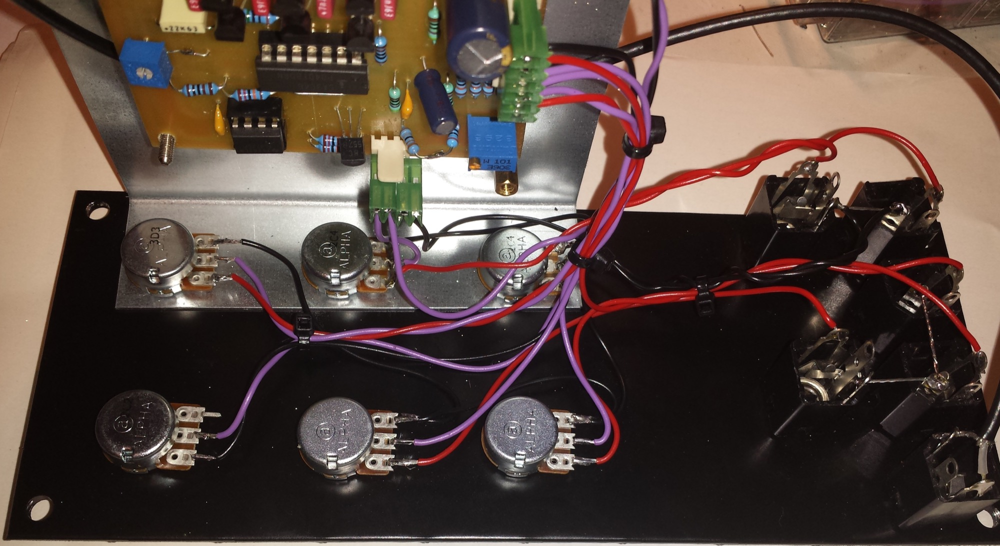

# Yusynth Minimoog Filter

> **Project**
>
> ### Projecttitel:Yusynth Minimoog Filter
>
> ### Status: `finsihed`
>
> ### Startdate: 23.Dec.2013
>
> ### Duedate: 06 November 2014
>
> ### Manufacture link: [http://yusynth.net/Modular/EN/MOOGVCF/index.html](http://yusynth.net/Modular/EN/MOOGVCF/index.html)

Yusynth Minimoog Filter in MOTM with 15V/-15V, works great, sounds great

(its not the same sound like a MOTM 490. the resonance range is better and not so much resonance oscillation here, the resonance is natural/softer)

the motm490 have more power, more punch, but dont have a mixer..

both are good filters.

As a minimoog owner i can say, the yusynth minimoog filter sounds very good in combination with MOTM300 and a Macbeth MK1 VCO.

## BOM:

|   |   |   |
|---|---|---|
| reference | value | quantity |
| U1,U2 | CA3046 Intersil, CA3146 and CA3086 are possible substitutes | 2 |
| U3 | TL072 | 1 |
| Q1 | BC557 | 1 |
| Q2,Q3,Q4,Q5,Q6,Q7 | BC547 matched by pairs | 6 |
| R1,R2 | 10 ohms | 2 |
| R25 | 22 ohms | 1 |
| R17,R19,R20,R21 | 150 ohms | 4 |
| R29 | 180 ohms | 1 |
| R14 | 220 ohms | 1 |
| R18,R22 | 330 ohms | 2 |
| R12,R15 | 470 ohms | 2 |
| R34 | 680 ohms | 1 |
| R16,R28,R33 | 1K | 3 |
| R26\* | 1.2K\* for +15V/-15V PSU 1K for +12/-12V PSU | 1 |
| R11 | 1.8K | 1 |
| R6 | 10K | 1 |
| R23,R30 | 47K | 2 |
| R5,R31 | 56K | 2 |
| R7,R8,R9,R13 | 100K | 4 |
| R3,R4,R32 | 120K | 3 |
| R10 | 150K | 1 |
| R24\*,R27\* | 270K\* +15V/-15V PSU 220K for +12/-12V PSU | 2 |
| C14 | 100pF | 1 |
| C4,C5,C6,C7 | 47nF matched to 1% | 4 |
| C13 | 100nF | 1 |
| C9,C10 | 220nF | 2 |
| C3,C11,C12 | 10µF/50V | 3 |
| C1,C2 | 22µF/50V | 2 |
| C8 | 220µF/25V | 1 |
| T1 | 500 ohms 10/15 turn trimmer | 1 |
| T3 | 1K trimmer | 1 |
| T2 | 10K trimmer | 1 |
| P4 | 10K lin | 1 |
| P1,P2 | 50K log | 1 |
| P3 | 50K lin | 1 |
| P5 | 50K reverse audio potentiometer (ALPHA) | 1 |
| Jk1,Jk2,Jk3,Jk4,Jk5,Jk6 | female jack socket | 6 |
| IC Sockets |   |   |

## Frontpanel connection

picture from [http://yusynth.net/Modular/EN/MOOGVCF/index.html](http://yusynth.net/Modular/EN/MOOGVCF/index.html)

## Trimming

copy from yusynth

V/Octave tracking :

- Apply 0.000V to the V/Oct input
- Turn the frequency knob fully counter-clockwise in order to measure 0mV at the base of Q1 (node between R9 to R11)
- Apply 1.000V to the V/Oct input
- Adjust T1 in order to measure 18.2mV at the base of Q1
- Apply 5.000V to the V/Oct input
- Check that you have 91.0mVat the base of Q1, if not adjust T1
- Apply 0.000V to the V/Oct input
- Set the filter to auto-oscillation (EMPHASIS turned fully clockwise)
- Connect a keyboard (CV/GATE) to the V/Oct input
- Play a tune and check the goodness of the tracking
- Slightly adjust T1 to achieve a good chromatic tracking.

Frequency range :

- Apply a sinewave with frequency 32Hz to the audio input
- Emphasis potentiometer to minimum resonance (fully counter-clockwise)
- Turn the frequency knob fully counter-clockwise
- Adjust T2, in order to mute the 32Hz signal.

Emphasis :
 Adjust T3 in order to reach auto-oscillation near 95% of the full range of the EMPHASIS pot.

