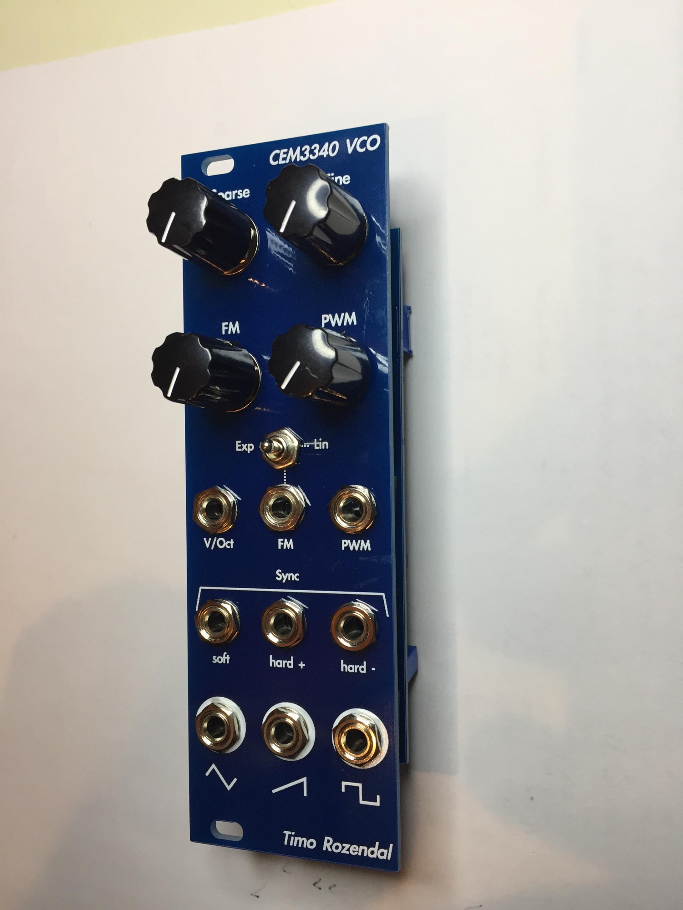
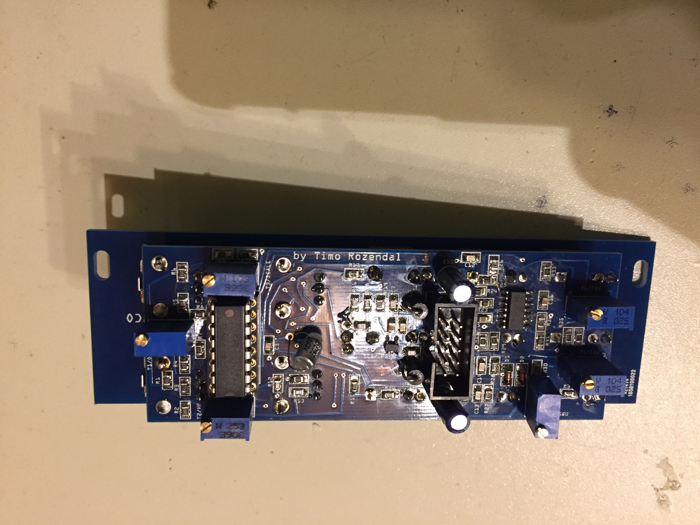

# CEM3340 VCO

> **Project**
>
> ### Projecttitel: CEM3340 VCO
>
> ### Status: `finished`
>
> ### Startdate: 21.Nov. 2016
>
> ### Duedate: 12.feb.2017
>
> ### Manufacture link: [https://www.muffwiggler.com/forum/viewtopic.php?t=170054&highlight=](https://www.muffwiggler.com/forum/viewtopic.php?t=170054&highlight=)

**Build info/code:**
 it is SMD and mostly 0805 (the smallest part being the voltage regulator, sot23-5) but not that hard.
 Don't worry about all those multiturn trimmers, calibration is easier than you think. There are no special other components apart from a good quality 1.5nf capacitor and I think you need to order the voltage regulator at a place like mouser.

**BOM**: [https://docs.google.com/document/d/1XSW3ewgHizRWL5AlVc7aHB7TIk77z9PuVF9al3tHGcY/edit?usp=sharing](https://docs.google.com/document/d/1XSW3ewgHizRWL5AlVc7aHB7TIk77z9PuVF9al3tHGcY/edit?usp=sharing)

in my case, a styroflex capacitor was used.

**Schematics:**

[cem3340vco\_schematic.pdf](assets/cem3340vco_schematic.pdf)

**Gallery:**

