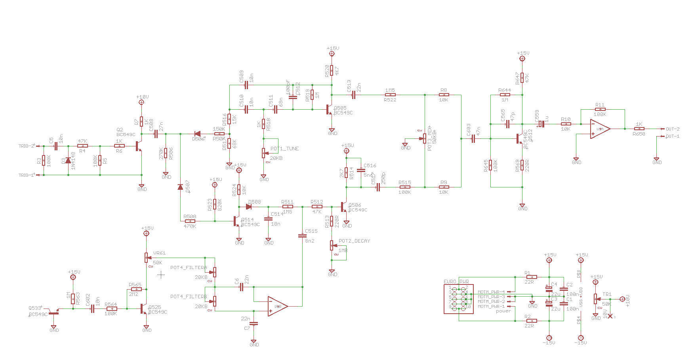
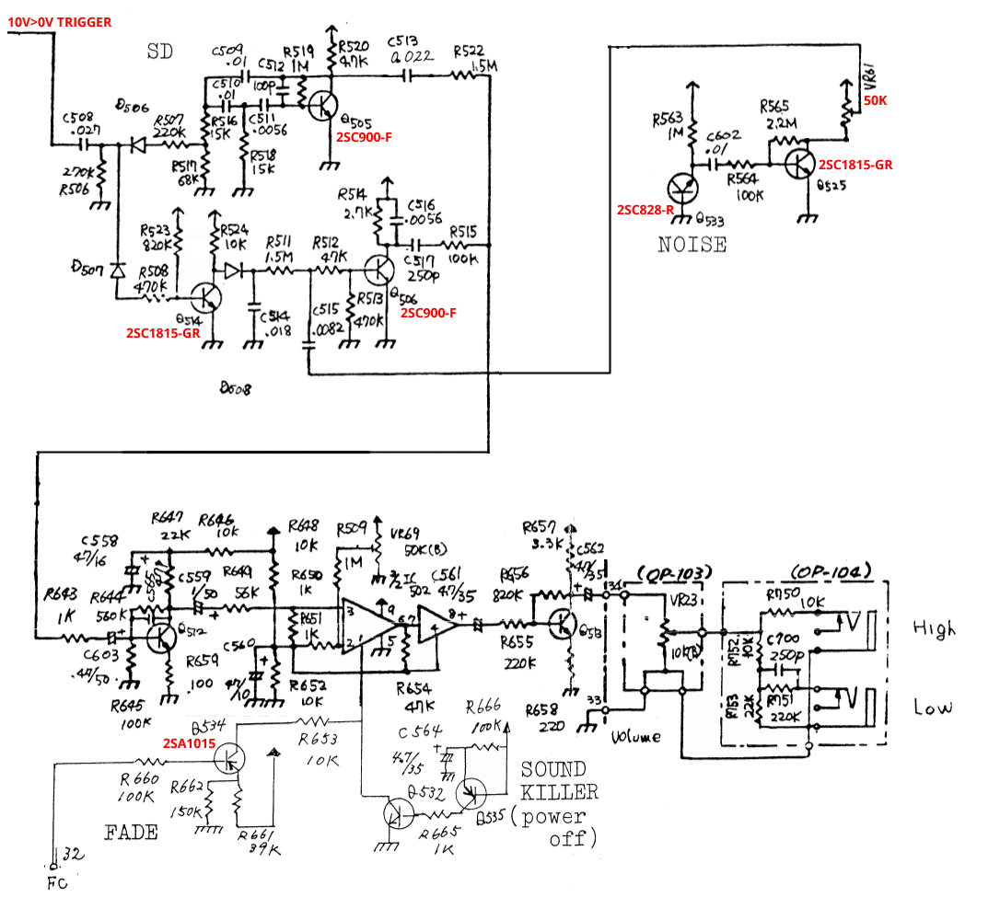
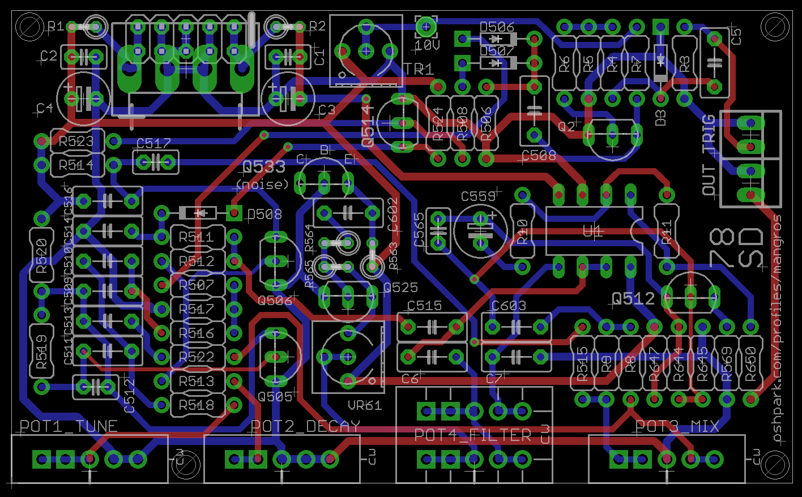

# CR-78 Snare in Eurorack

> **Project**
>
> ### Projecttitel: CR-78 Snare
>
> ### Status: `in progress`
>
> ### Startdate: 27 Jan. 2016
>
> ### Duedate: 15 Feb. 2016
>
> ### Manufacture link: [https://www.muffwiggler.com/forum/viewtopic.php?t=150329&start=50](https://www.muffwiggler.com/forum/viewtopic.php?t=150329&start=50)

this Project was initiated by Muffwiggler thread: [https://www.muffwiggler.com/forum/viewtopic.php?t=150329](https://www.muffwiggler.com/forum/viewtopic.php?t=150329&start=50)

The PCB that this BOM refers to can be ordered here: [https://oshpark.com/shared\_projects/C6dqLtvr](https://oshpark.com/shared_projects/C6dqLtvr)

Attachements: Panel (Adobe Illustrator file) [78sd.ai](assets/78sd.ai)

```
78 SD BOM
---------

(last updated 2016-01-15)

Ref numbers 5xx/6xx match components on the original CR-78 schematic (though some values have been tweaked), lower ref numbers are new additions.

Resistors

22R     2   R1, R2 (can be replaced by ferrite beads)
220R    2   R513, R569
1K      4   R6, R7, R518, R650
2K7     1   R514
4K7     1   R520
10K     4   R8, R9, R10, R524
15K     1   R516
47K     3   R4, R512, R647
68K     1   R517
100K    6   R3, R5, R11, R515, R564, R645
150K    1   R507
270K    1   R506
470K    1   R508
820K    1   R523
1M      3   R519, R563, R644
1M5     2   R511, R522
2M2     1   R565

Potentiometers (for suggested Euro panel use 16mm Alpha type)

10KA/B      1   POT1_TUNE (use log taper if you want finer control near the original's tuning)
1MB         1   POT2_DECAY (2MB would give longer times if you could ever find one)
50KB        1   POT3_MIX
10KB dual   1   POT4_FILTER

Trimmers

50K 2   TR1, VR61 (3362 single turn style - there isn't any need for high precision)

Capacitors

Film, 5mm pitch unless specified. Ceramic footprints are 2.54mm pitch

47p     1   C565    ceramic
100p    1   C512    ceramic
250p    1   C517    ceramic (220p works fine)
5n6     1   C516
8n2     1   C515
10n     4   C5, C509, C510, C602
18n     1   C514
22n     3   C6, C7, C513
27n     1   C508
47n     1   C603
68n     1   C511
100n    2   C1, C2  ceramic
1u      1   C559    electrolytic
22u     2   C3, C4  electrolytic

Semis

(I used BC549 'C' variants which matched the sound of the original 2SC900F the best, but there isn't a big difference if you only have 'B' parts)

BC549C  7   Q2, Q505, Q506, Q512, Q514, Q525, Q533 (Q533 is the noise transistor and it might be worth putting a SIL socket here to try different ones)
1N4148  4   D3, D506, D507, D508
TL072   1   U1

Connectors

2x5 0.100" pin header (for Eurorack only)
4-way 0.156" keyed header   1   (for MOTM only)
2-way 0.100" keyed header (Molex KK style)  2   optional for wiring to jacks
2-way 0.100" keyed housing (Molex KK style) 2   optional for wiring to jacks
Jack socket 2   panel mounted

Calibration

Set TR1 so that test point '10V' reads 10 volts. If the circuit is only producing the drum sound, adjust for a higher voltage here.
Set Mix pot to center, adjust VR61 (the noise level trimmer) to achieve a 50:50 balance of drum and noise

INFO
----

This circuit is mostly a clone of the Roland CR-78 snare drum circuit. The original had no adjustable parameters, so extra controls have been added. Additional circuitry has been pinched from other drum voices and Frankensteined together to make the circuit more useful as a module. The result is a vintage sounding drum voice with a useful range of sounds. It takes 5V gates and can run on 12V or 15V supplies.

For something close to the original CR-78 snare, set the drum pitch near the top of its range, keep the noise decay short (but not too short), the noise filter fully open and the mix at 50%. TSCHICK!
Other vintage snare sounds can be evoked with longer noise decay, lower pitch and more filtering. PFFFF!

Mods

R518 could be reduced to increase the highest tuning. The Drum Tune pot could go up to 50K to reach bassier frequencies (though it's more of a weak tom than an 808 bass drum boom). Larger values will probably be best with a linear taper - most of the action is found below 10K, and anything above 20K doesn't have a big effect.

I did investigate a drum decay control and got some usable range, but the circuit became unstable near short decay times and would often break into oscillation. It also interacted with the effect of the drum tune control, so I left it off. If you want to mess with this, try replacing some of the resistors around C510 with pots.

Noise decay is easy to experiment with. The bigger the resistance of R513 and the pot, the longer the decay time. Most of the pots I've tried produce silence at their minimum setting, and then sharp decay times when increased slightly. Increasing R513 can lengthen the minimum decay - the original value for R513 was 470K.

The filter pot could go up to 20KB dual, but as with the tune pot, the extra range isn't that useful.
```

## Schematic:



**Original Design CR78**



## PCB Design


