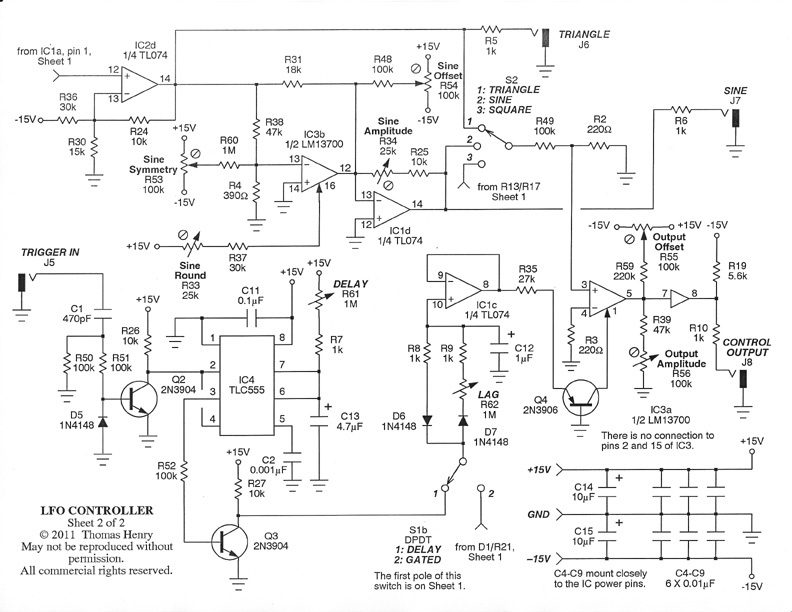
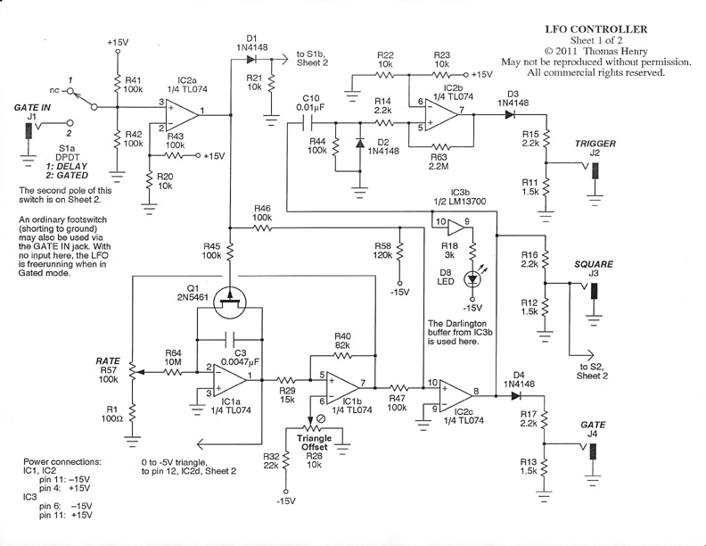
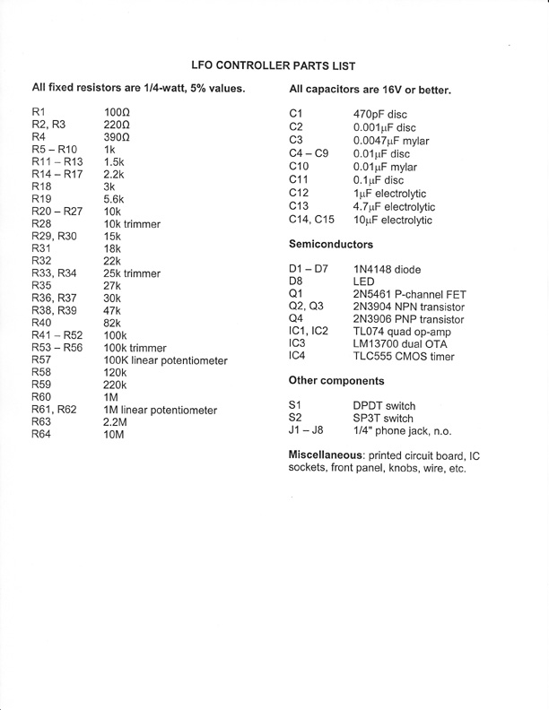
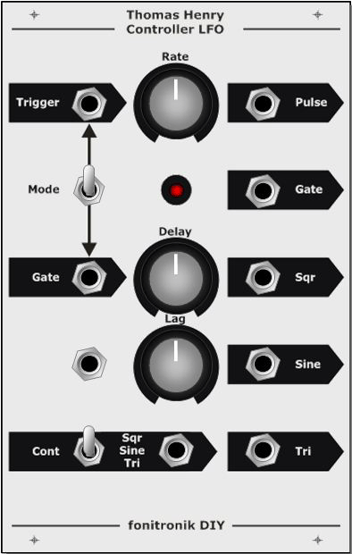
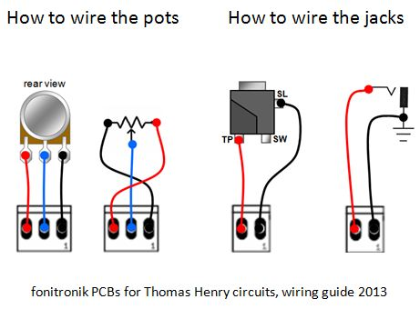
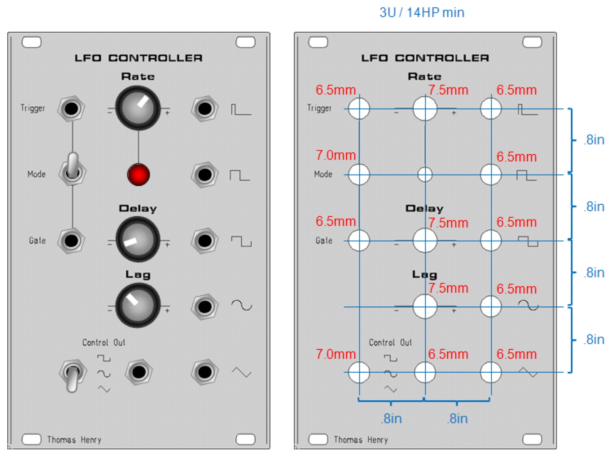

# Fonik LFO Controller by Thomas Henry

> **Project**
>
> ### Projecttitel: Fonik LFO Controller by Thomas Henry
>
> ### Status: `canceled`
>
> ### Startdate: 2011
>
> ### Duedate: 2013
>
> ### Manufacture link: [http://www.muffwiggler.com/forum/viewtopic.php?t=65434&postdays=0&postorder=desc&highlight=fonik+555&start=450](http://www.muffwiggler.com/forum/viewtopic.php?t=65434&postdays=0&postorder=desc&highlight=fonik+555&start=450)

have to build again this device, first pcb was sold, but need a MOTM or MU Frontpaneldesign,

[lfo\_controller\_100.pdf](assets/lfo_controller_100.pdf)
