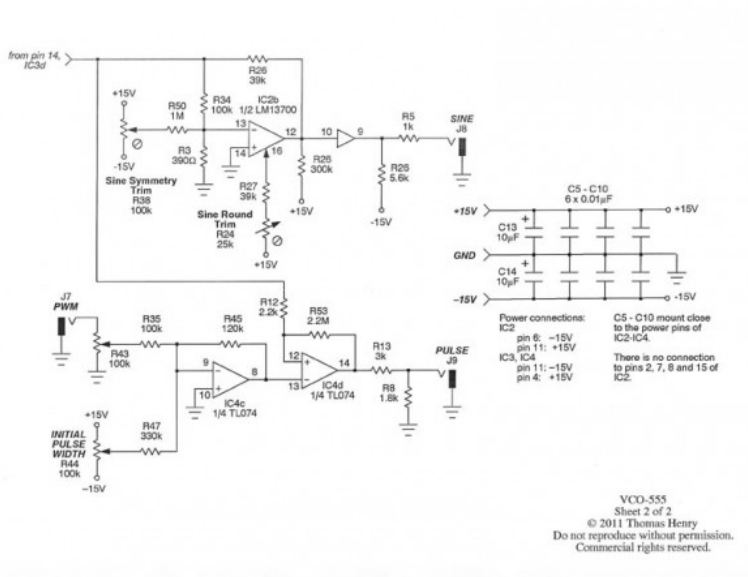
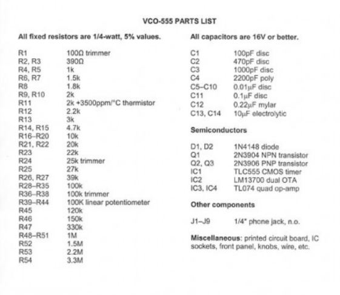
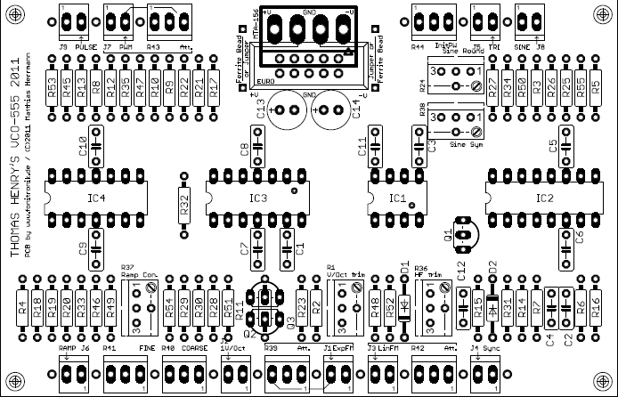
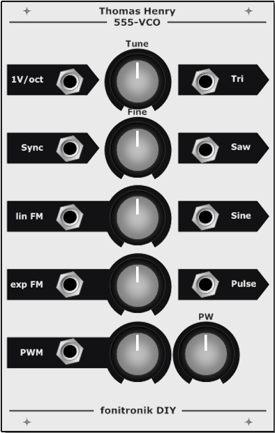

# Fonik VCO 555 Thomas Henry

> **Project**
>
> ### Projecttitel: Fonik VCO 555 Thomas Henry
>
> ### Status: `finished`
>
> ### Startdate: 2012
>
> ### Duedate: 09/2014
>
> ### Manufacture link: [http://www.muffwiggler.com/forum/viewtopic.php?t=73329&start=650](http://www.muffwiggler.com/forum/viewtopic.php?t=73329&start=650)

```
BUILDING NOTES

1)
in the original schematic of the VCO frmo thomas henry we three times a resistor R26, whereas R25 is missing completely.
so here are the values corresponding to the PCB labeling that are not covered correctly by the schematic/parts list:
R25 - 300k
R26 - 39k
R55 - 5.6k

2)
when powering from 12V:
```

R13 = 2k 
R27 = 22k 
R33 = 137k 

[https://www.muffwiggler.com/forum/viewtopic.php?t=73329&start=all&postdays=0&postorder=asc](https://www.muffwiggler.com/forum/viewtopic.php?t=73329&start=all&postdays=0&postorder=asc)

```
3)
when you have a hard time finding a precision trimmer wit 25k, just use 50k. does the job as well.

4)
C4 is the timing cap. use a nice C0G/NP0 or a mica for better stability.
```









- [VCO555-schematic.JPG](assets/VCO555-schematic.jpg)
- [VCO555-Partlist.JPG](assets/VCO555-Partlist.jpg)
- [info.txt](assets/info.txt)
- [vco-TH555.fpd](assets/vco-TH555.fpd)
- [555-VCO_layout.gif](assets/555-VCO_layout.gif)
- [555VCO_FP_sketch.gif](assets/555VCO_FP_sketch.gif)
