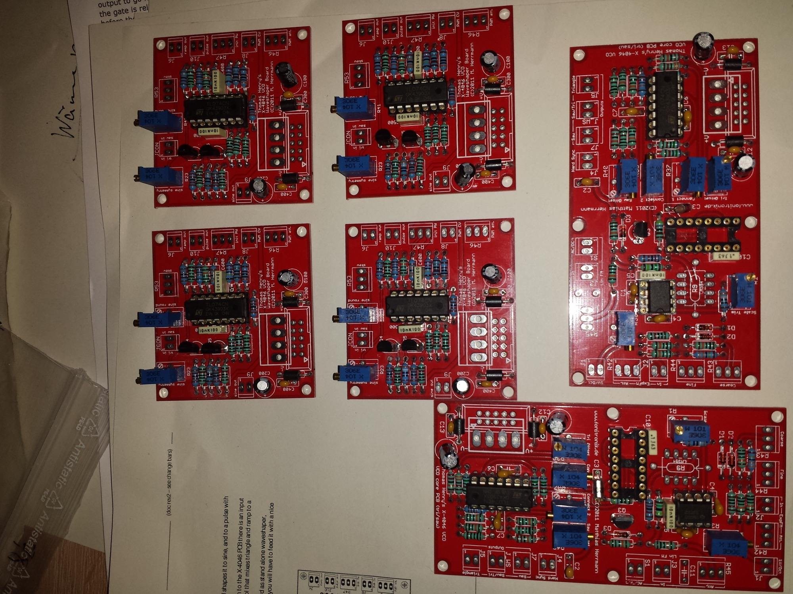
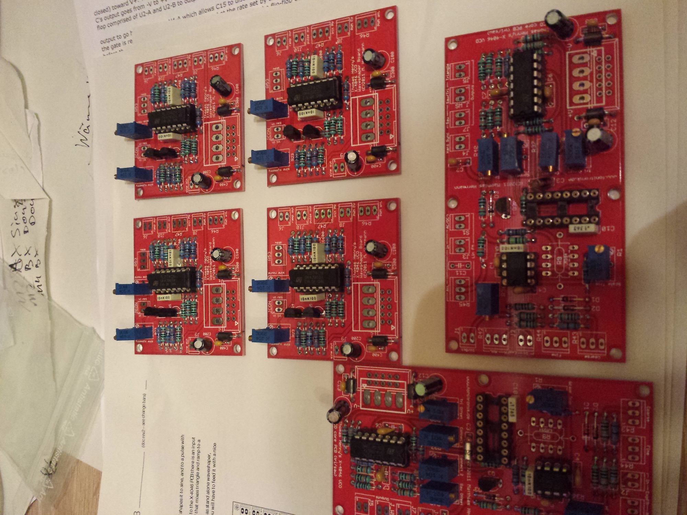
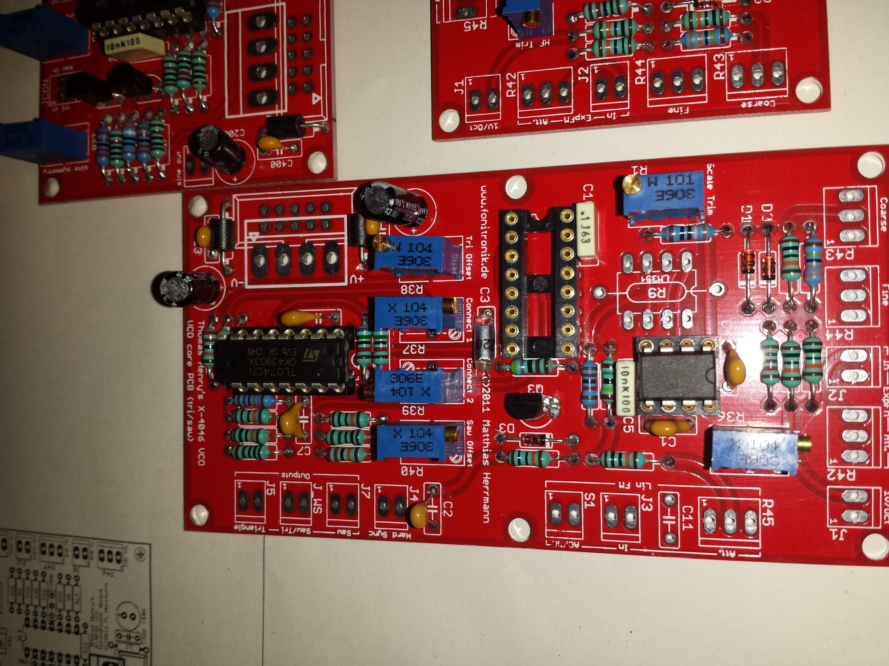

# Fonitronik TH X-4046

> **Project**
>
> ### Projecttitel: Fonitronik TH X-4046
>
> ### Status: `finished`
>
> ### Startdate: 09/2014
>
> ### Duedate: 12/2014
>
> ### Manufacture link:

**Buildersguide: Rev.1**

[http://www.modular.fonik.de/pdf/TH\_X-4046\_VCO.pdf](http://www.modular.fonik.de/pdf/TH_X-4046_VCO.pdf)

[http://www.thonk.co.uk/shop/fonitronik-th-x-4046-vco/](http://www.thonk.co.uk/shop/fonitronik-th-x-4046-vco/)

[http://www.synthdiy.fonitronik.de/forum/x4046-VCO\_V2](http://www.synthdiy.fonitronik.de/forum/x4046-VCO_V2)

[http://electro-music.com/forum/topic-47213.html](http://electro-music.com/forum/topic-47213.html)

[http://www.modular.fonik.de/pdf/TH\_X-4046\_VCO.pdf](http://www.modular.fonik.de/pdf/TH_X-4046_VCO.pdf)

So here we go. The most crucial part is the CMOS 4046 phase lock loop

IC itself.

You must not use a Texas Instrument or SGS Microelectronics

branded 4046

, you won’t be able to get the 1V/oct response.

I recommend the following:

NXP HEF4046, National CD4046, Fairchild CD4046, Motorola MC14046,

or On Semiconductor MC14046.

Q1 and Q2 should be matched for better linearity. You could match them

manually, or you could replace them by a super matched pair, i.e. the

LM394

–

if you still have one

**only pcbs parts !**

|   |   |   |   | price |   |
|---|---|---|---|---|---|
| 2 | ferrite |   |   | 0,20 |   |
| 2 | 390R |   |   | 0,04 |   |
| 4 | 1k |   |   | 0,08 |   |
| 1 | 1k8 |   |   | 0,02 |   |
| 1 | 2k |   |   | 0,02 |   |
| 3 | 2k2 |   |   | 0,06 |   |
| 1 | 3k |   |   | 0,02 |   |
| 1 | 4k7 |   |   | 0,02 |   |
| 5 | 10k |   |   | 0,1 |   |
| 1 | 12k |   |   | 0,02 |   |
| 1 | 18k |   |   | 0,02 |   |
| 1 | 33k |   |   | 0,02 |   |
| 3 | 75k |   |   | 0,06 | 68 |
| 9 | 100k |   |   | 0,18 | 86 |
| 2 | 120k |   |   | 0,04 | 90 |
| 2 | 220k |   |   | 0,04 | 94 |
| 1 | 330k |   |   | 0,04 | 98 |
| 1 | 1m5 |   |   | 0,04 | 102 |
| 1 | 2m2 |   |   | 0,04 | 106 |
| 1 | 3m3 |   |   | 0,04 | 110 |
| 1 | 100R | R1 | trimmer S64Y/W | 0,5 | 1,6 |
| 7 | 110k | R23,R36-41 | trimmer s64/w | 3,5 | 5,1 |
|   |   |   |   |   |   |
| 1 | 10n | c3 timimg | mica, c0g, polystere | 0,5 | 5,6 |
| 6 | 10n | c4-c9 | mlcc 5mm | 0,6 | 6,1 |
| 2 | 10uF | c12,c13 | electrolyt 2,5mm 35V | 0,4 | 6,5 |
| 1 | 100pF | c1 | film 5mm | 0,5 | 6,9 |
| 1 | 470pf | c2 | film 5mm | 0,5 | 7,4 |
| 3 | 100n | c10,c120,c130 | mlcc 5mm | 0,15 | 7,55 |
| 1 | 220n | c11 | film 5mm | 0,5 | 8,05 |
|   |   |   |   |   |   |
| 3 | 1n4148 | D1-D3 |   | 0,1 | 8,15 |
| 5 | 2n3904 | q1,q2,q3,q6,q7 | matched ! | 5 | 13,15 |
| 1 | cd4046 | ic1 | ntaionak, fairchiel, mot, nxp | 1,2 | 14,35 |
| 1 | lt1013 | ic2 | or tl072 | 3,5 | 17,85 |
| 2 | tl074 | ic3,ic4 |   | 0,8 | 18,65 |
| 1 | 1uf bipolar | c\_lfo | filmcap 5mm | 0,5 | 19,15 |
| 1 | 470k | r\_led | select for led | 0,02 | **19,17** |

|   |   |   |   |
|---|---|---|---|
| 2 | ferrite | 0,2 |   |
| 1 | 390r | 0,02 | 0,22 |
| 2 | 1k | 0,04 | 0,26 |
| 1 | 1k8 | 0,02 | 0,28 |
| 3 | 2k2 | 0,06 | 0,34 |
| 1 | 3k | 0,02 | 0,36 |
| 4 | 10k | 0,08 | 0,42 |
| 1 | 18k | 0,02 | 0,44 |
| 1 | 100k | 0,02 | 0,46 |
| 2 | 100k trimmer | 1 | 1,46 |
| 1 | 120k | 0,02 | 1,48 |
| 1 | 330k | 0,02 | 1,5 |
| 1 | 2m2 | 0,02 | 1,52 |
| 2 | 10n | 1 | 2,52 |
| 2 | 100n | 1 | 3,52 |
| 2 | 10uf caps | 0,2 | 3,72 |
| 2 | 2n3904 | 1 | 4,72 |
| 1 | tl074 | 0,4 | **5,12** |
|   |   |   |   |
|   |   |   |   |

[TH\_X-4046\_VCO.pdf](assets/TH_X-4046_VCO.pdf)
