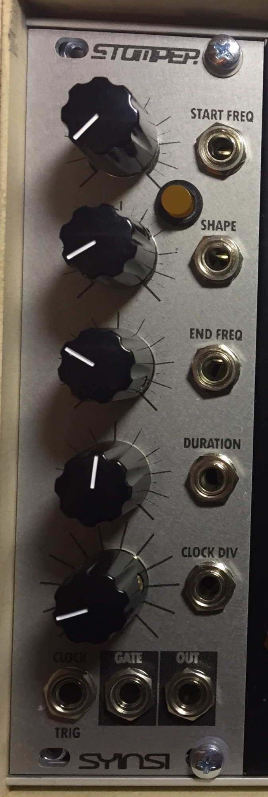

# Stomper Bassdrum Module

> **Project**
>
> ### Projecttitel: Syinsi Stomper "Bassdrum Module"
>
> ### Status: `in progress`
>
> ### Startdate: July 2016
>
> ### Duedate: August 2016
>
> ### Manufacture link: [https://www.muffwiggler.com/forum/viewtopic.php?t=146550&highlight=](https://www.muffwiggler.com/forum/viewtopic.php?t=146550&highlight=)

STOMPER is a percussion generator that uses an unfiltered square-wave oscillator. Quickly sweeping the oscillator results in a satisfying high-q-sounding zip and thud thanks to all the crazy harmonics.

**Features:**

 -Glorious 1 bit audio.
 -CV on all controls.
 -Gate output for external ADSR (or whatever).
 -Clock or trigger input.
 -Clock/Trigger Divider.
 -Arduino-compatible programming header, code provided.
 -Unused I/Os broken out for hacking.
 -8HP Eurorack.

**Buildguide:**

[https://www.dropbox.com/s/s50slshdt659j1e/Stomper-Info-and-Build-Instructions.pdf?dl=1](https://www.dropbox.com/s/s50slshdt659j1e/Stomper-Info-and-Build-Instructions.pdf?dl=1)

**BOM:**
 6 100nF Ceramic Disc Capacitors
 4 10uF Radial Electrolytic Capacitors
 3 100uF Radial Electrolytic Capacitors
 2 20pF Ceramic Disc Capacitors
 1 100R Resistor
 9 1K Resistors
 1 2K Resistor
 5 10K Resistors
 ATMEGA328P-PU DIL Microcontroller (supplied)
 TL071P Opamp DIL08
 2N3904 NPN Transistor
 7805L TO92 5v 100ma Power Regulator
 2 1n4007 Diodes
 16 1n5817 Schottky Diodes
 5 10kB Potentiometer 16mm PCB mount
 3mm LED + bezel (for 6mm hole).
 16MHz crystal
 5x2 Header (Eurorack Power)
 (optional) 1×4 Header (Programming)
 8 3.5mm Kobiconn-style sockets with lugs
 DIL28-3 Socket
 DIL08 Socket 

