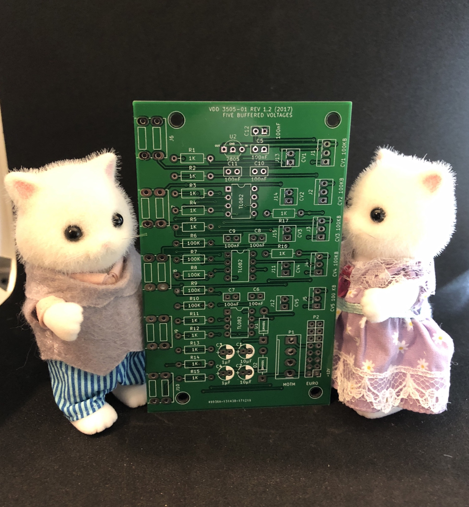

# VDD 3505-01 Five buffered Voltages

> **Project**
>
> ### Projecttitel: VDD 3505-01 Five buffered Voltages
>
> ### Status: `ready`
>
> ### Startdate: 05.Jan.2018
>
> ### Duedate: --
>
> ### Manufacture link: [https://www.diysynth.de/pcbs-panels/vdd-3505-01-pcb-only.html](https://www.diysynth.de/pcbs-panels/vdd-3505-01-pcb-only.html)

**Specs:**

The module provides five independent buffered control voltages from -5V to 5V. The outputs are buffered to reduce voltage influences induced by load changes at the individual outputs.

Typical use cases of an voltage module are

- offset voltages for other modules like VCAs or VCFs
- Wide range tuning of VCOs

As part of the "01" sub-series the PCB is compatible to Eurorack as well as MOTM. (-12/12V & -15V/15V) Supported Power Header formats are 10/16 pin Euro and MTA 156. The module is protected by rectifiers and provides power capacitors.

 You won't find the usual filter resistors or beads, because there won't be voltages spikes induced by this module. The linear regulator and the caps are just fine. Since there is nearly no power soak at the reference voltage, the OpAmps will prevent voltage interference from the distribution board. 

**BOM:**

[Five Voltages.csv](assets/Five-Voltages.csv)

|   |   |   |   |   |   |
|---|---|---|---|---|---|
| **ID** | **ID-PCB** | **Casetype** | **Amount** | **Designator** | **Source** |
| 1 | D1,D2 | D\_DO-41\_SOD81\_P10.16mm\_Horizontal | 2 | 1N4001 | [https://www.diysynth.de/product\_info.php?info=p44\_1n4001-diode.html](https://www.diysynth.de/product_info.php?info=p44_1n4001-diode.html) |
| 2 | IC Socket 8pin | IC Socket 8pin DIP/DIL | 3 | -- | [https://www.diysynth.de/product\_info.php?info=p10\_8-pin-dip-ic-sockel-rund.html](https://www.diysynth.de/product_info.php?info=p10_8-pin-dip-ic-sockel-rund.html) |
| 3 | C1,C2 | CP\_Radial\_D5.0mm\_**P2.00mm** | 2 | 10µF | [diysynth.de](http://diysynth.de) |
| 4 | C3,C4 | CP\_Radial\_D5.0mm\_**P2.00mm** | 2 | 1µF | [diysynth.de](http://diysynth.de) |
| 5 | C5,C6,C7,C8,C9,C10,C11,C12 | C\_Disc\_D5.0mm\_W2.5mm\_**P2.50mm** | 8 | 100nF | diysynth.de |
| 6 | J1 | MTA-100-3p | 1 | CV1 100KB | or use wirelink directly |
| 7 | J2 | MTA-100-3p | 1 | CV2 100KB | or use wirelink directly |
| 8 | J3 | MTA-100-3p | 1 | CV3 100KB | or use wirelink directly |
| 9 | J4 | MTA-100-3p | 1 | CV4 100KB | or use wirelink directly |
| 10 | J5 | MTA-100-3p | 1 | CV5 100 KB | or use wirelink directly |
| 11 | J11 | MTA-100-2p | 1 | CV4 | optional for MOTM |
| 12 | J12 | MTA-100-2p | 1 | CV5 | optional for MOTM |
| 13 | J13 | MTA-100-2p | 1 | CV1 | optional for MOTM |
| 14 | J14 | MTA-100-2p | 1 | CV2 | optional for MOTM |
| 15 | J15 | MTA-100-2p | 1 | CV3 | optional for MOTM |
| 16 | P2 | Pin\_Header\_Straight\_2x08\_Pitch2.54mm | 1 | EURO - optional | only EURORACK |
| 17 | R1,R2,R3,R4,R5,R11,R12,R13,R14,R15,R16,R17 | Resistor 1% THT | 12 | 1K |   |
| 18 | R6,R7,R8,R9,R10 | Resistor 1% THT | 5 | 100K |   |
| 19 | U1,U3,U5 | TL082 OPAMP DIP8 | 3 | TL082 |   |
| 20 | U2 | 5V Voltage regulator TO-92\_Inline\_Wide | 1 | LM78L05 | [https://www.mouser.de/productdetail/on-semiconductor-fairchild/lm78l05acz?qs=sGAEpiMZZMtdAabcSkQOl9gipZmsKLz7](https://www.mouser.de/productdetail/on-semiconductor-fairchild/lm78l05acz?qs=sGAEpiMZZMtdAabcSkQOl9gipZmsKLz7) |
| 21 | P1 | MTA156 | 1 | MOTM -optional | only for MOTM |
| 22 | J6 | Cliff1384 | 1 | Out-CV1 | [https://www.diysynth.de/product\_info.php?info=p40\_cliff-socket-3-5mm-mono-with-nut.html](https://www.diysynth.de/product_info.php?info=p40_cliff-socket-3-5mm-mono-with-nut.html) |
| 23 | J7 | Cliff1384 | 1 | Out-CV2 | [https://www.diysynth.de/product\_info.php?info=p40\_cliff-socket-3-5mm-mono-with-nut.html](https://www.diysynth.de/product_info.php?info=p40_cliff-socket-3-5mm-mono-with-nut.html) |
| 24 | J8 | Cliff1384 | 1 | Out-CV3 | [https://www.diysynth.de/product\_info.php?info=p40\_cliff-socket-3-5mm-mono-with-nut.html](https://www.diysynth.de/product_info.php?info=p40_cliff-socket-3-5mm-mono-with-nut.html) |
| 25 | J9 | Cliff1384 | 1 | Out-CV4 | [https://www.diysynth.de/product\_info.php?info=p40\_cliff-socket-3-5mm-mono-with-nut.html](https://www.diysynth.de/product_info.php?info=p40_cliff-socket-3-5mm-mono-with-nut.html) |
| 26 | J10 | Cliff1384 | 1 | Out-CV-5 | [https://www.diysynth.de/product\_info.php?info=p40\_cliff-socket-3-5mm-mono-with-nut.html](https://www.diysynth.de/product_info.php?info=p40_cliff-socket-3-5mm-mono-with-nut.html) |
| 27 |   | 16mm alpha 100KB (LINEAR) potentiometer | 5 |   | banzai, musikding, mouser, thonk |

**Schematics:**

[Five Voltages.pdf](assets/Five-Voltages.pdf)

